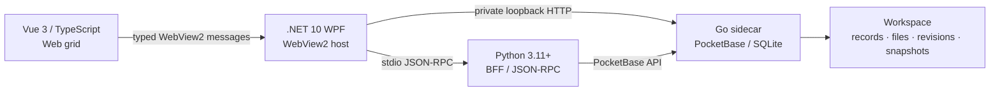

<div align="center">

# VibeTable

**离线优先的通用建表与文件管理桌面工具**

把灵活表格、附件与文档版本、工作区恢复和插件执行放进一个 Windows 本地应用。

[](https://github.com/FelixJI/VibeTable/actions/workflows/ci.yml)
[](https://github.com/FelixJI/VibeTable/releases/latest)
[](#系统要求)
[](LICENSE)

[下载](https://github.com/FelixJI/VibeTable/releases/latest) ·
[快速开始](#快速开始) ·
[源码导读](docs/source-reading-guide.md) ·
[插件开发](docs/plugin-development.md) ·
[质量门禁](docs/quality-gates.md)

</div>

VibeTable 将 WPF/WebView2 界面、Python BFF 和固定版本的 PocketBase sidecar 一起打包。
数据存储、实时更新、文档版本管理与插件执行都在本机完成，不依赖在线数据库。

> [!IMPORTANT]
> VibeTable 仅支持 Windows 10/11 x64。项目不提供 Linux 或 macOS 客户端，也不把非
> Windows 平台纳入产品兼容性承诺。

## 产品界面

下图由仓库的 WPF/WebView2 产品 E2E 从当前发布包直接截取，使用真实 PocketBase sidecar
和 Python 后端，不是设计稿或静态 mock。


<details>
<summary>查看建表与字段约束界面</summary>


</details>

## 核心能力

| 能力 | 说明 |
| --- | --- |
| 自由建表 | 动态发现本地数据表，在应用内创建、删除表和字段，并配置字段约束 |
| 表格交互 | 查询、筛选、排序、批量粘贴，以及 CSV/Excel 导入导出 |
| 文件管理 | 附件上传、预览、恢复，git-like 本地内容存储和 OpenXML 文档比对 |
| 文档工作区 | 文档版本、发布、修订历史，以及与业务记录的本地关联 |
| 实时更新 | 本地 sidecar SSE 更新、断线续传和事件去重 |
| 版本与恢复 | 工作区级 Snapshot、文件修订树、完整性验证和可审计恢复 |
| 插件边界 | 插件提交受控 mutation plan，不直接获得数据库写权限；支持本地包、开发目录和公共 GitHub Release |

## 快速开始

### 使用发布包

1. 打开 [Releases](https://github.com/FelixJI/VibeTable/releases/latest)，下载
   `VibeTable-v<版本>-win-x64.zip` 及同名 `.sha256` 文件。
2. 用 `Get-FileHash <ZIP路径> -Algorithm SHA256` 计算摘要，并与 `.sha256` 文件核对。
3. 解压 ZIP，运行 `VibeTable.Next.exe`。
4. 首次启动后创建工作区；程序会在用户数据目录保存设备状态和工作区注册信息，不会把业务数据写进程序目录。

发布包是完整的 Windows x64 离线包，运行时不需要安装 Python、Node.js、Go 或 .NET SDK。

### 从源码运行

先安装[系统要求](#系统要求)中的开发工具，再在 PowerShell 中执行：

```powershell
git clone https://github.com/FelixJI/VibeTable.git
Set-Location VibeTable

uv sync --frozen --group dev --group build

Push-Location desktop/web-grid
npm ci
Pop-Location

uv run python scripts/dev.py
```

`scripts/dev.py` 会构建 Go sidecar、Vue 前端和 WPF 宿主，然后由宿主管理 Python BFF 与
PocketBase 子进程。默认开发数据位于 `.dev-data/pocketbase/`。

如果你第一次接触这个多栈仓库，请从[面向初学者的源码阅读指南](docs/source-reading-guide.md)
开始；它提供启动链、两条真实请求链和分方向阅读路线。

## 架构



三个边界决定了代码应放在哪里：

- **PocketBase 是唯一业务数据权威**：前端不切换 authority，Python BFF 不直接持有 SQLite 写入路径。
- **WPF 是本机能力与生命周期 owner**：它管理 WebView2、Python BFF、PocketBase sidecar、会话凭证和 path grant。
- **跨进程调用使用闭集契约**：请求、响应、错误、取消和 session/epoch 语义都在边界处验证。

完整入口、authority 和验证索引见[跨进程 seam 索引](docs/architecture/interprocess-seams.md)。

## 仓库地图

| 路径 | 职责 | 推荐入口 |
| --- | --- | --- |
| `desktop/web-grid/` | Vue 3、TypeScript、Pinia、Tabulator 用户界面 | `src/main.ts`、`src/bridge/hostBridge.ts` |
| `desktop/src/` | WPF/WebView2 宿主、本机能力、进程与 workspace 生命周期 | `VibeTable.Desktop/App.xaml.cs`、`Services/ProductionWorkspaceRuntime.cs` |
| `backend/` | Python BFF、stdio JSON-RPC、导入导出、插件和 PocketBase adapter | `__main__.py`、`rpc/` |
| `sidecar/` | Go/PocketBase 数据权威、workspace v2、文件修订与 Snapshot | `cmd/vibetable-pb/main.go`、`internal/workspacev2/` |
| `contracts/` | 跨栈 JSON catalog、schema 与 fixtures | `v1/`、`v2/`、`schema-v2/` |
| `sdk/plugin/` | TypeScript 插件 SDK | `src/index.ts` |
| `examples/plugins/` | 可运行的插件示例 | `normalize-text/`、`data-overview/` |
| `scripts/`、`qa/` | 开发编排、构建、版本和发布资格门禁 | `dev.py`、`build_next.py`、`qa/next.py` |

## 系统要求

源码开发需要：

| 工具 | 仓库约束 |
| --- | --- |
| 操作系统 | Windows 10/11 x64 |
| Python | 3.11+，依赖统一由 `uv` 和 `uv.lock` 管理 |
| Node.js | 24.18.0；允许 24.x，见 `.nvmrc` 与各 `package.json` |
| .NET SDK | 10.0.100，见 `global.json` |
| Go | 1.25.8，见 `sidecar/go.mod` |
| WebView2 Runtime | Windows 桌面界面运行必需 |

Go、Node.js 和 Python 构建工具只用于源码开发与打包；正式发布包不会在运行时从网络下载组件。

## 开发与验证

先运行与你改动最接近的命令：

```powershell
# Python 后端与契约
uv run pytest

# Web grid
Push-Location desktop/web-grid
npm run test
npm run build
Pop-Location

# .NET
dotnet test desktop/VibeTable.Desktop.sln --configuration Release

# Go sidecar
Push-Location sidecar
go test ./...
Pop-Location
```

完整 Windows 发布资格门禁：

```powershell
uv run python qa/next.py --ci --json-report build/qa/report.json
```

该门禁还覆盖 Go race、真实 sidecar 集成、升级与故障注入、WPF/WebView2 产品 E2E、打包矩阵和最终只读 smoke。分层策略、覆盖率阈值及适用场景见[质量门禁说明](docs/quality-gates.md)。

## 数据目录与工作区身份

正式运行时，设备级 Shell 状态和工作区注册表位于
`%LOCALAPPDATA%\VibeTable\shell/`。这里保存的是本机设备状态，不是所有业务数据共用的单一工作区。

每个工作区使用永久稳定的 UUID，并独立拥有数据库、可见文件、文件修订树、审计账本和
Snapshot。创建时可以选择：

- **程序管理的默认位置**：`%LOCALAPPDATA%\VibeTable\shell\workspaces\<workspaceId>/`，固定采用可靠本机磁盘的直接模式；
- **其他位置**：由系统目录选择器授权，可按 provider 能力使用直接或镜像模式。镜像模式会在本机保留活动副本，再把经过验证的恢复仓库同步到所选位置。

路径不是工作区身份。位置离线时注册项仍会保留；重新定位必须核对
`.vibetable/workspace.json` 中的 UUID，不会通过创建同名空目录替代原工作区。进一步阅读
[恢复说明](docs/RECOVERY.md)和[镜像工作区说明](docs/workspace-smb-mirrored.md)。

## 构建与发布

生成并校验本地完整离线包：

```powershell
uv run python scripts/build_next.py --release
uv run python qa/package_check.py dist/VibeTable.Next
```

展开包输出到 `dist/VibeTable.Next/`；正式 Release 资产由项目自动化整理为：

- `VibeTable-v<版本>-win-x64.zip`
- `VibeTable-v<版本>-win-x64.zip.sha256`
- `build-identity.json`
- `SBOM.spdx.json`

唯一版本来源是 `backend/_version.py`，版本与 changelog 只通过发布自动化更新。PR 与 `main`
push 的 CI 会执行质量门禁、真实发布构建和 smoke；手动运行 CD 只负责创建或刷新唯一的版本与
changelog PR。不要直接编辑多个版本源、手打正式 tag 或手建 Release。

应用内更新会读取 GitHub Releases，并支持 GitHub 直连、预置代理或自定义 HTTPS 通道；更新事务不会触碰 `%LOCALAPPDATA%\VibeTable` 用户数据。详细边界见[自我更新能力说明](docs/self-update-assessment.md)。

## 文档

- [面向初学者的源码阅读指南](docs/source-reading-guide.md)
- [跨进程 seam 索引](docs/architecture/interprocess-seams.md)
- [质量门禁说明](docs/quality-gates.md)
- [插件开发、打包与 GitHub Release 安装](docs/plugin-development.md)
- [架构决策记录](docs/adr/)
- [全部文档索引](docs/README.md)

## 参与贡献

欢迎提交 Issue 和 Pull Request。开始较大改动前，建议先阅读[源码导读](docs/source-reading-guide.md)
和[质量门禁](docs/quality-gates.md)，明确修改所属的进程边界，并先运行最小相关测试。

提交信息使用 `<type>(<scope>): <简体中文动词短语>`；PR 请说明背景与根因、变更内容、影响与风险，以及实际执行的验证命令和结果。可见 UI 改动请附截图。

## License

Copyright (c) 2026 Felix Ji. 本项目基于 [MIT License](LICENSE) 发布。

仓库中捆绑或引用的第三方组件仍遵循各自许可证；相关许可证文件随对应组件保留。
