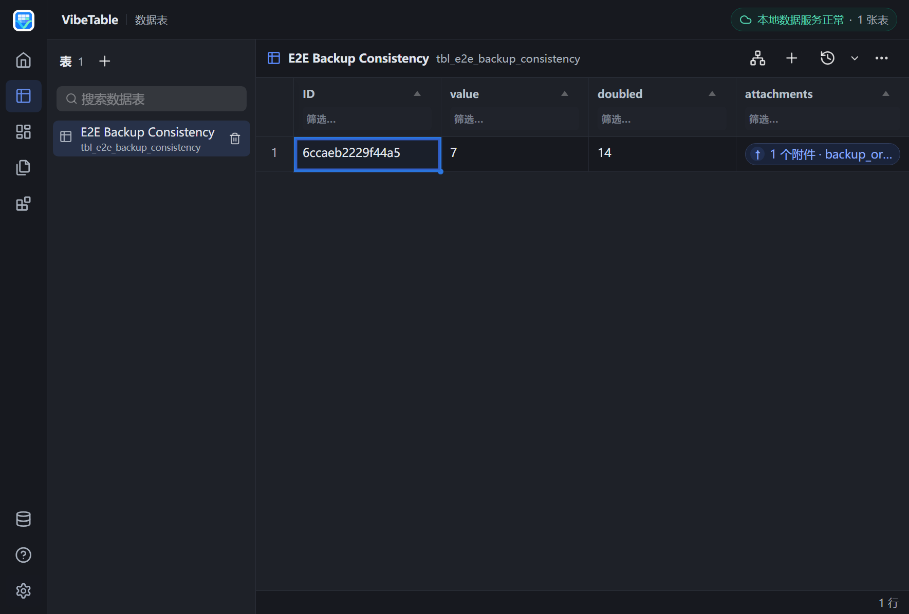
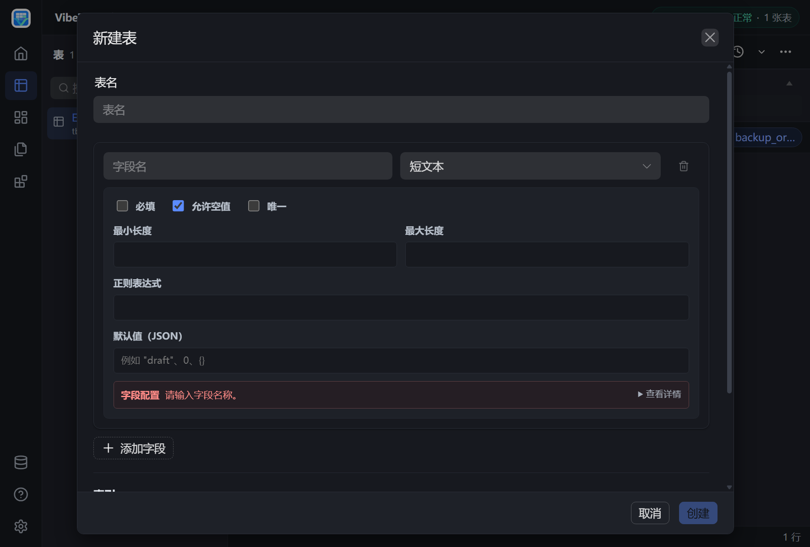

# VibeTable

VibeTable 是一款离线优先的通用建表与文件管理桌面工具。它把 WPF/WebView2 界面、Python BFF 和固定版本的 PocketBase sidecar 一起打包，在本机完成数据存储、实时更新、文档版本管理与插件执行，不依赖在线数据库。

**支持平台：Windows 10/11（x64）。项目不提供 Linux 或 macOS 客户端，也不把非 Windows 平台纳入产品兼容性承诺。**

## 实际界面

下图由仓库的 WPF/WebView2 产品 E2E 从当前发布包直接截取，使用真实 PocketBase sidecar 和 Python 后端，不是设计稿或静态 mock。



<details>
<summary>查看建表与字段约束界面</summary>



</details>

## 特性

- **自由建表**：动态发现本地数据表，在应用内创建、删除表和字段，并配置字段约束
- **表格交互**：查询、筛选、排序、批量粘贴，以及 CSV/Excel 导入导出
- **文件管理**：附件上传、预览、恢复，git-like 本地内容存储和 OpenXML 文档比对
- **文档工作区**：文档版本、发布、修订历史，以及与业务记录的本地关联
- **实时同步**：本地 sidecar SSE 更新、断线续传和事件去重
- **离线与可恢复**：本机状态、备份恢复、故障注入验证和发布包升级验证
- **插件边界**：插件通过受控契约提交 mutation plan，不直接获得数据库写权限

## 数据目录

正式运行时，默认数据目录是程序运行目录下的 `VibeTableData/`。首次打开会让用户选择存储位置；若取消选择，则使用该默认目录。程序目录不可写时，会提示并回退到 `%LOCALAPPDATA%\VibeTable\Data`。

当前目录可在“设置 → 数据源 → 数据存储位置”查看，也可以选择新位置。迁移请求不会在数据库运行时复制文件，而是在下次启动、所有服务启动之前完成：

1. 复制到目标同级的临时 staging 目录；
2. 校验文件数与总字节数；
3. 原子启用新目录并写入迁移标记；
4. 保留旧目录，失败时继续使用原目录。

PocketBase 数据、Python 状态、备份、日志、WebView2 用户数据、文档工作区和挂载信息都跟随同一个产品数据根目录。首次采用新策略时，应用会识别旧的 `%LOCALAPPDATA%\VibeTable` 布局并安全复制。

## 架构

- **桌面宿主**：.NET 10 WPF + WebView2
- **后端 BFF**：Python 3.11+，通过 stdio JSON-RPC 与宿主通信
- **前端**：Vue 3 + TypeScript + Vite + Tabulator
- **数据层**：内置 PocketBase sidecar（SQLite + CEL）
- **进程模型**：WPF 宿主管理 Python BFF 与 PocketBase 生命周期、会话凭证和本机文件能力

运行时只有 PocketBase 数据权威路径；前端不再提供云/本地 authority 切换，Python BFF 也不直接持有 SQLite 写入路径。

## 开发环境

- Windows 10/11
- Python 3.11+（推荐使用 `uv` 和仓库锁文件）
- .NET 10 SDK
- Node.js 24（见 `.nvmrc`）
- WebView2 Runtime
- Go 版本见 `sidecar/go.mod`

Go、Node 和 Python 构建工具只用于源码开发与打包；发布包运行时不需要这些工具，也不会从网络下载组件。

## 开发与验证

```powershell
# 安装锁定的 Python 开发/构建依赖
uv sync --frozen --group dev --group build

# 构建并启动完整开发栈
uv run python scripts/dev.py

# Python 后端与契约
uv run pytest

# .NET
dotnet test desktop/VibeTable.Desktop.sln --configuration Release

# Web grid
Set-Location desktop/web-grid
npm ci
npm run test
npm run build
```

完整 Windows 发布门禁：

```powershell
uv run python qa/next.py --ci --json-report build/qa/report.json
```

它额外覆盖 Go race、真实 sidecar 集成、升级与故障注入、WPF/WebView2 产品 E2E、打包矩阵和最终只读 smoke。门禁分层、覆盖率阈值及适用场景见 [质量门禁说明](docs/quality-gates.md)。

## 构建与发布

```powershell
# 输出完整离线包到 dist/VibeTable.Next/
uv run python scripts/build_next.py --release

# 校验包内容
uv run python qa/package_check.py dist/VibeTable.Next

# 在干净工作树提升版本、提交、打 tag 并推送
uv run python scripts/release.py --bump patch --push
```

`.github/workflows/ci.yml` 在 Windows runner 上分别验证 Python/契约、Web、插件 SDK、Go sidecar 和 Windows/.NET。`.github/workflows/release.yml` 只响应与仓库版本一致的 `vX.Y.Z` tag，在 Windows 上重新验证并构建 ZIP、SHA-256 与包内 SBOM，然后发布 GitHub Release。

## 版本管理

单一版本来源是 `pyproject.toml` 的 `[project].version`。`scripts/release.py` 会同步并校验 Python、.NET、Web、sidecar 和发布清单中的版本标识。

## License

Copyright (c) 2026 Felix Ji. 本项目基于 [MIT License](LICENSE) 发布。

仓库中捆绑或引用的第三方组件仍遵循各自许可证；相关许可证文件随对应组件保留。
