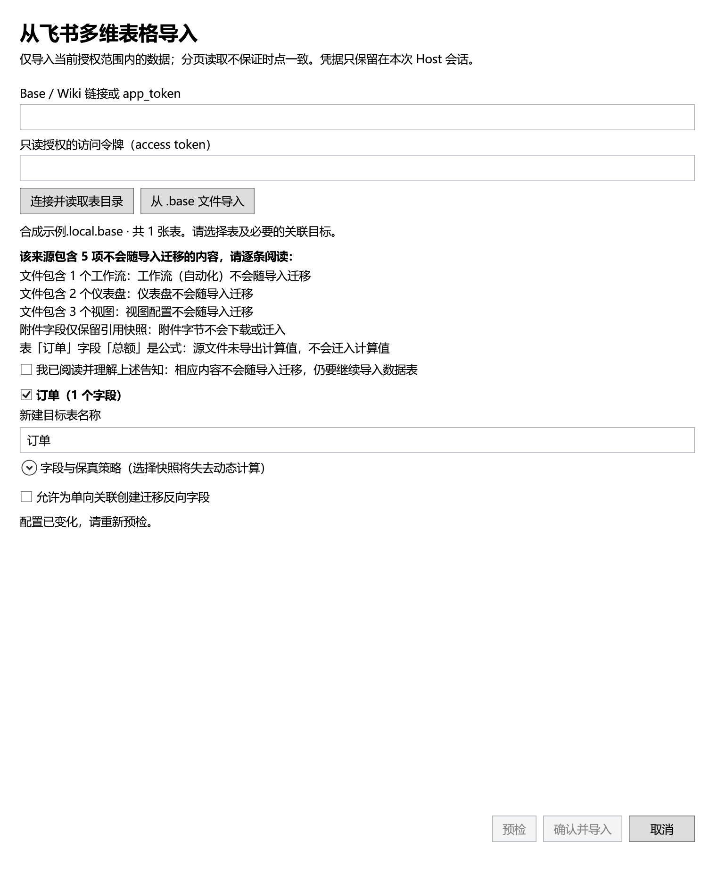

# 多维表格导入

从侧栏「导入管理」选择飞书或 WPS，在原生窗口输入来源与访问令牌，连接后选择数据表、目标表名和字段策略，再预检并确认。导入会新建目标表；进度、取消与结果复用导入管理中的统一任务记录。CSV/XLSX 仍使用原有本地文件选择和预览流程。飞书窗口也可选择「从 .base 文件导入」，此路径无需访问令牌。

当前实现已具备合成 HTTP 回放与原生窗口测试入口，尚未完成单独授权云端合成来源的真实桌面联调。不要将下面的实现范围视为账号兼容性或完整迁移验收结论。

## 来源与授权

| 来源 | 当前输入与读取路径 | 尚未验证或不支持 |
| --- | --- | --- |
| 国内飞书 | Base 链接、Wiki 链接或明确的 app_token；Wiki 经官方节点接口解析为多维表格；读取表、字段、分页记录及附件字节 | 应用/用户授权的真实账号矩阵、完整桌面迁移与离线重开未验证；国际版不支持 |
| WPS 多维表格 | 明确的 file_id；读取 schema 和所选表的分页记录；仅应用启用接口签名时填写 KSO-1 密钥对 | 个人/企业空间均 UNVERIFIED；分享链接解析、盘/文件浏览及附件下载不支持，父子层级检测和记录覆盖性未验证；普通表格、智能表格不作为多维表格导入 |

访问令牌需由用户在平台官方流程取得并拥有来源读取权限。本功能不提供 OAuth 登录、令牌刷新或内置共享密钥。仅申请本次来源所需的读取权限；WPS dbsheet 使用 `kso.dbsheet.read`，不为文件浏览申请盘读写权限。飞书 Wiki 解析与附件读取还需对应资源权限。文档是否可见取决于当前授权，权限不足不能解释为空表。

凭据只在 Host 来源会话内使用，不传入 Vue、工作区报告或持久存储。普通离线浏览不会连接这些平台。关闭未提交窗口会取消来源读取并释放预检会话；已确认任务由导入任务系统管理，关闭窗口不撤销已提交数据。

## 飞书本地 `.base` 文件

选择文件后，Host 在内存中读取并冻结导出快照，后续预检和导入复用这份内容，不再次读取文件，也不访问飞书。文件路径不传给 Web 界面。此入口识别当前已验证的 `schemaVersion=5`、`structVersion=1` 导出结构；损坏或超限文件、重复标识及不支持的结构会拒绝读取。

支持已验证的文本、数值、单选、日期和链接值。其他字段需选择快照或跳过；公式和查找的定义可保留为来源信息，但导出文件可能没有结果值，不能恢复缺失结果或动态计算。附件引用不等于附件文件，当前不会下载附件。视图、仪表盘与自动化不会迁移；导入前显示具体告知，确认后才能预检。文件中的公式、脚本和链接不会执行。

本地导入的合成测试与云端账号联调分开验收；本地文件支持不代表云端任务已完成。

## 预检与保真

- 选中需迁移的表，并将关系依赖表一并纳入预检；关系按源表、字段与记录 ID 重建，不按显示文本猜测。
- 目标表名、选表、字段策略、快照类型或反向字段名变化会使旧预检失效，必须重新预检后确认。
- 值快照可选择保持类型、精确文本或 JSON；超出本地数值精度时选精确文本，无法映射的结构化选项值可选 JSON。单向关系采用原生迁移时，可为目标表中新建的反向字段指定不同名称，避免多个关系同名冲突。
- 原生可表示且已实现转换的字段可保留类型；公式、Lookup、人员、系统及未知字段需选择明确的值快照或跳过策略。快照不会保留云端动态计算能力。
- WPS 日期仅在声明的格式可明确解析时保留日期类型，缺失或未验证格式需确认快照；整数显示格式不限制源值必须为整数。仪表盘、智能文档关联表及未知 sheet 类型会列出不支持项，不作为数据表迁移。
- WPS 附件目前只能明确选择值快照或跳过；快照中的引用不是已下载的离线附件。完整附件迁移仍是未完成范围。
- 分页读取不是来源的时点快照。已观察到的 schema 变化、异常游标、重复记录或读取失败会阻断成功结论；不要把当前授权可见数据称为全量备份。
- 源端始终只读，本地写入复用既有导入内核。取消、部分提交及结果未知以任务回执为准，不自动删除已经创建的目标表。

WPS 父子记录仍是阻塞项：官方 `parents/status` 仅描述前端开关，关闭不能证明没有层级数据；平面记录接口是否包含全部子记录尚无证据。当前实现未重建或可靠检测层级，不能用于要求完整父子结构的迁移。附件信息端点存在，但要求 `kso.coop_files.readwrite`，且字段 `uploadId` 与端点 `attachment_id` 的对应关系及下载域尚未验证；本实现不会据此自动扩权或猜测下载地址。

## 验证边界

合成测试覆盖 HTTP 业务错误、分页、限流、取消、来源映射、凭据隔离和窗口确认行为。它们不能替代真实平台权限、返回形态及附件读取验证。飞书和 WPS 均仍需单独授权的三表测试源（单表 2,501 条、关系和附件），经实际桌面入口迁移并离线重开核对后，才能完成对应任务验收。

