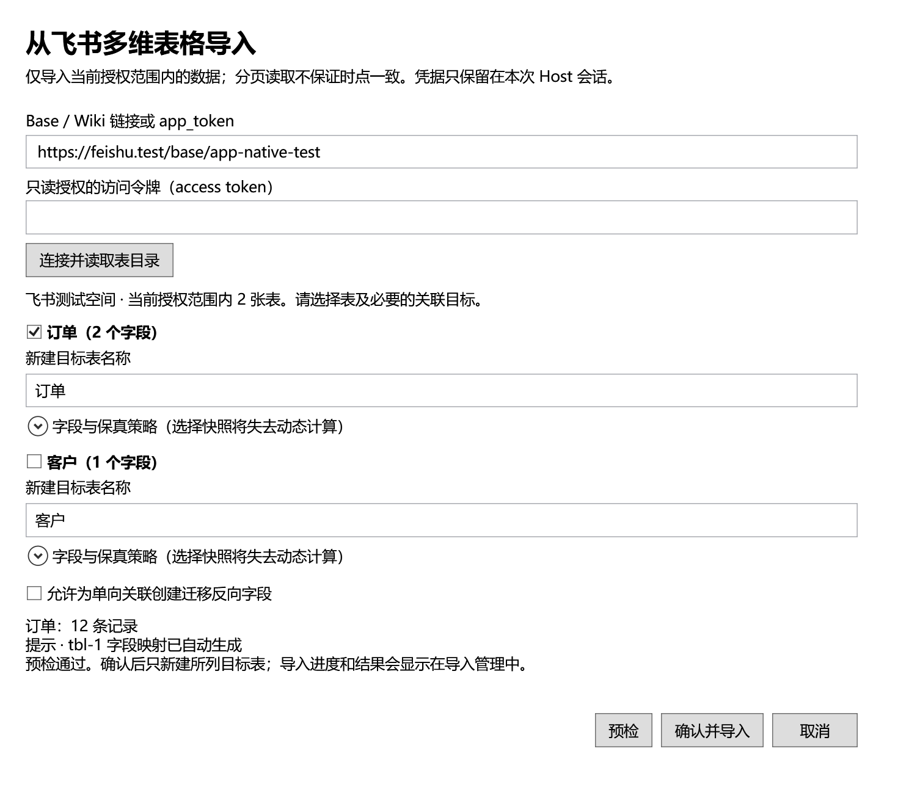

# 云端多维表格导入

从侧栏「导入管理」选择飞书或 WPS，在原生窗口输入来源与访问令牌，连接后选择数据表、目标表名和字段策略，再预检并确认。导入会新建目标表；进度、取消与结果复用导入管理中的统一任务记录。CSV/XLSX 仍使用原有本地文件选择和预览流程。

当前实现已具备合成 HTTP 回放与原生窗口测试入口，尚未完成单独授权云端合成来源的真实桌面联调。不要将下面的实现范围视为账号兼容性或完整迁移验收结论。

## 来源与授权

| 来源 | 当前输入与读取路径 | 尚未验证或不支持 |
| --- | --- | --- |
| 国内飞书 | Base 链接、Wiki 链接或明确的 app_token；Wiki 经官方节点接口解析为多维表格；读取表、字段、分页记录及附件字节 | 应用/用户授权的真实账号矩阵、完整桌面迁移与离线重开未验证；国际版不支持 |
| WPS 多维表格 | 明确的 file_id；读取 schema 和所选表的分页记录；仅应用启用接口签名时填写 KSO-1 密钥对 | 个人/企业空间均 UNVERIFIED；分享链接解析、盘/文件浏览及附件下载不支持；普通表格、智能表格不作为多维表格导入 |

访问令牌需由用户在平台官方流程取得并拥有来源读取权限。本功能不提供 OAuth 登录、令牌刷新或内置共享密钥。仅申请本次来源所需的读取权限；WPS dbsheet 使用 `kso.dbsheet.read`，不为文件浏览申请盘读写权限。飞书 Wiki 解析与附件读取还需对应资源权限。文档是否可见取决于当前授权，权限不足不能解释为空表。

凭据只在 Host 来源会话内使用，不传入 Vue、工作区报告或持久存储。普通离线浏览不会连接这些平台。关闭未提交窗口会取消来源读取并释放预检会话；已确认任务由导入任务系统管理，关闭窗口不撤销已提交数据。

## 预检与保真

- 选中需迁移的表，并将关系依赖表一并纳入预检；关系按源表、字段与记录 ID 重建，不按显示文本猜测。
- 目标表名、选表或字段策略变化会使旧预检失效，必须重新预检后确认。
- 原生可表示且已实现转换的字段可保留类型；公式、Lookup、人员、系统及未知字段需选择明确的值快照或跳过策略。快照不会保留云端动态计算能力。
- WPS 附件目前只能明确选择值快照或跳过；快照中的引用不是已下载的离线附件。完整附件迁移仍是未完成范围。
- 分页读取不是来源的时点快照。已观察到的 schema 变化、异常游标、重复记录或读取失败会阻断成功结论；不要把当前授权可见数据称为全量备份。
- 源端始终只读，本地写入复用既有导入内核。取消、部分提交及结果未知以任务回执为准，不自动删除已经创建的目标表。

## 验证边界

合成测试覆盖 HTTP 业务错误、分页、限流、取消、来源映射、凭据隔离和窗口确认行为。它们不能替代真实平台权限、返回形态及附件读取验证。飞书和 WPS 均仍需单独授权的三表测试源（单表 2,501 条、关系和附件），经实际桌面入口迁移并离线重开核对后，才能完成对应任务验收。

