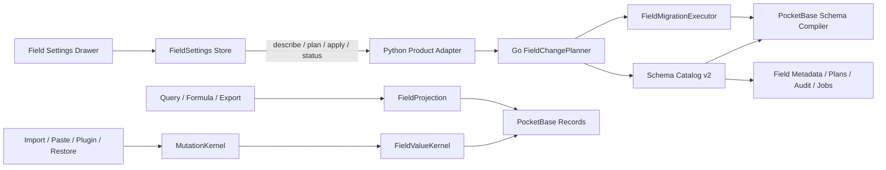
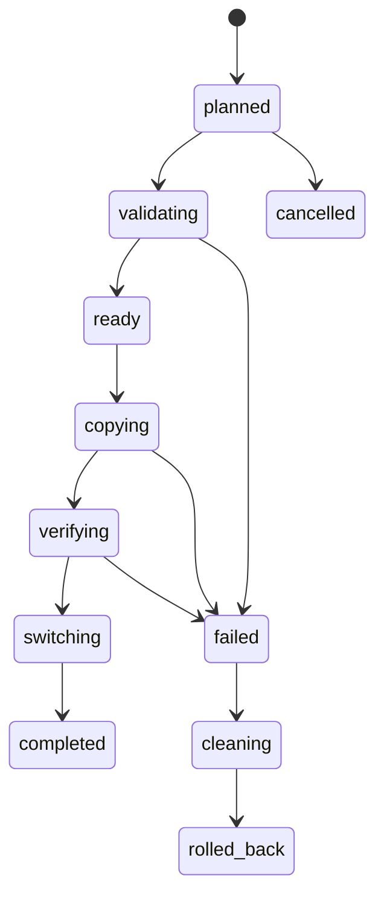

# VibeTable 字段设置完整实施计划

> 状态：Partially implemented；实现起点为 `292ce09a`（`feat(fields): implement schema v2 settings overhaul`）。最终验收清单仍保留未完成项，需以现行稳定化 ledger 和产品证据收口。
> 日期：2026-07-28
> 技术基线：PocketBase `v0.39.9`、Go `1.25`、Node `24`、Vue `3`、Python Broker、Windows Desktop Host
> 语义基线：[PocketBase v0.39.9 字段设置、默认值与桌面多维表格暴露方案](../pocketbase-v0.39.9-vibetable-field-settings.md)
> 本计划替代上述理念文档第 13 节的实施顺序；理念、默认值和字段语义仍以上述文档为准。

## 1. 目标与完成定义

本计划把当前只服务建表、选项平铺、依赖 PocketBase 隐式行为的字段编辑器，改造成一套同时服务“新建字段”和“修改已有字段”的完整字段管理能力。

完成后必须满足：

1. 新建和修改使用同一右侧设置抽屉，只有“常规 / 高级”两个页签；危险区固定在高级页底部。
2. 每个可编辑选项都有明确的当前值和 VibeTable 推荐默认值；不再用 placeholder、空 JSON 文本或 PocketBase 隐式默认表示产品行为。
3. 字段显示名可自由修改，稳定 `fieldId` 和公开物理名不随重命名变化。
4. 必填、默认值、唯一性、空白、`0`、`false`、`(0,0)`、空文本和空容器在所有写入与读取入口具有同一语义。
5. 同类型设置可以原地修改；显示设置不改数据；约束变更先预检；存储或类型变更通过迁移执行器完成。
6. 普通删除是可恢复停用；永久清除才删除物理列、索引、附件和关联元数据。
7. Schema 不进入 Ctrl+Z；只保留操作审计、迁移前后定义、失败回滚和字段回收站，不建设完整 Schema 时间机器。
8. `hash`、`secret`、`decimal` 和 PocketBase 原生危险属性不出现在普通用户的新建菜单或可编辑控件中。
9. 前端、Python Adapter、Go Sidecar、PocketBase Schema、查询、导入、粘贴、插件、历史恢复和备份形成一个可验证的纵切。

## 2. 范围与非目标

### 2.1 本轮范围

- Schema 域严格契约 v2；
- 字段能力与推荐默认矩阵；
- 字段身份、生命周期、存在性列和稳定 select option ID；
- 字段变更 Plan/Apply 协议；
- 同类型修改、约束预检、默认值、唯一索引；
- 类型转换、回填、关系目标/基数变化等迁移；
- 字段停用、恢复、永久清除；
- 创建/编辑共用抽屉和字段回收站；
- 所有字段族的常规、高级、危险选项；
- 跨语言契约、单元、集成、故障注入和产品 E2E。

### 2.2 明确不做

- 不把 Schema 操作加入 Ctrl+Z；
- 不建设用户可浏览、可任意回到任一版本的 Schema 修订历史；
- 不开放 PocketBase `system`、`primaryKey`、`hidden`、原始字段 ID或物理名编辑；
- 不开放精确十进制、密码/hash/secret 普通字段；
- 不让 UI、插件或 Python 直接生成 PocketBase DDL、索引 SQL 或存在性列；
- 不为当前开发数据实现 v1/v2 长期双读、双写或数据兼容层；
- 不承诺在线无锁迁移。首版采用表级写锁和可见进度，优先保证一致性。

## 3. 冻结的产品规则

### 3.1 通用规则

| 设置 | 推荐默认 | 分组 | 规则 |
|---|---|---|---|
| 显示名称 | 按类型命名 | 常规 | 只修改 `displayName` |
| 描述 | 空 | 常规 | 最多 300 字符 |
| 必填 | 关闭 | 常规 | 产品存在性校验，不机械映射 PB `required` |
| 默认值 | 关闭 | 常规 | “启用 + 类型化值”，只作用于未来 insert 且 key 未提供 |
| 唯一值 | 关闭 | 常规 | 开启后默认忽略产品空白 |
| 视图隐藏 | 关闭 | 常规 | 属于视图，不属于字段 Schema；不放进字段定义 |
| 物理名 | Sidecar 自动分配 | 高级只读 | 创建后稳定；显示名修改不影响它 |
| 字段 ID | Sidecar 自动分配 | 高级只读 | 产品引用的稳定身份 |
| `presentable` | 关闭 | 高级 | 只影响 PB 管理后台提示 |
| 危险原生属性 | 不开放 | 高级底部只读说明 | 普通用户不能修改 |

“恢复推荐值”只修改草稿。用户仍需显式保存，并经过与普通修改相同的差异计算和预检。

### 3.2 字段族推荐默认

| 逻辑类型 | 推荐默认与主要行为 |
|---|---|
| 文本 | 最大 5000 Unicode 字符；最小 0；pattern 关闭；默认值关闭 |
| 富文本 | 最大 1 MiB；URL 转换关闭；默认值关闭 |
| 数字 | binary64；普通数字格式；最多显示 2 位且去尾零；千分位开启；范围不限；默认值关闭 |
| 整数显示 | 与数字同一存储；`onlyInt=true` 约束；显示 0 位；切换格式不改存储 |
| 货币显示 | binary64；CNY；最多 2 位；千分位开启；不承诺会计精度 |
| 百分比显示 | ratio 存储；最多 2 位；显示时乘 100；切换格式不改存储 |
| 单位显示 | binary64；单位标签为空；标签仅显示 |
| 布尔 | 三态，允许未填写；复选框显示；默认值关闭 |
| 日期 | floating calendar date；显示到日；默认值关闭 |
| 日期时间 | UTC instant；按系统时区显示；默认到分钟；秒/毫秒只影响显示 |
| 时间 | wall-clock time；无日期和时区；默认到分钟 |
| Email | 域名允许/禁止列表为空；唯一关闭；默认值关闭 |
| URL | 只允许 HTTP/HTTPS；域名列表为空；默认值关闭 |
| 单选 | 至少 1 个选项后才可保存；不自动选第一项；默认值关闭 |
| 多选 | 从单选切换时默认“允许全部”；可改固定上限；默认值关闭 |
| 关系 | 必选目标表；单关系；`setNull`；显示字段显式选择 |
| 附件 | 单文件；5 MiB/文件；MIME 不限；无额外 thumbs；`protected=false` |
| GeoPoint | 6 位显示小数；不裁剪存储；默认值关闭 |
| JSON | 根类型任意；产品空白为 `null`；最大 1 MiB；2 空格格式化；代码/树形编辑 |
| 自动日期 | 创建时间或最后更新时间固定角色；只读；无必填、默认值和唯一设置 |
| 公式 / Lookup | 结果只读；无必填和默认值；类型设置由公式或路径结果决定 |

数值和日期的显示位数、币种、百分比/单位预设、时间显示精度都属于纯显示变更。增加或减少小数位不会舍入、重写或迁移原始值。

### 3.3 危险项

普通用户只会遇到产品确实支持的危险动作：

- 关系 `cascade`：展示删除方向、影响记录数和依赖；
- 字段永久清除：展示将删除的物理列、存在性列、索引、附件、公式/Lookup 依赖和记录数；
- 有损类型转换：必须选择转换规则、查看失败样本并确认。

`system`、`primaryKey`、`hidden`、PocketBase 原始字段 ID 和物理名只显示诊断，不提供开关。

### 3.4 可编辑选项矩阵

此表是 UI、Capability、契约和测试的共同覆盖清单。未列出的 PocketBase 属性不得临时塞进开放 JSON 配置。

| 字段族 | 常规 | 高级 | 只读或危险 |
|---|---|---|---|
| text | 显示名、描述、必填、默认文本、唯一 | min/max 字符数、pattern、自动生成 pattern | primaryKey/system/hidden 只读 |
| editor | 显示名、描述、必填、默认富文本 | maxSize、convertURLs | provider ID/物理名只读 |
| number | 必填、默认数值、格式预设、min/max | onlyInt 约束、显示位数/模式、去尾零、千分位、币种、百分比存储语义、单位标签 | PB required 映射只读 |
| bool | 必填、默认值、显示形式、允许未填写/三态 | true/false 标签 | PB “required=必须为 true”不开放为普通必填 |
| date/dateTime/time | 必填、固定或动态默认 | min/max、显示精度、dateTime 显示时区诊断 | 三种逻辑语义互转属于 migration |
| autodate | 无普通可编辑项 | 角色诊断 | onCreate/onUpdate 固定、system/readOnly、无默认/必填/唯一 |
| email | 必填、默认值、唯一 | onlyDomains、exceptDomains | provider 映射只读 |
| url | 必填、默认值、唯一 | onlyDomains、exceptDomains、允许协议 | 非 HTTP/HTTPS 协议显示安全警告 |
| select/multiselect | 必填、默认值、单/多模式、选项 label/color/order | maxSelect、停用选项 | 删除已使用 option 进入替换/清空计划 |
| relation | 必填、目标表、单/多模式、关系显示字段 | minSelect/maxSelect、setNull/restrict | cascade 显示方向和影响；目标/基数变更可触发 migration |
| file | 必填、单/多文件、maxFiles、maxBytes、MIME 预设/自定义 | thumbs、protected | 永久清除包含附件 blob |
| geoPoint | 必填、默认坐标、显示位数 | 经纬度输入/显示规则 | PB required 映射只读 |
| json | 必填、默认 JSON、根类型、代码/树形模式、缩进 | maxSize、JSON Schema | 原始 PB JSON 存储诊断只读 |
| formula/lookup | 显示名、描述 | 结果类型和来源诊断；通过各自编辑器修改公式/路径 | 结果只读，无默认/必填/唯一 |
| hash/secret/password/decimal | 无 | 无 | 不在普通菜单；开发者诊断只读 |

补充规则：

- text 的自动生成 pattern 只有 Sidecar 已实现并验证 PocketBase 语义时才由 Capability 返回；否则整项隐藏，不显示无效开关。
- 动态默认只对有明确产品语义的 date/dateTime 开放；time 的“当前时间”保存 wall-clock 值。
- GeoPoint 默认值仍默认关闭；开启后 `(0,0)` 是合法明确值。
- JSON 默认编辑器必须能表达 enabled + `null`，不得把 `null` 与默认关闭混为一谈。
- formula/lookup 的结构化配置继续由其专用深模块拥有；Field Settings Drawer 只提供共同元数据和跳转入口。

## 4. 目标架构



### 4.1 深模块与稳定接口

| 模块 | 稳定接口 | 隐藏的复杂度 |
|---|---|---|
| `SchemaModelV2` | `Normalize`、`Validate`、`CapabilityFor`、`RecommendedDefaults` | 严格字段联合类型、默认矩阵、PB 映射 |
| `FieldIdentityAllocator` | `AllocateField`、`AllocateOption`、`AllocateProviderField` | opaque ID、物理名冲突、重试稳定性 |
| `FieldChangePlanner` | `DescribeSettings`、`PlanChange`、`ApplyPlan` | 规范化、diff、分级、依赖、预检、幂等、revision |
| `FieldValueKernel` | `NormalizeWrite`、`ValidateValue`、`ProjectPhysicalWrite` | presence、默认、必填、空白、select ID、日期和数字原始输入 |
| `FieldProjection` | `SelectDescriptor`、`ProductValue`、`BlankPredicate`、`UniquePredicate` | value/presence 双列读取、筛选、排序、digest、公式输入 |
| `FieldMigrationExecutor` | `Start`、`Status`、`CancelBeforeSwitch`、`Resume` | shadow 字段、分批转换、验证、原子切换、失败清理 |
| `FieldLifecycle` | `Retire`、`Restore`、`Purge` | 依赖、回收站、附件、索引、物理资源 |
| `FieldSettingsFrontend` | `openCreate`、`openEdit`、`save`、`close` | 原始值/草稿、dirty guard、预检和迁移 UI |

调用者只提交产品意图，不提交 PocketBase 类型名、DDL、索引 SQL、存在性列名称或 provider field ID。

## 5. Schema 域契约 v2

### 5.1 版本策略

产品契约统一收敛到 `contracts/v2/product-contracts.schema.json`，Mutation、事件和插件相关产品 DTO 同步使用 `contractVersion: "2.0"`，不保留旧版本适配。

新增独立的 `vibetable.schema.v2` 域契约：

- 新增 `contracts/schema-v2/schema.schema.json`、fixtures 和生成脚本输入；
- Schema 描述、字段设置和字段变更 RPC 使用 v2 DTO；
- Mutation/Event 等通用信封统一使用 `contractVersion: "2.0"`；
- 当前没有业务数据，生产 Schema 路径一次性切到 v2，不实现 v1/v2 双读；
- 旧 `schema.validate/apply/delete` 从 renderer allowlist 移除，只保留为短期开发诊断入口，完成切换后删除。

### 5.2 字段定义

字段定义按责任拆分，禁止继续用开放的 `editor.config` 承载存储语义：

```jsonc
{
  "contract": "vibetable.schema.v2",
  "identity": {
    "fieldId": "fld_<opaque>",
    "physicalName": "f_<opaque>",
    "providerFieldId": "pb_<opaque>"
  },
  "displayName": "金额",
  "help": "",
  "logicalType": "number",
  "lifecycle": {
    "state": "active",
    "retiredAt": null
  },
  "value": {
    "required": false,
    "default": {
      "enabled": false,
      "value": null,
      "source": "recommended",
      "defaultsVersion": 1
    },
    "presence": {
      "mode": "companion",
      "providerFieldId": "pb_<opaque>",
      "physicalName": "__vt_has_f_<opaque>"
    }
  },
  "constraints": {
    "unique": {
      "enabled": false,
      "blankPolicy": "ignoreMissing"
    },
    "range": {"min": null, "max": null}
  },
  "storage": {
    "kind": "pocketbase-number",
    "options": {"onlyInt": false}
  },
  "display": {
    "kind": "number",
    "preset": "number",
    "displayScale": 2,
    "scaleMode": "max",
    "trimTrailingZeros": true,
    "useGrouping": true,
    "currency": "CNY",
    "percentStorage": "ratio",
    "unit": null
  }
}
```

具体实现使用以 `logicalType` / `kind` 为判别字段的严格联合类型，不使用任意 JSON object。

身份规则：

- `fieldId` 是所有产品引用使用的稳定 ID；
- `physicalName` 是产品公开诊断中的稳定物理名；
- `providerFieldId` 是内部 PocketBase 字段身份，可在 shadow migration 中轮换，普通用户不可见；
- 类型转换原子切换时，临时字段先用临时物理名；最终把新 provider 字段切回原 `physicalName`，因此产品身份和公开物理名保持稳定。

### 5.3 Select 选项

```jsonc
{
  "optionId": "opt_<opaque>",
  "label": "进行中",
  "color": "blue",
  "order": 20,
  "state": "active"
}
```

记录存储 `optionId`，不存 label。修改 label/color/order 不改记录；删除已使用选项必须生成替换、清空或取消计划。停用选项保留旧记录可读，但新写入不可选。

### 5.4 字段能力描述

`CapabilityFor(logicalType)` 是后端单一真相源，至少返回：

- 可用常规、高级和危险设置；
- 推荐默认值及 `defaultsVersion`；
- 是否支持 required/default/unique；
- 是否需要 presence；
- 可用显示预设；
- 可转换来源/目标与转换规则；
- PocketBase 编译策略；
- 是否允许普通用户创建。

前端用它决定控件可见性，但最终合法性仍由 Sidecar 校验。已有字段如果含当前版本不推荐的值，界面忠实显示实际值，不在打开时自动改写。

## 6. 字段变更协议

### 6.1 RPC

| RPC | 用途 | 主要结果 |
|---|---|---|
| `field.settings.describe` | 打开创建/编辑抽屉 | 当前定义、推荐值、能力、schema revision |
| `field.change.plan` | 保存前规范化、diff、预检 | 冻结 plan、诊断、影响、确认要求 |
| `field.change.apply` | 应用冻结计划 | receipt 或 migration job |
| `field.change.status` | 查询迁移 | 状态、进度、错误、是否可取消 |
| `field.change.cancel` | 切换前取消迁移 | 最终状态 |
| `field.recycleBin.list` | 查看停用字段 | 可恢复性、依赖、物理数据状态 |

创建字段也使用 `field.change.plan/apply`。新建表可以批量提交多个 create intent，但每个字段仍产生独立 normalized definition 和稳定身份。

### 6.2 变更意图

`FieldChangeIntent` 的 action 为：

- `create`
- `update`
- `retire`
- `restore`
- `purge`
- `convert`
- `backfill`

`create/update/convert` 提交完整的可编辑草稿，而不是 JSON Patch。Sidecar 根据原定义计算 diff，避免前端决定变更语义。

所有意图必须携带：

- `tableId`
- `fieldId`（create 时为空）
- `expectedSchemaRevision`
- `expectedDataRevision`（需要扫描/迁移时）
- `draft` 或 action 专用配置
- actor 上下文

### 6.3 冻结计划

`FieldChangePlan` 至少包含：

- `planId`、`planHash`、`expiresAt`
- normalized before/after definitions
- 分级后的 diff
- `expectedSchemaRevision`、`expectedDataRevision`
- 影响记录数、空白数、歧义数和有限失败样本
- 索引、公式、Lookup、关系、视图、附件依赖
- 执行步骤和预计是否产生 migration job
- warnings/errors
- `canApply`
- 所需确认：级联、替换规则、备份 receipt、永久清除文字确认

Plan 持久化在 Sidecar，不保存在 Python 内存。默认 30 分钟过期；Schema/Data revision 变化立即失效。Apply 需要 `operationId`，并按 plan hash 幂等。相同 operationId 携带不同 plan 时拒绝。

### 6.4 变更分级

| 等级 | 示例 | 预检与应用 |
|---|---|---|
| `display` | 显示名、帮助、颜色、顺序、数值小数位、币种、日期显示精度 | 不扫描记录；原子保存元数据 |
| `metadata` | `presentable`、编辑模式 | 不扫描或轻量编译检查 |
| `constraint` | 必填、唯一、min/max、长度、pattern、域名、JSON Schema | 扫描受影响记录；不通过则阻止 |
| `schema` | 同 PB 类型的 maxSize、MIME、thumbs、protected、relation policy | 编译新 Schema；按需要扫描 |
| `migration` | 类型、关系目标/基数、单选/多选、有损规则、默认值回填 | shadow migration |
| `danger` | cascade、永久清除 | 影响预览、备份、二次确认 |

一次保存包含多个等级时，以最高等级决定流程；仍分别展示每项 diff。

## 7. 空白、默认、必填和唯一性的权威实现

### 7.1 Presence

对 PocketBase 会折叠产品空白的可空字段，在创建时同步创建固定 companion presence 字段：

- number、bool、geoPoint；
- text、editor、email、url、date/dateTime/time；
- select、relation、file。

JSON 原生使用 `null`，不建 presence；autodate、formula、lookup、系统字段按各自只读契约处理。

元数据显式保存 presence 的 `providerFieldId` 和 `physicalName`，任何路径不得按字符串猜测。

`FieldValueKernel` 在同一事务写 value 和 presence：

| 产品输入 | value | presence |
|---|---|---:|
| 未填写数字 | `0` | `false` |
| 明确数字 `0` | `0` | `true` |
| 未填写布尔 | `false` | `false` |
| 明确 `false` | `false` | `true` |
| 未填写 GeoPoint | `(0,0)` | `false` |
| 明确 `(0,0)` | `(0,0)` | `true` |
| 未填写多选 | `[]` | `false` |
| 明确空集合 | `[]` | `true` |

读取、筛选、排序、统计、公式、Lookup、digest、导出和唯一索引都通过 `FieldProjection` 获取产品值。

### 7.2 默认值

`DefaultSpec` 必须有独立 `enabled`，使无默认值与默认 `0`、`false`、空文本或空集合可区分。

规则：

1. 只在 insert 且输入对象不存在该 field key 时注入；
2. 显式提交产品空白时不注入；
3. update 永不重放默认值；
4. 修改默认值只影响未来记录；
5. 回填是单独 `backfill` action，默认仅处理产品空白，并提供预览；
6. 动态默认（今天/当前时间）在 Sidecar 的幂等事务中求值一次，重试复用同一结果；
7. autodate/formula/lookup/hash/secret 不提供普通默认值。

### 7.3 必填

普通 UI 只有一个“必填”开关，默认关闭，不暴露 `nullable`。

- 文本、日期、select、relation、file 等检查产品 presence；
- number 的 `0` 合法；
- bool 的 `false` 合法；
- GeoPoint 的 `(0,0)` 合法；
- JSON 按产品 `null` 检查；
- formula/lookup/autodate 不显示必填；
- PB `required` 只在语义完全一致且不破坏零值时作为额外存储约束，否则保持 false。

### 7.4 唯一性

唯一默认关闭，开启时默认 `blankPolicy=ignoreMissing`。

索引由 `CompileIndexes()` 通过 field descriptor 生成部分唯一索引：

- presence 字段为 true 的记录参与；
- JSON 使用 `IS NOT NULL`；
- 明确 `0`、`false`、空文本或空集合按产品定义参与；
- 不支持可靠比较的类型不提供开关；
- 索引创建前扫描重复值并返回计数与有限样本；
- 索引状态必须可从 Schema describe 中读回，不允许 UI 猜测。

## 8. 迁移与回滚

### 8.1 迁移状态机



规则：

- `switching` 前可以取消；进入原子切换后不可取消；
- 首版迁移期间对目标表加写锁，读取继续使用旧字段；
- 创建临时 value/presence/provider 字段，分批读取、转换、验证并写入；
- 验证通过后，在一个 Sidecar 权威事务中切换元数据、索引和公开物理名；
- 原字段转为内部 retired provider 字段，直到迁移 receipt 和备份验证完成；
- 成功后按计划清理临时/旧 provider 字段；
- 任一步失败时旧字段继续权威，清理 shadow 资源并记录稳定错误；
- 进程中断后从 `vibetable_jobs.cursor_json` 恢复；不得重新猜测计划。

### 8.2 转换矩阵

| 来源 → 目标 | 空表 | 非空表默认 | 需要规则 |
|---|---|---|---|
| number → integer display | 直接 | 仅所有值均为整数时无损 | 否则 round/floor/ceil/truncate/阻止 |
| integer display → number | 直接 | 无损 | 无 |
| number 显示预设互换 | 直接 | 纯显示 | 无 |
| text → email/url/UUID | 直接 | 全量验证通过才无损 | 无效值清空/保留文本/阻止 |
| email/url → text | 直接 | 无损 | 无 |
| single select → multi select | 直接 | 单值包装为数组 | 无 |
| multi select → single select | 直接 | 仅每行最多一项时无损 | first/last/清空/阻止 |
| 单关系 → 多关系 | 直接 | 单值包装 | 无 |
| 多关系 → 单关系 | 直接 | 仅每行最多一项时无损 | first/last/清空/阻止 |
| date ↔ dateTime ↔ time | 直接 | 必须预览固定语义转换 | 时区/日期补全/截断规则 |
| 其他跨存储类型 | 直接 | 默认阻止，逐项增加显式规则 | 必须 |

显示位数变化永远不进入此矩阵。

### 8.3 回滚边界

- 同一事务中的 Schema/索引/元数据失败：由 PocketBase transaction 回滚；
- shadow migration 失败：旧字段仍为权威，删除 shadow，状态为 `rolled_back`；
- Apply 已成功提交后：不提供 Ctrl+Z 或通用 Schema undo；
- 可恢复需求由字段回收站承担；
- 永久清除后只能通过无损备份恢复，产品不承诺 Schema 历史回退。

## 9. 字段生命周期

### 9.1 停用

“移除字段”执行 `retire`：

- 从活跃表定义、列选择器和普通查询中隐藏；
- 保留 `fieldId`、公开物理名、provider 字段、presence、索引定义和数据；
- 记录 retiredAt、before definition、操作者和依赖；
- 公式、Lookup、关系、视图和导出依赖未处理时阻止停用；
- 字段回收站无限期保留，直到用户显式恢复或永久清除，不自动过期。

### 9.2 恢复

恢复前检查：

- 物理字段及 presence 完整；
- `fieldId` 和物理名无冲突；
- 目标类型能力仍受支持；
- 依赖可重新启用；
- 当前 Schema revision 未变化。

恢复保留原 fieldId、物理名、select option ID 和数据。

### 9.3 永久清除

必须同时满足：

- 当前 schema/data revision 的无损备份 receipt 已成功；
- 无未处理依赖；
- 无进行中的字段迁移；
- 用户完成字段名文字确认；
- Plan 明确列出将删除的 value/presence、索引、附件 blob/metadata、关系和审计摘要。

清除操作本身写一条 Schema audit receipt，但不保存被删除数据的第二份历史副本。

## 10. 前端实施

### 10.1 组件与状态

新增独立模块，避免把 `relations/FieldManagerDrawer.vue` 扩成万能表单：

```text
desktop/web-grid/src/field-settings/
  components/
    FieldSettingsDrawer.vue
    CommonSettingsPane.vue
    AdvancedSettingsPane.vue
    DangerZone.vue
    FieldDiffPanel.vue
    FieldChangePlanDialog.vue
    FieldMigrationProgress.vue
    FieldRecycleBin.vue
    editors/
  fieldSettingsModel.ts
  fieldSettingsService.ts
  fieldSettingsStore.ts
  capabilityMatrix.ts
  defaultsPresentation.ts
```

可以复用现有关系抽屉的 drawer、冻结计划卡片、依赖勾选和警告视觉语言，不复用关系专用状态模型。

Store 状态：

- `closed`
- `loading`
- `editing`
- `planning`
- `awaitingConfirmation`
- `applying`
- `migrating`
- `succeeded`
- `failed`

Store 同时保存 `original`、`draft`、`capability`、`dirty`、`plan` 和 revision。关闭 dirty 抽屉必须确认。

### 10.2 入口

- 新建表：左侧紧凑字段列表，右侧打开同一个 Field Settings Drawer；
- 已有表新增字段：列头/表管理中的“新增字段”；
- 修改字段：列头菜单“字段设置”；
- 停用：高级页危险区“移除字段”；
- 恢复/清除：表管理中的字段回收站。

创建表不再直接从 `SchemaFieldEditor.vue` 生成最终物理定义。前端只维护 draft，Sidecar Plan 返回分配好身份和显式默认值的 normalized definition。

### 10.3 保存流程

1. 用户点击保存；
2. 本地只做即时格式提示；
3. 调用 `field.change.plan`；
4. 无 diff 时直接关闭或提示“没有变更”；
5. 展示 display/constraint/migration/danger 分类；
6. 有 warning 时确认，有 error 时回到对应控件；
7. 调用 `field.change.apply`；
8. 同步变更返回新 Schema；
9. migration 返回 job，抽屉展示进度，可在切换前取消；
10. 成功后刷新表定义和列，不把操作加入 Ctrl+Z。

### 10.4 控件规则

- 默认值统一为开关 + 类型化编辑器；
- 不显示独立 nullable；
- 不用原始 JSON 文本编辑普通默认值；
- 常规区只显示高频产品语义；
- 高级区按“数据校验 / 格式与精度 / PocketBase 映射 / 危险操作”分段；
- 不适用设置完全隐藏，不以 disabled 开关堆满界面；
- 只读 provider 诊断使用复制按钮和解释文本；
- 所有警告说明“会影响什么”，不只写“危险”。

## 11. 内部存储

在开发数据库重建中更新内部集合：

### 11.1 扩展 `vibetable_fields`

新增或重构：

- schema model version；
- lifecycle state / retiredAt；
- identity JSON（field/provider/presence IDs 与物理名）；
- value semantics JSON；
- typed constraints JSON；
- typed storage JSON；
- typed display JSON；
- recommended defaults version；
- definition hash。

停止用 `replaceFieldMetadata()` 删除并重建所有字段记录；改为按稳定 fieldId upsert，保留 retired 字段。

### 11.2 新增 `vibetable_schema_change_plans`

保存冻结 plan、hash、expected revisions、状态、过期时间和 actor。它是短期执行凭据，不是 Schema 历史。

### 11.3 扩展 `vibetable_jobs`

增加 field migration 的：

- planId / fieldId；
- before/after definition；
- phase；
- cursor / progress / error；
- shadow provider identities；
- write-lock owner；
- cleanup 状态。

### 11.4 新增 `vibetable_schema_audit`

每次成功或失败的 Schema 操作一条摘要：

- operationId / planId / action；
- tableId / fieldId；
- before/after definition hash 和必要快照；
- outcome / error code；
- actor / occurredAt；
- migration job / backup receipt。

该集合不进入 `history/change-sets`，也不支持 Ctrl+Z。

通用 `vibetable_idempotency_keys` 可复用 operationId 机制，不另建重复的操作表。

## 12. 按依赖顺序实施

每个工作包都应保持主分支可构建。未接入 UI 的新能力先只通过测试调用，不使用用户可见 feature flag 或双写。

### WP0：特征测试与切换护栏

**目标：** 在重构前固定当前正确行为和已知差距。

**主要文件：**

- `sidecar/internal/schema/*_test.go`
- `sidecar/internal/schemaapi/*_test.go`
- `sidecar/internal/mutation/*_test.go`
- `sidecar/internal/query/*_test.go`
- `desktop/web-grid/src/services/schemaFieldDraft.test.ts`
- `desktop/web-grid/src/components/panels/SchemaFieldEditor.test.ts`
- Python paste/import contract tests

**任务：**

- 为当前 transaction rollback、field ID 保存、默认注入只发生于 insert/unsupplied 补特征测试；
- 添加预期失败或 todo 测试矩阵：presence、部分唯一、稳定重命名、编辑入口；
- 建立“provider 字段不能泄露到产品 DTO”的断言；
- 固定 schema v1 renderer allowlist，便于后续确认已移除。

**完成门槛：** 所有既有测试通过；新测试准确描述切换前行为，不修改产品语义。

### WP1：Schema v2 契约与能力矩阵

**目标：** 先建立严格的共同语言。

**主要文件：**

- `contracts/schema-v2/schema.schema.json`
- `contracts/schema-v2/fixtures/*`
- `contracts/v2/generate_product_rpc_catalog.py`
- `sidecar/internal/schema/types.go`
- 新 `sidecar/internal/schema/v2/*`
- `desktop/web-grid/src/contracts/*`
- `backend/application/product_data_service.py`
- Desktop RPC registry / gateway tests

**任务：**

- 定义 FieldDefinitionV2、typed unions、Capability、RecommendedDefaults、Intent、Plan、Receipt、MigrationStatus；
- 为所有普通字段族建立默认与设置支持矩阵；
- 生成/维护 Go、Python、TS 的严格 DTO；
- 新增字段 RPC catalog cases 和深度/大小安全限制；
- 保持 Mutation/Event v1 不变。

**完成门槛：** 同一 fixtures 在 JSON Schema、Go strict decode、Python params、TS tests 中一致通过；unknown property 一律拒绝。

### WP2：内部元数据与身份分配

**目标：** 建立未来可修改、可停用、可迁移的稳定身份。

**主要文件：**

- `sidecar/migrations/*_field_settings_v2.go`
- `sidecar/internal/schemaapi/catalog.go`
- 新 `sidecar/internal/schema/identity.go`
- Schema metadata integration tests

**任务：**

- 重建开发内部集合；
- 改为按 fieldId upsert，不整体替换 retired metadata；
- Sidecar 分配 fieldId、公开物理名、providerFieldId、presence provider ID、optionId；
- plan 重试复用已冻结身份；
- displayName 重命名只改元数据。

**完成门槛：** 重复 plan/apply 不生成新 ID；重命名不改 fieldId/physicalName；并发创建无冲突。

### WP3：Schema 编译器与 presence 物理模型

**目标：** 让 FieldDefinitionV2 可编译为完整 PB Schema。

**主要文件：**

- `sidecar/internal/schema/compiler.go`
- `sidecar/internal/schema/capabilities.go`
- `sidecar/internal/schema/validate.go`
- `sidecar/internal/schema/enum_codec.go`
- `sidecar/internal/schemaapi/catalog.go`

**任务：**

- 编译 value + presence companion 字段；
- providerFieldId 与产品 fieldId 分离；
- 为每个 logical type 编译严格 PB options；
- 修正 number/bool/geoPoint required 映射；
- select 存稳定 option ID；
- 明确禁止 decimal/hash/secret 普通创建；
- CompileIndexes 接收 field descriptor。

**完成门槛：** 实际 PocketBase v0.39.9 集成测试验证创建、describe、重放、失败 transaction rollback。

### WP4：FieldValueKernel

**目标：** 所有产品写入共享一个字段值权威实现。

**主要文件：**

- 新 `sidecar/internal/fieldvalue/*`
- `sidecar/internal/mutation/kernel.go`
- `sidecar/internal/mutation/apply.go`
- `sidecar/internal/mutation/schema_source.go`
- attachment/relation/formula mutation paths

**任务：**

- 在规范化前保留 key 是否存在和原始数字文本；
- 实现 typed default、presence、required、constraints、date/select 编码；
- value/presence 同事务写入；
- receipt/follow-up read 返回权威产品行；
- 插件和历史恢复继续只通过 MutationKernel。

**完成门槛：** 在线编辑、insert/update、附件和关系 mutation 对同一输入产生相同产品结果；零值/空白矩阵全覆盖。

### WP5：读取、查询、公式、唯一索引与导出

**目标：** 所有消费者按产品空白读取。

**主要文件：**

- 新 `sidecar/internal/fieldprojection/*`
- `sidecar/internal/query/*`
- `sidecar/internal/queryschema/*`
- `sidecar/internal/formula/*`
- `sidecar/internal/mutation/apply.go` 的 `productRow()`
- export/backup paths

**任务：**

- descriptor 同时携带 value/presence；
- 实现 blank/notBlank、排序、统计、digest；
- formula/lookup 接收产品 null；
- 部分唯一索引忽略 missing；
- CSV/XLSX 把产品 null 导出为空单元格；
- 无损备份保留 v2 definition、presence 和 retired 字段。

**完成门槛：** 同一记录在 query、mutation receipt、formula、export 中产品值一致；明确空容器与 missing 可区分。

### WP6：削薄 Python 与前端写入 Adapter

**目标：** Adapter 只负责传输、文件解析和错误定位。

**主要文件：**

- `backend/application/paste_service.py`
- `backend/application/import_service.py`
- `backend/adapters/pocketbase/mutation.py`
- plugin mutation adapters
- `desktop/web-grid/src/services/mutationService.ts`
- paste/import services

**任务：**

- 移除与 Go 重复的默认、required、空白和存储转换；
- 保留 CSV/XLSX/clipboard 解析、行列坐标和预览展示；
- 原始单元格值与 supplied 状态传给 MutationKernel；
- import 的“应用默认值 / 保留空白”转换为明确 intent，不在 Python 猜值。

**完成门槛：** paste/import/inline/plugin 的共享 corpus 结果一致；Python 不含 PB 字段语义分支。

### WP7：FieldChangePlanner 与 RPC

**目标：** 建立字段变更的唯一入口。

**主要文件：**

- 新 `sidecar/internal/fieldchange/*`
- `sidecar/internal/app/field_change_routes.go`
- `backend/application/product_data_service.py`
- `desktop/src/.../ProductDataRpcRegistry.cs`
- `desktop/web-grid/src/bridge/hostBridge.ts`
- RPC catalog / gateway tests

**任务：**

- describe、normalize、diff、classify、preflight；
- 计划持久化、30 分钟过期、revision 失效；
- operationId 幂等；
- typed diagnostics 和稳定错误码；
- renderer allowlist 新增 v2 RPC。

**完成门槛：** 计划被篡改、过期、revision 冲突和重复 operationId 均有确定结果；Backend 不再保存 field plan 内存字典。

### WP8：同类型修改、停用、恢复和清除

**目标：** 先交付不需要类型转换的完整生命周期。

**主要文件：**

- `sidecar/internal/fieldchange/apply.go`
- `sidecar/internal/schemaapi/catalog.go`
- dependency graph modules
- backup integration
- schema audit storage

**任务：**

- display/metadata/constraint/schema 级变更；
- preflight required/unique/range/pattern/domain/maxSize；
- retire/restore；
- purge 的依赖、备份和确认守卫；
- Schema audit 与数据 history 隔离；
- 关系 `setNull/restrict/cascade` 分级。

**完成门槛：** 已有字段不重建即可修改；失败保留 before 定义；retire/restore 数据和身份不变；purge 无备份时硬阻止。

### WP9：迁移执行器

**目标：** 支持类型、关系基数和回填等非原地变更。

**主要文件：**

- 新 `sidecar/internal/fieldmigration/*`
- `sidecar/internal/jobs/*`
- Schema compiler/catalog
- task/realtime routes
- fault-injection tests

**任务：**

- 状态机、表级写锁、cursor、resume、cancel；
- shadow value/presence；
- 转换规则与有限失败样本；
- 原子 provider/physical switch；
- 失败清理和旧字段继续权威；
- default backfill 独立 action。

**完成门槛：** 每个 phase 注入故障后都不出现半切换；进程重启可恢复；切换后产品 fieldId/physicalName 不变。

### WP10：前端抽屉骨架与统一入口

**目标：** 替换建表专用字段编辑器。

**主要文件：**

- 新 `desktop/web-grid/src/field-settings/*`
- `CreateTableModal.vue`
- `WorkspaceView.vue`
- table/column header modules
- table admin store/service

**任务：**

- 创建/编辑共用抽屉；
- original/draft/dirty guard；
- 常规/高级/危险区；
- 显式保存、diff、plan、apply、迁移进度；
- 列头编辑入口；
- 字段回收站；
- 从 renderer 移除旧 schema.apply 路径。

**完成门槛：** 创建和编辑走同一 service/store；关闭未保存草稿会确认；Schema 变更不写入 historyStore。

### WP11：字段族纵切批次

每个批次都必须同时完成 v2 DTO、capability/default、validator、compiler、FieldValueKernel、Projection、UI 和测试。

| 批次 | 字段族 | 重点 |
|---|---|---|
| 11A | text/editor/email/url | 长度、pattern、域名、协议、富文本大小 |
| 11B | number/bool/geoPoint | presence、零值、显示预设、显示小数位 |
| 11C | date/dateTime/time/autodate | 固定语义、动态默认、显示精度、只读角色 |
| 11D | select/multiselect | 稳定 option ID、标签/颜色/顺序、删除替换计划 |
| 11E | relation/lookup | 目标、基数、显示字段、setNull/restrict/cascade、依赖 |
| 11F | file | 5 MiB、单/多文件、MIME、thumbs、protected、purge blob |
| 11G | json/formula | JSON 根类型/Schema/编辑模式、公式结果只读 |
| 11H | 系统/不支持类型 | hash/secret/decimal 不出现在菜单，只读诊断正确 |

每批完成后更新字段能力快照测试，防止某个选项只出现在 UI 而没有后端语义。

### WP12：删除旧路径与产品验收

**任务：**

- 删除 `SchemaFieldEditor.vue` 的旧 draft-to-physical builder；
- 删除普通 renderer 的 `schema.validate/apply/delete`；
- 删除 `required + nullable` 双开关和 raw default JSON；
- 删除 displayName 派生 fieldId/physicalName；
- 删除 Python 重复字段校验；
- 更新文档、截图、i18n、错误路由和 telemetry；
- 重建开发数据库，完成 Schema v2 一次性切换。

**完成门槛：** 仓库搜索不存在旧写入旁路；产品 E2E 覆盖创建、修改、迁移、停用、恢复和清除。

## 13. 测试与质量门禁

### 13.1 契约

- Schema v2 JSON Schema 正反 fixtures；
- Go/Python/TS strict decoding；
- RPC catalog generated output 无漂移；
- unknown property、非法联合类型、超深/超大 payload 拒绝；
- recommended defaults snapshot。

### 13.2 Go

- capability/normalize/validate 表驱动测试；
- value/presence truth table；
- default supplied/unsupplied/update/idempotent retry；
- required/unique/blank predicate；
- PB v0.39.9 真实 collection/index 集成；
- plan expiry/revision/idempotency；
- migration phase fault injection、restart/resume/cancel；
- retire/restore/purge attachment/relation dependency。

### 13.3 Python

- paste/import 保留 raw value 和 supplied 状态；
- preview/apply token 与错误行列定位；
- Schema v2 closed params；
- Adapter 不接受 provider 字段和任意 route；
- plugin mutation 结果与 inline corpus 一致。

### 13.4 Web

- 每种类型的常规/高级控件快照；
- 默认值开关可区分 0/false/空文本/空集合；
- 不适用控件隐藏；
- existing 实际值与“恢复推荐值”；
- dirty close、revision conflict、typed diagnostic 定位；
- frozen plan、危险确认、migration progress；
- create/edit 复用同一抽屉；
- Schema 不进入 Ctrl+Z。

### 13.5 产品 E2E

至少覆盖：

1. 新建表时按推荐默认创建各字段；
2. 从列头修改显示名和显示小数位，原始值不变；
3. `null/0/false/(0,0)/""/[]` 往返；
4. 修改默认值只影响之后的未提供 insert；
5. required/unique 预检阻止不兼容数据；
6. select label 修改不改记录，删除已用 option 要求规则；
7. 关系 cascade 展示方向和影响；
8. 空表类型直接转换；
9. 非空表无损与有损转换、故障回滚；
10. retire/restore 保留数据，purge 要求备份；
11. paste/import/plugin/restore 语义一致；
12. Schema 操作后 Ctrl+Z 只撤销数据，不撤销字段。

### 13.6 命令

窄测试按工作包运行；里程碑至少运行：

```powershell
uv run ruff format --check .
uv run ruff check .
uv run pytest

Push-Location sidecar
gofmt -w <本工作包修改的 Go 文件>
go vet ./...
go test ./...
Pop-Location

Push-Location desktop/web-grid
npm run typecheck
npm run test
npm run build
Pop-Location
```

涉及 migration、MutationKernel、附件或备份/恢复时，源码冻结前还必须运行：

```powershell
python qa/next.py --ci --json-report build/qa/report.json
```

实际环境如果没有全局 `python`，使用仓库已验证的 Python/uv 入口；不要改变门禁含义。

## 14. 发布波次与提交边界

当前为无业务数据的内部开发阶段，采用一次破坏性 Schema 切换，但仍按以下波次降低评审风险：

| 波次 | 内容 | 对用户可见 |
|---|---|---|
| R0 | WP0 特征测试 | 否 |
| R1 | WP1–WP3 Schema v2、元数据、编译器 | 否，旧 UI 仍不可调用新路由 |
| R2 | WP4–WP6 value/projection/adapter 纵切 | 否，所有现有数据测试通过 |
| R3 | WP7–WP9 planner/lifecycle/migration | 仅测试与开发诊断 |
| R4 | WP10 + 11A–11C 抽屉和基础字段 | 是，开发版切换 |
| R5 | 11D–11H 全字段族 | 是 |
| R6 | WP12 删除旧路径、重建开发 DB、完整门禁 | 发布候选 |

建议一个 PR 只包含一个工作包或一个字段族批次。Schema v2 契约、生成结果和对应消费者必须在同一 PR 内更新，不能让主分支处于跨语言不一致状态。

## 15. 可观测性与稳定错误

新增指标/日志：

- `field_change_planned/applied/rejected`
- diff classification 和 field logical type；
- preflight scanned/failed rows；
- migration phase、processed/total、duration；
- rollback/cleanup outcome；
- retire/restore/purge；
- stale plan / schema conflict / data conflict。

日志不得写字段原始敏感值、附件 token 或完整 JSON 内容。失败样本通过产品 DTO 返回受限、脱敏的 recordId 和错误原因。

稳定错误码至少包括：

- `field.contract.invalid`
- `field.capability.unsupported`
- `field.change.noop`
- `field.change.plan_expired`
- `field.change.schema_conflict`
- `field.change.data_conflict`
- `field.constraint.existing_data_invalid`
- `field.unique.duplicate_values`
- `field.option.in_use`
- `field.dependency.blocked`
- `field.migration.conversion_failed`
- `field.migration.cancel_too_late`
- `field.lifecycle.not_restorable`
- `field.purge.backup_required`
- `field.purge.confirmation_invalid`

## 16. 风险与缓解

| 风险 | 后果 | 缓解 |
|---|---|---|
| presence 只改写入、不改查询 | 零值仍被错误显示为空白 | WP4/5 必须作为同一里程碑，使用共享 corpus |
| Schema v2 扩散到全局 v1 | 无关协议大面积改动 | 独立 Schema 域版本 |
| 前端仍决定 PB 细节 | 创建/编辑语义漂移 | Sidecar capability + plan 权威规范化 |
| migration 中途崩溃 | shadow 或锁残留 | 持久 job/cursor、启动恢复、phase fault injection |
| provider ID 与产品 fieldId 混淆 | 类型转换破坏引用 | v2 明确拆分两种身份 |
| retire 被误实现为删除 PB field | 无法恢复 | lifecycle metadata + 集成测试验证物理数据仍在 |
| purge 变成隐式历史副本 | 重新建设修订历史 | 只保留摘要和 backup receipt，不复制字段数据 |
| Python 与 Go 重复转换 | 导入和在线编辑不一致 | Adapter 共享 corpus，Go FieldValueKernel 单一真相源 |
| 显示格式修改触发数据改写 | 静默精度损失 | change classifier 把 display 设为不可产生 migration |
| `cascade` 方向误解 | 意外删除记录 | plan 返回方向、计数和依赖，危险区二次确认 |

## 17. 最终验收清单

- [ ] 创建和编辑已有字段使用同一个右侧抽屉。
- [ ] UI 只有常规/高级页签，危险区位于高级底部。
- [ ] 所有新字段显式保存推荐默认值。
- [ ] 既有字段打开时不自动改写；“恢复推荐值”需保存。
- [ ] 默认值用 enabled + typed value 表达。
- [ ] 必填默认关闭；没有普通 nullable 开关。
- [ ] 0、false、(0,0)、空文本、空集合与未填写可区分。
- [ ] 唯一索引默认忽略产品空白。
- [ ] fieldId、physicalName、optionId 在重命名和迁移后稳定。
- [ ] 数值/日期显示精度修改不改原值。
- [ ] 同类型设置可修改，无需删字段重建。
- [ ] 空表类型转换可直接完成。
- [ ] 非空表转换经过规则、预览、shadow migration 和失败回滚。
- [ ] 修改默认值不回填旧记录；回填是独立计划。
- [ ] 普通删除进入字段回收站；恢复保留身份和数据。
- [ ] 永久清除需要无损备份、依赖检查和文字确认。
- [ ] 关系 setNull/restrict/cascade 分组正确并展示方向。
- [ ] select 使用稳定 option ID，删除已用项有替换/清空/取消。
- [ ] 附件默认 1 个、5 MiB、MIME 不限、无额外 thumbs、protected=false。
- [ ] hash/secret/decimal 不在普通菜单。
- [ ] system/primaryKey/hidden/provider ID/物理名不可编辑。
- [ ] inline、paste、import、plugin、restore 使用同一字段值语义。
- [ ] Schema 操作不进入 Ctrl+Z。
- [ ] 只有必要 Schema audit、迁移前后定义、失败回滚和字段回收站。
- [ ] 跨语言契约、Go/Python/Web、真实 PB 集成、故障注入和产品 E2E 全部通过。
