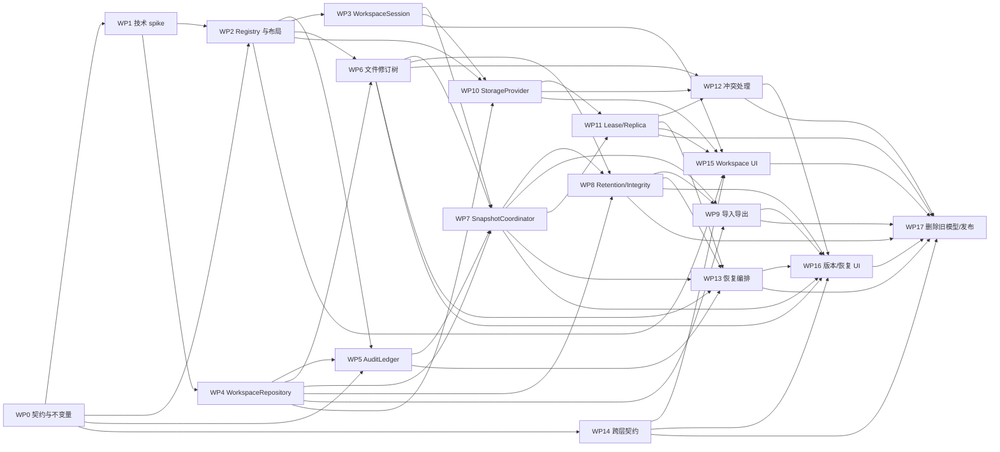

# VibeTable 工作区、快照与文件历史实施计划

> 日期：2026-07-28
> 状态：`Implemented`；通过合并提交 `28470348` 于 2026-07-30 合入 `main`，后续安全收口见
> `ff95d26d` 及其后续修复提交；当前产品验收空白单独记录在
> `docs/quality/capability-matrix.md`，不回写历史 checkbox。
> 前提：当前处于开发阶段，无历史用户数据；允许一次不兼容模型切换
> 范围：底层逻辑、跨层契约、Desktop/Web UI、测试、发布与旧能力删除

## 1. 目标

把当前“页面上叫工作区、运行时实际只有一个全局数据根”的产品，改造成真正的多工作区系统，并将现有整库备份、文件历史和后台保护点统一为 Snapshot。

完成后应满足：

1. 工作区是顶层硬隔离单元，拥有自己的数据库、表格、附件、文件、版本树、视图、工作区配置、审计锚点和快照。
2. 一次只打开一个活动工作区；切换会安全保护当前状态、释放写入权、重启/重绑本地数据服务并平滑进入目标工作区。
3. Snapshot 是唯一恢复点语义。自动保护、手动创建、危险操作前保护和导入只表示不同触发来源。
4. `files/` 只物化每个文件当前唯一有效版本；历史版本、数据库镜像和快照内容进入同一个去重分块对象仓库。
5. 文件历史是单文档修订树，不再有 main、scheme、adoption 或多条同时有效的主线。
6. 本机固定磁盘可直连；网络盘、同步盘和可移动磁盘使用本机活动副本 + 所选位置副本。
7. 同步仅用于方便数据携带，不是多人协同。正常状态为单写；离线强制编辑产生待联网裁决的临时写入。
8. 恢复和冲突处理不丢数据：恢复前有保护点，文件历史不截断，冲突可逐文件或整表选择，未采用状态仍保留为恢复快照。
9. 导出格式可被第三方工具检查和解密：ZIP64 `.vtsnapshot`，可选 age v1 `.vtsnapshot.age`。

## 2. 明确不做

- 不做多人实时协作、实时合并或 CRDT。
- 不做单元格级冲突合并。
- 不做跨工作区实时关系或共享对象引用。
- 不做 Git 式 main/branch/merge/rebase。
- 不做旧 `.backup`、scheme 或旧备份 ZIP 的历史数据迁移。
- 不把任意云盘同步目录宣传为强一致分布式锁。
- 不让 Web、Python 或 Desktop 直接了解 Kopia 对象、pack、index 或 maintenance 细节。

## 3. 当前实现与主要缺口

### 3.1 当前可复用能力

- `WorkspaceMountStore` 已能把稳定 `workspaceId` 映射到本机路径。
- `ManagedWorkspaceProvisioner` 已有 UUID、根清单、路径保护和原子 JSON 写入。
- `WorkspaceVersionService` 已有稳定读取、暂存、哈希、不可变对象、不可变修订、Ref CAS、outbox 和恢复补偿模式。
- `WorkspaceWatcher` 已有文件事件 debounce，并承认必须由扫描器补偿 watcher 丢失。
- `IntegrityGcService` 已采用“先计划、再隔离、最后删除”的保守原则。
- PocketBase sidecar 支持按数据根启动、graceful shutdown 和 restart。
- Sidecar 审计已有 preview/apply、schema/capability 校验、附件历史和幂等 Mutation receipt。
- RPC catalog、跨语言 fixture、Go race、故障注入、产品 E2E、升级 smoke 和打包门禁已经存在。

### 3.2 必须解决的结构性问题

- `MainWindow.Product` 在构造时固定一个 `_productDataRoot`、一个 PocketBase 实例和 `local://default`。
- 表格数据根与文件工作区根是两套体系；文件历史位于 `.backup/`，PocketBase ZIP 备份不包含可见文件工作区。
- Python `workspace-index.db` 重复保存文件/修订/main head，却是设备本地状态，不进入工作区恢复边界。
- 业务审计位于被恢复的 PocketBase 数据库中；直接恢复旧库会让审计历史倒退。
- 文件修订以 `SchemeId`、scheme 内 sequence 和 main adoption 建模，与最终产品语义相反。
- Backup RPC 以 ZIP 文件名作为身份，UI 暴露“备份文件”，而不是恢复点。
- Home 没有工作区身份；现有 `workspaceStore` 只表示当前数据库集合。
- 云盘同步目录通常没有跨设备原子 CAS，不能仅靠一个 `lease.json` 保证全局唯一写入者。

## 4. 目标目录与拓扑

### 4.1 可靠本机磁盘：直连模式

```text
<WorkspaceRoot>/
├─ files/                         # 用户可见，只含当前有效版本
└─ .vibetable/
   ├─ workspace.json              # 稳定身份、格式和存储配置摘要
   ├─ data/                       # 当前工作区 PocketBase/SQLite 数据
   ├─ topology/                   # 文件身份、修订树、有效指针、快照目录
   ├─ objects/                    # Kopia repository
   ├─ audit/                      # 不随业务恢复回滚的 append-only ledger
   ├─ snapshots/                  # Snapshot manifest/seal/index
   ├─ coordination/               # lease、计数器、publication、sync checkpoint
   ├─ quarantine/                 # GC/损坏/冲突隔离区
   └─ temp/                       # 可安全清理的未发布暂存
```

### 4.2 网络盘、云盘同步目录、可移动磁盘：镜像模式

```text
所选位置/<WorkspaceRoot>/         # 用户可见、可迁移、可被云盘同步
├─ files/                         # 外部可编辑副本
└─ .vibetable/
   ├─ workspace.json
   ├─ objects/                    # 已验证的仓库副本
   ├─ snapshots/                  # 已发布 manifest/seal
   ├─ audit/                      # 已发布的不可变审计段
   └─ coordination/               # provider 能力允许时的协调信息

%LOCALAPPDATA%/VibeTable/activity/<workspaceId>/
├─ files/                         # 本机活动文件副本
└─ .vibetable/
   ├─ data/
   ├─ topology/
   ├─ objects/                    # 本机主工作仓库
   ├─ audit/
   ├─ snapshots/
   ├─ sync/
   └─ temp/
```

规则：

- 所有业务写入先落本机活动副本，再生成已验证对象和清单，最后同步到所选位置。
- AuditLedger 在本机保持可查询数据库，同时定期封装为不可变审计段并随 Snapshot/replica 发布；本机丢失后可由最新健康副本重建。
- 所选位置不可用时不自动创建同名空工作区。
- 用户在所选位置 `files/` 的外部改动由三方比较吸收到活动副本。
- “释放本机缓存”只适用于镜像模式，且只能清理可从健康副本重建的内容。

## 5. 目标域模型

### 5.1 Workspace

`WorkspaceManifest`

- `formatVersion`
- `workspaceId`：UUID，永久稳定，名称和路径变化不影响
- `displayName`
- `createdAt`
- `storageMode`：`direct | mirrored`
- `encryptionMode`：`none | convenient | protected`
- `repositoryFormat`
- `topologySchemaVersion`
- `businessSchemaVersion`

`WorkspaceRegistryEntry` 是设备级投影，保存：

- `workspaceId`
- `displayName`
- `selectedRoot`
- `activityRoot`
- `storageKind`：`fixed | network | removable | registeredCloud | userMarkedSync`
- `coordinationStrength`：`strong | advisory`
- `lastOpenedAt`
- `lastKnownHealth`
- `lastSnapshotAt`
- `lastSyncAt`
- `pendingSync`

名称允许重复；身份始终使用 UUID。名称重复时 UI 同时显示位置。

加密模式采用统一且诚实的产品语义：

- `none`：不要求用户密钥；导出为普通 ZIP64。若底层 Kopia 格式仍强制要求 repository password，则使用公开的内置格式凭据，只作为库格式参数，UI 不宣称具有保密能力。
- `convenient`：默认模式，口令固定为 `password`，在创建页和导出页明确展示并允许复制；用于降低误操作门槛，不宣称能抵抗有意访问。
- `protected`：生成高强度随机密钥，存入 Windows Credential Manager，并要求用户保存可由标准工具使用的恢复密钥。

工作区仓库、Snapshot 导出和恢复对话框使用同一组术语，但分别显示“仓库保护”和“导出包保护”的实际状态；用户可对某次导出选择不加密。

### 5.2 WorkspaceSession

状态：

```text
closed
  └─> opening
       ├─> openedReadOnly
       ├─> openedWritable
       ├─> openedProvisional
       └─> failed

opened*
  └─> switching
       ├─> closed -> 目标 opening
       └─> rollback -> 原 opened*
```

不变量：

- 一个 Desktop 进程至多有一个活动 session。
- session 发布为 opened 前，数据库、文件拓扑、对象仓库、审计和租约状态必须属于同一 `workspaceId`。
- 切换失败不得留下两个可写数据服务，也不得把 UI 指向半打开工作区。
- 每次打开分配新的 `sessionEpoch`。所有 workspace-scoped 请求、响应、事件和 capability 均绑定 `workspaceId + sessionEpoch`；切换后迟到的旧 epoch 消息必须被丢弃。

### 5.3 FileDocument 与 FileRevision

`FileDocument`

- `documentId`
- `workspaceId`
- `relativePath`
- `status`：`active | deleted`
- `effectiveRevisionId`
- `nextRevisionOrdinal`
- `nextFormalVersion`

`FileRevision`

- `revisionId`
- `documentId`
- `parentRevisionId`
- `revisionOrdinal`：进入 canonical 修订树后按文档单调递增
- `formalVersion`：仅正式/恢复/晋升节点有 `Vn`
- `kind`：`autosave | formal | restore`
- `objectId`
- `contentHash`
- `size`
- `mimeType`
- `createdAt`
- `createdBy`
- `deviceId`
- `comment`
- `restoredFromRevisionId`

不变量：

- 每个修订最多一个父修订，可有多个子修订。
- `effectiveRevisionId` 必须指向叶节点。
- 同一时刻 `files/` 只物化有效叶。
- 从中间节点继续编辑必须创建新叶；不能把中间节点直接设为有效。
- 新的成功保存默认成为有效叶。
- 自动保存不消耗 `Vn`；晋升自动保存时创建一个引用同一 `objectId` 的新 formal revision，对象不复制，原 autosave revision 保持不可变。
- 恢复历史内容创建新的 restore 叶并使用下一个 `Vn`，不删除恢复点之后的历史。
- provisional writer 先使用不可变 `revisionId + localSequence`，不提前占用 canonical ordinal/Vn；候选被接纳时再串行分配正式序号。

### 5.4 Snapshot

`SnapshotManifest`

- `snapshotId`
- `workspaceId`
- `fenceEpoch`：仅写 lease 转移/接管时变化
- `claimId`
- `mutationRevision`：任一业务、schema、文件 topology 权威写入后变化
- `snapshotSequence`：每次 capture intent 单调分配
- `trigger`：`automatic | manual | protection | import | restore`
- `createdAt`
- `createdByDevice`
- `businessDatabaseObjectId`
- `topologyRootObjectId`
- `fileStateRootObjectId`
- `workspaceSettingsObjectId`
- `auditAnchor`
- `auditPrefixObjectId`：从 ledger 起点到 anchor 的不可变审计段索引
- `sourceSnapshotId`
- `formatVersion`
- `minimumAppVersion`

`SnapshotSeal`

- manifest 的规范化哈希
- 数据库对象哈希
- 文件状态根哈希
- 审计锚点哈希
- repository format/version
- `fenceEpoch + claimId + mutationRevision + snapshotSequence`
- 完整性结果

状态：

```text
queued -> barrier -> captured -> chunking -> verifying -> published
                                                    ├─> syncing -> ready
                                                    └─> ready(local-only)
任一步失败 -> failed（永不发布半成品）
已发布后校验失败 -> corrupt/repairing
```

`SnapshotCatalogEntry` 是 manifest 之外的可变目录项，包含 `pinned`、同步状态、保留原因、校验状态和用户备注，并通过 CAS 更新。Snapshot manifest/seal 一经发布永不修改。

### 5.5 AuditLedger

审计物理上与可恢复业务库分离：

- 业务事务在同库 outbox 中写入带规范化载荷哈希和 mutation identity 的 audit envelope。
- 提交后由 `AuditLedger` 追加到 `.vibetable/audit/ledger.db`。
- 启动、快照 barrier 和关闭 session 前必须 drain outbox。
- 该 outbox 是独立 `audit_outbox`，不复用会被 realtime retention 裁剪的现有 outbox。Envelope 至少含 `eventId`、`sourceEpoch`、source sequence、mutation identity 和 canonical payload hash。
- ledger 以 `eventId` 唯一约束幂等追加；只有 source high-watermark 与 ledger anchor 相等才算 drain 完成。
- Snapshot 记录 ledger 的 `epoch + sequence + chainHash`。
- Snapshot 同时引用截至 anchor 的不可变审计段；导出和“打开为新工作区”可独立重建历史。
- 恢复旧业务库不替换当前 ledger；恢复完成后追加 restore epoch 事件。
- 记录历史 UI 可从 ledger 投影重建，不以恢复后的旧 `vibetable_audit_events` 为最终权威。

### 5.6 Lease 与 Replica

`LeaseClaim`

- `workspaceId`
- `fenceEpoch`
- `claimId`
- `deviceId`
- `issuedAt`
- `heartbeatAt`
- `expiresAt`
- `mode`：`writable | provisional`
- `previousClaimId`

规则：

- 只有通过线性化 CAS/权威租约测试的 strong provider 才有可变共享 head，并在写入前拒绝旧 `fenceEpoch + claimId`。
- 仅提供排他文件锁但没有可靠 CAS 的位置不能在锁仍有效时强制接管；未超时强制接管只对可证明线性化的 provider 开放。
- 普通云盘同步目录采用 advisory 模式，不维护可覆盖共享 head；只发布不可变 `claims/<fenceEpoch>/<claimId>` 与 `publications/<claimId>/<snapshotId>`。
- advisory 候选绑定 `previousPublicationHash`、workspace/device 身份和完整性 MAC；同步收敛后 resolver 从 claim/publication DAG 确定本机 canonical head。
- advisory 强制接管只表示生成更高优先级候选，不能承诺即时排他。失败候选保留为 recovery Snapshot，而不是声称写入从未发生。
- 存储不可达时允许本机 provisional 写入；联网后无竞争则接纳为 canonical，有竞争则进入确定性裁决。
- advisory 副本永不执行 destructive maintenance、覆盖性同步或 `sync --delete`。

## 6. 深模块与 interface

### 6.1 `WorkspaceRegistry` 模块

外部 interface：

```text
List()
Register(selection)
UpdateHealth(workspaceId, observation)
Unregister(workspaceId)
PlanPermanentDelete(workspaceId) -> DeletePlan
ApplyPermanentDelete(planId, confirmation) -> DeleteResult
```

隐藏：注册文件原子写、路径规范化、重复 UUID、离线缓存、盘符变化和旧路径重定位。

### 6.2 `ShellBootstrap` 与 `WorkspaceSession` 模块

`ShellBootstrap` 先于任何工作区数据服务启动：

```text
StartShell()
LoadRegistry()
```

它只加载 Web assets、设备级 Registry 和全局设置，使“零工作区、上次位置离线、manifest 损坏、密钥缺失”时仍能进入 Workspace Center。

外部 interface：

```text
Open(workspaceId, openMode)
Switch(targetWorkspaceId, openMode)
Close(reason)
Current()
```

隐藏：sidecar/Python 生命周期、gateway 重绑、session epoch、旧请求取消/排空、Web event、失败补偿和切换动画阶段。保护 Snapshot 与 lease 通过 WP0 先定义的窄 hook/port 注入；Session core 不依赖其具体实现，从而避免 WP3→WP7→WP11 的实现循环。

### 6.3 `WorkspaceRepository` 深模块与内部 seams

调用者只使用事务化 façade：

```text
Commit(commitRequest) -> DurableCommitReceipt
Open(ref) -> stream
Verify(reachabilityRoot) -> VerificationReport
Pin(roots, purpose, expiry) -> RootPin
ReleasePin(pinId)
```

实现内部有五个真实 seams，但不向业务调用者暴露 Kopia 细节：

- `ContentStore`：对象写入/读取与 durable flush。
- `ImmutableManifestStore`：manifest put/get/list/tombstone。
- `PublicationStore`：strong CAS head 或 advisory immutable publication。
- `RepositoryReplicator`：checkpoint replication。
- `RepositoryMaintenance`：Kopia 自身安全窗口、owner 和 pack maintenance。

Adapters：

- `KopiaWorkspaceRepository`：生产实现，固定精确版本。
- `FaultInjectingMemoryRepository`：测试 flush、断电、缺块、重复内容和错误恢复。

Kopia 类型不得出现在 Snapshot、FileHistory、Desktop 或 Web 契约中。

### 6.4 `SnapshotCoordinator` 模块

外部 interface：

```text
Request(trigger, urgency) -> SnapshotOperation
List(query) -> SnapshotPage
Inspect(snapshotId) -> SnapshotDetails
Update(snapshotId, pinOrForgetAction) -> SnapshotDetails
```

内部负责 barrier、SQLite 一致性镜像、文件拓扑根、审计 anchor、对象写入、seal、发布和失败清理。导入/导出由 `SnapshotPackage` 负责，replica 发布由 `ReplicaSync` 负责，避免三套模块重复实现相同动作。

### 6.5 `FileHistory` 模块

外部 interface：

```text
Ingest(stableChange) -> RevisionResult
ReadTree(documentId) -> RevisionTree
ActivateLeaf(documentId, expectedEffectiveRevisionId, targetLeafRevisionId) -> MaterializationResult
RestoreRevision(documentId, expectedEffectiveRevisionId, historicalRevisionId) -> RevisionResult
UpgradeFrom(documentId, revisionId, content) -> RevisionResult
```

隐藏：叶校验、文件身份判断、重命名/移动、hash no-op、正式版本分配、对象去重、物化、锁文件、自动保存晋升和 watcher 重扫。非叶历史恢复必须走 `RestoreRevision` 创建新 restore 叶，不能通过 `ActivateLeaf` 绕过。

### 6.6 `ReplicaSync` 模块

外部 interface：

```text
Synchronize(workspaceId) -> SyncResult
ForceTakeover(workspaceId, mode) -> LeaseResult
```

隐藏：三方 base/local/replica、provider 差异、lease claim、fencing、断线续传、文件同步、Kopia repository replication 和冲突候选检测。

### 6.7 `ConflictResolution` 模块

外部 interface：

```text
List(query) -> ConflictPage
Inspect(conflictId) -> ConflictSet
Preview(conflictSet, choices) -> ResolutionPlan
Apply(planId) -> ResolutionResult
```

隐藏：逐文件/整表选择、依赖闭包、候选数据库、关系校验、保护 Snapshot 和原子发布。

### 6.8 `RetentionEngine` 模块

外部 interface：

```text
GetPolicy(workspaceId) -> RetentionPolicy
UpdatePolicy(workspaceId, expectedRevision, policy) -> RetentionPolicy
Plan(policy, inventory, quota) -> CleanupPlan
Apply(planId) -> CleanupResult
```

隐藏：时间分桶、最近 N、固定点、正式版本、分叉点、snapshot 引用、回收站、逻辑/物理占用和清理优先级。

### 6.9 `SnapshotPackage` 模块

外部 interface：

```text
Inspect(pathCapability, credential?) -> PackageInfo
Export(snapshotId, pathCapability, encryption) -> PackageReceipt
Import(pathCapability, credential?, targetMode) -> ImportOperation
```

实现：

- ZIP64 容器、版本化 `manifest.json`、对象索引、校验和。
- 可选 `filippo.io/age` scrypt passphrase 外层。
- 导入先验证、再迁移副本，原包只读。
- path 只能来自 Desktop 签发的短期 capability；Web/Python 不得传裸本机路径。
- age 加密流式写出，或仅使用受限 ACL 暂存；不在普通临时目录遗留明文 ZIP。
- 导入限制总展开大小、压缩比、对象数、路径长度，拒绝路径穿越、重复 entry、符号链接和 zip bomb。

### 6.10 `RestoreCoordinator` 模块

外部 interface：

```text
Preview(snapshotId, targetMode) -> RestorePlan
Apply(planId, confirmation) -> RestoreOperation
```

隐藏：恢复前保护、停服、staging、业务库安装、文件 restore 叶、审计 epoch、健康检查和失败补偿。恢复不由 Snapshot 列表模块或 UI 调用链自行拼步骤。

### 6.11 `WorkspaceWriteCoordinator` 模块

所有权威 mutator 必须通过同一入口：row mutation、schema、field migration、formula/lookup job、attachment、import/plugin、file ingestion 和 topology 更新。

```text
Execute(writeIntent) -> WriteReceipt
Capture(captureIntent) -> CaptureHandle
Drain(deadline) -> HighWatermark
```

`Capture` 在 gate 内持久化 capture intent、三类计数器、不可变 topology/file roots、audit anchor，并启动固定 SQLite 读事务；gate 释放后 Snapshot 只能读取 `CaptureHandle`，不能再扫描可变 `files/`。

### 6.12 `WorkspaceStorage` 与 `WorkspaceMigrator`

```text
Probe(location) -> ProviderCapabilities
PreviewMove(workspaceId, target) -> StorageMovePlan
ApplyMove(planId) -> StorageMoveOperation
ReleaseActivityCache(workspaceId, confirmation) -> CacheReleaseResult
RotateRepositoryKey(workspaceId, keyMode) -> KeyRotationOperation
PreviewUpgrade(workspaceId, targetFormat) -> UpgradePlan
ApplyUpgrade(planId) -> UpgradeOperation
```

所有危险动作都使用 stale-plan CAS、保护 Snapshot、staging 和失败补偿。打开 newer-than-supported 工作区只允许安全 inspect/只读提示，禁止零散写入。

### 6.13 运行时所有权与代码落点

工作区内的持久化权威统一收口到 Go sidecar。不能把 Kopia 留在 Go、版本图留在 C#、索引留在 Python，否则 Snapshot 仍无法成为单一一致性边界。

| 关注点 | 最终权威 | 现有入口 | 目标落点 |
|---|---|---|---|
| 全局工作区注册、最近打开项 | Desktop/C# | `WorkspaceMountStore` | `VibeTable.Infrastructure/Workspace/WorkspaceRegistry*` |
| 工作区进程生命周期与切换 | Desktop/C# | `MainWindow.Product` | `VibeTable.Desktop/Services/WorkspaceSession*` |
| Windows Cloud Files、盘型、凭据适配 | Desktop/C# | `ManagedWorkspaceProvisioner`、系统 API | `VibeTable.Infrastructure/Workspace/Storage/*` |
| 表格业务数据库 | Go sidecar/PocketBase | `sidecar/internal/app` | 按活动工作区 root 启动的现有模块 |
| topology、文件身份、修订树、effective ref | Go sidecar | C# `VibeTable.Workspace` + Python `workspace_index.py` | `sidecar/internal/topology`、`sidecar/internal/filehistory` |
| 对象仓库与密钥语义 | Go sidecar | C# `ContentObjectStore` | `sidecar/internal/objectrepo` |
| Snapshot、seal、保留、完整性、恢复 | Go sidecar | `sidecar/internal/backup` + C# restore | `sidecar/internal/snapshot`、`retention`、`restore` |
| append-only 审计 | Go sidecar | `sidecar/internal/audit` 同库表 | `sidecar/internal/auditledger` + 现有审计投影 adapter |
| repository replica、fencing、冲突候选 | Go sidecar | 无统一入口 | `sidecar/internal/replica`、`lease`、`conflict` |
| 文件选择、Reveal、Shell 预览、拖出 | Desktop/C# adapter | `DocumentWorkspaceHostService` | 保留 OS adapter，删除其中版本/方案权威逻辑 |
| Python workspace index | 无权威职责 | `backend/application/workspace_index.py` | 过渡期只读投影，最终删除 |
| Workspace Center、版本与恢复、冲突 UI | Web/Vue | Home/Settings/File Workspace | 独立 stores/services/views，经严格 RPC 使用权威模块 |

跨进程 seam：

- Desktop 向 sidecar 启动参数传递 `workspaceId`、活动 root、存储模式和 session capability，不传密钥明文到 Web/Python。
- Desktop 的 Windows provider/credential adapter 通过窄 host RPC 向 Go 模块提供能力结果或短期 capability token。
- Go sidecar 发布 workspace/snapshot/fileHistory/replica 事件；Desktop 只转发，Web 不轮询本地文件。
- C# 现有提交/恢复状态机作为端到端行为参照逐项移植；新 Go interface 测试通过后删除 C# 权威实现，而不是长期双写。

## 7. 原子协议

### 7.1 创建 Snapshot

1. 调度器合并重复请求；`mutationRevision` 未变化时不创建重复自动快照。
2. 普通自动快照等待空闲；保护快照显示真实阶段。
3. 通过唯一 `WorkspaceWriteCoordinator` 获取 workspace mutation gate；所有 row/schema/job/attachment/import/plugin/file mutator 都必须受它协调。
4. 等待文件保存进入稳定状态；普通自动快照超时则放弃并重试，保护快照超时则显示阻塞来源。
5. drain audit outbox。
6. 分配 `snapshotSequence`，持久化 capture intent，并记录当前 `fenceEpoch + claimId + mutationRevision`。
7. gate 内固定不可变 topology/file roots、audit anchor，并在专用 SQLite connection 上开启明确读事务；数据库镜像必须能反查 capture-intent digest。
8. 在目标 200ms 内释放 mutation gate。
9. 后台只从 `CaptureHandle` 完成 SQLite 一致性镜像、Kopia 分块、压缩和哈希；不得重新读取可变 `files/` 或 topology。
10. 写 Snapshot manifest 和 seal。
11. 校验所有可达对象并取得 durable commit receipt 后发布本地 Snapshot catalog。
12. strong replica 通过 CAS publication；advisory replica 只追加不可变 publication，待 resolver 收敛。两种状态分别展示。
13. 任一步失败只留下可清理暂存，不进入时间线。

SQLite 固定读视图必须先通过 WP1 spike 证明。普通增量 Online Backup 遇到并发写可能重启并得到更晚状态，因此必须从已固定读事务复制。若 PocketBase/modernc 不能做到，先采用受控停写 fallback；不得复制正在写的 `data.db`。

### 7.2 恢复当前工作区

恢复 journal 位于不会被 business data 目录替换的 `.vibetable/coordination/restore-journal/`，状态为：

```text
PREPARED
  -> DB_INSTALLED
  -> TOPOLOGY_COMMITTED
  -> AUDIT_EPOCH_COMMITTED
  -> VERIFIED
  -> COMMITTED
```

Journal 记录旧/新目录、root hashes、effective refs、`fenceEpoch + claimId` 和 ledger anchor。Sidecar 对外开放任何业务写入前必须恢复或补偿未完成 journal。

步骤：

1. 校验写 lease、Snapshot seal、所有可达对象和最低应用版本。
2. 强制创建“恢复前保护点”；失败则停止。
3. 构建带 expected revisions 的 restore plan，列出业务库、文件有效指针、快照后新增文件和工作区设置差异，并写 `PREPARED` journal。
4. 停止新业务写入并 drain audit outbox。
5. 停止当前 sidecar/Python session。
6. 在 staging 中恢复业务数据库；绝不覆盖 audit ledger。
7. 文件历史与权威 topology 不做目录级回滚：以 Snapshot 中的历史 topology root 生成变更计划，对每个需要回到旧内容的文档创建新的 restore 正式叶；快照后新增文件进入软删除。
8. 按 journal 状态推进 business data 安装、topology 追加事务和新 audit epoch；每一步 durable flush 后才能前进。
9. 启动数据服务并执行 schema/integrity smoke，写 `VERIFIED`。
10. 失败时按 journal 补偿回旧目录和原 effective refs；恢复 journal 未闭环前不开放业务写入。
11. 成功后写 `COMMITTED`，发布新的 Snapshot；旧状态仅在 committed 后进入延迟清理。

### 7.3 打开为新工作区

- 先验证包/快照。
- 生成新 workspace UUID。
- 恢复业务状态、文件历史和审计前缀。
- 为新工作区建立新的审计链根并追加 import 事件，保留来源工作区与源 anchor，不能让两个 workspace 共用后续审计链。
- 写入 `importedFromWorkspaceId`/`sourceSnapshotId`。
- 不与当前工作区产生实时引用。

### 7.4 文件外部编辑

三方状态：

- `base`：上次成功同步 Snapshot。
- `local`：本机活动副本。
- `replica`：所选位置 `files/`。

决策：

- 单侧变化：自动应用。
- 双侧相同 hash：自动收敛。
- 双侧不同或删除/修改：进入冲突中心。
- 重命名/移动优先用文件 ID + 时间窗口 + hash 判断；不确定则询问。
- 复制形成新 document，不形成版本树分支。
- 覆盖同一路径形成同 document 新修订。

### 7.5 冲突裁决

- 文件：共享端、本机端、两者都保留。
- 表格：整表选择共享端或本机端；包含 schema、records、views、表内附件。
- 跨表 relation、自动化和插件依赖由 resolver 计算闭包并校验。
- 先生成候选数据库和文件状态，校验成功后一次原子提交。
- 双方冲突前状态均保留为保护快照。
- 工作区级设置单独列出，默认采用当前共享端。

## 8. 保留策略

保留引擎支持“时间范围 + 最近条数 + 时间分桶 + 固定点 + 磁盘限额”，所有保留规则取并集，即满足任一规则就保留。固定快照、文件正式版本、分叉点、当前有效叶和被保留 Snapshot 引用的修订不受普通自动清理影响。

当前唯一已经确认的出厂值是：

- 工作区回收站默认保留 3 个月，不提供档位；用户仍可对单项立即永久删除。

Snapshot、文件自动修订和磁盘限额的具体出厂数字不在本计划中臆定。WP0 先把字段、边界和 UI 文案冻结，WP1/WP8 用真实办公负载测量“每天新增对象量、去重率、恢复点密度、GC 时间、磁盘告警频率”，再提交一次独立的默认值决策记录；该决策是波次 C default-on 的前置门。每个工作区可修改：

- Snapshot：最近天数、最近条数、分桶密度和固定点。
- 文件自动修订：最近天数、最近条数和分桶密度。
- 空间：对象仓库磁盘上限；UI 同时显示建议值、当前逻辑大小、实际新增占用和可回收空间。

清理顺序为：可重建缓存 → 已无引用对象 → 过期 Snapshot → 过期自动修订 → 过期回收站。保留规则优先于限额；仍超限时暂停新增普通自动恢复点并告警，不阻止业务保存，也不删除正式版本、有效叶或固定快照。

## 9. 工作包

### WP0：决策记录、契约骨架与不变量测试

依赖：无。

工作：

- 在唯一的 `contracts/v2/` seam 中维护 Workspace/Snapshot/FileRevision/Lease/Retention 与产品数据两套独立模块；开发阶段不保留历史契约目录和适配器。
- 写 ADR：工作区身份、审计不回滚、Kopia 隔离、advisory lease 限制、文件版本树。
- 建立错误码：`workspace.*`、`snapshot.*`、`repository.*`、`lease.*`、`replica.*`、`conflict.*`。
- 定义统一 wire envelope：global scope 或 `workspaceId + sessionEpoch + operationId + sequence`。Workspace switch 旋转 epoch，并丢弃旧响应/事件。
- 先写状态机和不变量的纯模型测试。

主要文件：

- `contracts/v2/`
- 新的 v2 catalog generator/registry；不改写冻结 v1 fixture
- `sidecar/internal/contracts/v2/`
- `desktop/src/VibeTable.Contracts/`
- `desktop/web-grid/src/contracts/`
- `backend/contracts/`

验收：

- Python/Go/.NET/Web 四端 typed parser 严格解析同一正反 fixtures。
- 反例覆盖顶层/嵌套未知字段、缺 required、非法枚举/状态、错误版本、尾随 JSON、非叶 effective ref、旧 session epoch 和旧 fencing token。
- catalog generator 有唯一注册表和 `--check` 模式；所有新事件都有 typed DTO/schema/fixture，禁止回退到通用 plugin envelope。

### WP1：技术 spike——Kopia、age、SQLite 固定快照与 provider 能力

依赖：WP0 的最小模型。

工作：

- 固定 Kopia 精确版本，验证 `repo.RepositoryWriter` 对象/manifest/verify/maintenance。
- 验证同仓库跨进程 Kopia CLI 可读。
- 验证三种模式：不加密模式的公开格式凭据、默认 `password` 简易加密、安全模式 Windows Credential Manager + 高强度恢复密钥。
- 验证安全模式的新设备恢复、密钥校验、轮换和旧 key 清退；不加密/简易模式 UI 明确标明不能抵抗有意访问，且简易模式直接告知固定口令。
- 验证 `filippo.io/age` 与官方 age CLI 互操作。
- 证明 PocketBase/modernc SQLite 固定读视图和 Online Backup 的一致性及 barrier 时间。
- 在固定盘、SMB、注册 Cloud Files 根、普通同步目录、可移动盘上运行 capability probe。
- 测量依赖体积、内存、首个对象和增量对象性能。

输出：

- 可执行 spike tests。
- 版本/许可证/体积记录。
- 支持矩阵和未支持 provider 的阻断条件。
- 明确威胁模型：不加密模式无保密能力，便捷模式只防格式误读；未加密 ZIP 的 hash 只证明完整性，不证明来源；恢复原工作区要求 workspace key MAC，第三方包按不受信输入处理。

失败门：

- 若 SQLite 无法满足固定读视图，不进入 Snapshot 实现，先设计受控停写 fallback。
- 若 Kopia 公共 Go interface 无法稳定满足需求，重新评估受控 CLI helper；不得直接使用 `internal/` 包。

### WP2：WorkspaceRegistry、目录布局与创建/连接

依赖：WP0、WP1 provider 结论。

工作：

- 用版本化 `WorkspaceRegistry` 替换薄 `WorkspaceMountStore`。
- 用 `.vibetable` 新布局替换 `.backup`。
- 创建向导默认展开“存储位置”，明确提供“程序管理的默认位置”和“其他位置”；默认位置不是可执行文件目录。
- 自动识别固定/网络/可移动/Cloud Files 根，并提供“由同步软件管理”手动标注。
- 创建前执行读写、原子 rename、并发、断连恢复和空间能力测试。
- 取消对所有 reparse point 的一刀切拒绝；Cloud Files/按需文件按 provider 能力处理，同时继续禁止会逃逸工作区根的符号链接与路径穿越。
- 路径不可用时保留注册项，不创建同名空目录。

验收：

- 相同名称不同 UUID 可并存。
- 盘符变化只能通过 UUID 校验后重新关联。
- 开发期旧 `.backup` 工作区被明确拒绝/重建，不做隐式迁移。

### WP3：WorkspaceSessionManager 与数据服务切换

依赖：WP2。

工作：

- WP3a `ShellBootstrap`：不启动 PocketBase/Python 即加载 Web shell、Registry 与全局设置。
- WP3b `WorkspaceSession core`：从 `MainWindow.Product` 抽出深模块。
- WP3c `Snapshot session hook`：接入 WP7 的切换前保护点和失败回滚。
- WP3d `Lease session hook`：接入 WP11 的租约释放、只读/provisional 和接管状态。
- PocketBase、Python backend、document host、table gateway 按当前活动根启动/关闭/重绑。
- 启动默认打开上次工作区；设置可选择总是进入 Workspace Center。
- 切换时关闭写 gate、取消或等待旧请求、旋转 capability 和 `sessionEpoch`、清空 workspace-scoped Web stores。
- 向 Web 发布真实切换阶段事件。

验收：

- 连续切换 100 次无残留进程、端口、锁或交叉 workspaceId。
- 任一阶段故障后仍可操作原工作区。
- 切换过程中所有旧 capability/token 失效。
- 零工作区、上次位置离线、manifest 损坏和密钥缺失均可进入 Workspace Center。
- 人工延迟旧 sidecar 响应/事件到新工作区时被 epoch 过滤。

### WP4：WorkspaceRepository 与密钥模式

依赖：WP1。

工作：

- 在 `sidecar/internal/objectrepo` 实现 façade 与 Content/Manifest/Publication/Replicator/Maintenance 内部 seams。
- 实现 Kopia adapter、memory/fault adapter，并验证 durable flush、reopen 和 publication recovery scan。
- 实现 none/convenient/protected key provider；`convenient` 固定为已公开的 `password`，不得把它显示成高安全等级。
- Commit receipt、manifest、replication 与 maintenance 全部带 workspaceId、`fenceEpoch + claimId` 和 root pins。
- 禁止业务层使用 Kopia ID 作为公开契约 ID。

验收：

- 相同内容跨文件/快照去重。
- 错误密钥、缺 pack、损坏 index、写中断均返回稳定错误。
- Kopia CLI 可使用仓库密钥读取测试仓库。
- Snapshot head、lease claim 和 restore journal 不依赖现有“temp + Replace”即视为掉电耐久；必须经过 flush/reopen 故障测试。

### WP5：独立 AuditLedger、epoch 与 outbox

依赖：WP0、WP2、WP4。

工作：

- 新增 append-only `audit/ledger.db` 和 hash chain。
- 新建独立 `audit_outbox`；row/schema/attachment/background job/import/plugin/file ingestion 等所有权威写入与业务提交同事务写 envelope。
- drain worker 以 `eventId` 唯一约束幂等追加 ledger，并在 ledger 成功后确认 source high-watermark。
- Snapshot barrier/关闭/恢复前强制 drain。
- 现有记录历史读取迁移到 ledger 投影或可重建只读索引。
- 新增 snapshot、restore、import、lease、sync、conflict-resolution 事件。

验收：

- 恢复旧业务库后，恢复前后的审计都存在。
- outbox 在“ledger 已追加/source 未确认”和恢复旧库后重新出现旧 envelope 两种情况下均可重放且不重复。
- 篡改/缺失事件可被 chain 校验发现。
- 明确 chain 只能发现被锚定范围内的篡改/缺失；尾部截断由远端/导出 Snapshot anchor 发现，不宣称抵御本机管理员重写。

### WP6：简化文件修订树

依赖：WP0、WP2、WP4。

工作：

- WP6a：在 Go sidecar 建立权威 topology/filehistory；移植 C# commit/restore/CAS/outbox 的已验证不变量。
- WP6b：重写 `RevisionManifest`、effective ref、watcher ingestion 和跨层 contracts；实现稳定保存、no-op hash、rename/move/copy/delete、双编号。
- WP6c：让 C# host 只承担 Shell/文件选择 adapter，并切换 Web fileHistory consumer。
- WP6d：删除 `SchemeRef`/`SchemeStatus`/`SchemeService`/`SchemeAdoptionService`；device-local `workspace-index.db` 在只读投影验证后删除，禁止长期双写。

验收：

- 线性 V1→V2→V3 与从 V2 创建 V4 的树正确。
- V3/V4 任一叶可成为唯一有效版本。
- 中间节点只能“从此升级”。
- restore 创建下一正式版本，不截断树。
- import、relink、open、reveal、preview、drag-out、unlink 等现有文件 OS 能力全部回归。

### WP7：SnapshotCoordinator 与后台触发

依赖：WP3、WP4、WP5、WP6、WP1 SQLite 结论。

工作：

- WP7a 实现本机 capture，并定义窄的 publication fence port：`WorkspaceWriteCoordinator`、三类计数器、固定 DB 读视图、file root、audit anchor、seal 和本地 catalog publish。
- WP7b 在 WP11 完成后接入 strong/advisory replica adapters；WP7a 不提前实现远端 fenced publish。
- 实现触发器：
  - 改动后 debounce、空闲约 5 分钟；
  - 持续编辑最长约 30 分钟阶段保护；
  - 工作区切换、批量导入、schema 变更、插件批处理和恢复前强制保护；
  - `mutationRevision` 无变化不重复创建。
- 自动默认不固定，手动默认固定。
- 连续失败退避并通知。

验收：

- 任意故障注入点都不会发布半成品。
- Snapshot 恢复出的 DB、文件有效状态与 capture intent 的 `mutationRevision` 一致。
- 普通 barrier 达到目标或明确记录需要调整的性能基线。

### WP8：Retention、GC 与完整性

依赖：WP4、WP6、WP7。

工作：

- 实现统一 reachability graph。
- 实现参数化保留策略和工作区覆盖设置；回收站出厂值固定为 3 个月，其他出厂参数由 WP0/WP1 的默认值决策记录提供。
- 根集合包括 pinned/catalog roots、正式/有效/分叉修订、in-flight capture、restore/export plan、冲突候选、pending replica、audit segments、recovery Snapshot 和 quarantine。
- reader 使用持久 root pin；CleanupPlan 绑定 inventory revision，Apply 前重新校验，出现未知 manifest/pending publication/损坏索引时 fail closed。
- 实现 logical tombstone→grace→Kopia maintenance；不尝试把 pack 中单对象物理移动到 quarantine。
- 每个 Snapshot 发布前校验新增对象；每日增量检查、每月完整检查。
- 损坏时停止 GC/覆盖性同步，优先从健康副本修复。

验收：

- property tests 证明固定点、正式版本、分叉点、有效叶和被引用内容永不误删。
- 模拟限额不足时只暂停普通自动恢复点，不阻止业务保存。
- UI 所示可回收空间与实际 cleanup 误差在定义范围内。

### WP9：SnapshotPackage 导入/导出

依赖：WP4、WP7、WP8。

工作：

- 定义公开 ZIP64 容器规范。
- 实现完整自包含导出、SHA-256 清单和 age 外封装。
- 恢复原工作区的包额外校验 workspace key MAC；来自第三方的包始终标记为不受信输入。
- 导出/导入全程持有 root pin 和短期 path capability。
- 导入先 inspect/verify，之后可创建新工作区或明确恢复原工作区。
- 新版迁移旧包只在临时副本上执行；旧版拒绝不支持的新关键能力。
- 提供第三方解密/解压说明和兼容测试。

验收：

- age CLI 可解密，普通 ZIP 工具可列出未加密包。
- 错误密码、截断、对象缺失、manifest 篡改均在写入工作区前失败。
- 导入不静默覆盖相同 workspaceId。
- zip bomb、路径穿越、重复 entry、符号链接和超资源包在正式写入前失败，且不遗留明文临时包。

### WP10：StorageProvider probe 与活动副本

依赖：WP2、WP3、WP4。

工作：

- 实现 fixed/network/removable/registeredCloud/userMarkedSync 分类。
- Windows Cloud Files root 自动识别嵌套目录。
- 镜像工作区创建本机 activity root，显示双份空间占用。
- provider 不兼容时阻断创建。
- 所选位置断开后保留 pending sync；重连先核验 UUID。
- 实现存储移动、direct↔mirrored 切换、释放活动缓存和 key rotation 的 preview/apply 状态机。

验收：

- 网络波动、突然拔盘、云盘 placeholder/按需文件不会破坏活动库。
- “释放本机缓存”只在远端副本完整、无 pending sync、session 关闭时可用。

### WP11：Lease、fencing 与 ReplicaSync

依赖：WP4、WP7、WP10。

工作：

- 实现 strong/advisory 两类 lease provider。
- strong CAS provider 在线接管原子提升 `fenceEpoch`；锁型 provider 在有效锁期间不承诺强制接管。
- 离线强制编辑建立 provisional session。
- strong repository replication 使用 checkpoint 和单 maintenance owner。
- advisory 只追加 immutable claim/publication DAG，本机主仓维护，远端禁止 destructive maintenance；需要压缩时重建新 replica identity。
- 文件或表格成功保存后只提交本机权威事务并将同步任务写入持久队列；同步异步执行、可退避，不因网络故障回滚已经成功的本机保存。
- strong 验证旧 token 写前拒绝；advisory 验证候选全部可发现、确定性收敛、败方状态不丢失。

验收：

- 两设备并发、心跳丢失、未超时强制接管、长期离线、时钟漂移和 sync conflict copy 均有确定结果。
- UI 不把 advisory lease 描述为强一致。
- 释放本机缓存前，用目标仓独立重开并读取验证全部 roots，不能只比较 checkpoint。

### WP12：三方同步与冲突中心

依赖：WP6、WP10、WP11。

工作：

- 维护 base/local/replica Snapshot。
- 自动处理单侧变化、相同变化和明确 rename/move。
- 每次进入/重连镜像工作区先扫描所选位置 `files/` 与本机活动副本；若两侧均变化，进入 Workspace 后立即询问，而不是静默覆盖。
- 生成逐文件、整表冲突 plan。
- 计算 relation/automation/plugin 依赖闭包。
- staging 构建候选状态，验证后原子提交。
- 文件冲突选中的内容始终作为当前文档的新修订摄入；不改写既有 revisionId、父子关系或正式版本号，未选一方保留为 recovery Snapshot。

验收：

- 无冲突自动同步不打扰用户。
- 冲突 UI 明确说明只是应急 patch，不支持同时编辑。
- 任一选择都不会产生悬空关系或丢失未采用一方的恢复点。

### WP13：恢复编排

依赖：WP13a 依赖 WP5、WP6、WP7、WP8；WP13b 在此基础上再依赖 WP11。

工作：

- WP13a 本机恢复：恢复当前工作区与打开为新工作区，使用 durable restore journal。
- WP13b 镜像恢复：在 WP11 后增加 fence/replica 校验和 provisional 失败分流。
- 恢复前保护、停服、staging、分阶段安装、启动恢复扫描、健康检查和回退。
- 文件按新 restore 叶恢复；快照后新增文件软删除。
- 预览允许提取单个文件副本，但不改变有效版本。

验收：

- kill-at-every-stage 故障测试均能回到旧状态或完成新状态，不能停在混合状态。
- audit ledger 不倒退。
- 恢复完成自动生成新的 Snapshot。

### WP14：跨层契约与兼容切换

依赖：WP0；随 WP2–WP13 增量推进。

工作：

- 建立 protocol/catalog v2，新增 `workspace.*`、`snapshot.*`、`fileHistory.*`、`replica.*` RPC；冻结 v1 schema、fixtures 和 catalog。
- Desktop registry/dispatcher/gateway、Python adapter、Web parser 全部严格 closed object。
- 所有 workspace-scoped 请求、响应、事件携带 `workspaceId/sessionEpoch/operationId/sequence`。
- 采用 producer-first → capability-on → consumer switch → legacy implementation delete 四阶段；禁止新旧权威双写，也禁止用旧 backup 假装完整 Snapshot。
- event topics 增加 session/snapshot/sync/lease/conflict changed，并各有 typed fixture。

旧面逐项替换矩阵至少覆盖：

- v1 `backup.list/create/delete/restore`；
- Desktop-only `backup.openFolder`；
- v1 `workspace.linkDocument/publishIndexBatch/readDocumentHistory/readDocuments/readFolder/registerDocument/unlinkDocument`；
- DTO 中的 `mainHead/mainHash/schemeId/schemeName`；
- `dataRoot.get/chooseMigrationRequested`、Go backup routes、packaged-sidecar backup matrix 和 `release.backup-restore.v1` capability。

验收：

- RPC catalog 无 missing/stale model。
- v2 catalog generator `--check` 无漂移；v1 fixture byte-for-byte 不变。
- old-client/new-server 与 new-client/old-server 均 fail closed，不把旧数据写到新工作区。
- capability 协商能让旧 UI fail closed；删除旧实现后有精确 absent-capability 门禁。

### WP15：Workspace Center、创建流程和切换动画

依赖：WP15a 依赖 WP2、WP3a、WP14 producer；WP15b 再依赖 WP3b/WP3c 和 WP14 consumer；WP15c 再依赖 WP10、WP11。

工作：

- WP15a Shell/Center：零工作区即可显示卡片、创建/连接、离线修复和重新定位。
- WP15b Session switcher：当前工作区顶栏、真实阶段和 store epoch reset。
- WP15c Storage/lease 状态：在 WP10/WP11 后显示位置、健康、最近快照、同步、错误、provisional 和接管能力。
- 创建流程默认展开存储位置和活动副本说明。
- 切换动画：
  - 300ms 内连贯过渡，不闪阶段文字；
  - 超过 300ms 展示真实阶段；
  - 失败反向回到原工作区；
  - 支持减少动态效果。
- 现有 Home 改为工作区内部首页，增加最近保护和同步状态。

验收：

- 键盘/屏幕阅读器/焦点恢复完整。
- 动画不阻塞真实状态，不用假进度。
- 离线、只读、provisional、pending sync 一眼可区分。

### WP16：版本与恢复、文件树和冲突 UI

依赖：WP16a 依赖 WP6、WP14；WP16b 依赖 WP7、WP8、WP13a、WP14；WP16c 依赖 WP8–WP10、WP14；WP16d 依赖 WP12、WP14。

工作：

- WP16a 文件树：默认折叠自动修订，仅分叉时显示树，高亮有效路径。
- WP16b Snapshot 时间线：Settings “备份”改为“版本与恢复”，显示触发来源、完整性、保留原因、逻辑/实际大小和同步状态。
- WP16c 存储/保留/密钥：直接编辑一套默认策略，支持位置迁移、释放缓存和 key rotation plan/apply。
- WP16d 冲突中心：持久冲突列表、逐文件/整表选择、依赖诊断和接管说明。
- 操作完整覆盖：手动创建、预览、恢复、打开为新工作区、提取副本、导出、固定/取消固定。
- 设备级 recent tables、UI 状态等使用 `workspaceId` 命名空间；进入 Snapshot 的工作区设置与全局/设备设置有明确清单。

验收：

- 不再出现 backup/snapshot 双重术语。
- 不再出现 scheme/main/adoption 产品术语。
- 危险操作均有清晰影响范围和恢复路径。
- 版本树、时间线和冲突中心通过键盘、ARIA tree/timeline、焦点恢复和 reduced-motion 测试。

### WP17：删除旧模型、发布与运维门禁

依赖：全部功能包。

工作：

- 删除 `.backup` 创建路径、Scheme types/services/UI、旧 backup RPC/UI、全局单数据根假设。
- 用机器可读 legacy-surface manifest 精确列出应消失的 RPC、DTO、路径创建器、catalog case、fixture、Go route、package matrix 和 handoff capability；旧格式检测/升级 primitive 使用明确 allowlist。
- 更新发布布局、SBOM、许可证、build-info、Kopia/age、repository/workspace/snapshot/package format 版本、schema hash、恢复指南和包体积阈值。
- 建立只增不改、按 `writerVersion/minimumAppVersion` 编目的跨版本 fixture corpus；至少用上一正式版真实产物验证读取、迁移、重导出和零写入拒绝。
- 新增 WorkspaceMigrator 的升级前保护、staging、断电恢复和 newer-version 只读/拒写 smoke。
- 完成端到端断电、两设备、网络盘、同步目录、移动盘和磁盘满测试。
- 发布 workflow 运行完整 `qa/next.py --ci`，或验证绑定当前 commit/sourceHash/artifactHashes、未过期且 `releaseEligible=true` 的报告。
- 测试分层：PR 使用 fake/contract；Windows 自动化跑进程、Cloud Files 模拟和故障注入；SMB/可移动盘/双设备进入专用硬件实验室，保存 stage/oracle/超时/日志证据并配置 release 阻断。

验收：

- legacy-surface manifest/allowlist 门禁证明旧产品语义不存在，不使用会误伤合法检测 primitive 的裸 `rg`。
- Go fmt/vet/test/race/build、Python、.NET、Web test/build、fault injection、product E2E、package smoke 全绿。
- 发布包内含第三方许可证和恢复说明。

### 9.1 主要文件落点与窄门禁

下表是实施起点，不是允许跳过仓库搜索的固定清单。新文件名在 WP0 contract/ADR 确认后可调整，但模块所有权不能漂移。

| WP | 主要现有/目标文件 | 每次合入前的窄门禁 |
|---|---|---|
| WP0 | `contracts/v2/**`、`sidecar/internal/contracts/v2/**`、`backend/contracts/**`、`VibeTable.Contracts/**`、Web `contracts/**` | 四语言正反 fixture、catalog `--check`、v1 fixture byte compare |
| WP1 | `sidecar/go.mod/go.sum`、`sidecar/internal/objectrepo/*_test.go`、SQLite/provider spike tests | Go unit/integration、Kopia CLI/age CLI 互操作、barrier benchmark |
| WP2 | `WorkspaceMountStore.cs`→`WorkspaceRegistry*`、`ManagedWorkspaceProvisioner.cs`、Infrastructure tests | Registry/路径/Cloud Files/reparse/capability probe tests |
| WP3 | `MainWindow.Product.cs`、`MainWindowViewModel.cs`、`ProductRuntimeService.cs`、`WorkspaceRequestDispatcher.cs`、`WebMessageRouter.cs` | .NET session lifecycle、zero-workspace shell、old-epoch delay tests |
| WP4 | `sidecar/internal/objectrepo/**`、key provider adapters | Repository contract suite、flush/reopen/fault tests、CLI readback |
| WP5 | `sidecar/internal/auditledger/**`、`sidecar/internal/audit/**`、new migrations | outbox crash/replay、restore dedupe、chain/anchor tests |
| WP6 | `sidecar/internal/topology/**`、`filehistory/**`、`DocumentWorkspaceHostService.cs`、`workspace_index.py`、File Workspace stores/views | Go tree/property tests、C# OS adapter tests、Python projection delete gate、Web file tests |
| WP7 | `sidecar/internal/snapshot/**`、`app` routes、old `backup` adapter | capture fault matrix、fixed-read-view integration、no-half-publish tests |
| WP8 | `sidecar/internal/retention/**`、repository maintenance adapter | reachability property tests、root-pin races、quota/repair tests |
| WP9 | `sidecar/internal/snapshotpackage/**`、path grant/capability adapters | age/ZIP64 roundtrip、zip-bomb/path traversal、cross-version corpus |
| WP10 | Desktop `Workspace/Storage/**`、Go activity/replica adapters | fixed/SMB/cloud/removable capability contract tests、cache release test |
| WP11 | `sidecar/internal/lease/**`、`replica/**` | strong stale-token rejection、advisory DAG convergence、多设备 fault tests |
| WP12 | `sidecar/internal/conflict/**`、relation/automation dependency adapters | file/table choice matrix、referential integrity、atomic apply tests |
| WP13 | `sidecar/internal/restore/**`、Desktop session recovery | kill-at-every-stage journal、startup recovery、audit non-rollback tests |
| WP14 | v2 catalog/generator、Desktop gateways/dispatchers、Web bridge/services | producer/consumer capability matrix、old/new fail-closed、event epoch tests |
| WP15 | `App.vue`、`WorkspaceView.vue`、new Center/session stores/views | zero-workspace E2E、switch animation/rollback、focus/reduced-motion |
| WP16 | `SettingsView.vue`、`FileWorkspaceView.vue`、`DocumentInspector.vue`、new conflict/storage views | timeline/tree/ARIA、manual Snapshot、retention/key/storage plan tests |
| WP17 | `.github/workflows/release.yml`、`qa/next.py`、`handoff_dependencies.json`、`publish-layout.json`、`package_check.py`、build-info/SBOM scripts | complete releaseEligible gate、real old artifact smoke、package/license/recovery-guide checks |

命令约定：

- Go：在 `sidecar/` 使用仓库固定 Go 入口执行目标 package，扩大阶段再跑 `go test -race ./...`。
- Web：`npm.cmd test -- <target files>`，随后 `npm.cmd run typecheck`，扩大阶段跑全量 test/build。
- .NET：先运行目标 test project/filter，扩大阶段跑 `desktop/VibeTable.Desktop.sln` 全量。
- Python：使用项目 venv，必要时以 `-o addopts=""` 跑窄测试，扩大阶段使用完整 dev 门禁。
- 每个 WP 的测试命令和结果写入实施期 progress；硬件实验室测试不能用 fake 结果代替。

## 10. 工作包依赖与并行关系



可并行边界：

- WP1 spike、WP2 registry 纯模型、WP5 AuditLedger 设计可并行，但 WP1 结论必须先于生产仓库和 Snapshot。
- WP4 WorkspaceRepository 与 WP3 Session 可并行。
- WP8 先提供 root pin/GC 协议，WP9 才实现 Package；二者的格式设计可以并行，生产实现不可越过依赖。
- WP10 provider 与 WP6 文件树可并行。
- UI 可在契约 fixture 稳定后使用 fake adapter 开始，但不得先定义后端语义。
- WP12 冲突和 WP13 恢复共享 staging/validation 基础设施，建议顺序复用而不是两套并行实现。

为保证波次依赖闭合，拆分包的最小依赖如下：

| 子包 | 最小前置 | 可交付结果 |
|---|---|---|
| WP3a/3b | WP2 | 无工作区 shell；单工作区 session core |
| WP3c | WP3b、WP7a | 切换前保护 Snapshot |
| WP3d | WP3b、WP11 | lease/provisional session |
| WP6a/6b | WP0、WP2、WP4 | Go 权威修订树和新契约 producer |
| WP6c/6d | WP6b、WP14 consumer | 切换 consumer，随后删除旧 scheme/main |
| WP7a | WP3b、WP4–WP6 | 本机完整 Snapshot；同时定义 replica port |
| WP7b | WP7a、WP11 | Snapshot publication 接入镜像副本 |
| WP13a | WP5–WP8 | 本机 durable restore |
| WP13b | WP13a、WP11 | 镜像/fencing-aware restore |
| WP15a | WP2、WP3a、WP14 producer | Workspace Center |
| WP15b | WP3b/3c、WP14 consumer | 可回滚切换动画 |
| WP15c | WP10、WP11 | 存储、同步和接管状态 |
| WP16a | WP6、WP14 | 文件修订树 |
| WP16b | WP7、WP8、WP13a、WP14 | Snapshot/恢复时间线 |
| WP16c | WP8–WP10、WP14 | 保留、导出、存储、密钥设置 |
| WP16d | WP12、WP14 | 冲突中心 |

## 11. 建议交付波次

### 波次 A：Shell 与真实工作区骨架（内部 feature-off）

WP0、WP1、WP2 的 Registry/新布局、WP3a/3b、WP14 producer、WP15a。

Web shell 与 Workspace Center 在无数据服务时可用；可以创建测试工作区并内部切换，但写入和切换默认关闭。因为新 Snapshot 尚不存在，本波次不得作为用户可写版本发布，也不切断现有 `.backup` 路径。

### 波次 B：文件历史新权威（内部 feature-off）

WP4、WP6a/6b、WP14 producer、WP16a fake/新契约 UI。

完成 Go 单 effective leaf 修订树并验证 C#/Python 投影，但不删除旧 scheme/main，也不让新旧权威双写。新工作区测试数据只走新路径。

### 波次 C：本机完整 Snapshot 与第一次 default-on

WP3c、WP5、WP6c、WP7a、WP8、WP13a、WP14 consumer switch、WP15b、WP16a/16b。

完成数据库+文件+版本树+审计锚点的一致保护与恢复。只有此时才原子切换 `.vibetable`、FileHistory 后端、Desktop adapter 和 Web UI，并允许本机直连工作区默认开启；切换/危险操作已具备 protection Snapshot。

### 波次 D：开放导入导出

WP9、WorkspaceMigrator、跨版本真实 fixtures、age/ZIP64 外部工具验证。自本波次起每个可发布波次都必须提供工作区格式 Preview/Apply 升级和 newer-version 零写入保护。

### 波次 E：镜像位置与单写同步

WP3d、WP7b、WP10、WP11、WP12、WP13b、WP15c、WP16c/16d。

先支持固定本机与 SMB，再按 capability probe 结果开放注册云盘、普通同步目录和可移动盘。

### 波次 F：删除旧能力与发布硬化

WP17，全量故障注入、跨版本、打包、SBOM、文档和产品 E2E。

## 12. 测试策略

### 12.1 纯模型/property tests

- 修订树：任意新增/切换/恢复序列始终只有一个有效叶。
- retention：任何规则组合都不会删可达或保护对象。
- lease：strong provider 的旧 `fenceEpoch + claimId` 写前拒绝；advisory 候选全部可发现、确定性收敛且败方不丢失。
- Snapshot 状态机：只有 verified 才能 published。
- conflict plan：任意选择后引用闭包可验证。

### 12.2 adapter contract tests

- Kopia 与 memory adapter 跑同一 WorkspaceRepository suite。
- Windows Credential Manager 与 fake vault 跑同一 key lifecycle suite。
- direct/mirrored/fault storage 跑同一 provider capability suite。

### 12.3 故障注入

在 Snapshot、sync、restore、GC 的每个持久化阶段注入：

- 进程退出；
- 磁盘满；
- 权限拒绝；
- 文件锁；
- 网络断开；
- 移动盘拔出；
- 对象损坏；
- SQLite busy；
- 旧 lease/fencing token。

### 12.4 多设备场景

- 正常释放后接管。
- 未超时在线强制接管。
- A 离线写、B 强制接管、A 重连。
- 两端 advisory claim 同 `fenceEpoch`。
- 一端未同步文件、一端修改同表。
- maintenance owner 崩溃和重新选主。

### 12.5 UI/E2E

- Workspace Center 创建、连接、离线、重新定位、移除、永久删除。
- 切换动画快速/慢速/失败/减少动态效果。
- Snapshot 时间线、固定、保留原因、导出、恢复。
- 文件历史线性/分叉/有效叶/从历史升级。
- 冲突逐文件/整表选择与依赖提示。
- 存储警告、不加密/简易/高强度密钥、固定 `password` 告知和恢复密钥流程。

## 13. 数据安全门禁

以下任一项不满足，不允许进入默认开启：

- Snapshot 无法证明数据库、文件和审计属于同一 capture intent 与 `mutationRevision`。
- 恢复会覆盖或倒退 audit ledger。
- strong provider 的旧 fencing token 仍能更新共享 head。
- advisory provider 存在可覆盖共享 head、候选不可发现、无法确定性收敛或败方丢失。
- 恢复 journal 在任何中间状态不能自动完成或补偿。
- GC 没有完整 roots、持久 pin、inventory CAS 或 grace。
- 镜像副本未校验却允许释放本机活动副本。
- 导入在完整校验前写入正式工作区。
- provider 无法通过最低原子写/恢复测试。
- UI 把 advisory 同步目录描述为支持同时编辑。

## 14. 主要风险与缓解

| 风险 | 后果 | 缓解 |
|---|---|---|
| Kopia v0.x interface 变化 | 升级破坏构建或仓库兼容 | 固定版本、自有 seam、CLI 跨版本 fixtures、升级单独评审 |
| SQLite 固定快照耗时 | barrier 超过目标或状态不一致 | WP1 先证明；专用读事务；失败时保护操作采用可见停写 fallback |
| 审计从同库拆出 | mutation/audit 短暂不同步 | 同事务 outbox、幂等 drain、snapshot/close 强制 drain |
| 云盘目录无强 CAS | 双写和冲突副本 | advisory 明示、provisional session、fencing 裁决、双方恢复快照 |
| 跨域恢复无法单事务提交 | DB/topology/audit 混合状态 | durable restore journal、启动恢复扫描、逐阶段 flush、开放写入门禁 |
| 协议 v1 已冻结 | 删除旧 RPC 破坏兼容规则 | 新建 protocol/catalog v2、冻结 v1 fixtures、替换矩阵和双向 fail-closed |
| 外部编辑身份误判 | 版本树串错或丢关联 | 文件 ID + hash + 时间窗；不确定时询问；周期扫描 |
| 工作树当前正在大改字段体系 | 实施冲突和重复返工 | 先完成/稳定当前 Schema v2 seam，再从契约 WP0 开始；按波次小步集成 |
| 统一对象仓库扩大故障半径 | 文件历史与 Snapshot 同时不可用 | 校验、replica、quarantine、maintenance 单 owner、公开导出格式 |
| 双份活动/副本占空间 | 用户误解磁盘使用 | 创建时说明；分别显示缓存与副本；安全释放缓存 |

## 15. 实施完成定义

- 工作区中心、工作区内部首页和切换器语义清晰。
- 每个工作区有独立 UUID、数据库、文件、版本树、审计和 Snapshot。
- 自动保护静默、可验证、可恢复；失败不发布半成品。
- 文件历史只剩单文档修订树和唯一有效叶。
- 本机、网络盘、同步目录、可移动盘按能力使用正确拓扑。
- 同步冲突可处置但产品明确不支持同时编辑。
- ZIP64/age 导出可用第三方工具读取。
- 保留、限额、完整性和同步状态在 UI 中可解释。
- 旧 backup/scheme/main/adoption 产品入口、契约和代码被删除。
- 全量质量门禁和数据安全故障矩阵通过。

## 16. 独立审阅与处置记录

在主代理完成代码基线核对、域模型、工作包拆分、依赖图和交付波次的自审后，调用两个只读子代理，以当前可用最高能力 `gpt-5.6-sol / ultra` 分别审阅：

1. 数据完整性、并发、快照原子性、恢复、GC、加密和同步语义。
2. 工程可交付性、跨语言契约、切换顺序、UI、测试和发布门禁。

审阅提出的 P0/P1 问题已吸收进本计划，主要包括：

- 将单一 generation 拆为 `fenceEpoch`、`mutationRevision`、`snapshotSequence`，并在 Snapshot 中记录 `claimId`。
- advisory 同步改为不可变 claim/publication DAG，不再承诺写前拒绝或强制接管的即时排他。
- 新增覆盖所有权威 mutator 的 `WorkspaceWriteCoordinator`，Snapshot 只消费固定 `CaptureHandle`。
- 增加业务数据目录之外的 durable restore journal，以及与 realtime outbox 分离的 `audit_outbox`。
- 引入 `ShellBootstrap` 和 `sessionEpoch`，保证零工作区可启动并丢弃切换后的迟到消息。
- 冻结 v1、建立真正的 protocol/catalog v2，并采用 producer-first → capability → consumer switch → 删除旧实现的切换顺序。
- 拆分 WP3/WP6/WP7/WP13/WP15/WP16，使内部 feature-off 波次和首个 default-on 波次依赖闭合。
- 增加持久 root pin、导入资源限制、密钥轮换、跨版本真实产物、硬件实验室和 `releaseEligible` 强制门禁。

复审后的结论是：波次 A/B 只能作为内部 feature-off 集成；波次 C 在本机完整 Snapshot、恢复 journal、审计不回滚和保护点全部通过后，才允许第一次 default-on。此记录只说明计划审阅完成，不替代实施期的代码审查和故障注入结果。

## 17. 参考资料

- [Kopia Features](https://kopia.io/docs/features/)
- [Kopia Architecture](https://kopia.io/docs/advanced/architecture/)
- [Kopia Repository Synchronization](https://kopia.io/docs/advanced/synchronization/)
- [Kopia Maintenance](https://kopia.io/docs/advanced/maintenance/)
- [SQLite Online Backup API](https://www.sqlite.org/backup.html)
- [SQLite over Network Filesystems](https://www.sqlite.org/useovernet.html)
- [SQLite How To Corrupt](https://www.sqlite.org/howtocorrupt.html)
- [age v1 specification](https://age-encryption.org/v1)
- [Windows StorageProviderSyncRootManager](https://learn.microsoft.com/en-us/uwp/api/windows.storage.provider.storageprovidersyncrootmanager.getcurrentsyncroots)
- [Windows CfGetSyncRootInfoByPath](https://learn.microsoft.com/en-us/windows/win32/api/cfapi/nf-cfapi-cfgetsyncrootinfobypath)
