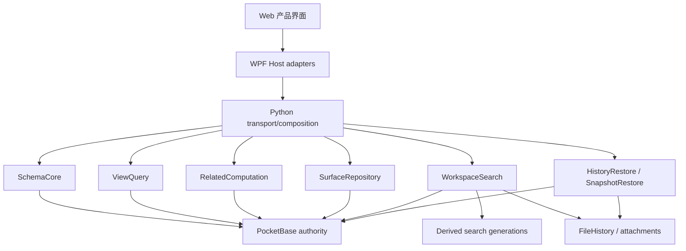
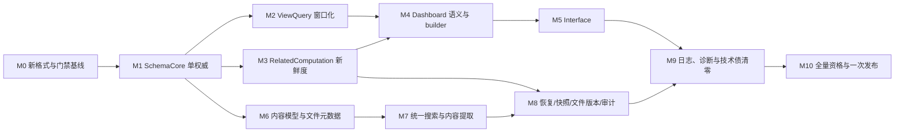

# VibeTable 离线数据工作台全面完成实施方案

> 状态：本地实现、双轨终审修正及当前树 quality/release build/定向 E2E 已完成；完整 release smoke/eligibility、GitHub `required` 与 Win10/11 双平台验证待外部交付流程
>
> 日期：2026-08-12
>
> 事实基线：`e730f558713eb702648ca0be7a41a850c9687e1d`
>
> 需求来源：[架构与质量审计](../../vibetable-audit-report-2026-08-11.md)
>
> 适用范围：开发期破坏性收敛；不兼容任何旧 workspace、Snapshot、Preset、Dashboard 或 wire 格式

## 1. 目标与最终完成定义

VibeTable 本轮目标不是复制全部云端协作功能，而是一次性完成一个面向单人和小团队的离线数据工作台：结构化数据、内容型记录、本地文件、分析仪表盘和可操作业务界面共享同一 workspace，同时保持 PocketBase 唯一业务数据权威、离线可用、可恢复、可审计。

最终公开版本必须同时满足：

1. VibeTable 仪表盘查询语义准确，具备 schema-aware 可视化 builder；
2. VibeTable 界面作为独立产品对象，支持页面、列表、详情、表单、按钮、导航和记录编辑；
3. 内容型记录、托管附件和文件文档进入统一的本地搜索体验；
4. 文件支持名称、路径、日期、格式、大小、正文、AND/OR 和显式历史版本搜索；
5. Schema V2 成为唯一字段领域模型，旧模型、旧 writer、旧查询模型和 Hidden producer 全部删除；
6. ViewQuery 严格 fail closed，表格采用 revision-bound cursor 与窗口缓存，不再全量物化；
7. Relation、Lookup、Formula 使用统一依赖图和新鲜度模型，stale 值不参与权威查询；
8. 离线重启、行历史恢复、工作区快照恢复、文件版本和 schema 审计形成可解释闭环；
9. 生产日志、诊断包、覆盖率、契约、新格式内部字段数据迁移、崩溃恢复、packaged E2E 和性能门禁全部完成；
10. 所有开发期 flag、兼容 adapter、dual-read/dual-write、旧格式迁移代码和替代实现全部删除后才允许公开发布。

本方案只用可验收里程碑表达，不提供日期、人天、人周或基于未知团队吞吐量的伪精确工期。

## 2. 产品边界与不变量

### 2.1 保留的不变量

- Go sidecar/PocketBase 继续是业务数据与 Schema 唯一权威；Python BFF 不获得 SQLite 写路径。
- workspace UUID 是身份。旧格式 workspace 必须返回 `workspace.format_unsupported`，禁止用同名空目录替代。
- WPF 继续拥有本机文件选择、路径授权、WebView2 和子进程生命周期。
- Web 只使用 closed contract，不获取数据库、对象仓库或本机绝对路径。
- 搜索索引、Dashboard 查询结果、Interface 运行状态都是派生物，不得反写为第二权威。
- 行历史恢复适配当前 Schema；工作区快照恢复完整 workspace 状态。两者必须使用不同产品术语和入口。
- 互操作导出不等于无损备份；搜索索引不进入 Snapshot、replica 或 export。

### 2.2 明确不做

- OCR、图片理解、旧二进制 Office 和压缩包内部内容搜索；
- 任意 SQL、JavaScript、HTTP、RPC 或未声明脚本执行；
- 完整触发器—条件—动作工作流引擎；
- 公网表单、外部分享、局域网服务端和移动/Web 客户端；
- 活跃 workspace 数据库与搜索索引的整体静态加密迁移；
- Notion 式块对象、块引用、块级历史和任意嵌套内容模型；
- 像素级绝对定位画布；
- 任何旧格式 reader、数据迁移器或永久兼容 flag。

### 2.3 破坏性开发期收敛

- 所有源码、contracts、fixtures、测试数据和开发工具直接迁到新格式。
- 旧开发 workspace、旧 Snapshot 和旧构建产物直接清理并重新生成，不提供数据迁移工具。
- 本方案后文的“字段数据迁移”只指新格式内部字段存储口径改变时的原子转换，不得包含旧 format reader、旧 workspace 升级或旧 Snapshot 转换。
- 清理动作必须通过仓库批准的固定输出/开发数据脚本执行，先预览精确目标；禁止宽泛递归删除用户数据。
- 正式运行时只识别新 format version。检测到旧版本时明确拒绝，并提示该版本属于不兼容开发构建。
- 开发期可以使用内部 capability flag 隔离尚未完成的纵向切片，但 flag 不得承载旧/新双写；公开发布前必须全部删除。

## 3. 目标领域模型

### 3.1 结构化与内容对象

| 对象 | 权威与身份 | 关键语义 |
|---|---|---|
| `Record` | PocketBase，`tableId + recordId` | 唯一结构化记录身份 |
| `ContentProfile` | 表级 Schema/设置 | 指定 title、body、summary 和进入搜索的字段；不产生第二内容身份 |
| `ManagedAttachment` | 记录 + 附件字段 | 从属于字段历史，有独立版本资源，但不是工作区文件 |
| `FileDocument` | FileHistory，`documentId` | workspace 级独立文件，相对路径、effective revision 和版本树 |
| `RecordDocumentLink` | PocketBase 关联实体 | 记录与文件文档的显式无级联关系；broken link 可修复 |
| `SearchDocument` | 派生索引 | 可丢弃、可重建，携带源 identity/revision/generation |

`RecordDocumentLink` 删除不删除任一端。文件删除后 link 显示 broken；“附件转文件”或“文件附加到字段”都是显式复制命令，创建新身份，不共享物理生命周期。

### 3.2 分析与操作界面

| 对象 | 用途 | 持久化 |
|---|---|---|
| `Dashboard` | 只读分析画布 | 独立 revision/config |
| `Panel` | 图表、指标、记录列表等分析节点 | 属于 Dashboard |
| `Interface` | 本地业务操作界面 | 独立 revision/definition |
| `Page` | Interface 的导航和布局单元 | 属于 Interface |
| `Element` | section、columns、tabs、text、chart、list、detail、form、button | 属于 Page tree |
| `DataBinding` | typed query + runtime variables | 定义态，不包含渲染实现 |
| `ActionBinding` | 记录 create/update、refresh、navigate，后续接插件 action | closed union，禁止任意执行 |
| `RuntimeContext` | 当前记录、筛选、选择值和页面参数 | 运行态，不写回 definition |

Dashboard 与 Interface 是不同聚合，不能共用一个含糊的 config。它们只共享运行模块和元素描述。

## 4. 目标架构：深模块、interface 与 seam



### 4.1 `SchemaCore`

```text
Describe(tableId) -> SchemaSnapshot(revision, fields, capabilities)
Plan(FieldIntent, expectedRevision) -> ChangePlan
Apply(planId, operationId) -> ChangeReceipt
```

- `schema/v2` 是唯一领域模型。
- field/operator/group/summary/formula/Relation capability 由 sidecar 计算下发；Web 不复制资格规则。
- TypeScript/C#/Python/Go wire DTO 从版本化 JSON Schema 生成；业务语义不进入生成代码。
- 删除旧 `definition_json`、旧 Lookup aggregate、junction/M2A 和旧 `resultType` 输入，不保留 Legacy adapter。

### 4.2 `ViewQuery`

```text
Validate(ast, schemaRevision) -> CanonicalQuery + diagnostics
Open(canonicalQuery, expectedDataRevision?) -> QueryCursor
Fetch(cursor, window) -> Rows + nextCursor + revision
Summarize(canonicalQuery) -> Groups + summaries
```

- closed union AST；未知 discriminator、operator、logic、空 group、错误类型一律拒绝。
- C#/Python 只校验 envelope、version 和大小，保持 AST 不透明，不能修复或丢弃条件。
- cursor 绑定 data/schema revision；失效返回 `query.cursor_stale`，Web 恢复选择和视口锚点后重新打开。
- Grid 只维护有界窗口缓存；导出、汇总和 Dashboard 使用服务端专用执行，不依赖 UI 已加载全部行。

### 4.3 `RelatedComputation`

```text
RelationPair.plan/apply/inspect/delete
RelatedValues.describe/page/aggregate
FormulaWorkbench.validate/preview/commit
Recalculation.invalidate/status/cancel/resume
```

内部共享 dependency graph 与：

```text
ComputedCellVersion = definitionVersion + sourceDataRevision + dependencyWatermark
```

只有 watermark 匹配的值可参与 filter/sort/group/summary。其他值返回 `calculation.pending`，不得继续使用 ready 的旧值。

### 4.4 `BindingRuntime` 与界面模块

```text
BindingRuntime.evaluate(binding, runtimeContext, signal) -> BindingResult
SchemaCatalog.describe(collectionId) -> CollectionSchema
SurfaceEditorController.open/dispatch/save/state
SurfaceRepository.list/load/commit/delete
ActionRuntime.describe/execute
```

- `BindingRuntime` 隐藏 schema 校验、字段漂移、projection、time bucket、Top N、限制、取消和错误映射。
- `SurfaceEditorController` 隐藏布局、dirty guard、引用重写、冲突和保存状态。
- `SurfaceRepository` 是 remote-but-owned port：生产 adapter 走 Host/BFF/PocketBase；测试 adapter 为内存实现。
- `ActionRuntime` 首先提供 record create/update、refresh、navigate；插件 action 在基础闭环后接入。
- `ElementRegistry` 首版是内部模块。只有 built-in/plugin renderer 真正形成两个 adapter 后才提升为外部 seam。

### 4.5 `WorkspaceSearch`

```text
Query(SearchRequest) -> SearchPage
Status() -> SearchIndexStatus
Rebuild(RebuildRequest) -> SearchJobStatus
```

内部隐藏 records/attachments/file-history source adapters、extractors、tokenizer、SQLite index、generation、checkpoint 和 promote。

- 权威事务只原子写 durable search projection intent；worker 按 identity 重读权威对象。
- index item 至少携带 `workspaceId/kind/canonicalId/sourceRevision/schemaRevision/extractorVersion/contentHash`。
- Query 返回 `generation/indexedWatermark/status=current|catchingUp|rebuilding|failed`。
- 打开 SearchHit 时向权威源重新解析；revision 不匹配返回 stale 并刷新结果。
- source identity、workspace ID、extractor schema 或恢复 revision 变化时创建新 generation；验证通过后原子 promote。
- 索引故障只能降级搜索，不能阻止记录/文件写入或 workspace 恢复。

### 4.6 恢复与审计

```text
HistoryRestore.PreviewAtCurrentSchema/Apply
SnapshotRestore.RestoreWorkspace
```

- 行历史恢复恢复业务值、Relation 和附件引用，Formula/Lookup 重新计算。
- Snapshot manifest 增加 computation watermark/job schema version；恢复顺序为验证→恢复权威状态→invalidate search generation→升级 job state→resume worker。
- 外部 ledger 的 schema 事件保存 field identity、action、before/after canonical hash 和脱敏安全摘要；不记录业务值。

## 5. 统一执行纪律与实施技能

### 5.1 每个里程碑的固定循环

1. 读取 `AGENTS.md`、`CONTEXT.md`、相关 ADR 和本方案；
2. 使用 `git-pr-delivery` 从最新远端 `main` 创建独立 `codex/<slug>` branch/worktree，核对 hooks；
3. 使用 `codebase-design` 确认本里程碑 module、interface、seam、adapter 和删除测试；
4. 若领域词汇改变，使用 `domain-modeling` 立即更新 `CONTEXT.md`；符合硬决策条件时才新增 ADR；
5. 使用 `tdd` 预先写明测试 seam，按单个 tracer bullet 执行 red→green，禁止按语言横向铺测试；
6. Dashboard、Interface、搜索等可见 UI 使用 `frontend-design`，先确定用途、视觉方向、密度、键盘与可访问性，再实现 Vue 组件；
7. 遇到语义错误、崩溃、文件占用或性能回归，切换 `diagnosing-bugs`，先建立可运行的红灯反馈环再提出根因；
8. 每个里程碑完成后使用 `code-review`，固定 base，对 Standards 与本方案 Spec 两轴并行审查；
9. 使用 `git-pr-delivery` 运行相关本地门禁、提交中文 Conventional Commit、创建/更新 Draft PR，并以 GitHub `required` 为完整门禁；
10. 所有里程碑持续合入统一集成分支，但对产品保持不可见；最终公开发布必须等待里程碑 10 的总门禁。

### 5.2 条件触发技能

| 技能 | 必须使用的场景 | 输出要求 |
|---|---|---|
| `research` | FTS/tokenizer、PDF/OOXML extractor、SQLite capability、依赖许可、资源限制、加密边界等本地事实不足 | 子代理基于官方文档/源码形成 `docs/research/` Markdown，逐项引用一手来源 |
| `route-subagents` | 独立能力调查、两种以上 interface 方案、Standards/Spec 双轴 review、并行只读验证 | 明确边界、模型/推理档、验证和未覆盖范围；主代理复核 |
| `frontend-design` | Dashboard builder、Interface builder/runtime、全局搜索和文件工作区 UI | 真实 Vue 代码、键盘/空状态/错误/进度/响应式和截图证据 |
| `diagnosing-bugs` | 查询错误、stale 参与计算、Windows cleanup、索引重建、内存或延迟超预算 | 可重复红灯命令、最小复现、3–5 个可证伪假设、修复与回归测试 |

## 6. 里程碑依赖图



M2 与 M3 可在不同 worktree 并行；M4 与 M6 可并行；M5 与 M7 在共享 contract 冻结后可并行。不得让并行工作同时修改同一个生成 schema、composition root 或超大协调文件；冲突热点由一个里程碑拥有。

## 7. M0：新格式、事实红灯与门禁基线

### 7.1 目标

先证明当前错误并冻结新格式，禁止后续实现建立在静默降级和双模型上。

### 7.2 工作包

- 定义唯一 format version、Schema V2、ViewQuery、DataBinding、InterfaceDefinition、SearchRequest/Hit/Status、computed envelope 和 schema audit event JSON Schema。
- 建立 TS/C#/Python/Go DTO 生成器与 `--check` 入口；正反 fixtures 是 consumer 兼容事实源。
- 增加红灯测试：
  - WPF 静默丢弃非法 filter/operator/logic；
  - Dashboard fields/timeBucket/topN/countDistinct 未执行；
  - Dashboard editor 多配置 round-trip 丢失；
  - computed fanout 期间旧 ready 值参与查询；
  - Grid 主路径全量拉取；
  - FileDocument size/revision time/path 未进入公开 summary；
  - 搜索没有跨源、排名和状态。
- 移除固定“必须恰好 16 个 E2E 场景”的 runner 限制，改为 capability-tagged manifest。
- 建立一次性开发清理脚本，只处理仓库声明的开发 workspace、fixtures 和构建输出；提供 `--preview`，默认不删除。

### 7.3 必用技能

- `codebase-design`：确认 SchemaCore/ViewQuery/WorkspaceSearch 等测试 seam。
- `tdd`：逐个红灯 characterization，不先写实现。
- `research`：验证 JSON Schema codegen 工具和 modernc SQLite FTS/tokenizer capability。
- `git-pr-delivery`：独立门禁 PR。

### 7.4 验收与删除

- 所有红灯能在旧实现上稳定失败，且不是环境失败。
- DTO 生成物与 fixtures 一致；生成代码不承载业务规则。
- 新 format 以外的 workspace 明确返回 `workspace.format_unsupported`。
- 清理脚本不会触及 `.git/`、用户数据、隔离区或未声明路径。

## 8. M1：SchemaCore 单一权威与四栈瘦身

### 8.1 工作包

- 实现 `SchemaCore` interface，将 `schema/v2` 作为唯一读写模型。
- 删除旧 `definition_json` 写入和旧 product-contract Schema 分支。
- 删除 Lookup aggregate/resultType、junction/M2A 新建与运行分支；现有开发数据不迁移。
- sidecar 下发字段、操作符、分组、汇总、Relation/Lookup/Formula capability。
- TS/C#/Python 只消费生成 DTO；移除本地字段资格和结果类型推断。
- 将 schema mutation、dependency invalidation、durable job 和 schema audit outbox 纳入现有 write coordinator 的同一提交边界。

### 8.2 TDD seam

- `SchemaCore.Describe/Plan/Apply`；
- schema JSON Schema 正反 fixtures；
- Relation pair 对称性、删除依赖和自关联；
- Formula 自动结果类型；Lookup 1/8/9 跳；
- schema audit event 不含业务值。

### 8.3 验收与删除

- 全仓不存在旧 Schema writer、旧 lookup aggregate 或调用方 resultType。
- Web 不要求用户输入 fieldId/physicalName 来配置公开功能。
- 删除所有旧 schema fixtures、旧 adapter、双写检查和被新 interface 替代的浅测试。

## 9. M2：ViewQuery 严格验证、窗口化和能力驱动编辑

### 9.1 工作包

- sidecar 完成 canonical closed-union AST validation；C#/Python 透明转发。
- 引入 revision-bound cursor/keyset，稳定主键排序和 `query.cursor_stale`。
- GridStateCoordinator 改为有界窗口缓存，保留选择/滚动锚点；不再循环拉完所有页。
- 导出、Dashboard、分组和汇总调用服务端接口，不使用 UI 已加载行。
- Web FilterTreeEditor 和 ViewQueryControls 根据 Schema capability 提供日期、选项、Relation、空白和多值编辑器；取消 CSV/raw text 猜测。
- Preset 只保存当前 canonical ViewQuery，不保留旧 query JSON。

### 9.2 TDD seam

- `ViewQuery.Validate/Open/Fetch/Summarize`；
- unknown/empty/type/depth/count 边界 fail closed；
- 并发 mutation 导致 cursor stale，不混合 revision；
- 10 万行首屏只取窗口，内存不随总行数线性增长；
- 表头快捷筛选与高级 AST 是同一状态。

### 9.3 验收与删除

- 删除 WPF filter parser/修复逻辑、Web 本地投影分叉和 OFFSET 全量循环。
- 50 条/3 层筛选、2 级分组、3 个 summary 有服务端和 packaged UI 证据。

## 10. M3：Relation/Lookup/Formula 新鲜度与大基数闭环

### 10.1 工作包

- 建立共享 dependency graph 与 ComputedCellVersion/freshness watermark。
- mutation 同事务写 dependency invalidation、durable recalculation job 和审计 intent。
- Query 对 stale/pending 值统一返回 envelope，禁止其参与 predicate/sort/group/summary。
- RelatedValues 支持分页、provenance 和服务端 aggregate；移除 relation 1000、formula collection 1024 的固定业务数量上限，改用 cursor、cost 和字节预算。
- fanout/backfill 支持 status、cancel、checkpoint、重启 resume；Snapshot 捕获 pending job 状态。

### 10.2 TDD seam

- mutation 已提交、worker 未启动；fanout 中途终止和 reopen；
- stale 值绝不命中筛选/排序/汇总；
- >10k direct relation、8 跳低 fan-out、成本超限；
- 取消后状态稳定，重启后从 checkpoint 恢复；
- Formula preview stale response 抑制和 schema drift。

### 10.3 验收与删除

- 删除 legacy calculator 分支、旧值继续参与查询的路径和各层自行猜测 pending 的逻辑。
- Relation/Lookup/Formula 的 UI、查询、恢复和审计共享同一新鲜度语义。

## 11. M4：Dashboard 语义正确性与成熟 builder

### 11.1 先修复查询语义

- 实现记录字段投影、准确 `countDistinct`、UTC day/week/month bucket、deterministic Top N。
- 统一现行 `measures/filters/timeBucket` 模型，删除旧 `metrics/filter/groupBy/timeField` AST。
- manifest 的 `minSize/optionsSchema/rendererVersion` 真正驱动布局、编辑器和校验。
- 多 dimension、measure、filter、sort 无损 round-trip。

### 11.2 Builder 产品化

- 使用 `SchemaCatalog` 和类型化字段/操作符/aggregate 选择器，禁止手填物理字段名。
- 实现字段漂移诊断、显式修复、preview error、revision conflict reload。
- interactions、runtime filters、drilldown 改为可视绑定，不再手填 panel ID。
- 约束 12 列响应式网格、拖拽、缩放、键盘移动和窄屏投影。
- 大部分当前 0% 的 Dashboard UI 获得相邻组件测试与视觉证据。

### 11.3 必用技能与验收

- `frontend-design`：建立面向离线数据工作台的高密度、清晰、非模板化视觉语言；包括空状态、错误、loading、pending 和键盘路径。
- `tdd`：BindingRuntime、editor round-trip、drift、conflict、cancel。
- packaged E2E：四类代表面板、筛选、联动、钻取、拖拽/缩放、保存重开、双编辑器冲突。
- 删除旧 Dashboard query 模型、字段文本框主路径和不执行的公开 contract 字段。

## 12. M5：VibeTable 界面 MVP 到完整本地闭环

### 12.1 InterfaceDefinition v1

- `Interface -> Page[] -> Element tree`；独立 revision 和 atomic commit。
- 结构元素：section、columns、tabs；展示元素：text、metric、chart；数据元素：record-list、record-detail；操作元素：form、button、navigation。
- 响应式约束布局，不支持像素级 absolute canvas。
- 编辑态与运行态分离；RuntimeContext 不写回定义。

### 12.2 动作闭集

- 第一纵切：record create/update、refresh binding、navigate。
- 第二纵切：复用现有插件 describe/start/confirmation/task lifecycle 的 plugin action adapter。
- 不执行 raw provider filter、HTTP、SQL、JS 或 arbitrary RPC。

### 12.3 必用技能与 TDD seam

- `frontend-design`：builder、runtime、form validation、窄屏预览、键盘和可访问性。
- `tdd`：`SurfaceEditorController`、`SurfaceRepository`、`ActionRuntime` 和 definition validation。
- packaged E2E：空白建页→绑定列表/详情→提交表单→更新记录→刷新→保存重开；插件动作确认/拒绝/取消。

### 12.4 验收与删除

- Dashboard 不被自动转换或复用为 Interface 持久化对象。
- 删除所有临时 Interface flags、示例假数据、旁路 mutation 和未使用 element manifest。

## 13. M6：内容型记录、文件元数据与显式关联

### 13.1 内容型记录

- `ContentProfile` 指定 title/body/summary/searchable fields；正文继续使用现有 richText/longText。
- 建立内容阅读/编辑布局、摘要、字段导航和从搜索结果打开记录的稳定路径。
- 不新增 RecordContent 身份、块数据库或内容双写。

### 13.2 文件元数据查询

- 新增 `FileDocumentSummary`：relativePath、displayName、extension、mimeType、sizeBytes、effectiveRevisionCreatedAt、formalVersion、status。
- “修改时间”定义为有效修订创建时间，不冒充 Windows mtime。
- 新增 `fileHistory.queryDocuments`：名称/路径/MIME/扩展名/大小/修订时间/状态 AND/OR、sort、cursor 和 topology revision。
- 10,000 文件是本轮正式上限；分页解决查询与内存，不伪称突破总容量。

### 13.3 RecordDocumentLink

- PB 权威关联实体：`tableId/recordId/documentId/role/order`。
- 删除 link 不删除对象；文档删除产生 broken link；修复/重新绑定有稳定命令和审计。
- 跨 PB/FileHistory 的复制或链接动作使用 write coordinator + 可恢复 intent。

### 13.4 验收与删除

- 删除孤立的 `size?/modifiedAt?` 类型字段或将其改成必有、语义准确的 summary 字段。
- README、UI 与实现一致，不再宣称不存在的隐式记录—文件关联。
- packaged E2E：内容记录编辑、文件元数据 AND/OR、link/broken/repair、重启重开。

## 14. M7：统一搜索、内容提取与历史版本范围

### 14.1 P0 研究与基准

先使用 `research` 子代理完成并写入 `docs/research/`：

- modernc SQLite 当前构建的 FTS5/tokenizer capability；
- Unicode NFKC/case fold、Latin token、CJK n-gram 的官方依据和实现选择；
- PDF/OOXML extractor 的许可、加密文件、损坏输入、资源上限和 Windows 打包影响；
- 搜索 index DB 的磁盘倍率、重建和查询基准。

研究结论经评审后才冻结 tokenizer/extractor adapter；不得凭记忆选依赖。

### 14.2 结构化与内容索引

- sources：Record ContentProfile 字段、ManagedAttachment metadata、FileDocument metadata/content。
- SearchRequest 支持 query text、kind、table、field、MIME/extension、size/date、status、AND/OR、sort、cursor、scope=current|history。
- 统一 SearchHit：kind、canonical identity、title、snippet/highlights、sourceRevision、score、metadata、open target。
- 默认只索引 effective/current revision；显式 history scope 搜索历史文件修订。
- 普通搜索词、snippet 和正文不进入日志或 ledger。

### 14.3 内容格式

- 第一纵切：UTF-8 text、Markdown、CSV、JSON、XML、YAML、HTML 可见文本；
- 第二纵切：DOCX、PPTX、受资源限制的 XLSX 显示文本；
- 第三纵切：原生文本 PDF，明确 unsupported/failed/truncated/passwordProtected；
- extractor 限制输入大小、ZIP entries/膨胀比、字符数、耗时和取消；失败不阻断源保存。

### 14.4 一致性与恢复

- business/file-history/attachment 的源事务写 durable projection intent；worker 幂等 upsert/tombstone。
- outbox checkpoint 落后保留窗口时直接 full rebuild。
- rebuild 使用 build-next→verify→atomic promote；崩溃后保留旧 generation 或继续构建。
- Snapshot restore/open-as-new 后 invalidate generation；搜索降级但 workspace 必须可打开。

### 14.5 验收

- packaged E2E：跨 records/files/attachments 搜索、AND/OR、metadata/content/history、键盘导航、lag/rebuild/error/stale open。
- 故障测试：磁盘满、SQLite busy/corrupt、文件占用、超时/取消、恶意 OOXML 膨胀、加密 PDF。
- 删除旧 `LIKE` 作为产品主搜索的路径；单表 keyword 可改为 WorkspaceSearch adapter 或明确只作为结构化 quick filter。

## 15. M8：离线、恢复、快照、文件版本与审计闭环

### 15.1 工作包

- Snapshot manifest 绑定 schema/data revision、computation watermark、job schema version、FileHistory root、settings、audit anchor。
- pending recalculation/search intents 状态可被 Snapshot 捕获；恢复后遵循 restore-before-resume。
- 行历史恢复明确处理字段删除、schema drift、Relation target 缺失、附件 revision 缺失和 computed 重算。
- 文件 effective revision 激活、历史搜索和恢复后 SearchHit stale 处理一致。
- 外部 ledger 新 schema event 可跨 Snapshot epoch 解释字段变更。
- UI 分别呈现行历史恢复与工作区快照恢复，不使用模糊“时间旅行”。

### 15.2 崩溃矩阵

- mutation commit 与 job enqueue/outbox 之间；
- fanout 中途；
- search generation build/promote 之间；
- Snapshot 捕获 pending jobs；
- restore 权威状态完成但 search invalidate 尚未完成；
- audit epoch 切换；
- 文件 revision publish/activate 和 RecordDocumentLink intent 中途。

### 15.3 验收

- 每个 cutpoint 使用 `diagnosing-bugs` 建立可重复反馈环，再固化集成测试。
- packaged E2E：附件版本 + 行历史恢复 + Snapshot restore，证明两种恢复语义、搜索重建和 ledger 连续性。

## 16. M9：日志、诊断、覆盖率和技术债清零

### 16.1 统一可观测性

- Python、Go、WPF 统一 JSON schema：timestamp、level、module、event、errorCode、requestId、operationId、workspaceId、sessionEpoch、jobId、durationMs。
- 统一脱敏：正文、搜索词、字段值、路径 grant、凭据和插件输出不进入日志。
- backend/pocketbase/WPF 日志均使用大小+时间轮转、配额和保留期；生产 WPF AppDomain/Dispatcher 崩溃落盘。
- `diagnostics.get` 扩展为一键诊断包：版本、健康、job/index status、最近错误计数和脱敏日志，不包含业务内容。
- 搜索、新格式字段数据迁移、计算、恢复在 UI 展示状态、进度、取消和稳定错误码。

### 16.2 覆盖率终态

- Python 保持 backend ≥85%。
- 本轮 Go 核心包行覆盖 ≥85%、分支 ≥75%、diff coverage ≥90%。
- Web 总体行覆盖 ≥80%、分支 ≥75%；Dashboard、Interface、FileWorkspace/Search 分别设置门槛，不允许 0% 产品视图。
- Desktop 与 PreviewHost 分开设阈值，禁止合并数字掩盖低覆盖模块。
- 生成 DTO 不纳入人工逻辑覆盖率。
- contracts、新格式字段数据迁移/旧 format rejection、crash-recovery、packaged E2E 和 performance 是独立 required checks。

### 16.3 深模块收口与删除测试

- `MainWindow.Product.cs` 只保留 composition/lifecycle；产品状态机迁入相应 controller。
- `WorkspaceRequestDispatcher.cs` 只做 allowlist/envelope/transport；删除业务 AST 解释。
- `WorkspaceView.vue` 只组合页面；查询、Dashboard、Interface、搜索状态迁入深模块。
- `product_rpc.py` 只保留 closed dispatch/业务编排，不镜像全部 adapter 语义。
- 删除旧 unit tests；以新 module interface tests 替代。测试不能穿透 seam 检查私有实现。
- 删除过时/乱码 planning 文件、陈旧 capability 声明、未消费 producer 和死配置。

“拆成多个 partial/file”不算完成；只有复杂度从调用方消失、重复逻辑删除、interface 更小且主要测试穿过该 interface，才算获得 depth/locality。

## 17. M10：规模资格、全量证据与一次性公开发布

### 17.1 正式规模与 SLO

基准 workspace：10 万结构化记录、1 万 FileDocument、20 GB。P0 基准必须冻结峰值 RSS、完整索引重建时限和窗口缓存预算；以下为硬目标：

- warm 全局搜索 p95 <150 ms；首屏 <300 ms；
- 常态增量索引延迟 p95 <2 s；
- 可见 Dashboard 面板刷新 p95 <1 s；不可见 Interface page/panel 不执行查询；
- 10 万行表格首屏不全量物化，内存遵守冻结预算；
- fanout、搜索重建和清理/初始化可取消、恢复并显示进度；
- 性能超过预算则 release fail closed。

### 17.2 PR 与 release 门禁

- 普通 PR：contract fixtures、相关单元/集成、四条快速 packaged 旅程和受影响 coverage/diff coverage。
- `main`/release：全部 packaged E2E、崩溃矩阵、10 万/1 万/20 GB 性能、发布 build/smoke。
- `.ci/project.json` 提供精确 PR E2E 子集；完整资格继续由 `qa/next.py --ci` 与 GitHub `required` 证明。
- 不能把 pending、历史报告或局部绿色写成当前 HEAD 通过。

### 17.3 最终删除清单

- 所有内部 capability/feature flags；
- 所有旧 Schema/Query/Dashboard/Preset/Workspace/Snapshot reader 和 writer；
- Legacy adapter、dual-read/dual-write、一次性开发清理辅助代码和任何旧格式迁移代码；
- 固定 16 场景限制；
- Hidden producer、无消费者 RPC、未挂载组件、孤立 DTO 字段；
- 静默 fallback、旧 computed ready 值和 UI 全量物化路径；
- 过时计划、乱码审计记录和与实现冲突的文档。

### 17.4 一次发布条件

只有以下全部为真，才允许公开发布：

- M0–M9 的 completion checklist 全部关闭，且 M10 的规模/SLO、PR 与 release 资格证据全部通过；
- 当前 HEAD 本地资格报告与 GitHub `required` 全绿；
- 无开放 S0/S1，无未处置的数据正确性 S2；
- 所有可见 UI 有截图和 Windows 10/11 x64 packaged evidence；
- 没有兼容双轨、临时 flag、Hidden 功能或未声明降级；
- `git grep` 和 contract/catalog 检查证明最终删除清单为空；
- release candidate 资产、SHA-256、identity 和 SPDX SBOM 满足仓库发布契约。

## 18. 测试与证据总矩阵

| 能力 | Module interface tests | 真实集成 | Packaged E2E | 故障/性能 | 主要技能 |
|---|---|---|---|---|---|
| Schema/字段 | Describe/Plan/Apply | PocketBase schema mutation | 创建/编辑/重开 | schema conflict | `tdd`, `codebase-design` |
| ViewQuery | Validate/Open/Fetch/Summarize | real PB cursor | 筛选/分组/汇总/窗口 | cursor stale/10万行 | `tdd`, `diagnosing-bugs` |
| Relation/Lookup/Formula | RelatedValues/Recalculation | durable jobs | 源修改→pending→fresh | kill/resume/>10k | `tdd`, `diagnosing-bugs` |
| Dashboard | BindingRuntime/Controller | BFF+sidecar query | builder/联动/冲突 | fan-out/内存 | `frontend-design`, `tdd` |
| Interface | Repository/Controller/Action | atomic definition + mutation | 表单/列表/详情/动作 | offline/restart | `frontend-design`, `tdd` |
| 内容/文件 | ContentProfile/FileDocument query | PB+FileHistory | 内容页/link/metadata | broken/repair | `domain-modeling`, `tdd` |
| 搜索 | Query/Status/Rebuild | outbox+index generation | 跨源/AND-OR/history | corrupt/disk/lag/SLO | `research`, `diagnosing-bugs`, `tdd` |
| 恢复/审计 | History/Snapshot restore | cutpoint integration | 两种恢复+ledger | crash matrix | `diagnosing-bugs`, `tdd` |
| 日志/诊断 | redaction/rotation/package | real subprocess logs | support bundle | crash/disk quota | `diagnosing-bugs` |

## 19. 每个里程碑的 PR 完成模板

每个里程碑的实施 issue/PR 必须从本方案复制并填写：

```markdown
## Module 与 seam
- Module：
- Interface：
- Production adapter：
- Test adapter：
- 本 PR 不跨越的 seam：

## TDD tracer bullets
- [ ] red：精确命令与旧实现失败
- [ ] green：最小纵向行为
- [ ] 下一个 tracer bullet

## 删除项
- [ ] 被替代的逻辑
- [ ] 被替代的测试
- [ ] 临时 flag/adapter

## 验证
- 单元/模块接口：
- 集成：
- Packaged E2E：
- 覆盖率：
- 性能/故障：
- 截图或诊断证据：

## 技能记录
- 使用的技能及触发原因：
- `code-review` Standards 结果：
- `code-review` Spec 结果：
```

## 20. 方案维护规则

- 本文件是本轮实现 Spec。需求变化必须先修改本文件和必要的 `CONTEXT.md`/ADR，再改代码。
- 每完成一个里程碑，更新顶部状态和对应验收证据链接；不得只勾选而无命令、报告或 PR。
- 新发现事实优先写入代码/配置/测试；文档与实现冲突时在同一 PR 修正文档。
- 任何声称“全面完成”的 PR 都必须通过 `code-review` 的 Standards 与 Spec 两轴，主代理复核后才能关闭里程碑。

## 21. 当前实施与验收证据（2026-08-15）

本节记录当前实现、M9 聚焦验证和 2026-08-15 最近一次完整本地 quality/build 及
smoke/eligibility 尝试证据，不替代各里程碑的删除清单，也不得冒充 GitHub `required` 或
Win10/11 双平台发布验证。

### 21.1 当前实现与 quality

- 终审可操作发现已修复：删除 legacy schema wire，restore pending marker 改为持久且错误可见，Schema
  types/cleanup 与 Formula tests 收敛到 V2，coverage gates 进入正式入口，Grid 状态机下沉到
  `GridRequestController`；M9 随后完成 Desktop/Web 深模块收口及 stale-race 回归。
- Schema V2 codegen 覆盖 59 个 wire shapes；`schemaexecution.Table` 直接持有
  `v2.SchemaSnapshot`/`v2.FieldDefinition`，生产执行链不再以 legacy `schema.TableDefinition` 为模型。
- 最终 `uv run python scripts/automation_project.py quality` 退出码为 0（254.2 s）；contracts、
  Ruff/Pyright/mypy、Python、Web、Go 与 .NET 全部通过，Web 163 files/1,146 tests、Desktop 461/461，Desktop/PreviewHost 独立
  coverage gates 均通过。
- 终局竞态修复均有旧实现红灯：Lookup fanout 等待当前 mutation receipt 的 `source_event_id`，Dashboard
  refresh 不再覆盖 pending selection，Dashboard CAS 场景使用确定置脏的公开设置操作；附件 modal 在显式
  trigger 与当前焦点不同时先释放 workspace，再于关闭后恢复 trigger；JSON/附件/Lookup 三个 NModal 禁用过早
  autofocus，在 transition `after-enter` 后聚焦 dialog 根节点，避免 focus-trap 聚焦 `aria-hidden` sentinel；Dashboard
  在已有 current 的 failed phase 可通过 refresh 恢复，桌面兜底异常经安全 Trace seam 留下异常类型。

### 21.2 当前本地发布门禁状态

- 终审修复前的最后一轮完整资格中，`uv run python scripts/automation_project.py build` 退出码为 0（62.8 s），随后
  `uv run python scripts/automation_project.py smoke` 退出码为 0（1,968.6 s）。
  `build/automation/vibetable-release-eligibility.json`（2026-08-14T16:35:13Z）为 `ok=true`、
  `releaseEligible=true`，21/21 stages 全部返回 0。版本、
  package contract、Go fmt/vet/test/race/build、Python/contracts/tooling、.NET、Web test/build、
  fault injection、product E2E、workbench qualification 和 readonly smoke 全部成功；当前 production
  `sourceHash` 为 `eb6e03bb156c47d4ab5a6accef4a38da749c25d6a1595d2f00d000c8e923f5ca`。该证据因随后
  week bucket 参数绑定、modal transition 公开入口回归与 fault gate 工具链解析修复而过期，不能作为当前资格结论。
- 当前树最终 quality 已全绿，fresh release build 退出码为 0（63.1 s）。其候选
  `VibeTable-v0.5.1-win-x64.zip` SHA-256 为
  `d801b34f84589111536351b739d21747a37fd835e3b942b1ad41c839d75a3122`，package tree SHA-256
  为 `21ec28fe3f468846ea3d565fd905759ff0bd74346706494557428f2714b470b5`，共 141,246,826 bytes、
  177 files。此前 current-candidate smoke 暴露 fault gate 错误回退到系统 Go 1.26.5；resolver 现从
  `tools/recovery-tools/go.mod` 读取 1.25.8 并优先使用精确版本目录，正式 component gate 已通过。
- 修复 resolver 后的上一候选 release smoke 前置 stages 已通过 version/package、Go fmt/vet/test/coverage/race/build、
  packaged sidecar 14 项 matrix、Python/contracts/tooling、.NET、Web 与 fault injection 3/3；real
  WPF/WebView2 product E2E 为 18/18 passed、0 failed、0 skipped。它包含此前分别闭环的
  Dashboard 16、Interface 17 与 WorkspaceSearch 18，并保留各场景截图、trace 和结果 JSON。
  本轮随后在 release qualification 物化第 8,019 个文件时因 C: 空间不足退出，当前 eligibility
  `sourceHash` 为 `fb3fb3dccbc5ec851428da20281008bad0e4c9390ec70398181c46b30b0ebd7b`、
  `ok=false`、`releaseEligible=false`；qualification、readonly smoke 与最终 candidate verify 尚未完成，
  不得写成通过。
- PR 提交 `1cb20223` 的首轮 GitHub CI 中，CodeQL、core、race-a、race-b 与 release lanes 均通过；
  resilience 的 18 场 product E2E 暴露 JSON round-trip 的 Tabulator stale-row warning，以及 sidecar
  主动故障恢复轮询未确认精确 `BACKEND_UNAVAILABLE`。当前实现复用已枚举 row component，避免
  `getRows`/`getRow` 间的 TOCTOU；E2E helper 只确认主动故障窗口内的该稳定错误码，不放宽其他失败。
  fresh 候选上的 04/10 原场景为 2/2 passed，renderer warnings、page errors、未预期 bridge failures 和
  pending requests 均为 0；场景规定的预期失败进入 `acknowledgedFailures`（本次 1 项），完整 GitHub
  `required` 尚待当前提交重跑，不能写成通过。
- 最近一次成功的历史 `build/qa/workbench-qualification.json`（schema v3、`failures=[]`）实际物化并读取
  100,000 records、10,000 file documents、20 GiB（21,474,836,480 bytes）：peak RSS
  257,400,832 bytes、first screen 1.023 ms、warm p95 0.999 ms、incremental p95 4.180 ms，
  qualification 114.050 s；它证明规模实现曾达标，但不替代当前树重跑。当前候选 identity 为
  VibeTable 0.5.1/windows/x64，`source_sha` 是 `local`，
  因此它不能替代提交后由 CI 绑定真实 source SHA、SBOM/provenance 和正式资产集合的发布候选。

### 21.3 已解决阻塞的根因链

- Schema 阻塞不是 writer 数量问题，而是执行端仍依赖第二套字段类型。删除旧 writer 后继续迁移所有
  production consumer，并用 `schemaexecution.Table` 封装 V2 snapshot 与仅运行时元数据，最终关闭
  “写入 V2、读取 legacy”分裂。
- 深模块阻塞来自 dispatcher/view 同时承担协议路由与业务状态机。Dashboard/Document/Surface controller
  与 navigation module 建立 production gateway/test fake seam 后，协调文件只组合公开 interface；相关
  聚焦测试和完整资格入口共同复验。
- 最终资格早期失败分别暴露 Schema fixture 绕过 durable scheduler、COUNT integer hint 丢失、合法
  optional display 值被拒，以及 search worker 取消后触碰已释放 runtime。修复均落在正式 seam，并添加
  回归测试；未通过重试、降级校验或跳过场景掩盖。
- 最终终审又发现 legacy schema wire 仍可被调用、restore pending marker 未持久化且 search 错误被吞、
  Schema types/cleanup 未完全收敛，以及 Formula 测试仍绕过 V2。修复删除旧 wire、让 marker/error
  进入公开恢复契约、迁移测试与类型，并由最终 quality 复验。

### 21.4 M9 深模块收口已完成

- `WorkspaceRequestDispatcher.cs`、`MainWindow.Product.cs`、`WorkspaceView.vue` 当前物理行数分别为
  159、869、1,570。Dispatcher 只保留 allowlist/envelope/transport，MainWindow 只保留
  composition/lifecycle；Desktop 产品状态机迁入 `HostRequestDispatcher`、`WorkspaceProductController`、
  `ProductWorkspaceController`、`WorkspaceTableRequestController` 等 closed controller interfaces，测试从
  相邻 module interface/fake host seam 进入。
- Web 页面只组合页面与生命周期：authoritative lookup、relation editor、preset、structured dialog、
  lookup provenance、plugin、session UI、table interaction 与 navigation 均进入 `src/workspace/` 深模块。
  relation `loadDraft` 以 editor epoch/accept-result seam 丢弃关闭后晚到的旧草稿；authoritative lookup 在
  `recordQuery` 时立即使旧 in-flight refresh generation 失效，下一次 refresh 使用新查询。
- M9 Web 聚焦回归最终为 11 files/82 tests；全 Web 163 files/1,146 tests、typecheck 和 build 已通过。
  workspace 模块中 `as unknown as`/`as never` 为 0，relation full-create/pending、table paste/CRUD、plugin
  start/resolve/cancel 与 lookup stale race 均通过公开 module interface 验证。其后 attachment modal 的
  显式 focus trigger 回归也进入正式 seam，并由最终 quality 与 18/18 product E2E 复验。

### 21.5 最终双轴复审

- 以 `GitHub/main` 为固定基线，对包含 CodeQL、CI race/resilience 与完成文档收口的最终差异重新执行
  Standards/Spec 双轴复审。最终 Standards 轮发现 modal 测试直接调用 transition callback、week bucket 使用
  `char(...)` 魔法数字两项问题；当前已改为从三个公开 modal 入口等待真实 transition，并由
  `compiler.bind` 绑定格式参数，并由真实 SQLite 跨周数据验证 UTC Monday bucket。两名审查者复核后均为
  0 findings。此前 Standards 审查中发现的 fanout completion 无界等待已改为
  从 `go test` deadline 派生的有界清理路径，并以 CI 同型 `-race -count=3` 复验。
- CodeQL 的 native int、容量提示与 week bucket SQL 修复未改变产品语义；week bucket 的固定 UTC/Monday
  格式通过既有 compiler 参数绑定 seam 传入，动态 field SQL 不再邻接 SQL 引号。lookup provenance 改用已渲染 row 集合定位，
  NModal 改为 transition 后聚焦 dialog；上一候选 18/18 E2E 中 aria-hidden warning 为 0，最新 fresh 候选的
  04/10 定向 E2E 又确认 Tabulator warning 与未预期 bridge failures 均为 0。

### 21.6 外部交付门禁

- GitHub PR 必须在严格同步最新 `main` 后通过完整 `required`，并由 CI 重新生成绑定真实 source SHA 的
  release candidate；本地 `releaseEligible=true` 不是远端 check 结论。
- Win10/11 x64 双平台矩阵未在本机分别执行，仍须由发布环境验证；本地只证明当前 Windows x64 环境的
  real WPF/WebView2 与 packaged 资格。
