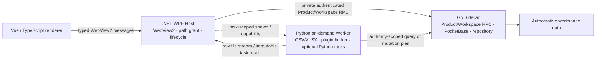
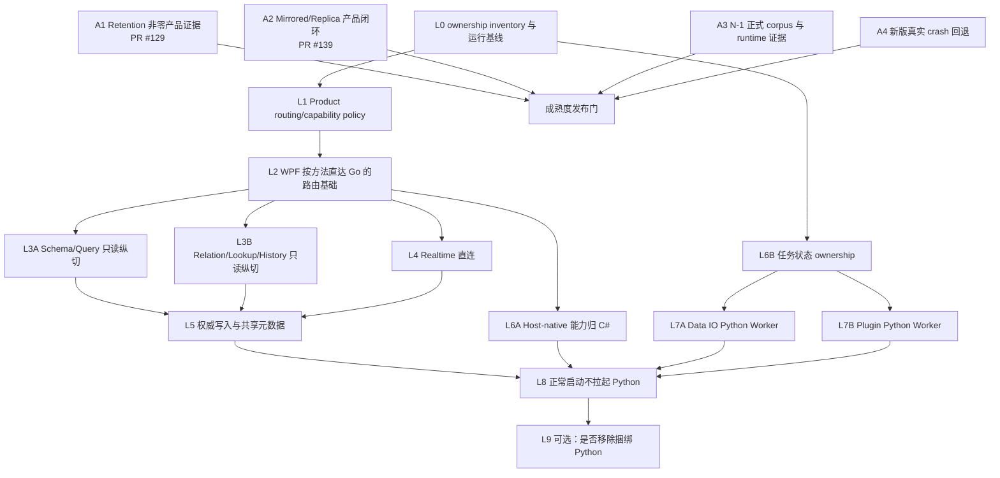

# VibeTable 成熟度审计与渐进实施指南

> 原审计日期：2026-08-17  
> 本次更新：2026-08-29  
> 代码基线：`GitHub/main@9ec0ac8ed5b14b84d4cb40e9851faa670075dc43`  
> 状态：Active；作为下一阶段成熟度闭环与运行时职责收敛的实施入口  
> 适用范围：Windows 10/11 x64 离线优先桌面产品、现行四栈运行时与发布门禁

本文件按当前代码、配置、测试、Git 历史、开放 PR 和现行架构决策重新建立实施基线。它不替代
[跨进程 seam 索引](../architecture/interprocess-seams.md)、[能力闭环矩阵](../quality/capability-matrix.md)、
[稳定化台账](../quality/stabilization-ledger.md)、[质量门禁](../quality-gates.md)或 ADR；这些文件发生冲突时，
事实优先级仍为可执行配置/锁文件与代码、项目脚本、测试、现行 ADR 和文档。

[2026-08-08 技术债治理与架构稳定化方案](2026-08-08-technical-debt-stabilization.md)已经完成其主要使命：
统一业务数据 authority、收敛能力可见性、接通 Document Diff、建立真实产品 E2E 与多栈质量门禁。
本文件不重复冻结期清债，而是回答两个后续问题：

1. 当前还缺哪些成熟度证据，按什么顺序闭环；
2. 如何在不重写产品、不制造第二数据 authority 的前提下，把 Python 常驻 BFF 渐进收缩为按需 Worker。

---

## 1. 决策摘要

VibeTable 当前不是“技术选型失败、需要改写”的项目。Vue/TypeScript、WPF/C#、Python 和 Go 的最初分工
已支撑完整产品闭环，PocketBase/Go 作为唯一业务数据权威、WPF 作为本机能力与进程生命周期 owner 的核心
架构仍然正确。

下一阶段采用两条互相约束但可部分并行的主线：

- **成熟度闭环主线**：补齐 Retention 非零产品证据、目录镜像工作区、N-1 真实兼容证据和新版进程真实崩溃回退；
- **运行时职责收敛主线**：让普通表格读写、共享工作区状态和实时事件逐步由 WPF 直达 Go，Python 退出常驻数据热路径。

语言迁移的目标不是“把所有 Python 翻译成 Go”，而是形成稳定 ownership：

| 技术栈 | 长期职责 |
|---|---|
| Vue 3 / TypeScript | renderer、交互、状态投影、typed bridge consumer；不拥有业务事务和本机路径 |
| .NET WPF / C# | Windows 宿主、WebView2、本机文件能力、path grant、设备设置、快捷键、进程与更新生命周期 |
| Go / PocketBase | 业务数据 authority、Product/Workspace RPC、事务、查询、计算、共享元数据、实时事件、恢复与对象仓库 |
| Python 运行时 | 按需 CSV/XLSX、插件 Worker broker、未来明确依赖 Python 生态的本地任务 |
| Python 工具链 | 构建、发布、契约生成、QA、E2E 编排；不因运行时收敛而迁移 |

阶段目标是：

> 正常启动、打开工作区、建表、查询、编辑、筛选、关系、公式、历史与实时更新的主链路不再经过 Python；
> 导入导出和插件等任务可按需启动 Python Worker。

是否最终从发布包移除 Python，不是本方案的预设 KPI。只有在按需 Worker 已无必要或有成熟替代、并且包体、
内存、启动和维护收益经实测成立时，才进入独立决策。

---

## 2. 当前代码现状与审计结论

### 2.1 保留的架构不变量

- PocketBase/Go sidecar 是唯一业务数据权威；Python、WPF 和 Web 均不得拥有旁路 SQLite 写入路径。
- workspace UUID 是身份；路径、显示名和 activity root 不是身份。
- WPF 持有 WebView2、子进程、本机 path grant、会话凭据、更新与退出生命周期。
- Web 只消费 Host 下发的闭集能力，不获得 sidecar credential、本机绝对路径或对象仓库访问。
- 跨进程调用必须保持闭集 method、严格参数/结果、稳定错误、取消、request identity、session/epoch/fence 语义。
- 行为保持型迁移不得改变业务 authority、revision/CAS、幂等、空白值、错误码和恢复语义。
- 迁移通过小型纵切完成；不以 LOC 为理由拆毁已有 Go 深模块，也不长期保留双写和运行时隐式回退。

### 2.2 2026-08-29 状态更新

| 审计面 | 当前事实 | 状态 | 下一步 |
|---|---|---|---|
| 真实产品闭环 | 当前权威证据为 22/22 WPF/WebView2 打包场景通过，Gallery、Kanban、Calendar date、Timeline point/date 已进入场景声明范围 | 已闭环到现行 manifest | 新场景先进入 manifest gap，待合并后的可信 `main` 报告再由独立证据 PR 关闭 |
| Workspace RPC capability | 已从权威 registry 生成 59 个 workspace-v2 方法的 capability manifest：55 个 renderer-public、2 个 renderer-internal、2 个 host-only；Web 已消费生成映射 | Workspace 纵切已闭环 | 保持为 Product RPC 收敛的参考实现 |
| Product RPC | 现行审计记录约 102 个 Product RPC 方法；WPF→Python stdio→Go HTTP 仍是大量普通数据调用的路径 | 主要待治理面 | 建立 Product routing/capability policy，按方法切换 WPF→Go |
| Python BFF | 仍承担 Product RPC adapter、Realtime、导入导出、任务/path grant、共享元数据编排和插件平台组合 | 职责过宽但运行稳定 | 将 authority、Host-native、Worker 三类职责拆开，不做整仓重写 |
| 更新与回退 | 成功更新、工作区健康失败、受控新版退出和 health timeout 均有真实打包回退 smoke | 主要状态机已闭环 | 仅新版进程真实 crash 仍需独立打包证据，不从受控退出推断 |
| N-1 兼容 | 已建立 closed policy、schema、append-only corpus 约束和 ADR 0011；v0.5.0 仍为 pending/unverified | 政策已冻结，运行证据未闭环 | 完成正式旧版 producer、当前 reader/import/零写入证据和显式 promotion |
| Retention | 单元/集成层已覆盖过期 pin 与真实 Kopia 物理 Sweep；现行产品场景只证明零删除 Apply | 部分闭环 | PR #129 正在增加非零逻辑清理场景；物理 Sweep 不混入 Apply 结论 |
| Mirrored/Replica | renderer 手动同步保持 Internal only；目录镜像工作区真实 packaged journey 仍在修复 | 进行中 | PR #139 完成初始化、capability refresh、恢复与重开闭环后再更新证据 |
| 覆盖率门禁 | Go 已有 core 与 authority 两组 line/branch/diff 门槛；六个 .NET 程序集具有独立 line/branch 门槛；Python/Web 维持各自门禁 | 已建立 | 新迁移模块进入相应独立分母，不通过聚合覆盖率相互掩盖 |
| Windows Go 临时目录 | 本地全包运行仍可能命中 `t.TempDir RemoveAll: directory is not empty` 外部清理竞态，业务断言通常已通过 | 已登记基线阻断 | 不加入无依据 sleep/retry，不让该现象掩盖真实失败；GitHub clean runner 为合并权威 |

### 2.3 当前开放工作

- [PR #129：非零 Retention 逻辑清理](https://github.com/FelixJI/VibeTable/pull/129)新增独立产品场景，
  明确区分 Apply 的逻辑 tombstone 与 90 天宽限期后的物理 Sweep。
- [PR #139：目录镜像初始化与恢复](https://github.com/FelixJI/VibeTable/pull/139)修复 replica one-shot migration、
  replacement sidecar capability refresh、bootstrap identity 和 activity root 恢复边界。

两项业务目标彼此独立，可以并行开发；但它们都可能修改产品 E2E 场景、manifest、生成索引或能力矩阵，必须
**重基后串行合并并重新生成派生产物**，禁止手工拼接生成文件。

### 2.4 当前风险分级

当前稳定化台账没有未处置且已复现的 S0/S1。后续工作按以下优先级执行：

1. **P0：发布与数据正确性**——任何新发现的数据丢失、跨工作区写入、混合版本或回退失效立即阻断其他工作；
2. **P1：明确待证成熟度边界**——PR #129、PR #139、N-1 真实证据、新版真实 crash 回退；
3. **P1：运行时职责收敛**——Product RPC、Realtime、共享元数据与 Host-native 能力重新归属；
4. **P2：未验收产品扩展**——Calendar datetime、Timeline datetime/range、Dashboard 双真实编辑器等；
5. **P3：纯整洁性重构**——只有能减少真实边界复杂度并具备相邻测试时才进入。

P2/P3 不应占用 P1 热点文件，尤其不得与 Product RPC routing、进程拓扑或 N-1 policy promotion 同时混改。

---

## 3. 为什么现在适合渐进收缩 Python

### 3.1 现行 Python 的三类不同职责

当前 `backend/` 不能作为一个整体判断是否应迁移。它至少包含三类性质不同的代码：

1. **临时 BFF/Adapter**：Pydantic 校验、Product contract 投影、HTTP 调用、错误映射和 Realtime 二次转发；
2. **适合按需执行的 Worker**：CSV/XLSX 容器处理、模板生成、Node 插件 Worker broker；
3. **开发与发布工具**：生成器、测试、构建、QA、E2E、发布自动化。

第一类应逐步退出常驻热路径；第二类应保留能力但改变生命周期；第三类继续使用 Python，不属于运行时迁移范围。

### 3.2 迁移的主要收益

迁移的首要理由不是笼统的“Go 更快”，而是：

- 减少 WPF→Python→Go 的重复协议跳数和错误映射；
- 让事务、revision、幂等、事件 cursor 和共享工作区状态集中到业务 authority；
- 减少正常工作区生命周期必须同时恢复两个后端进程的复杂度；
- 降低同一 Product contract 在 Python、C#、Go、TypeScript 间手工复制和漂移的概率；
- 让 Python 只在用户真正执行文件格式或插件任务时占用运行资源。

启动时间、RSS、安装包大小和单次请求延迟只能在建立当前基线后作为实测收益，不能在实施前写成保证。

### 3.3 明确不做

- 不发起“把所有 `.py` 文件改写为 Go”的大项目。
- 不重写已经具备成熟 Excel 语义的 `openpyxl` 路径，只为追求单一语言。
- 不把 Windows-specific 设置、快捷键、文件选择器、path grant 塞入 Go sidecar。
- 不让 Web 或 WPF 直接访问 PocketBase 内部 SQLite、Kopia repository 或内部 metadata 表。
- 不在生产中双写 Python 和 Go；读取 parity 只允许出现在隔离测试或受控 shadow harness。
- 不保留“Go 失败自动回落 Python”的隐式长期兼容层；切换后失败必须显式暴露并通过提交回退修复。
- 不以减少进程数为由弱化 session/epoch/fence、取消、超时、错误脱敏或恢复检查。
- 不迁移 Python 构建/QA 自动化，除非出现独立、可复现且收益明确的问题。

---

## 4. 目标运行时拓扑



目标不是立即删除现有 Python executable，而是先满足：

- 普通工作区打开和表格操作不依赖 Python Ready；
- Python Worker 的故障只影响当前任务，不使整个工作区数据面失效；
- Python 不保存跨 Worker 生命周期不可恢复的业务会话状态；
- Go 继续是唯一业务写入 authority；
- WPF 继续是唯一的本机能力和进程 owner。

---

## 5. 语言 ownership 分类

所有现有和新增模块必须先归入以下一类，再决定迁移方式：

| 分类 | 定义 | 目标 |
|---|---|---|
| `GO_AUTHORITY` | 业务事务、共享工作区状态、revision/CAS、查询、计算、事件和恢复 | 进入 Go sidecar 的稳定深模块与 Product/Workspace RPC |
| `HOST_NATIVE` | Windows UI/设备、本机路径授权、进程、更新、快捷键和用户交互能力 | 进入 C# Host，不经过 Python |
| `PYTHON_WORKER` | 明确依赖 Python 生态、可按任务启动并返回受控结果的能力 | 保留 Python，实现任务级生命周期和 capability |
| `TEMPORARY_BFF` | 当前仅做校验、投影、转发或重复编排，长期不拥有 authority | 按纵切迁往 Go 或 C#，迁完删除注册和 adapter |
| `PYTHON_TOOLING` | 构建、发布、生成、测试、QA 和 E2E | 保持现状，不计入生产运行时收敛 |

### 5.1 当前模块建议归属

| 当前范围 | 分类 | 目标 owner | 说明 |
|---|---|---|---|
| `schema.*`、`field.change.*`、`query.*`、`mutation.*`、`formula.*` | `TEMPORARY_BFF` → `GO_AUTHORITY` | Go | 最终数据与执行本来就在 sidecar；按完整 Product contract 暴露 |
| Relation、Lookup、History、附件读取/写入 | `TEMPORARY_BFF` → `GO_AUTHORITY` | Go | 保留来源、预算、revision 和稳定错误，不做简单 HTTP 透传翻译 |
| Product Realtime SSE、cursor gap reconcile | `TEMPORARY_BFF` → `GO_AUTHORITY` + Host transport | Go/WPF | Go 产生权威事件，WPF 管理连接代际并投影到 Web |
| Interface、Content Profile、Record-Document Link、Dashboard、Preset、Version | `TEMPORARY_BFF` → `GO_AUTHORITY` | Go | 属于共享工作区元数据，必须与 workspace revision/CAS/审计保持一致 |
| device settings、shortcut、command、path grant、原生 picker | `TEMPORARY_BFF` → `HOST_NATIVE` | C# | 与设备和 Windows 能力绑定，不应迁入 Go |
| CSV/XLSX import/export/template | `PYTHON_WORKER` | Python Worker + Go authority | Python 处理容器和原始单元格；Go 处理字段语义、验证和原子提交 |
| Plugin Node Worker broker | `PYTHON_WORKER`（现阶段） | Python Worker | Mutation plan 仍由 Go 验证/提交，文件与确认由 Host 授权 |
| `scripts/`、`qa/`、contracts generators、pytest E2E | `PYTHON_TOOLING` | Python | 保持，不因运行时迁移制造工具链重写 |

---

## 6. 渐进迁移的强制规则

### 6.1 先声明路由，再迁实现

建立机器可读的 Product RPC routing policy，至少声明：

- method；
- audience；
- authority owner：`sidecar`、`host`、`python-worker`；
- 当前 route：`python-bff`、`sidecar-direct`、`host-native`、`task-worker`；
- 是否允许 renderer；
- 是否需要 workspace/session/epoch；
- 是否属于读、写、任务或 Host-only。

该 policy 只拥有 capability/routing，不复制 params/result schema。现有 Product RPC catalog 继续拥有 wire shape，
生成器检查两者 method 集完全一致。未知、重复、遗漏或互相矛盾必须 fail closed。

### 6.2 一个方法只能有一个生产 authority

- 读方法在测试环境可同时调用旧/新实现做归一化 parity，但生产只选择一个 route。
- 写方法禁止生产 shadow write；必要时使用冻结 fixture、只读 preview 或事务回滚测试验证一致性。
- route 切换与旧 Python registration 删除应位于同一 PR，或位于紧邻且不能单独发布的两个 PR。
- 切换后不做隐藏 fallback；回退方式是 revert 已知提交并重新构建，而不是运行时猜测。

### 6.3 保持 wire 行为，而不是逐行翻译

每个迁移纵切必须固定：

- params/result 的 closed schema；
- error code、message 脱敏和 retryable 语义；
- request/operation/idempotency identity；
- sessionEpoch、fenceEpoch、claimId 和 stale rejection；
- cancel、timeout、drain 和 shutdown；
- revision/CAS、空白值、Unicode 和排序语义；
- packaged process recovery 与最终资源清理。

Go 实现可以采用更合适的深模块设计，不要求复制 Python class 或函数结构。

### 6.4 先处理跨生命周期状态，再让 Python 按需退出

当前 Paste/Import preview token、插件 task snapshot 和部分任务状态存在 Python 内存 ownership。将 Python 改为
短生命周期 Worker 前，必须完成以下之一：

- 状态迁入 Go 的持久/可恢复 task store；
- 状态由 WPF task coordinator 持有，并以 opaque capability 传递；
- Worker 返回不可变计划，Apply 时由 Go 重新验证 source hash、schema revision、权限和幂等 identity。

不得通过延长 Worker 常驻时间掩盖 ownership 不清，也不得让 Worker 崩溃后返回虚假的“任务不存在”。

### 6.5 用测量决定是否继续

语言迁移开始前建立以下同口径基线：

- shell ready 与首张表可交互耗时；
- WPF、Python、Go 的 idle/active RSS；
- Host→Python、Python→Go、Host→Go 的 p50/p95 与错误率；
- 普通 Product RPC、Realtime reconnect、导入导出和插件任务耗时；
- 展开包与 ZIP 中各运行时的字节占比；
- sidecar、BFF/Worker 异常后的恢复时间和未完成任务行为。

阈值在基线 PR 中固化。迁移至少不能突破现有产品性能硬预算；可比较基线出现显著退化时必须解释根因，
不能仅以“以后会更快”放行。

---

## 7. 总体依赖图



A 组成熟度工作与 L0/L1 可以并行；L2 之后才允许切换生产 route。A 组并不要求全部完成后才能写迁移基础设施，
但任何会改变发布进程拓扑、Workspace 格式或旧版本 admission 的迁移，必须等待对应 A 组边界稳定。

---

## 8. 成熟度闭环工作包

### A1：Retention 非零逻辑清理产品证据

当前 owner：PR #129。

验收要求：

- 真实 Settings UI 配置、创建两个以上 Snapshot、解除默认 pin、生成非零计划并 Apply；
- `deletedObjects > 0`，Apply 阶段诚实保持 `reclaimedBytes === 0`；
- 最新 Snapshot 仍可达，至少一个旧 Snapshot 不再位于产品可达集合；
- 二次 plan/apply 证明无剩余逻辑候选；
- 物理 Sweep 继续由受控 Clock + Kopia integration 证明，不伪装成产品 Apply 同步回收；
- 合并后以可信 `main` 报告关闭新增 manifest gap。

### A2：目录镜像 Workspace / Replica 闭环

当前 owner：PR #139。

验收要求：

- 通过真实 Workspace Center 创建目录镜像工作区；
- one-shot 初始化运行正式 migration，activity root 与 replica root 语义一致；
- replacement sidecar 后重新读取并验证 capability identity，再恢复 backend/consumer；
- `replica.status`、表查询、关闭/重开和同 UUID 重定位均通过；
- renderer 手动 `replica.synchronize` 仍保持不可公开；
- 离线、同步冲突和 exclusive-writer 若未覆盖，继续独立标记，不从当前场景扩大结论。

### A3：N-1 真实兼容证据

按 ADR 0011 分三步，不能在同一提交自我批准：

1. **Producer**：由正式 v0.5.0 Release 产生代表性 workspace archive、SnapshotPackage 和拒绝输入；
2. **Anchor**：producer 合并进入官方 remote `main` 后，后续提交推进 immutable prefix anchor；
3. **Consumer/Promotion**：当前发布包执行 `workspace.open`、`snapshot.import`、read-or-migrate 和
   `reject-zero-write`，产出机器证据；再显式启用 verification gate 并把 target 从 pending 提升为 verified。

任何一步缺失时，v0.5.0 继续保持 `pending/unverified`，不得写入兼容宣传。

### A4：新版进程真实 crash 回退

现有真实打包 smoke 已覆盖成功、`workspaceHealthProbeFailed`、受控 `updatedProcessExited` 和
`healthTimeout`。剩余纵切必须：

- 由受控但真实的进程异常终止产生 crash，而不是正常 close request；
- 证明 watchdog 识别精确 launch identity 和 owned process group；
- terminal receipt、journal、rollback attempt、旧包恢复、restored readiness 均严格匹配；
- 未证明完整进程组退出前不修改 target；
- 未知安装文件与 `%LOCALAPPDATA%` 用户数据保持不变；
- 失败诊断有界且不泄漏动态路径、凭据或用户内容。

---

## 9. 语言迁移实施工作包

### L0：建立 ownership inventory 与性能基线

交付物：

- `contracts` 或 `docs/architecture` 下的机器可校验 method ownership inventory；
- 每个 Product RPC 当前 route、目标 owner、读写性质、公开 audience、E2E 场景映射；
- 当前启动、RSS、route latency、包体和恢复基线；
- 迁移顺序和热点文件 owner。

本工作包不改变产品 route，可与 A1/A2/A3/A4 全部并行。

### L1：建立 Product routing/capability policy

参考已完成的 workspace capability manifest，新增 Product routing policy 与 closed schema：

- method 集必须与 Product RPC catalog 完全一致；
- policy 只声明 audience/owner/route，不复制 wire schema；
- 生成 C# route map 和必要的 TypeScript public method map；
- Python、Go、C# consumer 均检查 freshness；
- 未声明 method、未知 owner/route、重复 method、Host-only 被 renderer 调用均 fail closed。

现行 catalog 的 wire schema仍可由 Python/Pydantic 生成；把 schema authority 从 Python 移出属于后续独立决策，
不能与 routing policy 首次落地混在同一 PR。

### L2：WPF 按方法直达 Go 的路由基础

在不改变任何现有 method route 的前提下：

- 为 Product data 增加经过现有 sidecar supervisor/session credential 的私有 gateway；
- WPF 只消费生成 route map，不维护第二份手写 allowlist；
- route 绑定当前 workspace/session/epoch，并传播 request identity、取消和 deadline；
- sidecar response 必须校验 contract、workspace/session identity 与稳定 error envelope；
- Python gateway 与 Go gateway 使用同一 Host-facing interface，便于单方法切换；
- 测试固定未知 route、旧 epoch、sidecar replacement、cancel 和 shutdown 行为。

L2 是所有生产 route 切换的共同前置，需单独合并，不携带业务方法迁移。

### L3A：Schema / Query 只读纵切

建议按以下顺序迁移，每个切片可独立回滚：

1. `schema.list`、`schema.getTable`；
2. `query.page`、`query.readRows`；
3. cursor open/fetch、selection projection；
4. `query.view` 与 grouped/summary 返回。

每个切片必须：

- Go 返回现行 Product RPC 精确结果，而不是暴露 sidecar 内部 DTO；
- 使用共享 valid/invalid fixtures 和真实 source-built sidecar integration；
- 在测试环境做 Python/Go 只读 parity；
- 同一 PR 切 route 并删除对应 Python registration/adapter dead path；
- 至少复用一条现有 packaged E2E，必要时增加最小新场景，不重复造完整 UI journey。

### L3B：Relation / Lookup / History / File 只读纵切

可与 L3A 并行开发，但如果两者修改同一 routing policy、生成 catalog 或 Host registry，必须重基后串行合并。

重点不是把 Python HTTP 调用翻译成 Go handler，而是保留：

- relation path、one/many、provenance 分页和预算；
- Lookup 最终类型、filter operator 与 schema revision；
- History revision identity、stale CAS 和内容可见范围；
- 文件 handle/path grant 隔离；
- Unicode、空白值和稳定排序。

### L4：Realtime 由 Go 直达 WPF

L4 可在 L2 合并后与 L3A/L3B 并行：

- Go 保持 eventId、sequence、schema/data revision 和 reconnect cursor authority；
- WPF 管理 sidecar connection generation、replacement 和 Web 消费者代际；
- cursor gap reconcile 由 Go 深模块完成，WPF 不重新解释业务 revision；
- Web 继续接收现有 `data.changed`/task envelope；
- 删除 Python SSE supervisor 和二次事件包装；
- 复用 sidecar/BFF 故障产品场景，新增 Go→WPF reconnect 的精确证据。

### L5：权威写入与共享工作区元数据

只有对应读路径和 Realtime 稳定后再迁移写路径。建议按领域拆分：

- Schema/FieldChange；
- Mutation/Paste 权威提交；
- Formula validate/preview/commit；
- Relation/Lookup 配置；
- History restore；
- Interface/Content Profile/Record-Document Link；
- Dashboard/Preset/Version/共享设置。

每个写纵切要求：

- 生产只有一个 authority，不做 shadow write；
- preview/plan 与 apply 绑定 schema revision、source hash、idempotency key 和 operation identity；
- 失败为零写入或明确事务回滚；
- 审计、事件和 revision 在同一 authority 结算；
- 冲突、取消、重启恢复和旧 epoch 拒绝均有测试；
- route 切换与 Python 写入口删除形成不可分割的交付。

### L6A：Host-native 能力归 C#

可在 L2 之后与 L3/L4/L5 的 Go 数据纵切并行，但避免同时修改同一个 WPF composition root：

- device settings；
- shortcut/command launch；
- native picker 与 path grant registry；
- Host-owned task target/source grant；
- Windows-only 用户交互和设备状态。

共享工作区设置不属于本批，应归 Go；只有设备级设置进入 C#。

### L6B：迁出 Python 内存业务状态

这是 Python Worker 化的硬前置：

- Paste/Import preview token 改为 Go/Host ownership 或不可变计划 + Apply 重验证；
- task snapshot、取消、进度和终态具备进程外 identity；
- 插件 interaction/file request 使用 Host capability，不依赖 BFF 永久内存；
- Worker 异常时 task 进入稳定失败/可重试状态，不丢失已提交 authority receipt；
- Worker 重启不能复用过期 grant、旧 session 或旧 schema plan。

### L7A：Data IO 改为按需 Python Worker

保留 Python 对 CSV/XLSX 的优势：

- WPF 为任务授予输入/输出 capability，不传任意原始路径给 renderer；
- Worker 流式读取/写入，返回 raw cell/行、诊断或不可变导出结果；
- Go 继续拥有字段转换、默认值、blank 语义、约束、relation 解析和原子 mutation；
- 临时文件原子替换、取消、公式样文本、Unicode NFC/NFD 与大文件预算保持现有契约；
- 任务结束后 Worker 可退出，下一任务不依赖旧进程内存。

### L7B：Plugin broker 改为按需 Python Worker

L7A 与 L7B 可在 L6B 完成后并行开发；两者若同时修改 PyInstaller、release layout 或 Host process manager，
必须串行集成。

要求：

- Node 插件仍在短生命周期隔离进程执行；
- Python broker 只持有当前 task capability；
- read 插件返回受校验结果，write 插件只能返回 mutation plan；
- Host confirmation 和 file capability 保持 owner；
- Go 校验并提交 mutation plan；
- cancel、timeout、进程树清理、审计和安全错误可跨 Worker 崩溃结算。

### L8：正常工作区启动不再拉起 Python

仅在 L3–L7 对应公开能力迁完后执行：

- sidecar Ready + capability identity 足以完成正常 workspace activation；
- `schema.list` 健康探测不依赖 Python；
- 正常表格和文件工作区不启动 Python；
- 用户触发 Data IO 或插件任务时再启动 Worker；
- 更新健康门、sidecar recovery、workspace switch/drain/close 和托盘退出覆盖新拓扑；
- 发布包 E2E 同时验证“未触发任务时无 Python 进程”和“触发任务后 Worker 正常退出”。

### L9：可选的 Python 发布包决策

L8 完成后仅做决策，不默认继续改写：

- 方案 A：保留捆绑的按需 Python Worker；
- 方案 B：Worker 独立可选组件；
- 方案 C：数据格式/插件能力已有成熟替代后移除 Python runtime。

比较包体、启动、RSS、供应链、Excel 兼容、插件维护和离线可用性。若收益不足，方案 A 是合格终态；
“仓库仍有 Python”不代表迁移失败。

---

## 10. 可并行与必须串行的部分

### 10.1 可并行开发轨道

| 轨道 | 可并行对象 | 前置 | 合并注意 |
|---|---|---|---|
| P-A 当前成熟度证据 | A1 Retention 与 A2 Replica | 无共同业务前置 | 二者会触碰 E2E manifest/生成索引时，开发可并行、合并必须重基后串行 |
| P-B 发布可靠性 | A3 N-1 证据与 A4 updater crash | 现有 policy/rollback core | 可能共同修改 release build/QA；业务代码可并行，发布脚本变更串行 |
| P-C 基线与 policy | L0 metrics 与 L1 routing policy | 当前 main | 可与 A 组全部并行；不得顺手切生产 route |
| P-D 只读数据面 | L3A 与 L3B | L1、L2 已合并 | Go 包可分 owner 并行；共享 catalog/Host registry 由第二个合并者重生 |
| P-E Realtime | L4 与 L3A/L3B | L2 已合并 | 避免同时重写同一 sidecar app composition；事件 envelope 单一 owner |
| P-F Host-native | L6A 与 Go 数据写入 L5 | L2 已合并 | 分离 WPF 文件 owner；`MainWindow.Product.cs`/composition root 只允许一个集成 PR 修改 |
| P-G Worker | L7A Data IO 与 L7B Plugin | L6B 已合并 | Worker 协议可共享；process manager、PyInstaller、release layout 串行集成 |
| P-H 文档/证据 | capability matrix、performance evidence、ADR | 对应代码已进入可信 main | 只转录权威报告，不在功能 PR 中预写“已通过” |

### 10.2 必须串行的冲突区

以下工作不能并行合并，即使可在独立分支提前开发：

1. Product routing policy、Product RPC catalog generator 和所有派生 catalog；
2. 同一 Product method 的 Python 与 Go 实现切换；
3. `ProductDataRpcRegistry`、核心 WPF Router、`MainWindow.Product.cs` 的大范围 composition 变更；
4. sidecar app route registration 与 workspace/session identity bootstrap；
5. Python 常驻进程退出、Worker process manager 与 updater/health gate 的进程拓扑变更；
6. N-1 policy promotion 与 release version prepare；
7. 多个新增 E2E 场景及其生成能力索引；
8. 同一证据页对“当前 main run”的更新。

第二个合并者必须：严格同步最新 `main`、运行权威生成器、重新审计 method/场景全集，并保留前一个 PR 的
语义；禁止通过接受任一方生成文件解决冲突。

### 10.3 当前 PR #129 与 #139 的并行建议

- 两者继续并行修复各自产品根因；不要把对方的业务逻辑 cherry-pick 进当前分支。
- 先达到 required/CodeQL/产品 E2E 全绿者先合并。
- 后合并者重基最新 `main`，重新生成 E2E capability index，并运行场景 15、13/23 及完整 runner contract。
- 当前 E2E evidence 页只在各自进入可信 `main` 后更新；不能把 PR run 写成 main 基线。
- 若二者都新增 manifest gap，最终 evidence-only PR 一次读取最新 main 报告并关闭完整场景集合。

---

## 11. 建议 PR 切片

下表是容量和依赖指南，不是发布日期承诺；一个 PR 只表达一个完整意图。

| ID | 建议交付 | 依赖 | 并行性 |
|---|---|---|---|
| M-01 | 非零 Retention 产品场景（PR #129） | 无 | 与 M-02 并行开发 |
| M-02 | Mirrored/Replica 产品闭环（PR #139） | 无 | 与 M-01 并行开发 |
| M-03 | v0.5.0 正式 compatibility corpus producer | ADR 0011 | 与 M-04 设计并行，先合并 |
| M-04 | corpus anchor + current packaged runtime consumer | M-03 进入官方 main | 与 L0/L1 并行 |
| M-05 | N-1 policy promotion | M-04 机器证据 | 单独串行 |
| M-06 | updater 真实 crash packaged smoke | 现有 rollback harness | 与 M-03/M-04 业务开发并行，release 脚本串行 |
| L-00 | method ownership inventory + 性能/RSS/包体基线 | 无 | 与所有 M 组并行 |
| L-01 | Product routing policy/schema/generator | L-00 inventory | 与 M 组并行 |
| L-02 | WPF Product sidecar-direct gateway 与 route resolver | L-01 | 单独合并 |
| L-03 | `schema.list/getTable` 直连纵切 | L-02 | 与 L-05 开发并行 |
| L-04 | Query page/read/cursor/view 直连纵切 | L-03 | 可拆 2 个 PR，按 method 串行 |
| L-05 | Realtime Go→WPF 纵切 | L-02 | 与 L-03/L-04 开发并行 |
| L-06 | Relation/Lookup/History/File 只读纵切 | L-02 | 分领域开发，生成物串行 |
| L-07 | Schema/Mutation/Formula 等写入纵切 | 对应读路径 + L-05 | 每个领域独立 PR |
| L-08 | 共享工作区元数据迁 Go | L-02、对应 query/mutation | 可与 Host-native 开发并行 |
| L-09 | 设备设置/快捷键/path grant 归 C# | L-02 | 与 L-07/L-08 并行，composition 串行 |
| L-10 | preview/task/plugin 状态进程外 ownership | L-00 | Worker 化前置 |
| L-11 | Data IO 按需 Worker | L-10 | 与 L-12 开发并行 |
| L-12 | Plugin broker 按需 Worker | L-10 | 与 L-11 开发并行 |
| L-13 | 正常启动不拉起 Python | L-07–L-12 对应公开范围完成 | 独立拓扑 PR |
| L-14 | Python 打包终态决策 ADR | L-13 + 实测 | 只做决策，未必继续实施 |

---

## 12. 每个迁移 PR 的实施模板

### 12.1 设计前检查

- 写明当前 method、调用链、authority、session/epoch 和错误语义；
- 指出迁移后唯一 owner 与被删除的旧入口；
- 列出相邻 contract、unit、integration、packaged E2E；
- 明确是否改变进程拓扑、发布包、用户数据格式或兼容 policy；
- 若只缺证据，不把它描述成已复现 bug。

### 12.2 TDD 顺序

1. 用现有公开 seam 写一个在旧 route/错误实现上稳定失败的契约；
2. 增加 Go/C# 新实现，但保持生产 route 不变；
3. 对只读方法执行隔离 parity；
4. 切换生成 route map；
5. 删除旧 Python registration/adapter 与无消费者 contract；
6. 运行相邻测试、完整质量入口和必要的真实发布包场景；
7. 合并后再由 evidence-only PR 绑定可信 main run。

### 12.3 最低验收

- generator freshness 与 method 全集一致；
- Python、Go、C#、TypeScript 适用 consumer contract 全绿；
- 读写、错误、取消、超时、旧 epoch 和进程关闭至少覆盖与切片相关的真实边界；
- 新增 Go authority 代码进入正确 coverage group，新增 C# module 进入独立程序集门禁；
- 生产不存在双写和隐式 fallback；
- packaged E2E 未确认 `operation.failed=0`、pending request=0；
- 性能不突破现有硬预算，基线显著变化有解释；
- 正常退出无后代进程和监听端口残留；
- PR 正文诚实记录未运行项与 pending，不把局部通过写成完整资格。

### 12.4 建议验证入口

按改动范围先运行最小反馈，再扩展：

```powershell
# 共享契约与生成物
uv run --frozen --no-sync python scripts/automation_project.py contracts

# Python BFF / Worker
uv run --frozen --no-sync pytest <相关测试>
uv run --frozen --no-sync ruff check <相关文件>
uv run --frozen --no-sync ruff format --check <相关文件>
uv run --frozen --no-sync python -m pyright backend
uv run --frozen --no-sync python -m mypy backend

# Go sidecar
Push-Location sidecar
gofmt -d <相关文件>
go vet <相关包>
go test <相关包> -count=1
Pop-Location

# WPF Host
dotnet test desktop/VibeTable.Desktop.sln --configuration Release --no-restore --filter <相关范围>

# Web consumer
Push-Location desktop/web-grid
npm run test -- <相关测试>
npm run typecheck
npm run build
Pop-Location

# 项目级门禁
uv run --frozen --no-sync python scripts/automation_project.py quality
uv run --frozen --no-sync python scripts/automation_project.py pr-e2e
uv run --frozen --no-sync python scripts/build_next.py --release
uv run --frozen --no-sync python qa/next.py --ci --json-report build/qa/report.json
```

完整矩阵仍以 fresh GitHub PR `required` 和 advanced CodeQL 为合并权威；不使用人工额外重跑掩盖相关失败。

---

## 13. 回退与兼容策略

- 迁移 PR 首选 Git revert 回退，不在运行时保留自动 Python fallback。
- 新 route 未改变用户数据格式时，回退只需恢复 route 和旧实现；仍要验证旧/新版本 workspace admission。
- 涉及格式或持久状态时，必须先进入 N-1 policy/corpus，不能在普通迁移 PR 顺手修改 accepted window。
- Worker 协议使用版本化 closed envelope；Host 与 Worker 版本不匹配时 fail closed，不自动猜字段。
- 已提交的 Go authority mutation receipt 不因 Worker 崩溃而回滚为“未知”；task 层应能查询最终 authority 状态。
- 迁移中短期保留旧源码时，必须有明确删除 PR 和不可发布约束，避免形成永久双实现。

---

## 14. 阶段完成定义

### 14.1 成熟度闭环完成

满足以下条件后，当前成熟度审计从“Active”转为“Implemented / monitored”：

- Retention 非零逻辑清理和物理 Sweep 的证据边界分别成立；
- Mirrored workspace 创建、关闭/重开、sidecar replacement 和 replica status 产品闭环成立；
- N-1 target 要么通过正式 corpus/runtime 证据成为 verified，要么明确保持 unsupported，不存在含糊 pending 宣传；
- updater 新版真实 crash 回退有真实打包证据；
- 当前能力矩阵无错误广告，稳定化台账无未处置 S0/S1；
- 最新 main 的产品 E2E manifest 无 gap/surplus，未确认 failure 与 pending 均为零。

### 14.2 语言职责收敛完成

满足以下条件即可视为本方案的语言迁移完成，即使发布包仍包含 Python Worker：

- 正常 workspace activation 不依赖 Python Ready；
- 普通 Schema、Query、Mutation、Formula、Relation、Lookup、History 和 Realtime 不经过 Python；
- 共享工作区元数据由 Go authority 持有；
- Windows 本机能力由 C# Host 持有；
- Data IO 与 Plugin 通过按需 Worker 执行，Worker 不保存不可恢复的跨任务业务状态；
- Product routing policy、wire catalog 和各语言 consumer 自动校验 method 全集；
- 产品 E2E、恢复、更新、N-1 和性能预算在新拓扑下继续成立；
- 旧常驻 BFF route、registration、adapter 和无消费者 contract 已删除。

### 14.3 不属于完成条件

- 仓库中 Python 文件数量为零；
- 发布包一定不包含 Python；
- 所有 Product 内部模型都由同一语言生成；
- 所有当前 Hidden/Internal only 能力都转为公开；
- 为降低 LOC 拆分每个大文件。

---

## 15. 立即执行顺序

1. 继续完成 PR #129 与 PR #139；保持业务并行、生成物串行合并。
2. 同时启动 L0 ownership/metrics 基线与 L1 Product routing policy 设计；不切生产 route。
3. 独立推进 A3 N-1 producer/consumer 证据和 A4 updater real-crash smoke；协调共享 release 脚本的合并顺序。
4. L1 合并后完成 L2 Host route 基础，再并行开发 Schema/Query 只读纵切与 Realtime。
5. 只读和事件路径稳定后，按领域迁移写入与共享元数据；同时推进 Host-native C# 收敛。
6. 完成任务状态进程外 ownership 后，Data IO 与 Plugin Worker 可并行开发、串行集成发布拓扑。
7. 最后完成正常启动无 Python，并根据实测决定是否需要进一步改变发布包。

该顺序允许持续交付可验证的小 PR，也避免把“成熟度补证、Product RPC 重路由、进程拓扑变化、N-1 promotion”
一次性叠加成不可回滚的大改。