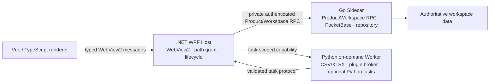
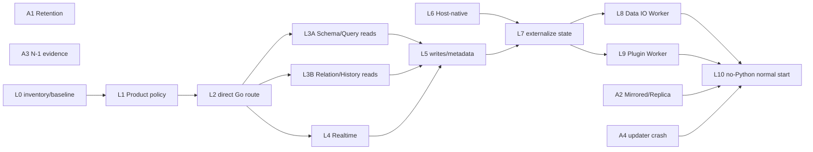

# VibeTable 成熟度收敛与运行时职责演进实施指南

> 制定日期：2026-08-29  
> 当前代码基线：`GitHub/main@9ec0ac8ed5b14b84d4cb40e9851faa670075dc43`  
> 历史审计基线：2026-08-17，`GitHub/main@0149afe7845491c1a25fb5664212361d3469e556`，产品版本 `0.5.1`  
> 状态：Active；用于承接 2026-08-17 成熟度审计中尚未完成的事项，并指导后续运行时职责收敛  
> 适用范围：Windows 10/11 x64 离线优先桌面产品、现行 Vue/WPF/Python/Go 运行时与发布门禁

本文件以用户提供的 2026-08-17 成熟度审计为历史输入，逐项核对当时的功能判断、TD-01～TD-14、
30/60/90 天路线和稳定发布验收清单。它不是把旧审计改一个日期，也不覆盖旧审计当时成立的事实；
它记录旧方案已经完成、部分完成、尚未完成或已经通过 Hidden/Internal 决策收口的内容，并据此形成新的
实施顺序。

现行架构、能力和证据仍分别以以下文件为准：

- [跨进程 seam 索引](../architecture/interprocess-seams.md)
- [能力闭环矩阵](../quality/capability-matrix.md)
- [稳定化台账](../quality/stabilization-ledger.md)
- [产品 E2E 能力索引](../quality/product-e2e-capability-index.md)
- [当前产品 E2E 性能与运行证据](../e2e-performance.md)
- [质量门禁](../quality-gates.md)
- [自我更新能力与安全边界](../self-update-assessment.md)
- [ADR 0011：Workspace 版本采用 N-1 验证策略](../adr/0011-workspace-version-n-minus-one-policy.md)

发生冲突时，事实优先级依次为：当前代码和锁定配置、项目脚本、测试和可信 `main` 报告、现行 ADR、
本文和其他说明文档。

---

## 1. 决策摘要

2026-08-17 审计把 VibeTable 定位为工程化 Beta（M3），其中数据与恢复内核接近 M4，但因真实产品
E2E 17/18、结构化弹窗焦点竞态和证据文档滞后，不具备 release-qualified 状态。该判断在当时是合理的。

截至当前基线，最重要的变化是：

- 结构化弹窗焦点已由固定时点恢复改为受 Grid 生命周期约束的焦点租约，并经过后续键盘与
  Tabulator 重投影回归；
- 当前可信产品证据已推进到 22/22 打包 WPF/WebView2 场景，manifest gap/surplus 均为无；
- Gallery、Kanban、Calendar `date`、Timeline point/date 已形成创建、交互、保存、刷新和重开闭环；
- Dashboard 已覆盖四类面板、筛选、清空、联动/钻取和竞争公开写入的 CAS 冲突；
- Go 已建立 `core` 与 `authority` 两组独立覆盖率门禁，.NET 六个程序集已建立独立 line/branch 门槛；
- 自更新已具备 shell readiness、只读工作区健康确认，以及健康失败、受控新版退出和健康超时的真实打包回退；
- Workspace RPC 已由权威 registry 生成 capability manifest，并由 WPF/Web 消费；
- N-1 版本政策和证据接口已经冻结，但上一正式版本仍是 `pending/unverified`；
- Retention 非零逻辑清理和目录镜像 Workspace 的真实产品闭环仍在开放 PR 中推进。

因此当前不再以“修复一个 P0 后恢复 M4 评估”为唯一主线。新的工作分为两条：

1. **成熟度证据收敛**：完成仍待验证的 Retention、Mirrored/Replica、N-1、更新真实 crash、数据互操作和
   Unicode/locale 等明确边界；
2. **运行时职责演进**：保持技术栈总体不变，但让普通数据请求、共享工作区状态和实时事件逐步从
   `WPF → Python → Go` 收敛为 `WPF → Go`，Python 从常驻混合 BFF 退为按需 Worker。

VibeTable 不需要全面重写。长期 ownership 定义为：

| 技术栈 | 长期职责 |
|---|---|
| Vue 3 / TypeScript | renderer、交互、状态投影、typed bridge consumer；不拥有业务事务和本机路径 |
| .NET WPF / C# | Windows 宿主、WebView2、设备设置、快捷键、文件选择器、path grant、进程、更新与退出生命周期 |
| Go / PocketBase | 业务数据 authority、Product/Workspace RPC、事务、查询、计算、共享元数据、实时事件、恢复与对象仓库 |
| Python 运行时 | 按需 CSV/XLSX、插件 Worker broker，以及未来明确依赖 Python 生态的本地任务 |
| Python 工具链 | 构建、发布、契约生成、QA、E2E 编排；不属于运行时迁移范围 |

阶段目标是：

> 正常启动、打开工作区、建表、查询、编辑、筛选、关系、公式、历史和实时更新的主链路不再经过 Python；
> 导入导出与插件等任务按需启动 Python Worker。

是否最终从发布包移除 Python，不是预设 KPI。只有当 Python Worker 不再必要或已有成熟替代，并且包体、
启动、RSS 和维护收益经同一候选实测成立时，才进入独立决策。

---

## 2. 状态判定规则

本文使用以下状态，避免把“代码存在”“测试通过”和“产品闭环”混在一起：

| 状态 | 含义 |
|---|---|
| **已完成** | 旧目标已经由当前代码、门禁和可信产品证据兑现；后续只做正常维护 |
| **基本完成** | 主要风险已经关闭，但旧目标中的一个明确子项或量化目标仍未兑现 |
| **部分完成** | 已有结构性进展，但仍存在重要生产路径、产品 E2E 或 authority 缺口 |
| **未完成** | 当前代码没有足够证据支持旧目标，或尚未进入实施 |
| **Hidden/Internal 收口** | 不再作为当前用户能力交付；实现保留但 UI、capability 或 renderer route 明确关闭 |
| **已替代** | 旧做法被更明确的现行架构或验收方式替代，不再按原表述继续实施 |

只有 producer、Host/allowlist、Web consumer、capability 条件和真实打包产品场景均成立的范围，才称为
产品闭环。单元测试、组件存在、provider 存在或本地一次运行不等同于完成。

---

## 3. 对 2026-08-17 综合结论的更新

### 3.1 成熟度结论

不继续沿用旧审计的 `7.4/10` 数字评分。两周内功能、门禁和进程恢复发生了大规模变化，继续增加一个新的
小数分数会制造精确性错觉。当前采用状态判断：

- **数据 authority、恢复内核、发布候选绑定和质量门禁：M4 水平；**
- **当前公开且进入能力矩阵的核心产品主链：M4 候选；**
- **整体产品：M3–M4，尚不能称为 M5 稳定生产。**

尚未进入 M5 的主要原因不是当前 `main` 有已知 S0/S1，而是：

- N-1 仍只有政策和静态证据接口，没有上一正式版本的真实 reader/import/零写入执行证据；
- Mirrored/Replica 的完整 packaged journey 尚未进入可信 `main`；
- updater 仍缺新版进程真实 crash 的打包回退证据；
- Retention 非零逻辑清理尚未形成可信主干产品证据，物理 Sweep 与 Apply 仍需保持两阶段结论；
- Product RPC 仍有大面积 Python 中转和多栈手写 registry/allowlist；
- Unicode/locale、PDF 提取和部分互操作组合仍不足以形成长期稳定承诺。

### 3.2 当前已不再成立的旧结论

以下 2026-08-17 判断已经被后续实现或证据替代：

- “当前构建不是 release-qualified，因为产品 E2E 17/18”已经失效；当前权威主干证据为 22/22。
- “能力矩阵停在 16 场、性能基线停在 12 场”已经失效；现行文档绑定 22 场 main 证据。
- “DocumentInspector、DocumentList、WorkspaceView 风险域缺少独立 ratchet”已经显著改善。
- “Go 高覆盖只覆盖三个核心 module”已经失效；当前另有独立 authority 组。
- “更新后无健康确认和自动回退”已经大幅失效；只剩真实 crash 证据。
- “替代视图只有组件和相邻测试”已经失效；四类替代视图已有分范围产品闭环。

以下旧判断仍然成立或只部分改善：

- Product/Workspace RPC 的总体 interface 面积仍大；Workspace 已收敛，Product 仍是主要治理面。
- Python BFF 仍同时承担 Adapter、应用编排、Realtime、Data IO 和插件组合，长期职责需要继续审查。
- 跨版本兼容仍不能作生产级承诺。
- Mirrored/Replica、插件成功升级/回滚/卸载、Calendar/Timeline datetime/range 等仍未全部闭环。
- Unicode/locale 与 PDF 提取器仍缺完整长期资格。

---

## 4. 旧功能域完成度复核

| 2026-08-17 功能域 | 当前完成情况 | 现行结论 | 后续动作 |
|---|---|---|---|
| Workspace 生命周期 | create/open/switch、旧 epoch 拒绝和 Snapshot open-as-new 已闭环；relink 已隐藏；目录镜像仍在 PR #139 | **部分完成** | 合并目录镜像初始化、恢复、capability refresh 和重开产品证据；relink 未重新立项前保持 Hidden |
| Schema、字段、记录 | Schema V2、字段计划/应用、迁移回滚和字段边界校验已强化；版本 policy 已冻结 | **基本完成** | 通过 N-1 正式 corpus 和当前 reader 证明长期兼容，不从 format 字段推断兼容 |
| Query、Formula、Relation/Lookup | revision-bound 查询、cursor、分组、fanout、计算 freshness 和替代视图 mutation 已有局部产品证据；既有 Query/视图声明范围不等于 Formula/Relation/Lookup 作者与跨表计算链闭环 | **部分完成；既有 Query/视图声明范围已完成** | Formula/Relation/Lookup 按[专项资格规范](../quality/formula-relation-qualification.md)保持 Partial/Open 并收敛 Product RPC 中转；Calendar/Timeline datetime/range 作为独立纵切，不扩大既有 date/point 结论 |
| 粘贴、导入、导出 | CSV/JSON 路径稳定，XLSX 导出已公开，公式样文本和 Unicode 往返有跨栈验证 | **部分完成** | 增加 packaged CSV/XLSX 空白、日期/时区、select/relation、NFC/NFD/emoji 和失败原子性矩阵 |
| 文件、附件、历史、Diff | Document Diff、附件历史、CAS stale、文件工作区和键盘交互均已闭环；相关 Web ratchet 已建立 | **基本完成** | 保持大文件预算、取消和 OpenXml 语义；超大文档集合只在有真实瓶颈时扩展 |
| 统一搜索与内容型记录 | WorkspaceSearch、内容型记录、文件/附件/记录搜索已闭环；Emoji codepoint 投影已收紧 | **基本完成** | 保留派生索引可重建原则；PDF 支持范围仍需独立决策和 corpus |
| Snapshot、恢复、审计、保护 | Snapshot、ledger、verify、过期 pin 和真实 Kopia Sweep 已有深层测试；产品仍主要是零删除 Apply | **部分完成** | PR #129 完成非零逻辑清理；物理 Sweep 继续通过 sidecar seam 独立验证，不把 `reclaimedBytes=0` 写成失败 |
| Realtime 与进程恢复 | sidecar kill/reconcile、BFF close/reopen、焦点与旧 scope 退役均强化 | **基本完成** | Realtime 数据流仍经 Python；迁移为 Go→WPF 后重新验证 cursor、去重、epoch 和恢复 |
| Dashboard | 四类面板、布局、筛选、清空、联动/钻取和公开竞争写入 CAS conflict 已进入场景 16 | **基本完成** | 双真实编辑器并发仍待独立产品场景；不阻塞当前单编辑器声明范围 |
| VibeTable 界面 | Interface lifecycle 已进入真实产品场景，content/surface 组合已稳定 | **已完成（当前声明范围）** | 共享元数据最终随 Product authority 收敛迁入 Go；保持 renderer 只消费闭集 |
| 插件 | install/enable/action、授权/拒绝 mutation 和 GitHub 远程安装已闭环 | **Hidden/Internal 收口 + 部分完成** | 成功 upgrade/rollback/uninstall 继续隐藏；若重新公开，需完整生命周期产品证据 |
| 看板/日历/时间线/画廊 | Gallery、Kanban、Calendar `date`、Timeline point/date 已分别闭环 | **基本完成** | datetime、range、泳道内排序等作为新增能力单独立项，不从相邻场景推断 |
| 自更新 | 启动确认、只读 workspace probe、健康失败、受控退出和 health timeout 回退均已打包验证 | **基本完成** | 增加新版进程真实 crash；运行时进程拓扑变化后必须重跑全部 updater smoke |
| 诊断与日志 | lane evidence、失败报告、脱敏字段和当前产品报告治理已明显强化 | **基本完成** | Product RPC 迁移期间统一 correlation，不复制 payload、绝对路径或 secret |

---

## 5. TD-01～TD-14 逐项完成度

| ID | 旧技术债 | 当前状态 | 已完成内容 | 仍需完成/现行处理 |
|---|---|---|---|---|
| TD-01 | WebView2/Tabulator modal 焦点非确定性 | **已完成** | 焦点租约按 row/field identity 与 render 生命周期恢复；scope、窗口失焦、用户移焦和 DOM 替换均有回归；后续 Shift+F10 路径也已稳定 | 作为普通回归维护，不再设置临时重复资格 |
| TD-02 | 能力矩阵/稳定化/性能文档停在 16/12 场景 | **已完成** | 建立生成的 E2E 能力索引，当前证据绑定 `main` SHA、run 和报告契约；现行为 22/22 | 新增场景继续采用 manifest gap→可信 main→evidence-only PR 两阶段流程 |
| TD-03 | 159 个平铺 RPC method 与多栈 registry/allowlist | **部分完成** | Workspace 59 方法已由 registry 生成 capability manifest，WPF/Web 消费生成 public map；contract 生成器和语义检查加强 | Product 约 102 方法仍大量经 Python；需建立 Product ownership/capability policy、Host route 生成和分能力迁移 |
| TD-04 | WorkspaceView/文件 UI/controller 覆盖岛 | **基本完成** | DocumentList、DocumentInspector、WorkspaceView 和 controller cluster 已有独立 line/branch ratchet及键盘/scope/race 回归 | 后续只在新增复杂度时按风险提高门槛，不追求全仓统一 90% |
| TD-05 | 替代视图、Dashboard、更新、mirrored、插件生命周期缺 E2E | **部分完成** | 替代视图和 Dashboard 大部分旧范围已闭环；更新只剩真实 crash；plugin 成功 lifecycle 已明确隐藏 | Mirrored 由 PR #139 完成；plugin 隐藏能力若重新公开需新纵切；datetime/range 不属于旧范围自动完成 |
| TD-06 | Go 高覆盖仅覆盖三个核心 module | **已完成** | `.ci/project.json` 已定义 `core` 与 `authority` 两组独立 line/branch/diff 门禁，authority 覆盖 filehistory/restore/query/mutation | 新迁入 Go 的 Product 模块必须进入合适分母，禁止聚合掩盖 |
| TD-07 | PreviewHost/Desktop 覆盖余量有限 | **基本完成** | 六个 .NET 程序集均独立接入中央 line/branch 门禁；Desktop 提升到 63/53，Workspace/Infrastructure/OpenXml/Contracts 均独立计量 | PreviewHost line 仍为 41，尚未兑现旧路线中的 45→50；只在新增该模块行为时继续提高 |
| TD-08 | 跨版本 workspace 升级不在门禁 | **部分完成** | ADR 0011、closed policy/schema、append-only corpus anchor 和 package identity 已建立 | v0.5.0 仍是 pending/unverified；需真实正式产物、当前 reader/import/零写入证据和显式 promotion |
| TD-09 | 本地 uv/npm/.NET 工具链不可复现 | **基本完成** | README 已提供 `doctor --profile minimum/full`，锁定 Python/Node/.NET/Go，构建脚本统一工具解析；依赖和 CodeQL 已升级 | 仍需用干净 Windows 环境周期性验证 doctor→bootstrap→build，不把单机已有缓存当证据 |
| TD-10 | 18 场性能基线缺失、Web chunk 偏大 | **部分完成** | 当前已有 22 场性能证据和 100k records/10k files/20 GiB release qualification | 持续趋势/nightly profile 尚无稳定证据；Vite chunk warning 仍存在，必须用 WebView2 cold-start/RSS 证明拆包收益后再改 |
| TD-11 | 更新后无健康确认/自动回退 | **基本完成** | shell readiness、workspace probe、health failure、受控退出和 health timeout 均有真实打包回退 | 新版进程真实 crash 仍未覆盖；受控正常退出不能替代 crash 结论 |
| TD-12 | Unicode/locale/路径组合矩阵薄弱 | **部分完成** | 搜索区分 Emoji/ZWJ codepoint，Data IO 覆盖 NFC/NFD/emoji，Dashboard 文件名处理 Windows 保留设备名；跨时区显示已有回归 | RTL、locale case、更多 CSV/XLSX 日期/时区、长路径和完整 packaged 矩阵仍待补齐 |
| TD-13 | 自研 PDF 文本提取器格式覆盖与维护成本 | **未完成** | 当前未找到足以关闭该项的独立替代、支持范围 policy 或代表性 corpus 证据 | 先建立支持子集、拒绝语义和 corpus；再比较保留自研解析与成熟离线 adapter，禁止无证据重写 |
| TD-14 | npm deprecated lucide/glob/pending install script 噪音 | **基本完成** | Node 与主要 Web 依赖已系统升级，Lucide 已迁移到现行包线，锁文件和构建可复现 | 只处理当前安装实际报告的剩余传递警告；不为消除日志盲升依赖或放宽 install script 策略 |

### 5.1 旧 TD 的总体结论

- 已完成：TD-01、TD-02、TD-06。
- 基本完成：TD-04、TD-07、TD-09、TD-11、TD-14。
- 部分完成：TD-03、TD-05、TD-08、TD-10、TD-12。
- 未完成：TD-13。

“基本完成”不等于删除台账；它表示旧问题的主要风险已经关闭，剩余子项应进入相邻模块正常演进，
不再单独发起大规模清债项目。

---

## 6. 对旧 30/60/90 天路线的完成度复核

旧路线按时间窗口组织。新方案不再使用日历承诺，而按依赖和可并行性组织；下表只用于核对旧目标。

### 6.1 原 0–30 天目标

| 旧目标 | 当前状态 | 说明 |
|---|---|---|
| 修复结构化 modal 焦点并恢复 main 绿色 | **已完成** | 焦点租约和后续键盘回归已进入主干 |
| 场景 04 独立重复稳定性资格 | **已替代/完成** | 根因关闭后恢复单次 required；不长期保留重复测试制造成本 |
| 同步 capability、stabilization、seams、quality 和性能证据 | **已完成** | 当前绑定 22 场主干报告，生成器检查 freshness |
| 为 DocumentList/Inspector、Workspace controller、PreviewHost 建 ratchet | **基本完成** | Web 风险域与六个 .NET 程序集均有门禁；PreviewHost line 尚未提高到 45/50 |
| 增加 Windows doctor | **已完成** | minimum/full 只读检查已成为 README 开发入口 |

### 6.2 原 31–60 天目标

| 旧目标 | 当前状态 | 说明 |
|---|---|---|
| 替代视图和 Dashboard 深交互 E2E | **基本完成** | 四类替代视图和 Dashboard 主要旧范围已闭环；datetime/range、双真实编辑器仍是独立增量 |
| CSV/XLSX 产品 E2E | **部分完成** | XLSX 已公开并补语义/Unicode测试，完整 packaged 多 locale/字段矩阵仍缺 |
| 扩大 Go `-coverpkg` | **已完成** | authority 独立组已建立 |
| 生成 RPC registry/allowlist | **部分完成** | Workspace 完成，Product 待实施 |
| 建立 nightly 50k/5k/2GiB 趋势 | **部分完成** | 更高的 release qualification 已存在，但没有稳定 nightly 趋势和连续回退策略证据 |
| 更新后健康确认与包回退 | **基本完成** | 仅真实 crash 仍缺 |

### 6.3 原 61–90 天目标

| 旧目标 | 当前状态 | 说明 |
|---|---|---|
| 冻结 workspace/schema/snapshot policy 与 N-1 contract | **部分完成** | policy/contract 已冻结，执行证据与 promotion 未完成 |
| Retention 非零删除 | **进行中** | PR #129 增加非零逻辑删除；物理 Sweep 独立验证 |
| Mirrored/Replica | **进行中** | PR #139 正在闭环目录镜像初始化和恢复 |
| Plugin upgrade/rollback/uninstall | **Hidden 收口** | 未公开，不阻塞当前首版；重新公开需新产品纵切 |
| Unicode/locale/长路径矩阵 | **部分完成** | 已补 Emoji、NFC/NFD、保留名和时区子集，未形成完整矩阵 |
| PDF 提取器决策 | **未完成** | 保留为明确研究与资格项 |
| Release 100k/10k/5GiB | **已完成并超过旧规模** | 当前 release qualification 已覆盖 100k records、10k files、20 GiB |

---

## 7. 对旧“稳定发布验收清单”的当前判断

| 旧验收项 | 当前状态 | 新结论 |
|---|---|---|
| `main required` 成功，18/18 E2E，无 unexpected failure/pending | **已完成并升级** | 当前权威证据为 22/22；新增场景继续按当前报告契约验收 |
| 当前 SHA 的 capability、稳定化和性能证据同步 | **已完成** | 继续通过生成器和 evidence-only PR 维护 |
| modal 焦点稳定重复通过 | **已完成** | 不再作为单独发布阻断 |
| Python/Web/Go/.NET 风险覆盖 ratchet | **基本完成** | Go/.NET/Web 已强化；Python 尚无独立 branch ratchet，不因此伪报全项完成 |
| nightly/release 容量不超预算 | **部分完成** | release profile 强，nightly 趋势不足 |
| 更新健康失败恢复旧包 | **基本完成** | health failure/timeout 已完成，真实 crash 尚缺 |
| 至少一个 N-1 成功和失败零写入证据 | **未完成** | 当前最明确的 1.0 前兼容阻断 |
| 所有公开 capability 有闭环或 Hidden/Internal | **基本完成** | 治理机制已建立；Mirrored 的公开范围随 PR #139 结果更新，plugin lifecycle 保持 Hidden |

因此，当前可以对“现行主干核心功能具备候选级工程质量”作内部判断，但不能对“长期数据兼容、全部存储模式和
所有故障形态均达到稳定生产”作扩大承诺。

---

## 8. 当前剩余成熟度工作

### A1：Retention 非零逻辑清理与物理 Sweep 分层证据

当前开放 PR #129 负责：

- 新增独立 packaged 场景，不改写已经可信的零删除场景；
- 通过真实设置 UI 构造非零候选；
- 证明 `retention.apply` 提交逻辑 tombstone，目标 Snapshot 从产品可达集合移除；
- 证明 Apply 当轮 `reclaimedBytes=0` 是 90 天 grace 的预期行为，而不是“未删除”；
- 通过二次 plan/apply 证明逻辑候选已经清空。

后续独立工作负责：

- 使用 sidecar `Sweep`、受控 Clock 和真实 Kopia repository 证明 grace 后物理退休；
- 保持产品 Apply 和物理 Sweep 两种报告、审计和故障语义分离；
- 不增加生产 test-only 时钟参数，也不通过直接改 SQLite 跳过领域接口。

### A2：目录镜像 Workspace/Replica 产品闭环

当前开放 PR #139 负责：

- replica one-shot 初始化执行正式 migrations；
- replacement sidecar Ready 后重新获取并验证 capability snapshot；
- refresh 失败保留最后一份已验证 capability，不先清空再读取；
- bootstrap capture 绑定目标 workspace、request、session 和模式；
- activity root、root-level `files` 与恢复对象路径一致；
- 真实 Workspace Center 创建目录镜像、释放活动缓存、同 UUID 重开、sidecar kill 后 table+replica 恢复。

合并后仍需明确：

- 手动 `replica.synchronize` 是否继续 Internal only；
- offline/reconnect、同步冲突和 exclusive-writer 资格是否属于下一公开范围；
- mirrored capability 只按真实产品场景范围广告，不从内部 hook 推断用户能力。

### A3：N-1 正式兼容证据

按 ADR 0011 分阶段实施：

1. **Producer PR**：从正式 v0.5.0 Release 产生代表性 workspace archive、SnapshotPackage 和拒绝输入；
2. **Anchor PR**：producer 合并到正式 remote main 后，推进 append-only anchor 和冻结计数；
3. **Consumer PR**：当前候选执行 workspace.open、snapshot.import 的 read-or-migrate，以及 reject-zero-write；
4. **Promotion PR**：只有机器执行证据成立后，显式启用 verification gate 并将 target 从 pending 提升为 verified；
5. **Package smoke**：包内 policy、schema、corpus、release identity 与 source tree 一致。

不得把当前 writer 重新生成的 fixture、同步修改 checksum、schema 通过或 `minimumAppVersion` 调整当作 N-1 证据。

### A4：新版进程真实 crash 回退

现有 smoke 已覆盖成功、workspace health failure、受控退出和 health timeout。剩余场景必须：

- 让新版宿主以真实异常退出形态终止，而不是消费正常 close request；
- 由进程外 watchdog 识别本次 attempt 的 PID、启动时间、nonce 和 owned Job；
- 在完整进程组为空后恢复旧包；
- 验证 terminal receipt、旧版 readiness、未知安装根文件和外部用户数据不变；
- 若后续默认启动不再包含 Python，更新 owned member 形状和 smoke oracle 后重新运行全部更新场景。

### A5：数据互操作和 Unicode/locale 资格

按固定 corpus 建立 CSV/XLSX 跨栈矩阵：

- blank、`0`、`false`、空文本、空容器和公式样文本；
- `date`、`datetime`、时区和 Excel serial 边界；
- select、relation、lookup、JSON 和系统字段；
- UTF-8 BOM、NFC/NFD、Emoji/ZWJ、CJK、RTL 和 locale case；
- Windows 保留名、长路径和 grant 失效；
- preview/apply token、取消、失败原子性和输出临时文件清理。

先在 source-built sidecar integration 冻结 codepoint 和 authority 语义，再选择少量代表性组合进入 packaged E2E，
避免把完整笛卡尔积塞进真实 UI 场景。

### A6：PDF 提取能力决策

该项继续保留，但不直接启动替换项目。先交付：

- 明确的 PDF 支持子集和拒绝语义；
- 代表性 corpus：文本层、字体编码、对象流、损坏文件、超限文件和无文本扫描件；
- CPU、内存、输出大小和取消预算；
- 解析失败不污染权威数据，派生搜索索引可重建；
- 自研实现与成熟离线 adapter 的可维护性、许可证、包体和行为对比。

只有 corpus 证明现实现无法满足声明范围，才进入替换 ADR。

---

## 9. 编程语言与运行时职责演进

### 9.1 当前语言使用判断

现行四栈并非不合理：

- Vue/TypeScript 适合复杂表格与 WebView2 renderer；
- WPF/C# 适合 Windows-only 宿主和本机能力；
- Go 与 PocketBase、SQLite、对象仓库、恢复和并发 authority 天然一致；
- Python 快速建立了 BFF、Data IO、插件和自动化能力。

问题不是“语言多”，而是 Python 常驻进程目前混合了五种性质不同的职责：

1. Product RPC 参数/结果投影和 HTTP Adapter；
2. Realtime SSE、cursor reconcile 和事件二次转发；
3. shared metadata、Dashboard、Surface/Content 等应用编排；
4. CSV/XLSX、任务、preview token 和文件格式 Worker；
5. 插件 registry、Node Worker broker、交互和文件 capability 协调。

其中 1～3 大量位于普通工作区热路径，长期应按 authority 重新归属；4～5 具有明确按需 Worker 价值。

### 9.2 Ownership 分类

建立 machine-readable inventory，每个生产 RPC、通知和状态对象只能属于一个主分类：

| 分类 | Owner | 判定规则 |
|---|---|---|
| `GO_AUTHORITY` | Go | 涉及业务数据、事务、revision、幂等、共享 workspace 状态、计算、事件 cursor、恢复 |
| `HOST_NATIVE` | C# | 涉及 Windows、WebView2、设备设置、快捷键、原生 picker、绝对路径、path grant、进程和更新 |
| `PYTHON_WORKER` | Python | 文件格式、插件 broker、Python-only 库或明确的短生命周期本地任务 |
| `TEMPORARY_BFF` | 迁移中 | 只做校验、投影、HTTP 转发或重复错误映射，且已有明确目标 owner |
| `PYTHON_TOOLING` | Python | 构建、发布、QA、生成器、E2E、脚本；不进入运行时迁移 |

Inventory 至少记录：method/event、当前路径、目标 owner、状态持有位置、authority、写入性、取消/超时、
当前产品场景、目标 PR 和删除条件。

### 9.3 目标拓扑

正常工作区打开时，Host 只需要启动和验证 Go sidecar。Python Worker 在用户执行导入、导出、模板、插件或
其他明确任务时启动；任务结束后允许退出，不能保存跨进程生命周期唯一状态。

### 9.4 明确不做

- 不发起“所有 `.py` 改成 Go”的大爆炸重写；
- 不迁移 Python 构建、发布、生成和 QA 工具；
- 不为单一语言重写已经成熟的 OpenPyXL 行为；
- 不把 Windows-specific 能力塞入 Go；
- 不让 WPF/Web 直写 SQLite、Kopia 或内部 metadata 表；
- 不在生产双写 Python 和 Go；
- 不提供“Go 失败自动回落 Python”的长期隐式路径；
- 不以减少进程数为由放宽 session/epoch/fence、取消、稳定错误或更新回退；
- 不在没有基线测量时承诺启动、RSS、延迟或包体收益。

---

## 10. 运行时演进工作包

### L0：建立 ownership inventory 与性能基线

交付：

- machine-readable Product RPC/event/state inventory；
- 当前冷启动、workspace open、首表、普通 RPC p50/p95、Python/Go/WPF idle RSS、包内组件体积；
- sidecar/BFF kill、关闭/重开的恢复时间和进程清理；
- 删除测试：标出 Python 仅转发的路径与具有真实业务价值的路径。

退出条件：每个运行时 method/event 有且只有一个目标 owner，未知项不能进入迁移 PR。

### L1：建立 Product capability/routing policy

以 Workspace capability manifest 为参考，为 Product RPC 建立：

- method、scope、audience、owner、write/read、notification 和 capability ID；
- 生成的 TypeScript method type、WPF route/allowlist、Go/Python registry adapter；
- closed schema、freshness test、重复/缺失/未知字段拒绝；
- `pythonBff`、`goSidecar`、`hostNative`、`pythonWorker` 等闭集 route owner。

此阶段只建立 policy 和消费者，不切换业务方法。

### L2：WPF 按方法直达 Go 的基础设施

- 在现有 private loopback、session secret、workspace/session/fence identity 上增加 Product Go gateway；
- 复用稳定 request ID、取消、超时、错误 envelope 和大小预算；
- Router 只读取生成 policy，不维护第二份手写集合；
- 增加仅测试的 parity harness，但生产只能选择一个 route；
- 默认所有现有 Product 方法仍指向 Python，保证基础设施 PR 行为保持。

### L3A：迁移 Schema/Query 只读纵切

首批建议：

- `schema.list`
- `schema.getTable`
- `schema.describe`
- `query.page`
- `query.cursorOpen`
- `query.cursorFetch`
- `query.selectionOpen`
- `query.view`
- `query.readRows`

每个纵切要求：

- Go 返回与权威 Product contract 完全一致的结果；
- Python/Go parity corpus 覆盖成功、非法输入、稳定错误和 Unicode；
- WPF 按 policy 切换，随后删除对应 Python route；
- 至少一条真实产品场景走新路径；
- 禁止保留生产 fallback。

### L3B：迁移 Relation/Lookup/History/File 只读纵切

可与 L3A 分支并行开发，但按最新 main 串行合并和重生成 catalog：

- Relation/Lookup 描述与分页；
- history list/preview；
- attachment/file metadata 读取；
- Formula/Field capability 描述；
- 共享 schema projection。

复杂投影必须进入 Go Product Adapter 深模块，不把 renderer DTO 泄漏到 query/restore 核心包。

### L4：Realtime 改为 Go→WPF

- Go 持有事件 cursor、去重、reconcile 和 authority revision；
- WPF 持有连接代际、session/epoch 和向 renderer 的通知生命周期；
- 删除 Python SSE supervisor、latest revision cache 和二次事件包装；
- 验证 sidecar recycle、cursor gap、duplicate、ABA、旧 epoch late event、正常关闭和端口清理；
- 场景 10 必须在新路径通过。

### L5：迁移权威写入与共享工作区元数据

在只读和 Realtime 稳定后，按完整能力纵切迁移：

- FieldChange、Mutation、Formula；
- Relation/Lookup 写入；
- row/history restore；
- Dashboard、Preset、Version、Surface、ContentProfile、RecordDocumentLink 等共享 workspace metadata。

规则：

- 写路径绝不 shadow/double-write；
- plan/apply token、revision、idempotency 和 audit receipt 由 Go authority 持有；
- 每次只迁一个可回滚能力组；
- 旧 Python route 在切换 PR 内删除或明确标记为下一紧邻 PR 的删除项，不长期双轨。

### L6：Host-native 能力归 C#

从 Python composition root 中识别并迁移：

- device settings；
- shortcut 和 command launch；
- path grant registry 与原生 picker 协调；
- Windows 文件名、路径和设备能力；
- 只属于本机进程生命周期的 task/notification。

共享 workspace 设置仍归 Go；C# 只持设备级状态和 capability，不形成第二业务数据 authority。

### L7：迁出 Python 内存唯一状态

在 Python Worker 化前，先迁出：

- paste/import preview token；
- task snapshot、取消状态和进度 authority；
- plugin installation/task identity；
- confirmation/file interaction 的 pending state；
- Realtime cursor 和 shared metadata revision。

目标 owner 按性质选择 Go 或 C#。Worker 可持有短暂执行上下文，但进程退出后不能令用户已确认计划永久失效，
除非协议明确把任务结算为失败并可重新 preview。

### L8：Data IO 改为按需 Python Worker

保留 Python 在以下方面的价值：

- OpenPyXL 读取/写入和模板；
- CSV/XLSX 容器语义；
- 流式临时文件和原子替换；
- 文件格式诊断。

Worker 协议必须：

- 使用 Host 发放的 task-scoped grant，不接收任意路径；
- 只处理原始单元格/输出，不拥有字段转换、约束、事务和业务 revision；
- 支持取消、超时、进度、Worker crash 和残留临时文件清理；
- 任务完成或空闲后可退出；
- packaged E2E 验证正常、失败和进程终止。

### L9：Plugin broker 改为按需 Python Worker

- Node 插件继续短生命周期隔离；
- Go 持 mutation authority、catalog/audit 的共享工作区状态；
- WPF 持用户确认、文件选择和本机 capability；
- Python Worker 只负责 package/Node 执行编排与受控结果解析；
- Worker crash 必须结算 task，并保证 mutation 未经确认不会提交；
- 成功 upgrade/rollback/uninstall 若仍 Hidden，不因 Worker 化自动公开。

### L10：普通启动不再依赖 Python

只有 L3～L9 的目标状态完成后才能实施：

- workspace open 不启动常驻 Python；
- readiness 与 update health 不再把 Python 视为普通主链必需成员；
- Worker 第一次按需启动失败时给出稳定可恢复错误；
- 更新、自恢复、Job Object、正常退出、托盘和静默启动重新验收；
- 对比 L0 基线，诚实记录收益或无收益。

### L11：是否从发布包移除 Python

这是独立 ADR，而非自动结果。只有满足以下条件才讨论：

- Data IO 和 Plugin 已有非 Python 成熟替代，或产品决定删除相应能力；
- 同等 CSV/XLSX/插件 corpus 全通过；
- 包体、启动、RSS 或维护收益显著且可复现；
- 不降低用户能力、诊断和开发效率。

否则继续捆绑按需 Python Worker也是合理架构。

---

## 11. 依赖关系与可并行实施

### 11.1 总体依赖图

A1、A2、A3、A4 与 L0/L1 的大部分设计和相邻实现可以并行，但共享生成物和进程拓扑的合并必须串行。

### 11.2 当前即可并行的轨道

| 轨道 | 可并行工作 | 不能同时修改/合并的区域 |
|---|---|---|
| Retention | PR #129 产品场景；物理 Sweep 的 Go 测试设计 | E2E manifest、生成能力索引和证据页需按最新 main 重生成后串行合并 |
| Mirrored/Replica | PR #139 初始化、恢复、capability refresh | `ProductionWorkspaceRuntime`、workspace capability、场景 15/manifest 与其他进程拓扑 PR 串行合并 |
| N-1 | 正式旧版 corpus 采集、producer interface、consumer harness 设计 | policy anchor/promotion 必须按 producer→anchor→consumer→promotion 顺序合并 |
| Updater crash | 独立 crash harness 与 receipt oracle | 与 L10 进程成员形状变化不能同时合并；L10 后必须重新跑 smoke |
| Product migration groundwork | L0 inventory/measurement、L1 policy/schema/生成器 | Product catalog、WPF route registry 和生成物变更只允许一个权威分支依次合并 |
| Data IO/Plugin | Worker 协议设计、corpus、任务状态梳理 | L7 前不得改变生产生命周期；两个 Worker 实现可在 L7 合并后并行 |
| Host-native | device/shortcut/path grant ownership 设计与相邻 C# 测试 | `backend/__main__.py`、WPF composition root 的删除接线需与 L5/L7 串行 |

### 11.3 L2 合并后可并行的代码纵切

以下可由不同 owner 在独立 worktree 开发：

- Schema/Query 只读；
- Relation/Lookup/History 只读；
- Realtime；
- Host-native device settings/shortcut；
- Data IO corpus 和 Worker harness；
- Plugin Worker harness。

但 Product 方法迁移会共同触碰以下权威热点，最终必须重基并串行合并：

- `contracts/v1/`、Product RPC catalog/policy 和生成物；
- `desktop/src/.../ProductDataRpcRegistry*`、WebMessageRouter 或 Product gateway；
- `sidecar/internal/app/` 与 Product route registration；
- `backend/__main__.py` 和 Python route registry；
- `tests/e2e/pocketbase_product_scenarios.json`、生成的能力索引和证据文档。

每个后合并分支必须：

1. 重基最新 `main`；
2. 运行仓库生成器；
3. 重新执行 freshness/contract tests；
4. 不手工拼接生成 JSON/TypeScript/C# 文件；
5. 重新确认 manifest gap 和可信 main 证据边界。

### 11.4 必须串行的事项

- N-1 producer、anchor、consumer、promotion；
- 写 authority 的每个能力切换；
- Python 内存状态迁出与 Worker lifecycle 启用；
- 普通启动移除 Python与 updater/process membership 调整；
- 同一 Product method 的 route policy、WPF consumer 和旧 Python route 删除；
- 当前 E2E 证据页更新：只能在对应功能进入可信 `main` 后单独更新；
- 版本准备、policy promotion 和正式 Release。

---

## 12. 建议 PR 切片

每个 PR 只表达一个完整意图，可独立回滚。推荐切片如下；编号表示依赖，不是发布日期：

### 成熟度线

1. Retention 非零逻辑清理产品场景（现 PR #129）。
2. Retention 物理 Sweep 领域证据。
3. Mirrored/Replica 初始化与恢复（现 PR #139）。
4. Mirrored 后续 offline/conflict 范围决策：公开、Hidden 或新纵切。
5. N-1 正式 corpus producer。
6. N-1 anchor 前移。
7. N-1 当前 reader/import/零写入 consumer。
8. N-1 policy promotion。
9. updater 真实 crash packaged smoke。
10. CSV/XLSX/Unicode 代表性 packaged corpus。
11. PDF 支持范围与 adapter 评估 ADR。

### 运行时职责线

1. Product ownership inventory 与基线报告。
2. Product capability/routing policy 与生成器。
3. WPF→Go Product gateway 基础设施，默认不切流。
4. Schema/Query 只读纵切。
5. Relation/Lookup/History 只读纵切。
6. Realtime Go→WPF 纵切。
7. Mutation/FieldChange/Formula 写入纵切。
8. Shared metadata 纵切。
9. Host-native settings/shortcut/path grant 纵切。
10. Preview token/task/plugin pending state 迁出 Python。
11. Data IO on-demand Worker。
12. Plugin on-demand Worker。
13. 普通 workspace 启动不再拉起 Python。
14. 进程拓扑后的 updater、lifecycle、E2E 与性能证据同步。

不要把 4～13 合并成一个“Go rewrite”PR。读、写、Realtime、Host-native 和 Worker lifecycle 的失败边界不同，
必须分别验收。

---

## 13. 每个迁移 PR 的固定模板

### 13.1 设计说明

PR 必须说明：

- 当前 owner 和目标 owner；
- 用户可见行为是否变化；
- authority、session/epoch/fence、revision、idempotency、取消和错误码；
- 哪些状态迁移，哪些保持不变；
- 旧代码删除范围；
- 回退方式；
- 适用的能力矩阵和产品场景。

### 13.2 测试要求

最小顺序：

1. contract/generator freshness；
2. 目标语言相邻单元和集成测试；
3. Python/Go 只读 parity corpus（仅迁移期测试）；
4. WPF gateway/router/取消/错误测试；
5. Web consumer 测试和 build；
6. 完整目标栈覆盖率门禁；
7. 至少一个真实打包产品场景；
8. 涉及进程、更新或打包时运行 release build/smoke；
9. PR `required` 和 CodeQL。

### 13.3 切换完成条件

- policy 中只有一个生产 owner；
- 旧 route、allowlist、错误映射和无消费者代码删除；
- 不存在运行时 fallback；
- capability 和 UI 可见性不扩大；
- 产品场景报告无 unexpected failure/pending；
- 相关进程正常退出，无后代或端口残留；
- 文档只在可信 main 后更新完成证据。

---

## 14. 回退与停止条件

出现以下任一情况时，停止扩大迁移范围：

- 同一写入可能由 Python 和 Go 同时提交；
- parity 差异涉及 blank/zero、revision、排序、Unicode codepoint、错误码或权限；
- route owner 无法由 machine-readable policy 唯一判断；
- Worker crash 后任务、preview token 或确认状态处于未知状态；
- sidecar recovery 后 Host capability 与实际进程代际不一致；
- updater 无法证明 owned process group 为空；
- 新路径只能靠 sleep、宽泛 retry、吞错或降低门禁变绿；
- 包内 policy/catalog 与 source tree/release identity 不一致。

回退采用 Git revert 和重新构建候选，不在运行时隐藏切回 Python。需要短暂迁移开关时，必须是内部构建期 policy，
有明确删除 PR，不成为用户设置或永久 feature flag。

---

## 15. 新方案的完成定义

### 15.1 旧审计剩余事项完成

- PR #129 的非零 Retention 产品证据进入可信 main；
- 目录镜像 Workspace 的声明范围进入可信 main，或明确保持 Hidden/Internal；
- updater 真实 crash 回退打包通过；
- N-1 target 取得真实 reader/import/零写入证据并按 policy 显式 promotion；
- CSV/XLSX/Unicode 代表性 corpus 通过；
- PDF 支持范围和继续自研/替换决策有可执行 ADR；
- 当前能力矩阵、稳定化台账和 E2E 证据无漂移。

### 15.2 运行时职责收敛完成

- 普通工作区主链 Product RPC 由 WPF 直达 Go；
- Realtime 不再经 Python；
- shared workspace metadata 与写入 authority 位于 Go；
- device/path/process 能力位于 C#；
- Python 不持有跨生命周期唯一业务状态；
- CSV/XLSX 和插件按需启动 Worker；
- 正常 workspace 打开不要求 Python ready；
- 所有旧 BFF route、registry 和无消费者代码删除；
- updater、正常退出、故障恢复、E2E 和性能基线已按新进程拓扑重验。

### 15.3 M4/M5 声明边界

可进入 M4 候选评估至少需要：

- 最新 main `required` 成功；
- 当前 manifest 全部场景通过，无 unexpected bridge failure/pending；
- 无未处置 S0/S1；
- 所有公开 capability Closed，或明确 Hidden/Internal；
- 当前发布包 identity、SBOM、smoke 和恢复边界通过。

对 M5/1.0 稳定生产作承诺还需要：

- N-1 兼容证据；
- 所有广告的存储模式和更新失败形态具备真实产品/打包证据；
- 容量、Unicode/locale、长期恢复和数据升级边界有持续证据；
- 运行时职责不会产生双 authority、隐式 fallback 或无法恢复的 Worker 状态。

---

## 16. 建议的立即执行顺序

1. 保持 PR #129 与 PR #139 独立开发，先达到完整门禁者先合并；后合并者重基并重新生成 E2E 派生产物。
2. 两项进入 main 后，用独立 evidence PR 更新能力矩阵、性能/场景证据和本方案状态，不在功能 PR 中提前写成完成。
3. 与上述工作并行完成 L0 ownership inventory、当前进程/RSS/RPC/包体基线和 L1 Product policy 设计。
4. 在 L1 合并后实现 L2 WPF→Go 基础设施，保持默认路由不变。
5. 并行开发 L3A、L3B、L4 和 L6，但重基后按共享 catalog/router 冲突串行合并。
6. 只读和 Realtime 稳定后迁移写入与 shared metadata，再执行 L7 状态迁出。
7. L7 完成后并行实施 Data IO Worker 与 Plugin Worker。
8. 最后实施普通启动不拉起 Python，并重新运行 updater crash、全部更新 smoke、生命周期、产品 E2E 和性能基线。
9. Python 是否从发布包移除留给独立 ADR，不作为本轮完成条件。

该顺序允许成熟度补证和语言演进同时推进，又避免在同一时间改动数据 authority、进程拓扑、更新器和产品证据
四个高风险边界。
