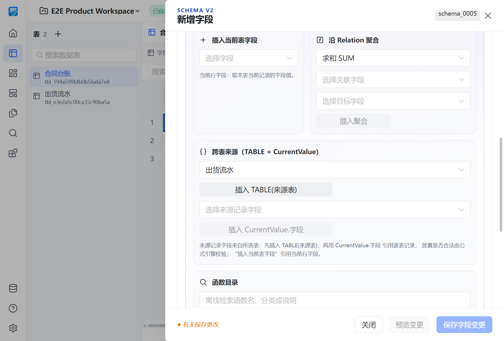
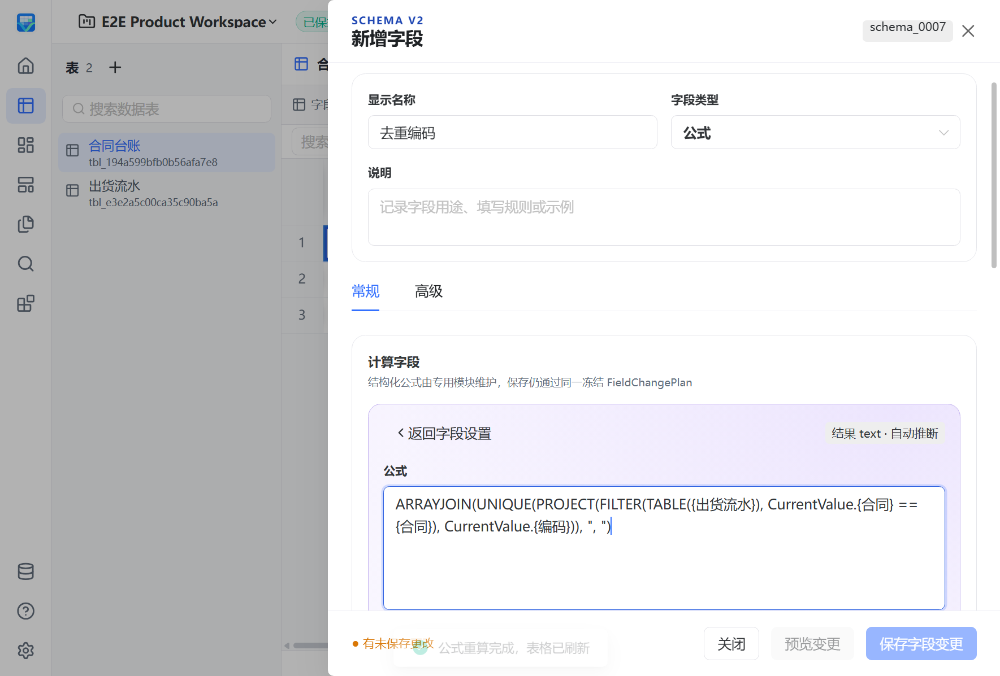
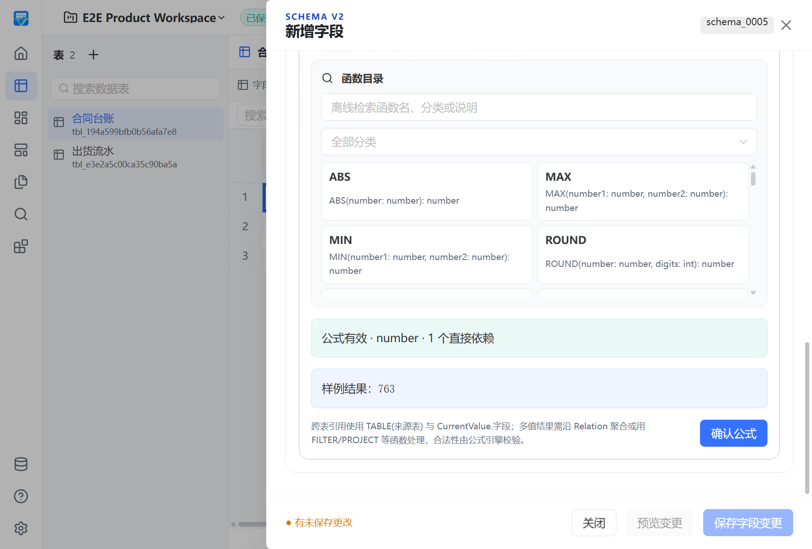

# 集合与跨表公式

在公式工作台选择来源表，插入 `TABLE({出货})`，再选择来源字段插入 `CurrentValue.{金额}`。来源字段只在 FILTER、PROJECT、SUMIF、COUNTIF 的谓词或投影位置有效；裸 `{合同}` 始终指当前行，即使来源表也有同名字段。编辑器显示名称，保存时由 Go 绑定稳定表、字段 ID；改名不重新按名称猜引用，失效引用显示 `#REF!`。

## 可复制的表达式

当前行需要“合同”“开始日期”“结束日期”，来源表“出货”需要“合同”“状态”“金额”“编码”“日期”。可把名称替换为工作区实际字段。

```text
SUMIF(TABLE({出货}), CurrentValue.{合同} == {合同} && CurrentValue.{状态} == "已发货", CurrentValue.{金额})
COUNTIF(TABLE({出货}), CurrentValue.{合同} == {合同} && CurrentValue.{状态} == "已发货")
ARRAYJOIN(UNIQUE(PROJECT(FILTER(TABLE({出货}), CurrentValue.{合同} == {合同}), CurrentValue.{编码})), ", ")
SUMIF(TABLE({出货}), CurrentValue.{日期} >= {开始日期} && CurrentValue.{日期} <= {结束日期}, CurrentValue.{金额})
```

`SUMIF(range, predicate, field)` 等价于 `SUM(PROJECT(FILTER(range, predicate), field))`；`COUNTIF` 等价于筛选后的 COUNT。Relation 记录范围可用 `PROJECT({明细}, CurrentValue.{金额})`；返回列表的 Lookup 可直接用 `SUM({查找金额})`。单值 Lookup 仍是标量，不能当列表。

这组表达式覆盖相应飞书场景；飞书的中括号引用、链式属性写法和完整函数语言需要转换，不直接兼容。

## 值与顺序

| 函数 | 空值与结果 |
|---|---|
| SUM | 只接受数值列表，忽略 null；空列表为 0。 |
| AVERAGE / MIN / MAX | 忽略 null；没有数值时返回 null。MIN/MAX 原有双数值重载保持。 |
| COUNT | 元素或记录数，包含 null。结果为整数；与 double 算术混用时显式转换，例如 `double(COUNT(range))`。 |
| COUNTA | 排除 null 和空字符串，0 和 false 仍计数。 |
| UNIQUE | 保留首次出现顺序；null 与空字符串各自保留一次。 |
| ARRAYJOIN | 按给定分隔符连接；null 产生空项，0、false 不丢弃。 |

TABLE 按稳定记录 ID 顺序读取完整集合；Relation 保留成员顺序，Lookup 保留完整集合顺序，均不受网格分页影响。结果可以是一维同型列表，元素限 number、bool、text、dateTime，可含 null。顶层记录、嵌套列表、混合元素及标量冒充列表会被拒绝。日期列表保留 timestamp 语义，显示或拼接时使用规范日期文本。列表不是拆分字符串模拟的结果。

## 执行边界

新集合表达式使用 `cel-v2`。旧 `cel-v1`、Relation 快捷聚合及 path Lookup 保持原义；旧客户端须拒绝未知语言。结果类型由服务端推断，列表以 JSON 结果加 `resultElementType` 表达，客户端不能指定推断结果。

每个范围最多一层 FILTER，PROJECT 只选择静态字段，谓词不能再执行集合运算。动态表名、动态索引、用户 comprehension、外部数据和任意 SQL 不开放。

基础字段的完整类型化比较可下推既有查询；日期、计算字段和不能等价下推的谓词在 Go 内有界执行。只读取引用列、固定大小来源页，同一次求值复用相同来源请求；不会把整张来源表传给前端。不同当前行的结果不使用跨修改缓存。

仍使用原有上限：源码 4096 bytes、AST 512 节点、递归 64、物化 32 MiB、CEL cost 10000、单次求值 50 ms。取消和资源错误不会被 IFERROR 转成成功值。数值溢出和除零仍遵循[数值语义](formula-numeric-semantics.md)，日期与时钟遵循[日期公式](formula-date-clock.md)。

## 正式界面验证

真实 WPF/WebView2 场景 S37 使用 165 行合成来源数据，覆盖条件求和、计数、去重编码拼接和日期窗口；三行台账与同条件 Lookup、网格和 CSV 对齐独立 oracle，并验证来源变更、重命名及关闭重开。






