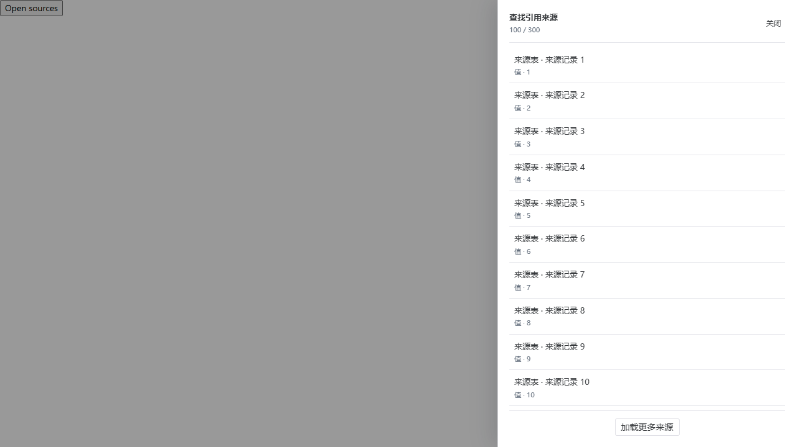
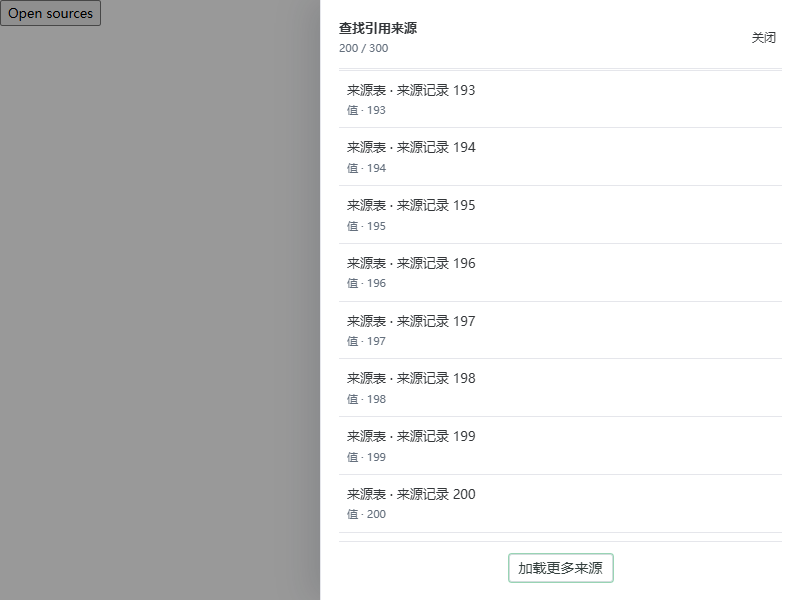

# 查找引用来源面板视口修复

2026-09-08，基于 `3f665176` 的来源面板源码完成真实 Edge 布局回归。

## 根因与修复

`WorkspaceView.vue` 的来源面板同时具有固定定位、`top: 0` / `bottom: 0`，以及 Naive UI 注入的 `.n-modal` 类。后者默认 `align-self: center`，使面板按内容高度展开；`margin: auto` 随之将过高的面板居中。100 条来源在 1280×720 视口中使面板高达 5917px，标题位于视口上方、页脚位于 y=3259px。普通 Playwright 点击报 `outside of the viewport`，与包内 S29 的失败症状一致。

单变量浏览器实验：

- 仅设 `margin: 0`：面板仍高 5917px，页脚位于 y=5858px，点击仍失败。
- 仅设 `align-self: stretch`：面板恢复到 y=0..720，列表自身滚动，页脚位于 y=661..702，普通点击成功。
- 实测面板及其祖先的 `transform` 均为 `none`，不需要修改变换或焦点行为。

生产变更仅增加 `align-self: stretch` 和解释注释，覆盖 Modal 的默认对齐。未增加延迟、重试、强制点击或滚动绕过。

## 回归范围与结果

`tests/e2e/lookup_sources_viewport.test.mjs` 从实际 SFC 读取来源面板的完整 NModal 模板、编译其 scoped CSS，并载入真实 Vue、Naive UI 与项目 design tokens；只用夹具提供来源数据及 dispatch。它在真实 Edge 中验证初始 100 条来源、正常点击追加至 200 条、缩小到 800×600 后滚动到最后一条、再次加载和关闭。页面异常会令测试失败。

这是一项生产模板的浏览器夹具回归，截图不是 WPF/WebView2 完整包运行截图。完整包 S29 复验仍 pending，不能据此宣称包资格或发布门禁通过。

为使真实产品包也能复验同一故障，本修复精确承接 `3b477257` 的 `scenario29`、场景映射项及完整 manifest 对象：建立 101 条 Unicode 关联来源，正常打开面板并点击加载更多，确认无重复、分页耗尽与两表记录及 revision 不变。这里只增加产品回归；`lookup.valuePage` 仍由现有 Python 实现处理，未修改 owner、inventory 或 Go 生产代码。能力索引由仓库脚本重新生成，历史 main 报告的 source/run 保持原值，gap 如实补为 S26、S28、S29 三项。

使用仓库锁定 Node 24.19.0 与已有 uv 环境；以下命令均通过：

| 命令（仓库根目录，另有注明除外） | 结果 |
| --- | --- |
| `node --test tests/e2e/lookup_sources_viewport.test.mjs` | 修复前同症状失败；修复后 1/1 通过，约 2 秒 |
| `uv run --no-sync python -m pytest tests/e2e/test_product_e2e_runner.py::test_bridge_recovery_and_workspace_wire_contracts_use_the_locked_node_runtime -q --no-cov` | 1/1 通过，6.41 秒；其完整 Node 集合 221/221，外层 30 秒预算未变 |
| `node node_modules/vitest/vitest.mjs run src/views/WorkspaceView.test.ts src/workspace/lookupProvenanceController.test.ts`（`desktop/web-grid`） | 62/62 通过 |
| `npm run build`（`desktop/web-grid`） | 类型检查及 Web 生产构建通过；有既有大 chunk 提示 |
| `uv run --no-sync ruff format --check tests/e2e/test_product_e2e_runner.py` | 通过 |
| `uv run --no-sync ruff check tests/e2e/test_product_e2e_runner.py` | 通过 |
| `uv run --no-sync python -m pytest tests/e2e/test_product_e2e_runner.py tests/contract/test_product_e2e_capability_index.py -q --no-cov` | 150/150 通过，7.71 秒 |
| `uv run --no-sync python scripts/generate_product_e2e_capability_index.py --write` / `--check` | 生成及一致性检查通过 |
| `node --check tests/e2e/webview_product_scenarios.mjs` | 通过 |
| `git diff --check` | 通过 |

本次未重建完整发布包。完整多栈质量入口、PR required 和 S29 包复验由交付任务继续记录。

## 浏览器截图

1280×720，初始 100 条来源，标题、关闭按钮和加载按钮均可见：

800×600，追加至 200 条并滚至列表末尾，标题和页脚仍留在视口内：

