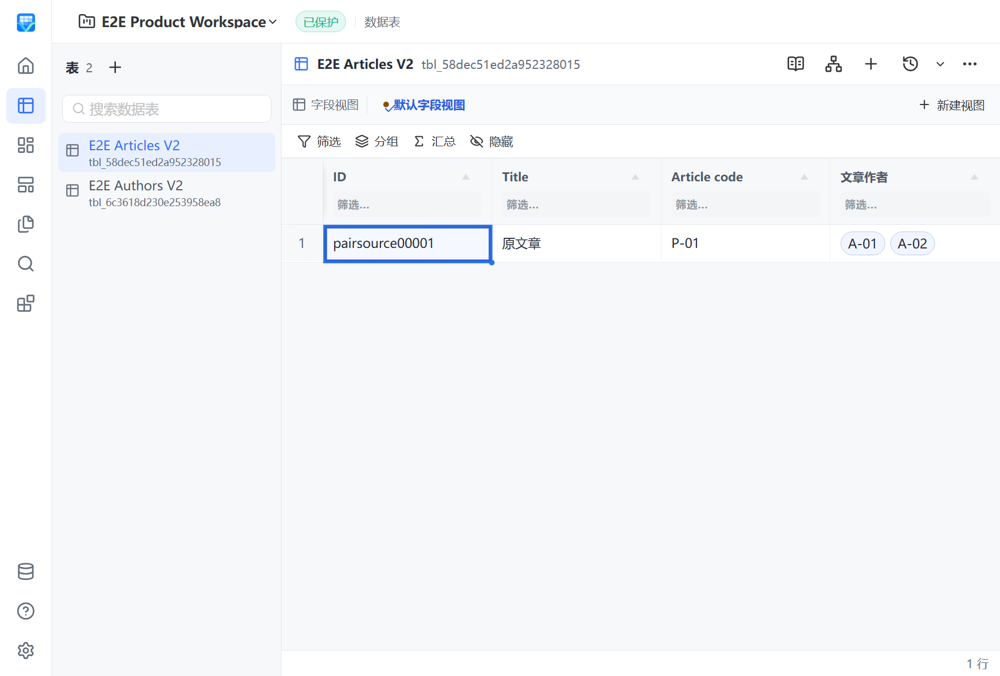

# 已验证计算与关系批次整合资格

## 固定批次

按已授权的“各 PR 单独通过完整 CI 后整合到最新 main，再取得整合端点 fresh required”策略，本批次冻结为以下四项，各自保留独立实现、审查、测试和回滚意图：

| PR | 固定 head | 单独完整 CI |
| --- | --- | --- |
| [#305 关系双端配置](https://github.com/FelixJI/VibeTable/pull/305) | `5739435a43bd4194522bdf02c474c9fd21c2af57` | [34293641787](https://github.com/FelixJI/VibeTable/actions/runs/34293641787)，attempt 2 成功；原失败仍保留 |
| [#308 数值边界与错误分类](https://github.com/FelixJI/VibeTable/pull/308) | `ff9cb6f993bc63f56e2524b2b22c03cc16058f21` | [34294151244](https://github.com/FelixJI/VibeTable/actions/runs/34294151244) 成功 |
| [#309 有界编译计划缓存](https://github.com/FelixJI/VibeTable/pull/309) | `4fff7d052e13c54c2c0389bc53a5282f917da568` | [34294583652](https://github.com/FelixJI/VibeTable/actions/runs/34294583652) 成功 |
| [#310 Lookup 页面批量投影](https://github.com/FelixJI/VibeTable/pull/310) | `2a4aabed1b8a0938340dd81a6e58d136a35ef714` | [34295092369](https://github.com/FelixJI/VibeTable/actions/runs/34295092369) 成功 |

最新实际 main 为 `cadf51533ed45c3793c8f75b21025375d4d3f633`，四项普通合入无冲突，组合生产源码为 `7a2891033bef34cc04b7f791da3f65d4950b3ffe`。组合 Standards/Spec 审查无确定问题：双端原子更新与缓存的权威 revision/提交后失效保留，Lookup 页面投影没有替换 mutation 全物化，数值 decorator 没有共享可变执行状态。此批次不吸收尚未通过当前门禁的候选，也不以原 PR 的成功代替组合 CI。

## 当前组合验证

依赖锁和已有环境复用，使用 Go 1.27.0、Node 24.19.0、.NET 10.0.400 与 uv；没有为整合升级或重建依赖。以下日志相对仓库根目录 `build/qa/qualified-formula-integration/`，Go 命令在 `sidecar/` 执行：

- `go test -race ./internal/formula ./internal/fieldchange ./internal/schemaapi ./internal/lookup ./internal/relation -count=1`：五包 PASS，4.278 / 30.299 / 4.735 / 4.117 / 1.694s，`four-pr-core-race.log`。
- `go test -race ./tests/integration -run 'Test(RelationPair(Patch|Update)|LookupQueryPage|Formula(Relation|Author))' -count=1 -v`：PASS，112.598s，`four-pr-integration-race.log`；覆盖真实双端身份/回滚/基数分页、共享目标读取及 Formula 关联交界。
- `go vet ./internal/formula ./internal/fieldchange ./internal/schemaapi ./internal/lookup ./internal/relation ./tests/integration`：EXIT 0，`four-pr-vet.log`。
- `uv run --frozen --no-sync python scripts/build_next.py`：完整构建 EXIT 0，无 skip，`four-pr-product-build.log`。
- `uv run --frozen --no-sync python tests/e2e/product_e2e_runner.py --package-root dist/VibeTable.Next --scenario 02-all-field-schema --scenario 05-formula-lifecycle --scenario 06-relation-fanout --scenario 12-backup-consistency --scenario 26-lookup-definition-read --scenario 27-relation-target-search --scenario 28-relation-delta-preview --scenario 29-lookup-source-pagination`：实际 WPF/WebView2 8/8 PASS、100 项断言、0 skip，run `20260909T013741Z`，`four-pr-product-e2e.log`。

| 场景 | 耗时 ms | 断言 |
| --- | --- | --- |
| S02 | 16065 | 18 |
| S05 | 5772 | 7 |
| S06 | 21662 | 17 |
| S12 | 16422 | 22 |
| S26 | 5786 | 6 |
| S27 | 6452 | 11 |
| S28 | 6181 | 10 |
| S29 | 6980 | 9 |

报告为 `build/qa/product-e2e/20260909T013741Z/product-e2e-report.json`。四组件 fresh，未启动替代浏览器；所有场景 Node/Host exit 0，页面错误、异常 bridge 和 pending 均为0。S02/S12各1条已确认预期失败。退出后成员/后代进程均为0，端口、owner lease 和最终清理全部通过。数值边界、缓存并发和事务回滚仍由相应 Go 契约测试证明，不将场景数量等同于完整功能覆盖。

当前批次 S06 实际关系标签截图：

## 保留的早期证据

原两项组合源码 `e60305aa3b184301d0b8f5d294d3290810030f21` 的普通三包测试/vet及完整构建通过，S05/S12 实际 WPF/WebView2 run `20260909T011659Z` 为2/2 PASS、0 skip。这些报告只归属原两项，不代作四项组合资格。

同一早期源码的三包 race 整体 FAIL（`core-race.log`）：Formula 4.113s、FieldChange 30.491s 通过；SchemaAPI `TestListIncludesNewlyCreatedEmptyTable` 在 TempDir RemoveAll 报目录非空，包结果 FAIL（3.730s）。这次失败和各原 PR 资格文档中的失败记录继续保留，不因新组合测试通过而改写，也没有放宽清理断言或增加重试。

## 门禁和回滚

当前组合 fresh required、squash merge 与合并后 main CI/CD 尚待完成。只有整合 PR 成功合并后才关闭四项原 PR 并标明已吸收。保留完整 CI、覆盖率及不支持格式零写入拒绝；0.5.0/N-1 不纳入当前开发验收。

整体回滚以整合 PR squash 为单位；各原 PR 的固定 head 和独立资格保留，可据其完整差异定位和准备单项回滚。批次不改变数据 authority、RPC owner 或用户数据格式，不包含尚未验收的混合依赖环校验。
