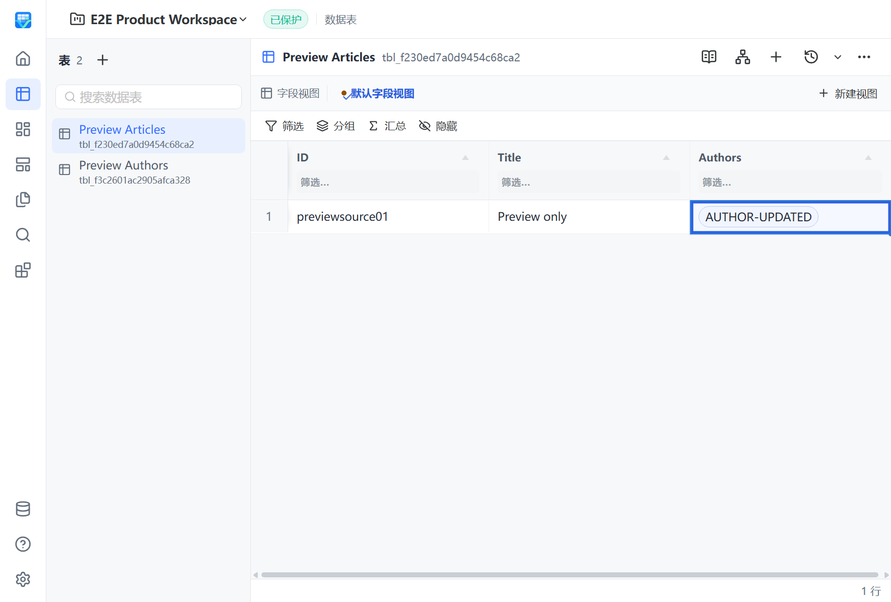

# Relation 标签与已验证修复整合资格

状态：本地相关质量与真实产品验证通过；原PR #302/#303 CI已各自成功；统一候选fresh CI及squash/main CI/CD仍待完成。本报告不声明Relation、RR2或PR #140整体完成。

## 来源与边界

候选源码30b19a2827a2c607bf6a4087d18d717526538f3d，基于实际main dc9439803fc7545107cafcccb06da14737699fa6。按用户批准的“各PR独立通过CI后统一最新端点验证”方式准备，原PR保持开放，当前不提前以候选资格替代原CI。

- #302 head06d3b296a624ae260d157e8faeb0bc8f85741bbb的CI34270441766已成功；包含分别通过CI的#298 replay修复与#299字段计划状态修复。
- #303原head4051553c86de0d27714c596ed5fd779b2c04dd35的CI34272657827已成功。标签本地正常同步已合并的Host #300后形成940785ee367375617573dec15852ced4ad8749b2，再进入本候选。
- Host恢复boolean/context/table/dispose守卫与标签多窗口200条批次共存；全部必要批次接受后才返回成功。标签metadata不进入Mutation身份或digest，Picker保持主显示字段。
- 整合Spec发现labelsOnly忽略keyless返回行却成功，已改为整批预检并返回既有错误/false，不部分发布pages；后续合法批次清相同错误。RED 2 FAIL/88 PASS，修复后相关5文件164 PASS与typecheck通过，最终双轴无遗留确定问题。
- 相对940785ee的11文件修复增量保持#302生产内容不变；独立Spec和Standards未发现新增交界问题。未修改owner、RPC catalog、CI门禁或lock。

## 本地验证

- `npm run test:coverage`：174文件1523 PASS、58.00秒，全部原覆盖门禁通过。此前940785ee上的1519 PASS/54.26秒是独立来源，不混作候选计数。
- `go test -race ./internal/app -run TestWorkspaceMutationReplay -count=1`：23.919秒PASS。首次进程PATH漏现有w64devkit目录，链接器找不到ld，未运行测试；确认缓存ld.exe存在后只修进程PATH重跑，失败日志保留。
- Host整合端点940785ee的`dotnet test desktop/tests/VibeTable.Desktop.Tests/VibeTable.Desktop.Tests.csproj --configuration Release --no-restore --filter FullyQualifiedName~PocketBaseTableGatewayTests --verbosity minimal`：22 PASS、0 skip、104ms；本候选.NET源码与其一致，未重复运行。
- 按实际qa/precommit.py执行Ruff format/check（两份Python变更）、version-consistency和package-contract：全部通过。
- `uv run --frozen --no-sync python scripts/build_next.py`：完整构建退出0；四组件fresh，sidecar build-info版本0.5.1/commit30b19a2827a2。

仅复用锁一致的Python、Node工具链与Web依赖junction，以及Go/.NET缓存。另三个未改Node项目的旧根目录缓存锁不同，因此未复用那些缓存，也未重新安装依赖。其完整矩阵仍由fresh CI验证。

## 当前包真实产品

`uv run --frozen --no-sync python tests/e2e/product_e2e_runner.py --package-root dist/VibeTable.Next --scenario 02-all-field-schema --scenario 10-sse-reconnect --scenario 16-dashboard-lifecycle --scenario 28-relation-delta-preview`

run20260908T203944Z：4/4 PASS、0 skip。

| 场景 | 耗时 | 断言 | 已确认预期bridge失败 |
|---|---:|---:|---:|
| S02普通编辑 | 13.923秒 | 18 | 1 |
| S10 SSE恢复 | 10.471秒 | 18 | 6 |
| S16 Dashboard生命周期 | 28.231秒 | 17 | 5 |
| S28关系preview与标签刷新 | 5.453秒 | 10 | 0 |

四场景Node/生命周期Host退出0，pageErrors、未确认bridge failures、pending均0；成员/后代为空，端口释放、owner lease和最终清理通过。S28真实显示AUTHOR-UPDATED；取消preview保持源链接与revision。

原报告build/qa/product-e2e/20260908T203944Z/product-e2e-report.json，日志build/qa/qualified-relation/中的web-coverage.log、replay-race.log、replay-race-toolpath-fixed.log、product-build.log及product-e2e.log。多窗口与keyless拒绝由组件/集成回归支撑，不把上述定向产品场景扩大为全规模或全部恢复资格。

