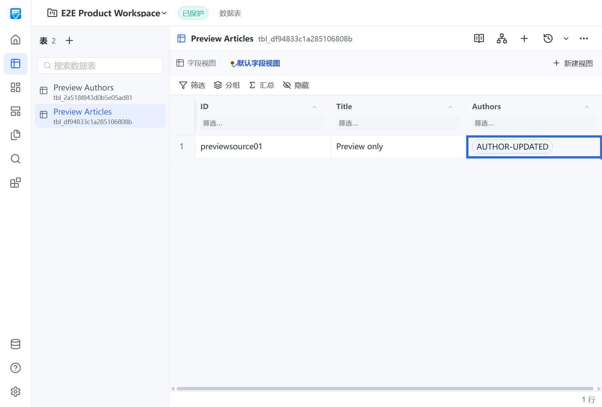

# Relation 单元格展示标签资格

状态：本地相关质量检查与定向真实产品验证通过；fresh PR CI、squash 和 main CI/CD 待完成。整体 Relation / Lookup / Formula 资格仍为 Partial。

## 单一意图

Grid 使用既有 Relation.DisplayField 读取目标记录的标量展示值。原关系字段仍是稳定 ID 或 ID 数组；标签是 QueryPort 只读行元数据 __vibetableRelationLabels，不参与 Mutation、digest 或关系身份。Host 整行复制插入排除此元数据，其他未知业务字段仍拒绝。

按目标表/显示字段分组、去重并分块读取，每单元格只为实际展示的前三个目标取标签；不会递归调用 QueryPage 解析自关联。值的 presence 与计算 freshness 复用查询编译契约。空值、缺失目标、不支持的对象/数组或失效计算结果不作为有效标签，退回原记录 ID；不会 stringify 旧计算状态或递归展开另一条关系。

纯 Relation 页在目标变化时复用现有 lookup.query 空投影，按所有已加载行键每批最多200条刷新标签，不重用首窗口的筛选/offset。只替换标签与必要的行/page引用，保留业务值、分页、游标与未提交草稿；使用已有 generation/revision 守卫和编辑期间的渲染队列。含 Lookup 的现有查询行为保持原路径。Picker 继续使用目标表主显示字段，未切换 owner 或新增 RPC。

## 测试与审查

- `go test -race ./internal/query ./internal/queryschema ./tests/integration -run 'TestQuery|TestRelationDisplayField|TestNormalize|TestCompiler|TestComputed|TestDescribeField|TestNewDerives|TestPresence' -count=1`：query/queryschema及相关集成通过，集成35.040秒；`go vet ./internal/query ./internal/queryschema` 通过。
- 固定 SDK 和缓存 locked restore 后，`dotnet test desktop/tests/VibeTable.Desktop.Tests/VibeTable.Desktop.Tests.csproj --configuration Release --no-restore --filter FullyQualifiedName~PocketBaseTableGatewayTests --verbosity minimal`：22 PASS、0 skip。
- 新增 Go/renderer/复制插入/刷新/空投影回归均有旧实现失败记录。Python LookupQueryParams 保持必填和max256，仅允许现有Go端已支持的空fieldRefs；该正向回归先因too_short失败后通过。
- `uv run --frozen --no-sync python scripts/automation_project.py python-quality`：1787 PASS、1 skip、105.30秒、coverage90.88%；Ruff/Pyright/mypy通过。复用锁文件一致的现有环境，没有重新安装依赖。
- `npm run test:coverage` 最终174文件1439 PASS、59.81秒，全部既有覆盖门禁通过；vue-tsc通过。此前完整运行分别因Workspace分支79.62%低于80%、新用例测试隔离失败而未通过，原日志保留。
- 首轮Spec发现原位更新不触发表格重绘、只刷新第一个cursor窗口，均已修复。回归证明编辑结束后接收Fresh标签、405个已加载行按200/200/5批次刷新，并保持分页和Draft值。最终Standards与Spec无遗留确定问题。
- 新Workspace测试使用与挂载相同的显式testPinia，按requestId完成真实上下文响应，结束时unmount/bridge.stop。原失败日志没有记录具体ambient回调身份，不将特定回调归因为已证实事实。

原始证据集中在 build/qa/relation-labels/：go-race.log、go-vet.log、python-contract-red.log、python-contract.log、python-quality.log、web-coverage.log、web-coverage-fixed.log、web-coverage-isolated.log、web-workspace-isolation.log及verification.md。定向Python模块覆盖96.51%不是全后端覆盖；全后端以本节90.88%为准。

## 真实产品证据

源码05f0c1a9cd71617cd0fc2f7e5c9c28ae57d2c77d，sidecar build-info为05f0c1a9cd71。

- `uv run --frozen --no-sync python scripts/build_next.py`：完整新包退出0，四组件fresh，未使用旧0.5.0产物。
- `uv run --frozen --no-sync python tests/e2e/product_e2e_runner.py --package-root dist/VibeTable.Next --scenario 28-relation-delta-preview --scenario 02-all-field-schema`：run20260908T195126Z，2/2 PASS、0 skip。
- S28：6.025秒、10断言；配置字段显示AUTHOR-001，Picker仍以主显示名称选择，取消preview保持权威数据，目标更新后实际Grid显示AUTHOR-UPDATED且源链接/revision不变。
- S02：13.930秒、18断言，验证相邻普通编辑路径。
- Node/Host退出0，pageErrors、未确认bridge failures及pending均为0；members/descendants为空，端口释放、owner lease及最终清理通过。

报告为 build/qa/product-e2e/20260908T195126Z/product-e2e-report.json；日志product-build.log与product-e2e-corrected.log。首次CLI误写场景ID被配置入口拒绝、未启动产品，记录在product-e2e.log，不计为场景执行。

多窗口/编辑队列由集成和组件回归支撑，当前真实S28是单窗口；不将其夸大为100k、全部UI布局、完整pair生命周期或恢复资格。最终远端门禁尚待完成。
