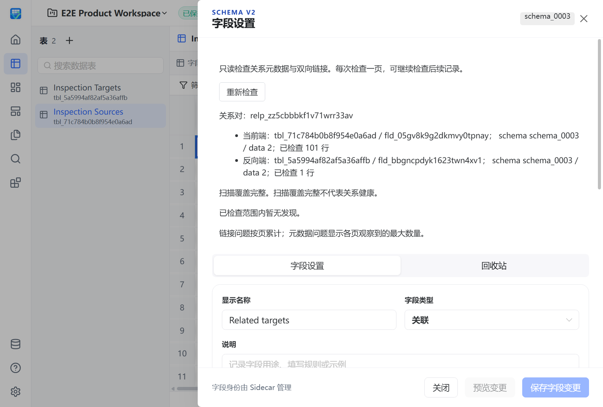

# 关系完整性只读诊断资格

状态：实现、相关验证及本地组合候选的真实打包场景和截图已完成；完整本地矩阵仍有历史失败，依赖 PR #305 实际 main 同步、fresh PR CI 和合并闭环待完成。此记录不代表 RR2 inspect/repair 整体完成。

## 完整意图

`relation.inspectPair` 由 Go 直接读取 PocketBase 的持久关系定义与双端原始链接，不依赖正常 query/describe 成功。按稳定记录 ID 对双端分页，冻结双方 schema/data revision；读取失败、取消和 revision 变化显式拒绝，不返回空的健康结果，不写权威数据。

报告区分每页发现、分页结束与扫描覆盖。计数和样例是页局部数据；UI 累计链接问题，重复元数据问题取各页最大值，保留前页发现；`complete` 表示覆盖完整，不表示关系健康。返回游标只表示扫描进度，不授权修复。样例数量受限，截断明确显示。

字段设置保存显式请求的 tableId/fieldId，正常描述失败后仍能检查该目标；关闭、换目标或停止隔离迟到回调。Host 使用现有 Product 注册和 Go owner，不提供 Python fallback；既有领域错误 envelope 保留 revision_changed 文案。修复写入、owner 切换、独立稳定性修复不在本意图内。

## 已取得证据

- 真实 PocketBase `go test -race ./internal/relationpair ./tests/integration -run TestRelationPairInspect -count=1`：PASS75.497s；`go vet ./internal/relationpair` PASS。覆盖双端分页、401目标200/200/1读取、损坏元数据/链接/presence、样例截断、revision变化、取消与读取错误；日志 `build/qa/relation-inspect/race-final.log`、`vet-final.log`。
- 新 Product adapter 参数/领域错误/取消回归通过。能力与 dispatcher 完整 race 分别 PASS1.271s/1.700s；旧精确注册清单先 RED，补充唯一新增方法后断言通过。
- `npm run test:coverage`：176文件1554 PASS，56.88s，全部原有覆盖率门禁通过；日志 `web-full-final.log`。之后生成样例与真实 parser 的消费回归，旧样例1 FAIL→3文件59 PASS；修复只改变生成样例语义和测试。
- Host 新路由6项回归先因缺少注册全部失败，补充后相关83项 PASS、0 skip；`ProductContractV2RoundTripTests` 10 PASS。日志 `host-routing-red.log`、`host-routing-final.log`、`host-contract-catalog.log`。
- 既有 `{error: ...}` 领域返回的真实 resolved envelope 先2 FAIL，修复后模块53 PASS、vue-tsc通过；日志 `web-envelope-red.log`、`web-envelope-green.log`、`web-typecheck-envelope.log`。
- 16项新 DTO 测试通过；新增场景/索引/目录及 Python owner 闭集契约192 PASS。catalog、capability、inventory由现有脚本生成/校验，没有手工改生成物。
- Standards/Spec 双轴独立审查已覆盖实现；最新真实场景仍须在打包候选上验收。

## 未通过与未完成

完整 Go app race 整体 FAIL278.794s：`TestHistoryReadProductHTTPPreservesLegacyValidationAndPublicErrors` 在 TempDir 的 coordination 目录清理失败；一次诊断定向 race 同样 FAIL6.345s。未出现业务断言或 race detector 报告，但完整命令不能计为通过；事后目录为空不足以判断清理时的文件或持有者。保留 `go-fixture-race.log`、`go-fixture-history-diagnostic.log`，不放宽清理或盲重试。

完整 Python quality 初次因新增方法未进入精确期望集合失败，已精确修复。之后完整入口为1788 PASS、1 skip、1 FAIL，覆盖率91.42%，Ruff/Pyright/mypy通过；唯一失败是 `test_repeated_launch_and_close_does_not_leak_parent_handles` 的父句柄172与基线171不相等。一次原断言定向诊断通过仅说明未复现，不能替代完整入口；保留 `python-quality.log`、`python-quality-final.log`、`python-handles-diagnostic.log`，不扩大为全量通过。

新场景 `31-relation-pair-inspection` 已进入完整 manifest，声明101条来源的双页检查、检查零写入、页间修改后的拒绝及重新检查。实际表头编辑入口依赖关系双端更新 PR #305 的修复；本地组合候选已取得下节真实证据，#305 实际 main 同步与独立 fresh CI 仍待完成。历史23场景 main 样本不覆盖新增场景，coverage index 明确列出 gap。

进程能力闭集补充：`go test ./cmd/vibetable-pb -run '^TestSidecarWorkspaceV2HTTPFailsClosedAndPersistsAcrossRestart$' -count=1` 旧清单 FAIL1.306s，精确加入唯一新增的 `relation.inspectPair`（20项、workspace scope）后 PASS1.720s；加 `-race` PASS10.142s。保留全部身份/失败关闭/重启断言，日志 `build/qa/relation-inspect/go-process-{red,green,race}.log`。不改变上述完整矩阵仍失败的结论。

实现提交 `d9354212` 之后以正常 merge `61657e6e` 同步实际 main `3bf03bc6`，没有冲突。字段设置 service/store、检查面板/parser、目录消费共5文件83项 PASS1.76s（`build/qa/relation-inspect/main-sync-web.log`）；Spec 合并交界复审无新增问题。Standards 复核指出旧日志引用拼写，已改为实际 `web-typecheck-envelope.log`。该 main 同步阶段尚未执行 S31；后续本地组合的真实证据见下节，最终实际 main 同步与 fresh CI 仍待完成。

同一 main 合并结果的 `npm run test:coverage`：176文件1578 PASS（55.42s），全部既有覆盖率门禁通过；Statements85.64%、Branches78.68%、Functions84.14%、Lines89.07%。日志 `build/qa/relation-inspect/main-sync-web-full.log`；未重复建立环境。

## 本地依赖组合的真实产品资格

为在 #305 fresh CI 期间完成实际验收，正常 merge 其候选 `277f9bb4947714a149d8b14e03a96e4d6be68a2d`，形成当前产品源码 `1b7f14d5dfbb`。该组合没有合并远端 PR，不视作 #305 已进入 main。两处冲突保留双方新增 service 测试并用脚本重建索引；双轴交界审查无新增确定问题。

- `npm exec vue-tsc -- --noEmit` PASS；`npm exec vitest run src/field-settings src/relation-inspection src/contracts/productContractV2.test.ts`：9文件133 PASS6.00s。
- `uv run --frozen --no-sync python -m pytest tests/contract/test_product_e2e_capability_index.py tests/e2e/test_product_e2e_runner.py -q --no-cov`：166 PASS8.93s，索引生成/校验通过。
- `uv run --frozen --no-sync python scripts/build_next.py` 完整构建 PASS，复用原有 uv/Node/Go/.NET 缓存；sidecar为0.5.1/1b7f14d5dfbb，四组件 fresh。
- `uv run --frozen --no-sync python tests/e2e/product_e2e_runner.py --package-root dist/VibeTable.Next --scenario 06-relation-fanout --scenario 28-relation-delta-preview --scenario 31-relation-pair-inspection`：run `20260908T224535Z`，3/3 PASS、0 skip；S06 21.460s/17断言、S28 6.093s/10断言、S31 7.520s/12断言。
- S31 实际打开字段设置，检查101+1条双端记录；先100行后续页覆盖完整，权威 rows/schema/data revisions 不变；主动写入后旧游标拒绝且拒绝本身零写入，重新检查成功。该路径直接操作真实 WebView2 网页，没有单独启动浏览器替代桌面宿主。
- 三场景 Node/生命周期 Host 退出0，pageErrors、bridge failures/acknowledgedFailures/pending均0；进程成员/后代为空，端口、lease和最终清理通过。

日志 `build/qa/relation-inspect/product-build.log`、`product-e2e.log`、`pair-sync-typecheck.log`、`pair-sync-web.log`、`pair-sync-runner.log`；原始报告 `build/qa/product-e2e/20260908T224535Z/product-e2e-report.json`。上述证据不替代此前 Go/Python 完整矩阵失败，也不代表 fresh PR CI 完成。下次实际 main 同步后按代码差异判断是否需重建，不能把本地候选当作最终合并资格。

## 组合候选的完整 core 结果

同一源码 `1b7f14d5dfbbe2363853b533f151fb812332819e` 的现有候选由 `qa/release_candidate.py create` 归档后，执行 `uv run --frozen --no-sync python qa/next.py --lane core --package-root dist/VibeTable.Next --package-archive dist/VibeTable-v0.5.1-win-x64.zip --json-report build/qa/relation-inspect/core-report.json`，最终 FAIL。version、go-fmt、go-vet通过，go-test 275.120s 失败；之后的 go-coverage、Go build/smoke、Python、contracts、tooling、.NET、Web和最终smoke阶段未执行，不能记作完整 core 通过。

失败都记录为 workspacev2 既有用例的 TempDir RemoveAll 目录非空，涉及 coordination、snapshots、audit 和 restore-rollback；日志没有其他业务断言失败。现有 QA 内置的相同命令最多三次处理仍未通过，本次未增加重试或修改清理策略。原始 `build/qa/relation-inspect/core.log` 和 `core-report.json` 完整保留，后者 `ok=false`、`releaseEligible=false`。该证据仍不足以确定 Windows/SQLite 根因，不能由关系检查场景通过或定向诊断未复现代替。
