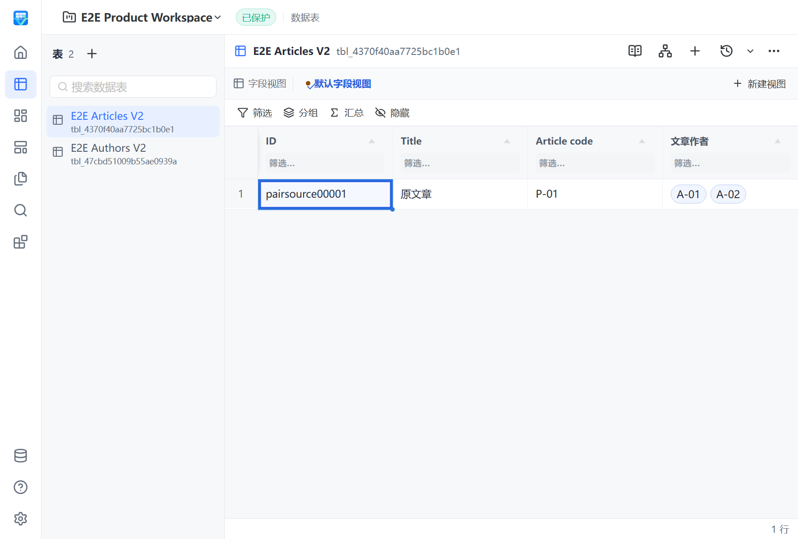

# Relation pair 原子更新资格

状态：本地实现和定向产品资格已取得；fresh PR CI、squash 与合并后资格待完成。整体 Formula / Relation / Lookup 仍为 Partial。

## 完整意图与边界

现有关系对可在一次 FieldChange 计划中修改双方名称、基数、DisplayField 配置和共享删除策略。pair identity、字段身份与目标表不可修改；双方 schema/data revision 参与冻结与冲突检查。many→one 遇到多链接记录时零写入拒绝。普通产品仅开放 setNull/restrict，内部 cascade 迁移路径不变。

Web 从真实表头菜单进入字段设置，装载对端、呈现双方冻结摘要、确认后原子应用，并可重开检查。混合 pair 与其他通用属性修改要求分次保存，不产生半份 pair 计划。目标表发生变化后，相同 patch 重新计划绑定最新 revision；同一 revision 下仍复用有效计划。

本改动不切换 RPC owner，不实现 inspect/repair、完整 picker 冲突恢复或计算依赖统一。最初源码34835708只证明DisplayField配置保存；下述e7ab2b13集成资格已补充双方真实Grid标签消费。ADR 0009 的 picker 按目标表主显示字段展示契约保持不变。不能由定向显示消费证据推断 Relation 已 Closed。

## 本地证据

测试复用既有锁定环境和缓存；所有命令在本分支运行，日志在 build/，不提交本机包或数据库。

| 验证 | 命令或入口 | 结果 |
|---|---|---|
| Go pair 事务和 revision | 相邻 fieldchange/schema/v2/schemav2wire race 测试与 go vet | PASS；22.336 / 1.586 / 1.269 秒 |
| replan 回归 | 原目标数据/Schema 变化后相同 patch 测试 | 旧实现 2 FAIL；修复后 PASS，pair 集成 2.460 秒 |
| Python DTO/contracts | 相关 pytest 集合 | 47 PASS，0.77 秒 |
| .NET 严格 DTO | Contracts.Tests 中 pair contract 测试 | 11 PASS、0 skip；最初错选 Desktop 项目未匹配测试，不计通过 |
| Python 项目质量 | 仓库 Python quality 入口 | 1801 PASS、1 skip、覆盖率 90.89%；Ruff/Pyright/mypy PASS |
| Web 完整测试 | npm run test 对应锁定 Vitest 入口 | 174 文件、1443 PASS，54.26 秒 |
| Grid 表头真实属性 | GridHost.test.ts | 旧实现事件缺失 RED；修复后 10 PASS，vue-tsc PASS |
| E2E manifest 历史语义对账 | 相关 pytest 与 Node 语法检查 | 166 PASS，7.93 秒；保留原历史报告，不将旧 S06 当成新语义证据 |

精确命令与原始输出保留在 build/relation-pair-*.log；本表只概括范围，不替代 PR 中的精确验证记录。独立 Standards 与 Spec 审查已完成，pair plan 缓存发现经回归修正并复审；新增 Grid 真实表头入口修正两轴无遗留问题。

## 当前构建与真实产品

- 源码：34835708d2eecd23d85d1bd76cb7de0b467936ab。
- 构建：`uv run --frozen --no-sync python scripts/build_next.py`；完整四组件新包，退出 0，日志 build/relation-pair-menu-product-build.log。
- 实际入口：`uv run --frozen --no-sync python tests/e2e/product_e2e_runner.py --package-root dist/VibeTable.Next --scenario 06-relation-fanout`。
- 运行：20260908T183824Z；S06 1/1 PASS、0 skip、20.827 秒、15 断言。
- 报告：build/qa/product-e2e/20260908T183824Z/product-e2e-report.json；日志 build/relation-pair-menu-product-e2e.log。
- 真实 WPF/WebView2 经表头菜单编辑双端名称、基数、DisplayField 配置和策略；冻结摘要、应用重开、原链接和身份保持、many→one 歧义及公开 cascade 零写入拒绝成立。
- 四组件 fresh；Node/Host exit 0；pageErrors、异常 bridge、pending 均为 0；进程、端口、lease 与最终清理全部通过。
- S27 在较早生产源码 28900284712adfffbbea3df7ecc2609aba15047a 上通过；未在 34835708 重跑，不混用源码归属。

首轮真实执行揭示 reciprocal presence 缺失，已拆为独立 PR #301；后续执行揭示测试与生产同时使用错误的表头 data-field 属性，修复为真实 tabulator-field。失败报告均保留，没有弱化断言或通过 RPC 旁路模拟表头操作。当时截图仍显示原始 ID；现已替换为下述集成运行的真实标签截图，原截图保留在原运行目录。

## 尚未完成

reciprocal presence #301 已完成 main CI/CD 闭环；字段设置修复与标签消费的原#302/#303均已各自通过CI，目前由统一端点#304接续fresh CI，仍待合并。本分支还须同步最新实际 main、保留独立pair意图并完成最终审查、fresh required CI、squash 与 main CI/CD。不声明全部关系四种基数、完整生命周期、10k/100k 或恢复资格已完成。

## 双端展示消费集成资格

源码e7ab2b1387b2ca27a7c3c29b09ce74bef2a92177，正常集成独立标签PR #303的4051553后，新增18行S06断言；此前配置/原子性/身份/链接/歧义/公开cascade拒绝均保留。新增断言Standards/Spec无遗留问题，正常hooks通过。

- `npm run test:coverage`：174文件1452 PASS、54.15秒，全部既有门禁通过，日志build/relation-pair-labels-web-coverage.log。
- `uv run --frozen --no-sync python scripts/build_next.py`：完整构建退出0，复用现有环境与缓存，日志build/relation-pair-labels-product-build.log。
- `uv run --frozen --no-sync python tests/e2e/product_e2e_runner.py --package-root dist/VibeTable.Next --scenario 06-relation-fanout --scenario 27-relation-target-search --scenario 28-relation-delta-preview`：run20260908T201209Z，3/3 PASS、0 skip。
- S06：21.566秒、17断言，双端配置应用后源Grid显示A-01、对端Grid显示P-01；原重开及拒绝契约通过。
- S27：6.206秒、11断言，Picker主显示字段搜索/分页契约通过。
- S28：5.545秒、10断言，配置标签与目标变更刷新、preview取消零写入通过。
- 三场景Node和生命周期Host退出码均0，pageErrors、bridge failures/acknowledgedFailures/pending均0；成员/后代为空，端口、lease和最终清理通过。

报告build/qa/product-e2e/20260908T201209Z/product-e2e-report.json，执行日志build/relation-pair-labels-product-e2e-corrected.log。首次S27参数误写被配置校验拒绝、未启动产品，原日志保留，不计场景运行。下图是该运行S06结束后的真实Grid；后续前置合并与新main资格仍待完成，不把集成包视作已发布版本。

## 同步 Host 与统一候选后的当前资格

当前实际源码68dc17758a2093692170eeebf93afc0060a3ec72，正常同步#304候选5e978159及其中已合并的Host主线。没有改变pair计划/事务或S06双端显示断言；两轴合并交界审查无新增确定问题。本节是最新来源，上述运行保持各自历史源码归属。

- `npm run test:coverage`：174文件1532 PASS、59.42秒，全部既有门禁通过，日志build/relation-pair-qualified-web-coverage.log。
- `uv run --frozen --no-sync python scripts/build_next.py`：完整构建退出0，sidecar build-info为0.5.1/68dc17758a20，四组件fresh，日志build/relation-pair-qualified-product-build.log。
- `uv run --frozen --no-sync python tests/e2e/product_e2e_runner.py --package-root dist/VibeTable.Next --scenario 06-relation-fanout --scenario 27-relation-target-search --scenario 28-relation-delta-preview`：run20260908T205721Z，3/3 PASS、0 skip。
- S06为20.960秒/17断言；S27为5.930秒/11断言；S28为5.994秒/10断言。双端配置消费、Picker搜索、标签刷新与原子性/拒绝契约均通过。
- 三场景Node/生命周期Host退出0，pageErrors、bridge failures/acknowledgedFailures/pending均0；成员/后代为空，端口、lease和最终清理通过。

报告build/qa/product-e2e/20260908T205721Z/product-e2e-report.json，执行日志build/relation-pair-qualified-product-e2e.log。等待#304实际main后再完成独立pair PR的fresh CI与合并闭环；当前不将定向包验证提升为完整Relation/RR2资格。

## 实际 main 端点同步

PR #304 已于 2026-09-08 21:43 UTC squash 合并为 `3bf03bc6f47399bacbdb1305a9b110c8d3b11ae5`，其 PR required CI 全部成功。当前分支以正常 merge 同步该实际 main，提交 `60a9ffe99d1678824ff89612ebe3f6eea1c103b4` 与同步前 `040a6ced` 的 Git tree 完全一致；保留 pair 专属测试和计划，两处 squash 历史冲突未改变产品代码。因此复用上述 `68dc1775` 产品构建与三场景资格，不重复构建同一代码。#304 合并后 main CI/CD 尚在跟踪，本 pair PR 的 fresh CI 与合并闭环仍待完成。

## 首轮 fresh CI 的契约修正

CI run `34282704336` 的 core lane 在 Python 场景结构契约失败：真实 S06 已点击可见的 `.tabulator-col-title`，静态测试仍要求旧 `header.click` 字符串。只同步该精确点击断言，保留可见控件、双端权威与冲突零写入的全部断言。原测试本地 1 FAIL（0.32s），修正后 `uv run --frozen --no-sync python -m pytest tests/e2e/test_product_e2e_runner.py -q --no-cov` 为 111 PASS（8.60s），日志 `build/qa/relation-pair-static-red.log` 与 `relation-pair-static-green.log`。产品源码未变，复用上述实际构建与三场景证据；更新后的 fresh CI 仍待完成。
