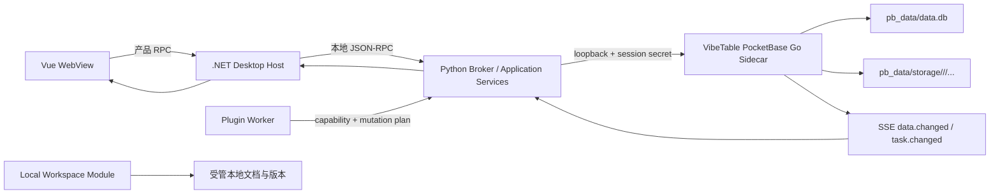

# VibeTable 去 Directus / PocketBase 完整实施计划

> 状态：Ready for implementation  
> 日期：2026-07-24  
> 目标版本基线：PocketBase `v0.39.9`，自定义 Go sidecar，公式语言 `cel-v1`  
> 前置研究：
> [功能与适配矩阵](../research/2026-07-24-pocketbase-replacement-matrix.md)、
> [架构决策](../research/2026-07-24-directus-exit-architecture.md)、
> [公式引擎选型](../research/2026-07-24-formula-engine-options.md)、
> [托管附件边界](../research/2026-07-24-pocketbase-file-capabilities.md)、
> [审计与工作流调研](../research/2026-07-24-pocketbase-audit-activepieces-ce.md)

## 1. 结果、范围与非目标

本计划把尚未发布的 Directus 后端完整替换为 VibeTable 自有 PocketBase Go sidecar。PocketBase 是唯一数据后端，不建设 Directus/PocketBase 双后端选择器，不做迁移、双写、兼容开关或旧数据导入。

首个可发布版本必须具备：

- 单机 SQLite 数据库、托管附件和完整离线启动；
- 表、字段、关系、Lookup、查询、粘贴、导入、导出、归档和恢复；
- 完整字段约束、建表前置验证、JSON 字段和托管附件字段；
- 后端权威公式引擎、实时公式预览、物化结果和可恢复重算；
- 统一写入内核、乐观并发、幂等、审计、历史恢复和实时事件；
- 只读 View、聚合查询、Dashboard/Panel/Preset、Identifier Mapping 和 Grid State；
- 现有插件只能通过 VibeTable capability/mutation Interface 写入；
- 桌面端内置 sidecar，无首次启动下载或 `npm install`；
- 删除 Directus 运行时、扩展、安装脚本、认证窗口和专属协议。

明确不做：

- Directus 数据迁移或两套后端长期共存；
- SQLite generated column 或由 UI 直接修改 SQLite DDL；
- 前端维护第二套权威公式求值器；
- 多人评论、@提及、通知收件箱和协作活动流；
- Activepieces 内嵌、工作流设计器或 Directus Flow 兼容层；
- 首版全局文件资产库、跨记录文件复用或任意 per-table 磁盘路径；
- 将本地工作区文档迁入 PocketBase 托管附件。

## 2. 冻结的核心决策

| 编号 | 决策 | 工程含义 |
|---|---|---|
| D-01 | PocketBase 是唯一后端 | 不创建 `IDataBackend` 双实现，不保留 Directus Adapter |
| D-02 | 自有 Go binary 扩展 PocketBase | `sidecar/` 同时承载 PB、CEL、Mutation、审计和自定义 API |
| D-03 | 所有业务写入经过 `MutationKernel` | UI、Python、导入、粘贴、插件均不得直写 PB Records API |
| D-04 | 后端是公式单一真相源 | 保存和预览调用同一 evaluator；前端只负责编辑、节流和展示 |
| D-05 | 公式结果物化为普通 PB 字段 | 产品 schema 标记只读；依赖变化时在事务中重算 |
| D-06 | 记录、公式结果、审计、幂等键、outbox 同事务 | 使用 `RunInTransaction` 和回调中的 `txApp` |
| D-07 | 自建 `vibetable_audit_events` | `pb-audit` 可作调试辅助，但不是历史恢复的权威来源 |
| D-08 | 文件使用 PB 原生 File field | 每张表天然按 `collectionId/recordId/filename` 隔离 |
| D-09 | 工作区文档与托管附件分开 | 前者由现有 Workspace Module 管理，后者随记录生命周期 |
| D-10 | 单人桌面产品 | 删除协作通知、评论和 mentions；保留历史、任务状态和内部 outbox |
| D-11 | 产品协议不暴露 PB schema | Vue/.NET/Python 只看 normalized schema 和产品错误码 |
| D-12 | 先纵切替换、后物理删除 | 只有全部删除门槛通过后才移除 Directus 目录 |

### 2.1 托管附件的“按表存放”

PocketBase 标准 File field 使用全局 filesystem，但对象键自动按
`collectionId/recordId/filename` 组织。首版把这定义为“每张表独立存储命名空间”：

- 本地默认根目录：`pb_data/storage`；
- 每张表：独立 `collectionId` 子树；
- 每条记录：独立 `recordId` 子树；
- 文件字段配置：单/多文件、必填、每文件大小、MIME、缩略图、protected；
- 建表 UI 不展示磁盘路径选择器，也不允许某张表绕开 PB 生命周期。

只有未来出现“表 A 存 D 盘、表 B 存独立 S3”这类真实需求时，才引入
`AttachmentStorage` Module、第二个 Adapter、迁移和备份策略。现在只有一个实现，提前创建这个 Seam 只会增加泄漏和测试成本。

## 3. 目标进程拓扑



进程责任：

- `.NET Host`：拥有 sidecar 生命周期、端口、进程状态、崩溃恢复和退出顺序；
- `Python Broker`：保留产品用例编排、长任务、导入导出和插件 Host，不保存第二套业务真相；
- `Go sidecar`：拥有 schema、query、mutation、formula、audit、attachment 和 realtime 的权威实现；
- `Vue`：只通过产品 RPC 工作，不获取 PB superuser、内部 token 或 filesystem 路径；
- `Workspace Module`：继续管理本地文档，不与 PB attachment 共用生命周期。

安全基线：

- sidecar 仅监听 `127.0.0.1` 随机端口；
- `.NET` 每次启动生成 256-bit session secret，通过受控启动握手交给 sidecar 和 Python，永不发给 WebView/插件；
- 业务 collection 的标准写 API 对普通 token 关闭；写入只能走自定义 Mutation route；
- PocketBase Dashboard 默认不暴露在产品 UI，仅开发模式可开启，并标记为可能绕过产品不变量的维护工具；
- 文件路径、公式资源限制、body limit、插件 capability 和日志脱敏全部由 Go route 再验证。

## 4. 目标 Module、Interface 与 Seam

下表中的 Module 以较小 Interface 隐藏复杂 Implementation。只在确有第二个调用边界或外部依赖时建立 Seam。

| Module | 稳定 Interface | Implementation 与所有权 | Depth / Leverage |
|---|---|---|---|
| `LocalDataService` | `StartAsync`、`GetStatus`、`StopAsync`、`OpenAdmin` | .NET；进程、端口、握手、日志、恢复 | 从 `MainWindow.xaml.cs` 隐藏整个 sidecar 生命周期，高 Leverage |
| `SchemaCatalog` | `Describe`、`ValidateChange`、`ApplyChange`、`GetRevision` | Go；PB collections/indexes + VibeTable metadata | UI 不理解 PB schema，避免 provider 细节外溢 |
| `QueryPort` | `QueryPage`、`ReadRows`、`Aggregate`、`ValidateSnapshot` | Go；编译既有 `TableQuery` AST | 所有读取语义集中，保持分页和筛选一致 |
| `MutationKernel` | `Preview`、`Apply` | Go；校验、冲突、公式、事务、审计、幂等、outbox | 最深的核心 Module；所有写入口复用 |
| `FormulaEngine` | `Validate`、`Preview`、`Compile`、`Evaluate`、`PlanBackfill` | Go + `cel-go` | 同一个编译/求值 Implementation 服务预览和保存 |
| `AuditHistory` | `ReadChangeSets`、`PreviewRestore`、`ApplyRestore` | Go；权威事件与反向 mutation | 恢复仍经过 MutationKernel，不旁路写入 |
| `ManagedAttachments` | `ValidatePolicy`、`ProjectMetadata`、`OpenDownload` | Go；PB File field + metadata projection | 包装产品语义，不复制 PB filesystem |
| `RelationLookup` | `Describe`、`SearchTargets`、`PreviewDelta`、`ApplyDelta`、`QueryLookup` | Go/Python use-case | 保留现有产品行为，替换 Directus 编译和扩展 |
| `RealtimePort` | `Subscribe`、`Unsubscribe`、标准化事件 | Go SSE + Python/.NET Adapter | 将 PB 事件稳定成 `data.changed` |
| `PluginCapabilityHost` | capability manifest、mutation plan、file grant | 现有 Python/.NET Worker 架构 | 插件永远不接触 PB token 或写 API |
| `WorkspaceDocuments` | 现有文档、版本、恢复 Interface | 现有 .NET/Python Workspace | 直接保留，不引入无意义 PB Adapter |

必须处理的现有 Interface：

- 保留并去除注释中 Directus 语义的 `ITableRpcGateway`；
- 删除 `IDirectusRpcGateway`，不要让 PocketBase 去实现它；
- 将关系/Lookup 的 `JsonElement` 临时边界逐步替换为产品 typed contracts；
- `DirectusService` 不改名成更大的 `PocketBaseService`，而是拆到上表各 Module；
- `directus.changed` 改为 `data.changed`；
- `directus.*` RPC 改为 `session.*`、`schema.*`、`table.*`、`file.*` 等产品命名空间。

其他现有产品能力的归属：

- Grid State/个人网格预设继续使用现有本地 SQLite Module，只把 reconciliation 键改成 normalized `schemaRevision`；
- Dashboard、Panel 和共享 Preset 的查询统一复用 `QueryPort.Aggregate`，元数据进入 internal collections；
- Identifier Mapping 保留产品 Interface，origin 改为 `vibetable/pocketbase`，删除只服务未发布 Directus 迁移的 orphan/import 分支；
- 插件 `NetworkRequestPort` 保留域名、方法、超时、响应大小和凭据限制；
- PocketBase API logs 只用于诊断和指标，不参与数据版本或恢复。

## 5. Normalized schema 与字段覆盖

### 5.1 表和字段契约

`TableDefinition` 至少包含：

```text
tableId, physicalName, displayName, kind(base|view),
schemaRevision, archivePolicy, fields[], indexes[]
```

`FieldDefinition` 至少包含：

```text
fieldId, physicalName, displayName, kind,
dataType, storageType, nullable, defaultValue,
constraints, editor, readOnly, formula, relation, lookup, attachmentPolicy
```

`kind` 固定为：

- `scalar`
- `relation`
- `lookup`
- `formula`
- `attachment`
- `system`

`constraints` 是有版本的 discriminated union，不再是任意字典。公共约束包含：

- `required` / `nullable`
- 静态默认值
- `unique`
- 普通/唯一/组合 index
- `min` / `max`
- `minLength` / `maxLength`
- `pattern`
- `precision` / `scale`
- enum 值、显示名和单/多选
- JSON Schema
- relation 基数、目标表、删除策略
- file 数量、大小、MIME、缩略图和 protected

验证分三层，但只有一个权威结果：

1. Vue 同步预检：空名称、重复名称、明显范围错误、JSON 格式等；
2. `schema.validate`：Go sidecar 权威检查类型映射、索引、公式、依赖和 PB 限制，零写入；
3. `schema.apply`：同一 validator 再运行一次，在 schema revision guard 下提交。

错误统一返回：

```json
{
  "code": "schema.field.invalid_constraint",
  "path": "fields[2].constraints.scale",
  "message": "scale 不能大于 precision",
  "details": {"precision": 8, "scale": 10}
}
```

### 5.2 表级行为

- Base collection：可读写，所有 mutation 经过 `MutationKernel`；
- View collection：只读派生表，contract 中强制 `readOnly=true`，不能伪装成公式字段；
- 归档：由 normalized `archivePolicy` 选择 `status` 或 `deleted_at`，普通 Query 默认排除归档记录；
- 恢复：归档恢复和历史恢复都走 MutationKernel，重新执行约束和公式；
- 聚合：使用受限 aggregate AST，不允许 UI/插件透传原始 SQL 或任意 PB filter；
- Content Version：由审计 change set 派生“命名版本”，不把 PB backup 当记录版本。

### 5.3 字段映射和明确缺口

| VibeTable 类型 | PB 存储 | 约束/补充工作 |
|---|---|---|
| `shortText` / `longText` / `richText` | Text / Editor | 长度、pattern、编辑器配置 |
| `boolean` | Bool | required/default |
| `integer` | Number | 服务端整数与范围验证；wire 禁止静默精度丢失 |
| `float` | Number | min/max、有限值，拒绝 NaN/Infinity |
| `decimal` | Number + 产品 precision/scale | 先做存储与 round-trip POC；达不到定义精度则不在 UI 宣称“精确小数” |
| `date` / `dateTime` / `autoDate` | Date / Autodate | 时区和空值规则写入契约 |
| `time` | Text | `HH:mm:ss[.fff]` validator 和专用 editor |
| `email` / `url` | Email / URL | PB 最终验证，前端同规则预检 |
| `uuid` | Text | 格式验证；可由 MutationKernel 生成默认值 |
| `select` / `multiSelect` | Select | 值集合、最少/最多选择 |
| `json` | JSON | JSON editor、JSON Schema、查询、粘贴和导入导出 round-trip |
| `geoPoint` | GeoPoint | 点坐标；线/面改用 GeoJSON |
| `geoJson` | JSON | GeoJSON Schema；不承诺 PB 原生空间索引 |
| `file` | File | 见 AttachmentPolicy；二进制字段统一映射为附件 |
| `relation` | Relation | M2O/O2M/M2M 原生映射；M2A 用 junction + target type |
| `lookup` | 普通物化/虚拟返回 | 由 VibeTable Lookup Module 管理 |
| `formula` | 普通结果字段 | 只读、CEL、依赖图、版本和 backfill |
| `csv/list` | JSON array | 不再把 CSV 作为不可判型的普通字符串 |
| `hash/secret` | Text | 只提供明确的 one-way/hash 或 masked-secret editor；不把明文伪装成 hash 类型 |

`decimal` 是发布阻断 POC：必须用边界值证明 PB/SQLite/Go/JSON/JS 往返和筛选排序符合声明的 `precision/scale`。若不能证明，首版 UI 只提供 `number`，不做虚假精确度承诺。

## 6. PocketBase 内部数据模型

用户创建的表继续使用 PB Base collection。以下 internal collections 由 sidecar migrations 创建，不在普通表列表中显示：

| Collection | 关键字段 | 用途 |
|---|---|---|
| `vibetable_tables` | `collection_id`、`physical_name`、`display_name`、`schema_revision`、`archive_policy` | 产品表元数据 |
| `vibetable_fields` | `table_id`、`field_id`、`physical_name`、`kind`、`data_type`、`constraints_json`、`editor_json` | normalized field schema |
| `vibetable_formulas` | `field_id`、`source`、`language`、`result_type`、`ast_hash`、`dependencies_json`、`version`、`status` | 公式定义与编译身份 |
| `vibetable_relations` | `relation_id`、两端、基数、junction、delete_policy | M2A 和产品关系元数据 |
| `vibetable_lookups` | `lookup_id`、路径、聚合、输出类型、revision | Lookup 定义 |
| `vibetable_audit_events` | `change_set_id`、`sequence`、table/record、operation、before/after、schema revision、request id | 权威历史与恢复 |
| `vibetable_idempotency_keys` | `key`、request hash、status、receipt、expires_at | 重放保护 |
| `vibetable_outbox` | `event_id`、topic、payload、status、attempts | 提交后事件和插件触发 |
| `vibetable_jobs` | type、state、cursor、progress、error、schema revision | 公式 backfill、reconcile、导入导出任务 |
| `vibetable_attachment_meta` | table/record/field/stored name、original name、MIME、size、hash | 只存展示与核对元数据，不拥有二进制生命周期 |
| `vibetable_shared_settings` | key、value、revision | 共享产品设置 |
| `vibetable_dashboards` / `vibetable_panels` | layout、query/aggregate definition、display config、revision | Insights 产品元数据 |
| `vibetable_presets` | scope、table、query/grid state projection、revision | 共享 Preset；设备 Grid State 仍保留本地 |
| `vibetable_identifier_mappings` | entity kind、parent、physical/display name、aliases、origin、status | 安全物理名与显示名映射 |
| `vibetable_content_versions` | table/record、name、change_set_id、created_at | 指向权威 audit snapshot 的命名版本 |
| `vibetable_workspace_index` | document id、record link、published revision、outbox state | 只保存工作区索引/关联元数据，不保存文档二进制 |

不创建：

- collaboration comments；
- mentions；
- notification inbox；
- 多人 activity feed；
- 全局 `vibetable_files` 资产库。

每次 sidecar schema migration 都有单调版本、hash、向前迁移测试和全新数据库测试。由于旧 Directus 从未发布，不写 Directus import migration。

## 7. Go sidecar API 与产品 RPC

### 7.1 sidecar 自定义 API

统一前缀：`/api/vibetable/v1`。

| 方法 | Endpoint | 语义 |
|---|---|---|
| GET | `/health` | 进程、PB、schema/migration、存储可写性 |
| GET | `/schema/tables` | normalized table 列表 |
| GET | `/schema/tables/{id}` | normalized schema |
| POST | `/schema/validate` | 零写入 schema preview |
| POST | `/schema/apply` | revision guarded schema mutation |
| POST | `/query` | TableQuery page/read/aggregate |
| POST | `/query/validate-snapshot` | 查询快照失效检查 |
| POST | `/mutations/preview` | 零写入归一化、验证和影响预览 |
| POST | `/mutations/apply` | 权威单条/批量/multipart 写入 |
| POST | `/formulas/validate` | 语法、类型、依赖、循环检查 |
| POST | `/formulas/preview` | 用同一 evaluator 试算，不落库 |
| POST | `/formulas/recalculate` | 创建可恢复 backfill job |
| GET | `/history/change-sets` | 按表/记录/字段查询历史 |
| POST | `/history/restore-preview` | 生成一次性恢复 token |
| POST | `/history/restore-apply` | 通过 MutationKernel 恢复 |
| GET | `/files/token` | 受保护下载 capability |
| GET | `/events` | 标准化 SSE |
| GET | `/jobs/{id}` | 长任务进度和错误 |

标准 Records API 可用于 sidecar 内部实现和只读诊断，但不是产品公开 Interface。

### 7.2 Mutation contract

请求必须含：

```text
requestId, idempotencyKey, tableId, schemaRevision,
operations[], actor, expectedRevision/expectedDigest
```

响应 `MutationReceipt` 必须含：

```text
status, changeSetId, affectedRows, computedFields,
newRevision, emittedEvents, warnings
```

`MutationKernel.Apply` 固定顺序：

1. 验证内部 session/capability；
2. 解析 normalized schema 和 schema revision；
3. 归一化输入，拒绝客户端写 formula/system 字段；
4. 检查字段约束、relation 和附件策略；
5. 读取 before image 并检查 expected revision/digest；
6. 根据依赖 DAG 计算受影响公式；
7. 在 `RunInTransaction` 中保存记录、公式结果、审计、幂等键和 outbox；
8. 提交后发布标准事件；
9. 返回服务端已存值，不让前端猜测最终结果。

同一 idempotency key：

- request hash 相同：返回原 receipt；
- request hash 不同：返回 `mutation.idempotency_conflict`；
- 正在执行：返回可查询的 pending 状态；
- 已过期：按新请求处理并生成新 change set。

## 8. 公式引擎实施规格

### 8.1 语言与求值

- 语言标识固定 `cel-v1`；
- 使用 `cel-go` parser、AST 和类型检查；
- 默认只开放确定性、无副作用函数；
- 首批函数：算术、比较、布尔、条件、`concat`、`coalesce`、大小写、trim、length、round、min/max/abs、列表、JSON path、timestamp/duration、日期加减和格式化；
- 不允许网络、文件、动态代码、任意循环或反射；
- 每次编译和求值设置表达式长度、AST 节点、运行时间、集合大小和递归上限；
- 空值、除零、溢出、类型错误和日期时区写入版本化语言规范及 golden fixtures。

### 8.2 两级依赖

F1 必须先交付：

- 同一记录的标量、JSON path 和确定性函数；
- 依赖 DAG、循环检测和按受影响字段增量重算；
- 前端编辑器 150–250ms debounce、取消旧请求、显示服务端结果；
- 保存、paste、import、restore 和 plugin mutation 全部复用同一 evaluator。

F2 在 Directus 删除前交付：

- relation 字段解引用，例如 `author.name`；
- 记录目标表/字段依赖；
- 目标记录变化时，通过 reverse dependency job 重算引用方；
- fan-out 上限、任务进度和可恢复游标；
- Lookup/聚合依赖使用明确函数和静态依赖，不开放任意动态查询。

### 8.3 公式 schema 变更

创建/修改公式：

1. `schema.validate` 编译、类型检查、提取依赖并检查循环；
2. 创建或确认结果 storage field；
3. 写入公式 metadata，版本 `N+1`，状态 `backfilling`；
4. 新写入立即按新版本计算；
5. 旧记录分块重算，小表可同步，大表进入 `vibetable_jobs`；
6. 完成后状态 `ready`；失败保留 cursor 和结构化错误；
7. UI 在 backfill 期间显示进度，不把旧值伪装成最新值。

公式预览只负责实时反馈，不是另一真相源。保存返回的服务端值覆盖 UI 的乐观展示。

## 9. 托管附件实施规格

`AttachmentPolicy`：

```text
maxFiles, maxBytesPerFile, allowedMimeTypes,
thumbnailVariants, protected
```

`ManagedAttachmentRef`：

```text
tableId, recordId, fieldId, storedName, originalName,
mimeType, size, sha256, downloadCapability, thumbnails[]
```

实施规则：

- 上传作为 `mutations/apply` 的 multipart operation；
- 前端可按同一策略预检，服务端始终重新检测 MIME 和大小；
- PB File field 负责存储名、上传、替换、删除、缩略图和 protected token；
- `vibetable_attachment_meta` 只补充原始文件名、MIME、大小和 hash，不成为第二个文件所有者；
- 记录删除、字段清空和 restore 都经过 MutationKernel 并进入 audit；
- 导出默认导出附件 manifest，不把二进制塞进 CSV/XLSX；“带附件包导出”单独生成 ZIP；
- 备份必须覆盖整个 `pb_data`；恢复后运行 attachment reference/orphan 校验；
- 本地 Workspace 文档保留原逻辑，UI 文案明确区分“工作区文档”和“托管附件”；
- 删除当前 disabled 的“云端资源附件”tab，将附件入口放在 File 单元格和记录详情中。

故障注入必须覆盖：

- 文件已写而 DB 保存失败；
- 多文件中途失败；
- DB 成功而旧文件清理失败；
- 上传、提交和清理阶段进程退出；
- storage 缺失引用或存在孤儿；
- 备份恢复后的引用一致性。

## 10. 可合并的工程工作包

每个工作包必须独立通过其验收门槛后再合并。`S/M/L/XL` 仅表示相对复杂度，不是日历承诺。

| WP | 工作包 | 主要改动 | 依赖 | 规模 | 合并门槛 |
|---|---|---|---|---:|---|
| WP-00 | 契约与架构护栏 | 新增 `contracts/v1/` golden schemas/fixtures；冻结错误码、field kinds、mutation receipt、事件；CI 禁止新增 `directus.*` RPC | 无 | M | C#/Python/TS/Go 同一 fixture round-trip |
| WP-01 | Go sidecar 骨架 | 新增 `sidecar/cmd/vibetable-pb`、health、session auth、migrations、build info、日志 | WP-00 | M | 新库启动、health、退出、错误端口、迁移测试 |
| WP-02 | 桌面生命周期 | 新增 .NET `LocalDataService`；从 `MainWindow.xaml.cs` 抽离启动/状态/停止；随机端口和握手 | WP-01 | L | 首启离线、崩溃重启、应用退出无残留进程 |
| WP-03 | SchemaCatalog 与字段约束 | normalized schema、internal collections、PB field/index compiler、validate/apply、decimal POC | WP-00/01 | XL | 全字段/约束 contract + real PB integration |
| WP-04 | QueryPort | 复用 `TableQuery` AST，PB compiler、分页、排序、筛选、aggregate、snapshot | WP-03 | L | 与现有 query golden fixtures 等价；JSON/关系查询通过 |
| WP-05 | MutationKernel | 单条/批量、revision、digest、幂等、事务、receipt、outbox | WP-03/04 | XL | 原子批量、冲突、重放、回滚和故障测试 |
| WP-06A | 公式 F1 | CEL 编译/类型/DAG、预览、物化、backfill、同记录增量重算 | WP-05 | XL | 预览与保存 golden 一致；循环/空值/重算恢复通过 |
| WP-06B | 公式 F2 | relation/Lookup 依赖、reverse dependency、fan-out jobs | WP-06A/09 | XL | 跨记录更新最终一致且可观察、可恢复 |
| WP-07 | 审计与历史恢复 | `vibetable_audit_events`、change set、preview/apply restore | WP-05/06A | L | before/after、批量 change set、两阶段恢复、公式重算通过 |
| WP-08 | 托管附件 | File field schema/UI、multipart mutation、metadata、download、backup/orphan checks | WP-05 | L | 单/多文件、策略、protected、故障注入和恢复通过 |
| WP-09 | Relations / M2A / Lookup | 重写 schema/data/query Adapter；junction 和 Lookup endpoint | WP-03/04/05 | XL | 现有 relation/lookup contract tests 等价 |
| WP-10 | Paste / Import / Export | 接 MutationKernel、任务进度、JSON、公式、附件 manifest | WP-04/05/06A/08 | L | preview token、幂等、取消、round-trip、失败回滚 |
| WP-11 | Realtime | PB SSE 到 `data.changed`/`task.changed`，重连、去重、revision reconcile | WP-05 | M | 断线重连、重复事件、进程重启和 stale snapshot |
| WP-12 | 工作区文档 | 去除 Directus workspace-index 依赖，保留本地版本/恢复/关联 | WP-03 | M | 原有 Workspace tests 全绿且不写 PB storage |
| WP-13 | 设置、Insights、Identifier、任务、插件 | internal settings/dashboard/panel/preset/identifier；aggregate；插件 mutation/network capability；移除 Flow | WP-04/05/10 | L | 插件不能直写 PB；越权/网络/路径/file grant 测试 |
| WP-14 | UI/RPC 纵切 | CreateTableModal、字段编辑器、公式、JSON、附件、错误映射；替换 gateways/命名 | WP-03–13 | XL | 产品 E2E 全部走 PB；无 UI Directus token/类型 |
| WP-15 | 开发、CI、打包、发布 | 重写 scripts/qa；打包 sidecar/migrations/checksum/SBOM | WP-01/14 | L | 干净机离线首启、升级、备份恢复、package check |
| WP-16 | 删除 Directus 与协作 UI | 删除 adapters/extensions/runtime/auth/windows/contracts/tests；删除 comments/mentions/notifications | 全部 | M | 删除清单和全套 CI 通过，无生产路径引用 |

### 10.1 主要文件映射

新增：

```text
sidecar/
  cmd/vibetable-pb/main.go
  internal/schema/
  internal/query/
  internal/mutation/
  internal/formula/
  internal/audit/
  internal/attachments/
  internal/realtime/
  internal/auth/
  migrations/
  testdata/
contracts/v1/
backend/adapters/pocketbase/
desktop/src/VibeTable.Infrastructure/PocketBase/
desktop/src/VibeTable.Desktop/Services/LocalDataService.cs
desktop/web-grid/src/components/schema/
desktop/web-grid/src/components/formula/
desktop/web-grid/src/components/attachments/
```

重写/收窄：

- `backend/application/table_admin_service.py`
- `backend/application/history_service.py`
- `backend/application/paste_service.py`
- `backend/application/import_service.py`
- `backend/application/export_service.py`
- `backend/application/relation_*`
- `backend/application/lookup_*`
- `backend/application/plugin_*`
- `backend/application/insights_service.py`
- `backend/application/grid_state_service.py`
- `backend/application/identifier_mapping_service.py`
- `backend/application/settings_command_service.py`
- `backend/rpc/dispatcher.py`
- `desktop/src/VibeTable.Desktop/Services/ITableRpcGateway.cs`
- `desktop/src/VibeTable.Desktop/Services/TableWorkspaceService.cs`
- `desktop/src/VibeTable.Desktop/MainWindow.xaml.cs`
- `desktop/src/VibeTable.Contracts/TableContracts.cs`
- `desktop/src/VibeTable.Contracts/TableMutationContracts.cs`
- `desktop/web-grid/src/components/panels/CreateTableModal.vue`
- `desktop/web-grid/src/stores/historyStore.ts`

最终删除：

```text
directus/
backend/adapters/directus/
backend/infrastructure/directus_*
backend/application/directus_service.py
backend/application/flow_binding_manager.py
backend/application/collaboration_service.py
backend/contracts/directus.py
backend/contracts/collaboration.py
desktop/src/VibeTable.Infrastructure/Directus/
desktop/src/VibeTable.Desktop/Services/IDirectusRpcGateway.cs
desktop/src/VibeTable.Desktop/Services/JsonRpcDirectusGateway.cs
desktop/src/VibeTable.Desktop/Services/Directus*
desktop/src/VibeTable.Contracts/DirectusContracts.cs
desktop/src/VibeTable.Contracts/C2CollaborationContracts.cs
scripts/local_directus/
scripts/extension_manifest.py
scripts/migrate_directus_files_to_workspace.py
```

删除动作必须避开用户已有未提交改动；当前
`MainWindow.xaml.cs`、`DirectusTableGateway.cs`、`DirectusTableGatewayTests.cs`
若仍有用户改动，WP-14/WP-16 开始前先人工拆分和确认归属。

## 11. 实施顺序与纵切里程碑

### M0：契约与可启动 sidecar

完成 WP-00、WP-01、WP-02。桌面可以在无 Node/无网络环境启动自定义 PB、显示状态、正常退出，但尚不切产品数据。

### M1：最小权威数据纵切

完成 WP-03、WP-04、WP-05、WP-06A 的最小路径：

1. 创建 `order_lines`；
2. 字段 `quantity`、`unit_price`、`metadata(JSON)`；
3. 公式 `subtotal = quantity * unit_price`；
4. 创建、查询、编辑、冲突、公式预览和重启后读取；
5. 全部写入产生 change set。

这是第一条真实替代路径；未通过前不大规模迁移 UI。

### M2：附件与历史纵切

完成 WP-07、WP-08：

- 给 `order_lines` 增加单/多附件字段；
- 上传/替换/删除/受保护打开；
- 修改普通字段后预览并恢复历史；
- 备份、删库恢复、引用/孤儿检查。

### M3：完整表格能力

完成 WP-06B、WP-09、WP-10、WP-11：

- relation/M2A/Lookup；
- 跨记录公式依赖；
- paste/import/export；
- SSE 重连与 revision reconcile。

### M4：产品面切换

完成 WP-12、WP-13、WP-14。所有 WebView 产品 E2E 都经过产品 RPC + PB sidecar；Directus 只剩未被调用的待删代码。

### M5：发布闭环和物理删除

完成 WP-15、WP-16。干净 Windows 环境离线安装、首次启动、升级、备份恢复、卸载数据保留策略均通过，再删除 Directus。

## 12. 测试与验收矩阵

### 12.1 单元测试

Go：

- 字段映射、约束、错误路径；
- Query AST compiler；
- mutation pipeline、revision、digest、幂等；
- CEL parse/type/dependency/DAG/cycle/null/error；
- audit diff、restore plan；
- attachment policy/metadata；
- relation、M2A、Lookup；
- SSE event normalization。

Python：

- 产品 use-case 编排；
- import/export/paste/task；
- PocketBase client 的超时、取消、错误映射；
- 插件 capability 和 mutation plan；
- 禁止任何直接 PB business write。

.NET：

- `LocalDataService` start/status/stop/crash；
- gateway contract 和取消；
- Web message allowlist；
- sidecar secret 不进入 renderer；
- MainWindow 只消费状态，不拥有生命周期细节。

Vue：

- CreateTableModal 全字段和约束；
- 服务端 validation error 定位；
- JSON editor；
- formula editor 的 debounce/cancel/stale-response；
- attachment cell/detail；
- history restore；
- 删除协作入口。

### 12.2 现有测试迁移清单

| 当前测试组 | 动作 | 新的验收重点 |
|---|---|---|
| `tests/backend/adapters/test_directus_*.py` | 删除并替换为 `test_pocketbase_*.py` | query/schema/realtime/transport；纯 coerce 提升为 normalized schema tests |
| `tests/backend/application/test_directus_service.py` | 删除并替换 composition tests | 产品 Module 不 import 具体 backend 类型 |
| `tests/backend/application/test_flow_binding_manager.py` | 删除 | 首版无 Flow；outbox/plugin code action 另测 |
| `tests/backend/integration/test_plugin_directus_12.py` | 替换 | 启动真实自定义 PB binary |
| `tests/backend/rpc/test_directus_errors.py` | 改写 | normalized schema/query/mutation error 映射 |
| table/paste/import/export/relation/lookup/history/insights/settings/workspace/plugin tests | 保留业务断言，换 Adapter | 不再断言 Directus URL、token、system collection |
| collaboration service/contracts/fixtures | 删除 | 独有 history/revert 断言先迁入 AuditHistory |
| `desktop/tests/VibeTable.Infrastructure.Tests/Directus/` | 删除并替换 | LocalDataService、launch、health、secret、crash、offline |
| `DirectusTableGatewayTests.cs` / `JsonRpcDirectusGatewayTests.cs` | 改写/拆分 | 产品小 Interface、PB gateway、取消和错误映射 |
| `CreateTableModal.test.ts` / table-admin tests | 扩展 | 全字段、约束、条件可见性、公式、JSON、field-path errors |
| relation/Lookup/history/dashboard/workspace Vue tests | 保留并换 fixture | PB relation、VibeTable audit/internal metadata |
| Directus extension tests | 由 Go tests 替换 | mutation、Lookup、plugin bridge、workspace index |
| extension lockfile/manifest tests | 删除并替换 | `go.sum`、reproducible build、binary hash |
| `tests/test_document_workspace_migration.py` | 删除 | 不存在未发布 Directus Files 迁移 |
| release/dev/next/handoff/architecture tests | 大幅改写 | sidecar、migration、offline、禁止 Directus import 和写入旁路 |

### 12.3 契约测试

- `contracts/v1` 每个请求、响应、错误、事件都有 golden fixture；
- C#、Python、TypeScript、Go 分别反序列化并重新序列化；
- `schemaRevision`、`MutationReceipt`、`ManagedAttachmentRef` 和 formula errors 是重点；
- fixture 变更必须显式提升 contract version 或附兼容说明；
- CI 拒绝新增 renderer 可调用的任意方法名和 `directus.*` namespace。

### 12.4 真实集成测试

必须启动实际打包方式构建的 PB sidecar，而不是只 mock：

- 全新数据目录 + migrations；
- schema create/alter/index；
- record CRUD/query；
- 原子 batch rollback；
- formula preview/save/backfill；
- relation/lookup；
- file upload/download/delete/thumb/protected；
- audit/restore；
- SSE；
- 进程重启；
- backup/restore。

### 12.5 E2E 场景

1. 干净机离线首次启动；
2. 创建包含全部字段家族和约束的表；
3. 前置验证阻止错误 schema，服务端返回同路径错误；
4. JSON 编辑、筛选、粘贴、导入导出不变形；
5. 公式实时预览、保存、依赖更新和循环报错；
6. relation 更新触发跨记录公式重算；
7. 上传附件、重启、预览、替换、恢复历史；
8. 两个 stale edit 产生明确冲突；
9. paste/import 中途失败无半提交；
10. SSE 断线后重连且不重复应用；
11. 插件提交 mutation plan，越权被拒绝；
12. 备份恢复后记录、公式、审计和附件一致。

### 12.6 性能与故障门槛

- 公式单记录预览在本地基准环境记录 p50/p95，UI 不因旧请求回包闪烁；
- 25k 行分页、筛选、排序维持现有 client/remote 切换语义；
- 10k 行公式 backfill 可取消、恢复且不重复审计；
- 1k 行 paste/import 原子提交或完整回滚；
- sidecar 被杀死后 Host 展示 degraded，自动重启并 reconcile；
- 磁盘满、文件锁、只读目录、端口占用、损坏 migration 均给可操作错误；
- attachment orphan scan 只报告/隔离，不静默删除用户文件。

## 13. 脚本、CI、打包与发布

| 文件 | 修改 |
|---|---|
| `scripts/dev.py` | 构建/启动 web、Python、Go sidecar；删除 Directus/npm-install flags |
| `scripts/build_next.py` | 构建目标平台 sidecar，打包 migrations、build info、checksum、SBOM |
| `scripts/versioning.py` | 加入 `pocketBaseSidecarVersion`、schema version、migration hash |
| `scripts/release.py` | 发布物完整性、干净数据目录 smoke、备份恢复 |
| `scripts/vibetable_plugin.py` | 移除 `local_directus/node_modules` 的 esbuild fallback |
| `qa/next.py` | Go fmt/vet/test/race/build + real sidecar integration |
| `qa/package_check.py` | 检查 binary、权限、hash、migrations、schema assets、SBOM |
| `qa/handoff.py` | 输出 sidecar/schema/migration/capability hashes |
| `qa/handoff_dependencies.json` | 删除 Directus 扩展和外部环境证据，改列产品 capabilities |
| `qa/README.md` / `scripts/DEV.md` | 改为 sidecar 开发、调试、数据目录、备份恢复和发布流程 |
| `LaunchPaths.cs` / `.csproj` / 安装资源 | 解析、复制和校验 sidecar/migrations/logs；移除 local-directus/extensions |

发布物必须包含：

- 固定版本、自定义构建的 sidecar binary；
- PocketBase 和 `cel-go` 版本；
- migrations 和 hash；
- contract version；
- sidecar SHA-256；
- Go build info、第三方许可证和 SBOM；
- 不依赖用户机器的 Go、Node、npm 或联网下载。

数据目录必须与安装目录分离。升级先备份 `pb_data`，再运行幂等 migration；失败不启动新版本业务写入，并保留可回滚的旧 binary 和数据备份。

## 14. Directus 删除门槛

以下条件必须全部满足：

- 功能矩阵每个“保留/替换”项都有 owner、代码路径和通过的验收证据；
- 所有 WebView 可达 RPC 均为产品命名，不再调用 `directus.*`；
- 所有业务写入路径都有 MutationKernel 测试，搜索不到直写 PB business collection 的生产调用；
- 公式 F1/F2、审计恢复、附件、relation/Lookup、paste/import/export 和 SSE E2E 全绿；
- 干净机离线首启和打包 smoke 通过；
- Directus 未提交用户改动已拆分处理；
- `directus/` 能被整目录移除且 build/test/package 不再引用；
- 安装器、文档、环境变量、secret store、端口、进程名和诊断包都已去 Directus；
- 删除 collaboration comments/mentions/notifications 后，历史和任务状态仍有独立测试；
- 最终 `rg` 审计只允许历史研究/ADR 中出现 Directus 名称。

删除应作为独立提交，便于代码级回滚；不使用 `git reset --hard` 或覆盖用户工作树。

## 15. 风险与控制

| 风险 | 控制 |
|---|---|
| 自定义 PB binary 增加维护面 | 固定版本、依赖更新窗口、真实 binary integration、SBOM |
| 公式形成隐藏复杂度 | `cel-v1` 版本化、资源上限、静态依赖、禁止动态 I/O |
| relation formula 重算 fan-out | reverse index、上限、job、游标、进度和恢复 |
| 文件与 DB 非跨存储 ACID | 使用 PB 原生补偿；故障注入、orphan scan、完整 pb_data 备份 |
| Python 与 Go 重复业务逻辑 | Go 是 schema/mutation/formula 权威；Python 只编排和转译 |
| MainWindow 继续膨胀 | `LocalDataService` 深 Module；窗口只绑定状态 |
| 产品契约泄漏 PB | normalized schema、产品错误码、golden fixtures |
| decimal 精度宣传错误 | 阻断 POC；证明不了就只提供 number，不伪称 exact decimal |
| Dashboard 绕过不变量 | 默认不暴露；开发维护模式警告；发布 E2E 不依赖 Dashboard |
| 一次性删除范围过大 | 按纵切里程碑替换；最后独立删除提交 |

## 16. 完成定义

实施完成必须同时满足：

- 用户无需理解 PocketBase 或 Directus 即可创建完整字段、约束、JSON、公式和附件；
- 所有前置验证都有后端同源复核和稳定错误路径；
- 前端预览与保存后的公式值来自同一 evaluator；
- 任意业务写入都产生一致的 revision、change set 和 receipt；
- 历史恢复、插件、paste、import 不存在旁路；
- 每张表的托管附件使用 PB 原生命名空间，备份恢复可验证；
- 本地工作区文档仍按原有版本模型工作；
- 单人产品中不存在无意义的协作通知入口；
- 首次启动完全离线，无运行时安装；
- Directus 生产代码、运行时、扩展、认证和打包依赖已删除；
- unit、contract、real integration、E2E、fault-injection、package smoke 全部通过。

## 17. 开工时的首批任务

建议按以下顺序创建最初 6 个可审查 PR：

1. `contracts/v1` + 架构护栏 + 错误码；
2. Go sidecar health/session/migrations/build info；
3. .NET `LocalDataService` 与离线启动测试；
4. `SchemaCatalog` + CreateTableModal normalized contract；
5. `QueryPort` + `MutationKernel` 最小 CRUD 纵切；
6. CEL F1 + `order_lines.subtotal` 纵切。

第 6 个 PR 通过后再并行推进审计、附件和 relation/Lookup，避免在权威写入路径尚未稳定时同时重写所有产品功能。

## 18. 官方实现依据

- [PocketBase Files upload and handling](https://pocketbase.io/docs/files-handling/)
- [PocketBase API Files](https://pocketbase.io/docs/api-files/)
- [PocketBase Go database / transactions](https://pocketbase.io/docs/go-database/)
- [PocketBase Go event hooks](https://pocketbase.io/docs/go-event-hooks/)
- [PocketBase backup and production guidance](https://pocketbase.io/docs/going-to-production/)
- [PocketBase v0.39.9 FileField source](https://github.com/pocketbase/pocketbase/blob/v0.39.9/core/field_file.go)
- [PocketBase v0.39.9 Record file path source](https://github.com/pocketbase/pocketbase/blob/v0.39.9/core/record_model.go)
- [PocketBase v0.39.9 Collection file path source](https://github.com/pocketbase/pocketbase/blob/v0.39.9/core/collection_model.go)
