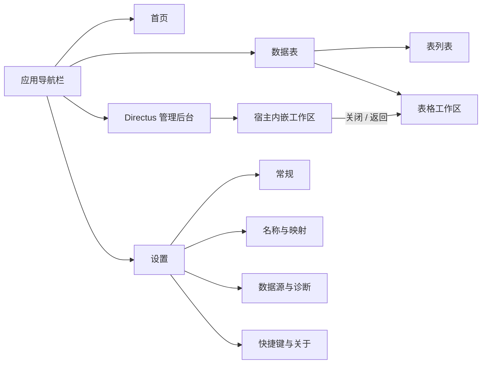
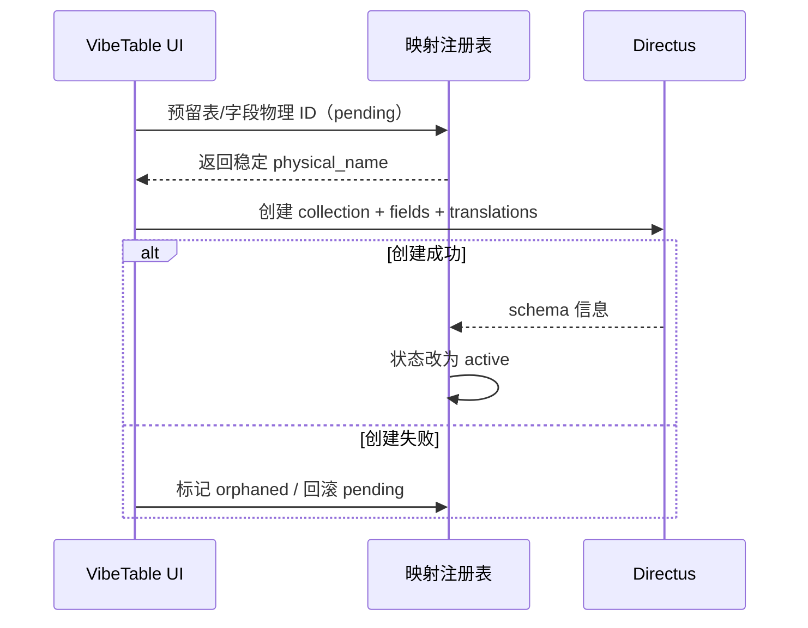

> 历史设计归档；不属于当前产品实现。

# VibeTable 产品与界面统一改版设计

- 日期：2026-07-19
- 状态：P0/P1/P2 已实施并通过自动化门禁与主要真实桌面验收（2026-07-19）
- 范围：中文/任意名称映射、应用导航与首页、Directus 管理后台内嵌、设置与 Tooltip、工具栏和状态反馈、整体视觉统一
- 设计基调：飞书多维表式的克制、轻量、高密度工作界面

## 1. 结论摘要

本轮不应继续在现有“表格单页”上零散增加按钮。建议把 VibeTable 明确为一个有应用外壳的桌面数据工作台：

1. 用户名称与 Directus 物理标识符彻底分离。用户可输入中文、空格、Emoji 等 Unicode 显示名；Directus 始终使用稳定、不可变的 ASCII 物理键。
2. 新建隐藏系统集合 `vibetable_identifier_map`，统一维护表和字段的双向映射、历史别名、来源和同步状态；同时把显示名投影到 Directus collection/field 的 `meta.translations`，让 Data Studio 也显示中文。
3. 主界面增加应用级首页和设置。首页以“继续工作”和空状态引导为主，日历、每日一句只作为低权重填充，不做资讯门户。
4. Directus 管理后台不再覆盖当前主 WebView 导航，而是在主窗口内使用第二个、按需初始化的 WebView2 作为叠加工作区。顶部提供宿主所有的浏览器式外壳和明确“返回 VibeTable”操作，关闭后原表格状态完全保留。
5. 移除常驻“连接 Directus”按钮；刷新降级到更多菜单和快捷键。把连接状态变成右上角低干扰状态胶囊，仅在异常时可操作。
6. 删除 C# 常驻底部状态栏和网页内常驻文本状态栏。启动阶段用宿主级启动画面，运行阶段用网页内局部骨架、Toast、任务中心和故障页。

## 2. 产品信息架构



### 2.1 左侧导航改为两级

第一级为 52px 应用导航栏：

- 顶部：VibeTable 标志。
- 主区：首页、数据表。
- 底部：Directus 管理后台、帮助、设置。
- 仅图标按钮必须提供 Tooltip、选中态和 `aria-label`。

第二级为 220–240px 上下文侧栏：

- 首页：可隐藏，主内容获得更多空间。
- 数据表：搜索、最近使用、全部表、新建表。
- 设置：设置分组目录。
- 不把 Directus 当作普通路由页；点击后打开宿主叠加层。

这样能保留当前表列表的熟悉结构，同时为首页、设置和未来视图留下位置。

## 3. 中文及任意名称映射

### 3.1 核心原则

同一实体同时拥有两类名称：

| 名称 | 示例 | 用途 | 是否可改 |
|---|---|---|---|
| 显示名 `display_name` | `2026年客户清单 ✅` | VibeTable 与 Directus UI 展示 | 可改 |
| 物理名 `physical_name` | `vt_t_01K0…` / `f_01K0…` | Directus API、数据库表/列、契约 | 创建后不可改 |

不要把中文转拼音后直接作为物理名。拼音存在多音字、同音冲突、不可逆和改名联动问题。物理名应与显示名语义无关：

- 表：`vt_t_` + 12–16 位 Crockford Base32 稳定 ID。
- 字段：`f_` + 12–16 位 Crockford Base32 稳定 ID。
- 系统字段继续使用 `id`、`status`、`sort`、`date_created` 等固定键。
- 用户改显示名时，只更新映射和 Directus 翻译，不重命名数据库表或列。

### 3.2 映射集合

创建隐藏系统集合 `vibetable_identifier_map`，继续沿用项目已有的 `vibetable_` 系统保留命名空间。建议字段：

| 字段 | 类型 | 说明 |
|---|---|---|
| `id` | UUID | 映射记录 ID |
| `entity_kind` | enum | `collection` / `field` |
| `parent_physical_name` | string/null | 字段所属表；表记录为空 |
| `physical_name` | string | Directus/数据库真实键 |
| `display_name` | string | 当前默认显示名 |
| `normalized_name` | string | NFKC、去首尾空白、大小写折叠后的冲突键 |
| `locale` | string | 默认 `zh-CN`，为后续多语言留口 |
| `aliases` | JSON | 曾用名、导入名和搜索别名 |
| `origin` | enum | `vibetable` / `directus` / `import` |
| `status` | enum | `pending` / `active` / `orphaned` / `deleted` |
| `created_at` / `updated_at` | timestamp | 审计 |

唯一性约束：

- `physical_name` 在对应实体范围内唯一。
- `normalized_name` 在同一父级内唯一；表在全局唯一，字段只在所属表内唯一。
- 显示名允许中文、空格、标点和 Emoji，但禁止空字符串、控制字符、路径分隔语义和超长输入。

### 3.3 Directus 元数据同步

Directus 官方模型已经支持 collection 的 `meta.translations`；当前 VibeTable 字段读取也会优先使用字段 `meta.translations`。因此采用以下分工：

- `vibetable_identifier_map`：VibeTable 的身份、双向解析、冲突、别名和恢复来源。
- Directus `meta.translations`：映射的展示投影，让 Data Studio 内也显示一致的中文名称。

新建表时，collection 与字段创建请求直接携带 `zh-CN` translation；不要先创建英文键、随后再补 UI 名称。Directus 官方文档明确 collection key 对应数据库表名且创建后不可改，但可通过命名翻译覆盖 Data Studio 展示，因此该拆分与平台模型一致。

参考：

- https://docs.directus.io/reference/system/collections
- https://docs.directus.io/app/data-model/collections
- https://docs.directus.io/app/data-model/fields

### 3.4 创建与修复流程



必须提供幂等 `schema.reconcile`：

- VibeTable 启动、Directus 后台关闭、schema change 事件到达时触发。
- 扫描 Directus 中未登记的用户表和字段并自动收养。
- 优先读取 `zh-CN` translation；没有时用 Directus 格式化标题或物理名作为初始显示名。
- 映射存在但物理实体消失时标记 `orphaned`，不立即硬删除，便于诊断和恢复。
- Directus 管理后台直接修改翻译后，在关闭后台时同步回注册表。

### 3.5 创建表界面变化

当前“名称”输入框应改成“表名称”，允许任意显示名；物理键不再默认暴露。高级设置中可只读显示：

> 数据标识：`vt_t_01K0…` · 自动生成 · 创建后保持不变

字段行同理显示“字段名称”和友好类型中文名。若发生重名，提示：

> 已有字段“联系电话”。可以改为“备用联系电话”，或将它添加为现有字段的搜索别名。

设置页“名称与映射”提供搜索、复制物理键、查看曾用名、导出 JSON；第一版不提供任意修改物理键。

## 4. Directus 管理后台内嵌

### 4.1 推荐架构：窗口内第二 WebView2

当前单 WebView 从 VibeTable 导航到 Directus 会销毁网页运行态，且返回入口依赖页面本身。建议改为：

```text
MainWindow
├─ AppWebView（常驻，VibeTable 不离开、不卸载）
├─ AdminSurface（默认隐藏，打开时覆盖主客户区）
│  ├─ AdminChrome（宿主拥有，38–40px）
│  └─ DirectusWebView（首次打开时懒初始化）
└─ Bootstrap/FatalOverlay（仅启动或网页不可用时显示）
```

两个 WebView 使用同一个 `CoreWebView2Environment`/profile；管理员 session 仍由现有认证器建立并注入。安全策略分开：

- AppWebView 只允许 `https://app.vibetable.local`。
- DirectusWebView 只允许当前 `http://127.0.0.1:<port>`。
- 外部链接继续交给系统浏览器。

收益：

- 关闭后台后，当前表、选区、滚动、未提交 UI 状态原样存在。
- 返回控件不依赖 Directus DOM、路由或插件。
- Directus SPA、REST 和 WebSocket 仍直接访问自身 origin，无代理复杂度。
- 两个浏览上下文的导航白名单更容易审计。

代价是额外 WebView2 内存。采用首次点击再初始化；关闭时默认保留实例以便快速再次打开，后续可在长时间闲置时释放。

### 4.2 浏览器式外壳

外壳只在管理后台打开时出现，不污染主应用：

- 高度 40px，背景 `#F7F8FA`，底边框 `#E5E6EB`，无厚重阴影。
- 左侧三个 10px 圆点表达 Mac 浏览器意象；红点可点击关闭，黄/绿点为装饰并标注不可交互语义，避免制造假功能。
- 红点旁仍保留带文字的“返回 VibeTable”，不能只依赖小圆点。
- 中间为轻量地址胶囊：锁形本地图标 + `本地管理后台 · Directus`，不显示随机端口。
- 右侧提供重新载入和更多菜单；“在外部浏览器打开”默认不提供，因为外部浏览器没有注入会话。
- `Esc` 关闭后台前，若 Directus 页面可能有未保存编辑，应先提示；无法可靠检测时至少提供二次确认设置。

### 4.3 可移动悬浮按钮

它适合作为可选增强，不应是唯一返回方式。第二阶段可通过 `AddScriptToExecuteOnDocumentCreatedAsync` 在 Directus origin 注入 Shadow DOM 胶囊：

- 默认右下角，文字为“返回 VibeTable”，可拖动。
- 位置按窗口尺寸归一化持久化，缩放/分辨率变化后自动吸附到安全边界。
- 单击向宿主发送专用 `admin.closeRequested`；宿主必须校验消息来源 origin。
- 可在设置中关闭；顶部固定外壳始终保留。

## 5. 首页与空状态

首页目标是“快速开始今天的工作”，不是做综合门户。

建议布局：

1. 顶部欢迎区：当前日期、简短问候、全局搜索/快速打开。
2. 主卡片“继续工作”：最近 5 张表，显示名称、最后打开时间和少量状态。
3. 无表时替换为三步引导：新建表、导入数据、打开管理后台。
4. 右侧窄列：迷你日历/今天、每日一句、Directus 健康状态。
5. 每日一句使用内置短句库按日期确定，不依赖联网；可在设置中关闭。

比例建议为主要工作内容 70%，轻内容 30%。日历不做成强交互大组件，以免让用户误以为已有完整日历视图；未来真正实现表格日历视图时，再从首页进入。

## 6. 设置与 Tooltip

### 6.1 设置页

| 分组 | 内容 |
|---|---|
| 常规 | 语言、主题、启动页、首页组件、紧凑度 |
| 名称与映射 | 映射搜索、显示名/物理键、别名、导出、修复扫描 |
| 数据源 | Directus 连接状态、地址类型、重新连接/重启、最后同步时间 |
| 交互 | 快捷键、危险操作确认、后台关闭确认、悬浮按钮 |
| 诊断与关于 | 版本、日志目录、复制诊断信息、开源许可 |

主题切换从当前顶部工具栏迁入设置；右上角用户/偏好菜单可保留快捷入口，但不再占用表格主操作区。

### 6.2 Tooltip 规则

- 所有纯图标按钮在 400–500ms 后显示 Tooltip。
- Tooltip 文案描述动作并可附快捷键，例如“刷新数据（Ctrl+R）”。
- 有文字的普通按钮不重复显示 Tooltip，除非需要解释副作用。
- 被禁用的按钮仍应能说明原因，例如“请先打开一张表”。
- 删除、覆盖、重建映射等危险动作使用确认对话框，不把风险只藏在 Tooltip 中。

## 7. 主工具栏重构

### 7.1 移除与迁移

| 当前项 | 新位置/行为 |
|---|---|
| 连接 Directus | 移除；应用启动时自动连接。异常时由右上状态胶囊提供“重新连接” |
| 刷新 | 从常驻主按钮移到 `…` 更多菜单，保留 `Ctrl+R`；实时事件到达时自动刷新受影响数据 |
| 行数 | 移到表格底部信息区或分页/选区摘要，不与全局操作混排 |
| 主题 | 移到设置/偏好菜单 |
| 快捷键帮助 | 移到帮助入口；`?` 仍可打开 |
| Directus 管理后台 | 移到一级导航栏底部，使用数据库/控制台图标，不与“设置”共用齿轮语义 |

### 7.2 表格页命令区

顶部标题区：面包屑/表显示名、视图名称、收藏或更多。

表格命令区按使用频率排列：

- 主按钮：`+ 新增记录`。
- 高频：筛选、分组、排序、字段、视图。
- 右侧：搜索、撤销/重做、更多。
- 连接状态不进入此行，放在应用级右上角。

当前尚未实现的功能不应先放空壳按钮。第一版可只保留已有能力，并用同一布局预留扩展顺序。

## 8. 状态反馈统一

### 8.1 删除双重底栏

移除：

- WPF `MainWindow.xaml` 常驻底部状态栏。
- Web `StatusBar.vue` 常驻“就绪/已加载”文本。

它们把低价值信息永久占据窗口，并形成两套视觉语言。

### 8.2 分层反馈

| 状态 | 表现 |
|---|---|
| Directus/后端启动中 | 宿主全页启动画面，显示品牌、当前阶段和简短进度；Web 可用后消失 |
| Web 已加载、表数据加载中 | 表格区域骨架或轻量 loading，不遮住侧栏 |
| 保存/同步成功 | 默认静默；必要时短 Toast |
| 可恢复错误 | 网页 Toast + 操作按钮，如“重试” |
| 长任务 | 右上任务中心，可展开查看进度 |
| 连接异常 | 右上状态胶囊变黄/红，点击展开详情与重连 |
| WebView/宿主致命错误 | 宿主全页故障页，提供重试、复制诊断信息、打开日志 |

WPF 仍负责“网页还没加载或已经崩溃”的最后兜底，但不再以系统默认 DockPanel 常驻显示。

## 9. 视觉规范

沿用现有 token 基础，不引入另一套强风格：

- 主色继续使用 `#3370FF`，只用于选中、主动作和链接。
- 背景层级限定为白色、`#F7F8FA`、`#F2F3F5`；卡片主要靠 1px 边框而非大阴影。
- 4px 间距基线，常用控件高度 28/32px，标题区 40–48px。
- 圆角以 6px 为主，首页卡片可用 8px；不使用大面积渐变、玻璃拟态和高饱和装饰。
- Lucide 线性图标统一 1.75px；“设置”和“管理后台”使用不同图标和命名。
- 中文继续使用本地系统字体栈，避免额外字体下载和 CSP/安装体积问题。
- 动效只用于叠加层出现、侧栏收展、任务完成，120–200ms；表格编辑不增加弹跳或缩放。
- 每日一句卡片仅使用极浅的暖灰底，不引入与蓝色主色竞争的新品牌色。

## 10. 实施优先级

### P0：先修产品骨架

1. 显示名/物理名契约与 `vibetable_identifier_map`。
2. 建表流程写入 translations，读取表列表和字段统一使用显示名。
3. schema reconcile 与既有表自动收养。
4. 第二 WebView2 管理后台叠加层 + 固定返回外壳。
5. 移除 WPF/Web 双底栏，建立启动/故障兜底。

### P1：完成应用体验

1. 应用级导航、首页和完整空状态。
2. 设置页与连接状态胶囊。
3. 工具栏重排、Tooltip 和快捷键提示。
4. Directus 后台关闭后触发 schema reconcile。

### P2：体验增强

1. 可移动悬浮返回胶囊。
2. 映射别名管理、导出/导入与修复工具。
3. 首页组件自定义、最近表格排序和每日一句开关。
4. 管理后台 WebView 闲置释放策略。

## 11. 验收标准

### 命名

- 可创建表 `2026年客户清单 ✅`，字段 `联系电话（备用）`、`1月金额`、`备注/说明`，并正常读写。
- Directus 物理表/字段均为安全 ASCII 键，显示名修改后 API 键不变。
- VibeTable 与 Directus Data Studio 都展示相同中文名称。
- 重名、历史别名、外部 Directus 表自动收养有确定行为。

### 管理后台

- 点击管理后台后在主窗口内打开，不弹外部窗口。
- 始终可看到“返回 VibeTable”；关闭后原表、选区和滚动位置不变。
- Directus REST/WS 正常工作；外部 origin 仍被导航白名单阻止。
- 在 Directus 新建/修改 schema 后返回，VibeTable 自动刷新表和映射。

### 界面

- 启动后有主页；无表时不出现空白大画布。
- 图标按钮均有 Tooltip；设置可发现且分类明确。
- 主工具栏不再常驻“连接 Directus”和高权重“刷新”。
- 正常运行时无 C# 常驻底栏，也无重复“就绪”状态。
- 1024×720 下无拥挤或截断；浅色/暗色均有清晰层级和可访问对比度。

## 12. 明确不做

- 不把 Directus 完整重写成 VibeTable 原生管理后台。
- 不把拼音作为用户名称的唯一映射算法。
- 不允许用户直接修改已创建实体的物理键。
- 不让可拖动悬浮按钮成为唯一返回路径。
- 不在首页堆天气、新闻、动态图表等与表格工作无关的内容。
- 不为了 Mac 外壳引入拟物化、玻璃拟态或与飞书风冲突的高装饰视觉。

## 13. 实施与验收记录

截至 2026-07-19，本文 P0/P1/P2 已完成代码实施：名称映射管理工作台支持搜索、物理键复制、别名、JSON 导入/导出和手动修复；Directus 宿主具备固定返回工具条、可拖动悬浮胶囊、关闭确认和闲置释放；首页与设置具备轻量组件开关，连接和状态反馈已统一到网页层。

自动化门禁结果：Python backend/contract 363 项、Web 307 项、.NET Contracts 24 项、Workspace 59 项、Infrastructure 87 项、Desktop 93 项全部通过；前端生产构建、Ruff、WPF 只读冒烟和 `git diff --check` 通过。

真实桌面验收已覆盖 1024×720 首页、Directus 登录/Data Studio、固定与悬浮返回控件、拖动、关闭确认、取消继续、确认返回和快速复开。复开可恢复同一 Directus 页面与侧栏状态，不重复登录或刷新主页面。10 分钟闲置释放由计时器和状态机测试覆盖，本轮未做完整墙钟等待；Directus HTTP/SPA/认证链路已实际验证，WebSocket 未单独抓包断言。
