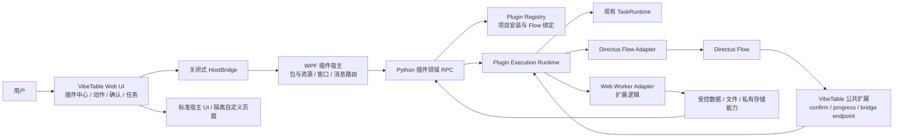
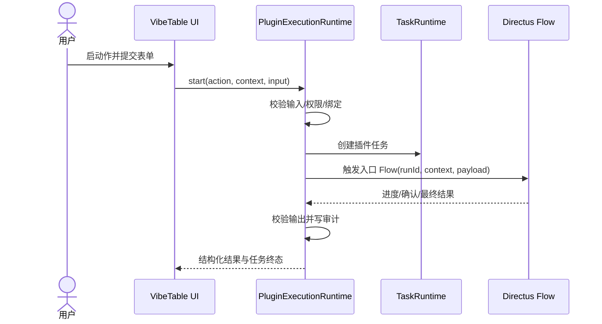

> 历史设计归档；不属于当前产品实现。

# VibeTable Flow 增强插件系统设计规格

- 状态：设计基线（已确认，待实现）
- 日期：2026-07-20
- 适用范围：VibeTable 桌面端、Python BFF、Directus 12.x、插件 SDK/CLI
- 相关领域语言：[历史领域语言归档](../../legacy-flow-plugin-domain-language.md)
- 关键决策：[`ADR 0001`](../../adr/0001-flow-first-plugin-platform.md)

## 1. 结论

VibeTable 插件系统定位为 **Directus Flow 的桌面交互外壳、分发单元和能力补充层**，不是第二套工作流引擎。

业务编排、服务端数据访问、Webhook、定时和事件触发优先由 Flow 完成；插件提供按钮、菜单、表单、弹窗、自定义面板、本地文件、客户端计算、项目级安装、Flow 管理与统一任务体验。Flow 做不到或不适合做的部分才由插件扩展逻辑补足。

首版面向可信的单用户环境，不建设抵御恶意插件的高强度沙箱，也不设置开发者模式。系统仍保留关闭式宿主 API、Web Worker/隔离页面、独立禁网 CSP、权限声明和审计，用于稳定性、误操作控制与清晰的产品边界。

## 2. 背景与现状

VibeTable 当前由 WPF/.NET 宿主、WebView2 中的 Vue 3 前端、Python JSON-RPC BFF 和 Directus 12 组成，已经具备以下可复用能力：

- Web `HostBridge` 与 WPF `WebMessageRouter` 的双侧消息白名单；
- Python `TaskRuntime` 的后台任务、单调进度、有界历史与协作式取消；
- 会话级文件路径授权，不向 Web 暴露原始路径；
- `vibetable-bulk-mutation.v1` 的单表事务、幂等键、并发冲突检查与 10,000 操作上限；
- `--vt-*` 主题变量、亮暗主题、语言和紧凑度状态；
- Directus 扩展清单、构建、测试与随应用发布链路；
- 以 `local:default` 或规范化远程 URL 表示的项目/数据源身份。

当前 Flow 适配仅支持硬编码 approved list 与基础调用，尚不能表达项目级安装、Flow 所有权、逻辑 ID 到 UUID 的映射、输入输出契约、风险、交互确认、进度、更新与偏离。Directus 现有 Flow 执行也没有可恢复的人机审批，因此本设计采用明确的内存确认语义。

## 3. 目标

本设计必须支持：

1. 通过离线 `.vtplugin` 包或本地开发文件夹，按当前 Directus 项目安装插件。
2. 一个插件声明多个动作，动作可采用 `flow`、`local`、`hybrid` 三种执行模式。
3. 托管 Flow 的创建、升级、回滚、偏离检测与卸载，以及外部 Flow 的绑定和只读生命周期。
4. 工具栏、菜单、右键菜单、标准表单、宿主最终确认、自定义面板、进度和结构化结果。
5. 手动写入 Flow 在同一次执行中预览、等待确认并继续执行。
6. TypeScript/JavaScript 客户端扩展逻辑、本地文件授权和受控批量数据能力。
7. 插件中心、项目级启停、错误说明、权限/风险报告、日志和回滚。
8. SDK/CLI 的脚手架、校验、构建、测试宿主和离线打包。

## 4. 非目标

首版明确不包含：

- 第二套可视化或代码式工作流编排引擎；
- 可恢复审批、多人审批、跨设备接力或重启后继续；
- 面向恶意插件的 OS 级沙箱、AppContainer、WASM 安全边界或完整签名信任链；
- 开发者模式或按用户身份切换的高权限模式；
- Python 插件、Node.js 进程、子进程、任意本地路径或原始 SQL；
- 插件自带任意 Directus Operation/Endpoint 代码；
- 插件间依赖、运行时 npm 安装、在线市场或在线自动更新；
- 对外部 Flow 业务正确性和自定义 Operation 行为的形式化证明；
- 多表 Flow 的全局事务承诺；
- 多人共享的插件安装状态同步。

插件开发者可以就是最终用户，但需要具备 TypeScript/JavaScript 和 Directus Flow 的编码与配置能力。首版不提供低代码插件编辑器。

## 5. 核心不变量

以下规则优先于具体实现：

1. **Flow-first。** Flow 能实现的服务端业务逻辑不在插件运行时重复编排。
2. **一个入口 Flow。** 每个 `flow`/`hybrid` 动作只有一个入口 Flow；子 Flow 在 Directus 内编排。
3. **项目级单实例。** 同一项目内同一 `pluginId` 只能有一个当前安装实例。
4. **整体启停。** 任一必要 Flow 缺失、未绑定或契约不兼容时，插件整体禁用，不提供部分动作。
5. **所有权明确。** 托管 Flow 与外部 Flow 在存储、界面和生命周期中不能混用。
6. **外部 Flow 不受管理。** 升级和卸载不得修改、替换或删除外部 Flow。
7. **托管 Flow 不静默覆盖偏离。** 检测到用户修改后暂停自动升级，并要求恢复或转为外部 Flow。
8. **写前确认。** 手动 `write`/`destructive` 动作必须在第一次写入前经过宿主最终确认。
9. **确认不可恢复。** 取消、超时、VibeTable 重启或 Directus 重启会使当前确认失败；用户重新运行动作。
10. **直接调用不放行。** 没有活动 VibeTable 会话时，`vibetable.confirm` 必须拒绝或快速超时，永不自动批准。
11. **取消不作过度承诺。** 取消是协作式请求，不保证中断正在执行的 Directus Operation。
12. **插件代码不直联网。** Worker 和自定义页面不具备网络接口；声明过的 Flow 可以按 Directus 能力访问外部网络。
13. **关闭式宿主能力。** 插件只能调用版本化、白名单式宿主 API，不提供通用 RPC 转发器。
14. **结果结构化。** 插件返回结构化结果和展示意图，不接管主界面、全局导航或宿主状态树。
15. **不扩大 Directus 权限。** 插件声明只能收窄能力；真实数据访问仍受当前 Directus 用户权限限制。

## 6. 总体架构



系统沿用现有真实 Seam，而不是建立平行技术栈：

- **Web Seam：** `HostBridge` 追加少量插件领域消息；
- **WPF Seam：** 新增聚合的 `IPluginRpcGateway` 与插件资源宿主；
- **Python Seam：** 新增插件 contracts、application service、项目存储和 Directus Adapter；
- **Directus Seam：** 通过现有 `/flows`、`/operations` API 及随应用交付的公共扩展工作；
- **构建 Seam：** 公共 Directus 扩展进入既有 `directus/extensions/manifest.json` 与 `scripts/extension_manifest.py` 链路。

## 7. 领域对象

### 7.1 PluginInstallation

表示一个项目中的当前插件实例，包含：

- `projectKey`、`pluginId`、当前版本、包哈希；
- 来源类型：`.vtplugin` 或本地文件夹；
- manifest 快照、权限决定、配置版本；
- 当前状态、错误原因、安装/更新时间；
- 当前与上一可回滚包修订。

状态：

```text
not-installed
  -> inspecting
  -> installing
  -> disabled | enabled
enabled | disabled
  -> upgrading
  -> enabled | disabled | error
enabled | disabled | error
  -> uninstalling
  -> not-installed | error
```

`disabled` 记录原因：用户禁用、Flow 无效、契约不兼容、包损坏或升级待处理。安装中间态不得注册动作。

### 7.2 PluginAction

表示插件的一项能力，至少包含：

- 稳定 `actionId`、本地化名称和说明；
- `mode`：`flow`、`local`、`hybrid`；
- `risk`：`read`、`write`、`destructive`；
- 调用入口：`manual` 或 `webhook`；
- UI 位置和可用上下文条件；
- 输入、输出、配置表单 schema；
- 入口逻辑 Flow ID 和/或 Worker 入口；
- 所需数据、文件、私有存储与外部网络声明。

`hybrid` 不是自由编排器。其固定管线为：本地 `prepare` → 调用一个入口 Flow → 本地 `present`。任一步骤可省略，但插件代码不能通过通用 API 任意串联多个 Flow。

### 7.3 FlowRequirement 与 FlowBinding

`FlowRequirement` 来自包，描述逻辑 Flow ID、所有权、触发器、契约和所需公共 Operation。`FlowBinding` 属于项目，记录：

- `logicalFlowId`；
- `ownership`：`managed` 或 `external`；
- Directus Flow UUID；
- 输入/输出契约版本；
- 安装定义哈希、当前定义哈希与偏离状态；
- 当前修订和保留回滚修订；
- 校验时间、校验结果和错误。

manifest 永不硬编码项目 UUID。运行时始终先由注册表把逻辑 ID 解析为当前项目 UUID。

### 7.4 PluginTask

复用现有 `TaskRuntime` 状态：`queued`、`running`、`succeeded`、`failed`、`cancelled`、`aborted`。另附插件元数据：

- `pluginId`、`pluginVersion`、`actionId`、`runId`；
- 项目、目标集合、选中数量与风险等级；
- 进度快照、待确认交互、取消请求标记；
- 结构化结果或安全错误；
- 开始/结束时间和审计关联 ID。

`cancelRequested` 是任务附加标记，不新增一个与现有运行时冲突的终态。只有执行器确认已停止且没有继续副作用时才进入 `cancelled`。

### 7.5 CommandContext

宿主向动作提供只读、版本化上下文：

- 项目标识和当前集合；
- 选中主键、当前筛选/排序的结构化快照；
- 语言、主题、紧凑度；
- 当前用户可显示身份与宿主版本；
- 可用能力句柄。

上下文不暴露 Pinia、Tabulator、Vue 组件、WPF 对象、Directus token 或原始本地路径。

## 8. 深模块与接口

模块接口应围绕完整业务任务设计，隐藏跨层顺序、补偿和存储细节。实现中可以调整类型名，但不得把这些职责拆成大量一对一传递层。

### 8.1 PluginRegistry

负责包检查、安装、项目状态、修订、启停、升级、回滚和卸载。Interface：

```text
inspect(source, project) -> InstallPlan
install(approvedPlan) -> PluginSnapshot
upgrade(pluginId, source) -> UpgradePlan | PluginSnapshot
rollback(pluginId, targetRevision) -> PluginSnapshot
setEnabled(pluginId, enabled) -> PluginSnapshot
uninstall(pluginId, cleanupPolicy) -> UninstallResult
get(pluginId) / list(project) -> PluginSnapshot
```

`InstallPlan` 是提交前的完整预览，包含包身份/哈希、版本兼容性、动作、数据权限、文件能力、Flow 网络声明、自动触发器、托管 Flow 变更和外部 Flow 待绑定项。`install` 只接受仍与当前项目快照匹配的 plan，避免预览后环境变化。

### 8.2 FlowBindingManager

负责逻辑 ID、Directus UUID、所有权、定义修订和契约校验。Interface：

```text
plan(requirements, project) -> BindingPlan
provisionManaged(plan) -> ManagedBindingSet
bindExternal(logicalFlowId, directusUuid, attestation) -> FlowBinding
validateAll(pluginId) -> BindingHealth
detectDrift(pluginId) -> DriftReport
resolveDrift(logicalFlowId, restore | detach) -> FlowBinding
rollbackManaged(logicalFlowId, revision) -> FlowBinding
removeOwned(pluginId) -> RemovalReport
```

Module 隐藏 Directus Flow/Operation 创建顺序、激活切换、哈希规范化、补偿动作与旧修订清理。测试使用内存 Directus Adapter，而不是直接断言内部辅助函数。

### 8.3 PluginExecutionRuntime

是 UI 启动所有动作的单一 Interface：

```text
describe(actionId, context) -> ActionAvailability
start(actionId, context, input) -> TaskHandle
resolveInteraction(taskId, interactionId, decision) -> InteractionResult
requestCancel(taskId) -> CancelRequestResult
getTask(taskId) -> PluginTaskSnapshot
```

Module 负责输入校验、风险策略、任务创建、Worker/Flow 固定管线、输出校验、结构化结果、审计和终态。UI 不分别调用 Flow、Worker 或批量写入服务。

### 8.4 PluginInteractionBroker

封装 Directus 中的内存交互状态与宿主轮询/长轮询协议：

```text
watch(runId) -> async InteractionSnapshot stream
resolve(runId, interactionId, approved | rejected) -> ResolveResult
requestCancel(runId) -> CancelFlag
close(runId, outcome) -> void
```

运行时只理解“确认、进度、取消标记”，不依赖 Directus endpoint 路径。真实 Adapter 使用 VibeTable 公共扩展；测试 Adapter 在内存中控制超时、重启和竞争条件。

### 8.5 PluginWorkerSupervisor

负责启动、限制和终止预构建 JavaScript Worker，向其暴露版本化 Capability API，并把 Worker 事件关联到插件任务。它不解释业务逻辑，也不提供网络、DOM、Node 或任意 RPC。

主应用页面不直接 `import` 插件代码。Supervisor 通过该插件修订的独立 runner 页面启动 Worker，runner 与主应用只交换版本化消息；插件资源宿主为文档和 Worker 响应注入独立 CSP，并拦截插件来源的外部资源请求。

```text
prepare(workerEntry, context, input, capabilities) -> PreparedInput
run(workerEntry, context, input, capabilities) -> LocalResult
present(workerEntry, flowResult, capabilities) -> StructuredResult
terminate(runId, reason) -> TerminationResult
```

### 8.6 PluginUiHost

负责动作注册、宿主标准 UI、自定义页面、主题投影、最终确认和结构化结果展示。标准表单优先由宿主根据 schema 渲染；只有复杂可视化或独特交互使用自定义页面。

插件只能表达内容和展示意图，具体工具栏尺寸、菜单层级、模态层级、危险色、焦点管理和无障碍行为由宿主决定。

### 8.7 PluginProjectStore

为插件领域提供项目级事务存储，隐藏 SQLite 表、并发版本和路径布局。安装注册表、Flow 绑定、包修订、私有配置和审计使用独立表，不能塞入现有 grid state JSON。

项目键必须复用现有 Directus source scope 规范化结果。首版安装状态是设备本地的；同一远程 Directus 在另一设备上不会自动同步插件安装。

### 8.8 Adapter 列表

- `DirectusFlowAdapter`：Flow/Operation CRUD、触发、定义读取与激活；
- `DirectusInteractionAdapter`：公共扩展的观察、确认和取消；
- `WebWorkerAdapter`：Worker 生命周期与 Capability 消息；
- `WebViewPluginBridgeAdapter`：Web/WPF 白名单消息；
- `ProjectPluginStoreAdapter`：本地项目级持久化；
- `PathGrantAdapter`：复用现有文件选择与授权；
- `BulkMutationAdapter`：复用 `vibetable-bulk-mutation.v1`；
- 对应内存 Adapter：供模块级状态机和失败补偿测试使用。

## 9. 包格式与 manifest

### 9.1 包布局

`.vtplugin` 是可离线检查的 ZIP 容器，推荐布局：

```text
example.vtplugin
├─ manifest.json
├─ integrity.json
├─ schemas/
│  ├─ action-input.v1.json
│  ├─ action-output.v1.json
│  └─ action-form.v1.json
├─ flows/
│  └─ normalize-text.flow.json
├─ dist/
│  ├─ workers/normalize-text.js
│  └─ views/overview/
│     ├─ index.html
│     ├─ index.js
│     └─ style.css
├─ locales/
│  ├─ zh-CN.json
│  └─ en.json
└─ assets/
```

规则：

- 所有运行时依赖必须在构建时打包，不允许运行时安装 npm 包或下载资源；
- 路径必须是包内相对路径，拒绝绝对路径、`..` 逃逸、符号链接和重复归一化路径；
- `integrity.json` 记录每个文件的 SHA-256；安装器另记录整个规范化包的哈希；
- 哈希用于完整性、变更检测和审计，不等同发布者签名或可信身份；
- 包大小、单文件大小、解压后大小和文件数量必须有宿主上限，防止误打包耗尽资源；
- 本地开发文件夹遵守相同 manifest、权限和运行时契约，只增加显式“重新加载”与文件变更提示，不引入开发者模式。

### 9.2 manifest 示例

以下示例表达契约方向，不替代最终 JSON Schema：

```json
{
  "$schema": "vibetable.plugin-manifest.v1",
  "pluginId": "com.example.normalize-text",
  "version": "1.0.0",
  "displayName": { "zh-CN": "批量文本规范化" },
  "description": { "zh-CN": "预览并规范化选中记录中的文本" },
  "compatibility": {
    "minHostVersion": "1.0.0",
    "pluginApi": "1.x",
    "directus": ">=12.1 <13"
  },
  "permissions": {
    "data": [
      {
        "collection": "$active",
        "operations": ["read", "update"],
        "fields": ["$configured"]
      }
    ],
    "files": [],
    "privateStorage": true
  },
  "actions": [
    {
      "actionId": "normalize-selection",
      "displayName": { "zh-CN": "规范化选中文本" },
      "mode": "flow",
      "risk": "write",
      "invocation": "manual",
      "placements": ["table.toolbar", "table.context-menu"],
      "requires": { "selection": "one-or-more" },
      "entryFlow": "normalize-text",
      "formSchema": "schemas/action-form.v1.json",
      "inputSchema": "schemas/action-input.v1.json",
      "outputSchema": "schemas/action-output.v1.json"
    }
  ],
  "flows": [
    {
      "logicalFlowId": "normalize-text",
      "ownership": "managed",
      "trigger": "manual",
      "risk": "write",
      "definition": "flows/normalize-text.flow.json",
      "inputSchema": "schemas/action-input.v1.json",
      "outputSchema": "schemas/action-output.v1.json",
      "requiresOperations": [
        "vibetable.confirm@1",
        "vibetable.progress@1"
      ],
      "externalNetwork": {
        "required": false,
        "purpose": null
      }
    }
  ],
  "ui": { "customViews": [] }
}
```

### 9.3 契约版本

- manifest、Plugin API、公共 Operation、动作输入和动作输出分别版本化；
- 输入输出使用受限 JSON Schema 方言，CLI 与运行时使用同一校验器测试向量；
- 小版本只能向后兼容增加可选字段；破坏性变更必须提升主版本；
- 包安装时检查宿主、Plugin API、Directus 和公共 Operation 版本；
- 运行前再次校验输入，运行后再次校验输出，不能只信任安装期检查；
- 外部 Flow 没有 Directus 原生 schema 元数据时，由绑定记录保存预期 schema，运行时校验实际输入/输出。

## 10. 权限与能力模型

权限声明是产品级约束和透明度机制，不是抵御恶意代码的安全证明。

### 10.1 能力类型

首版 Capability API 只包含：

- `data.read`：按声明集合/字段、游标或分页读取；
- `data.mutate`：提交类型化 mutation plan；
- `file.pickRead`：用户选择后获得会话授权句柄；
- `file.pickWrite`：用户选择目标后写入；
- `storage.private`：插件命名空间内的项目级 JSON 配置；
- `ui.emitResult`、`ui.reportProgress`：结构化结果和进度；
- `context.read`：读取当前命令上下文。

不提供：原始 Directus token、任意 URL 请求、原始 SQL、Node API、进程、环境变量、注册表、任意文件路径、宿主 DOM、Pinia、Tabulator 或通用 RPC。

### 10.2 数据范围

数据权限按操作、集合和字段声明。`$active`、`$configured` 等占位符在安装配置中解析为明确项目范围，并把最终结果展示给用户。运行时取以下交集：

```text
manifest 声明范围
∩ 用户安装时批准范围
∩ 当前动作需要范围
∩ 当前 Directus 用户真实权限
```

插件权限不能绕过 Directus 权限。批量读取必须分页；单页行数和序列化体积均受宿主限制，避免越过当前 WebView 4 MB 消息上限。

### 10.3 写入

- `local`/`hybrid` 的客户端写入必须先形成 mutation plan，由宿主渲染最终预览并调用 `vibetable-bulk-mutation.v1`；
- 单次写入沿用 10,000 操作上限、幂等键、预期版本和冲突报告；
- 大规模或多步服务端写入优先放入 Flow；
- 多表/多 Operation Flow 不声明全局原子性，插件说明必须准确描述可见事务边界；
- `destructive` 预览必须展示目标范围、不可逆影响和危险视觉，不默认提供静默批量执行。

### 10.4 文件与私有存储

文件访问复用当前路径授权机制，插件只接收短期 grant ID 和显示元数据。私有存储按 `projectKey + pluginId` 隔离，适合配置和缓存，不用于存放业务主数据。敏感凭据不写入普通 JSON 配置；需要时引用宿主凭据句柄或 Directus 端配置。

### 10.5 网络

插件 Worker、自定义页面和宿主 Capability API 均不提供外部网络。自定义页面使用独立 `connect-src 'none'`，不能依赖当前主页面 CSP，因为主页面仍允许自己的外部服务。

Flow 可以使用 Directus 的网络 Operation，但 package 必须按 Flow 声明 `externalNetwork.required` 和用途，安装/升级时显著展示。首版声明用于知情和审计，不承诺技术上限制目标域名；外部 Flow 的网络行为由用户维护。

## 11. Flow 所有权与生命周期

### 11.1 托管 Flow 安装

安装器按以下补偿式流程执行：

1. 验证包、兼容性、公共 Operation、权限决定和所有外部绑定；
2. 为每个托管 Flow 创建新的未激活 Directus Flow；
3. 创建 Operation 图并回读规范化定义；
4. 校验触发器、图连通性、逻辑契约、风险规则和定义哈希；
5. 写入项目绑定草稿；
6. 激活需要激活的新 Flow；
7. 在本地事务中提交安装记录、绑定和包修订；
8. 注册动作和自动化状态。

任一步失败都执行已知补偿：停用/删除本次新建 Flow、撤销草稿和移除未提交包目录。补偿失败时插件保持整体禁用并在插件中心给出可重试清理项。

### 11.2 外部 Flow 绑定

用户在安装或插件中心选择 Directus Flow UUID。绑定器只读检查：

- Flow 存在且当前用户可访问；
- 触发器类型与 action 契约相符；
- 能读取时，检查必要公共 Operation 和图结构；
- 输入/输出 schema 版本由绑定声明并在运行时验证；
- `write`/`destructive` 外部 Flow 必须包含确认点或明确属于无需运行时确认的自动 Flow；
- 无法证明的自定义 Operation/副作用以警告展示，由可信用户确认绑定。

绑定不会向外部 Flow 写入 VibeTable 元数据。解绑、升级或卸载只删除本地绑定。

### 11.3 升级

托管 Flow 不原地覆盖：

1. 读取当前 Flow 并执行偏离检查；
2. 若有偏离，暂停升级；
3. 创建新版本未激活 Flow/Operation；
4. 校验新定义和契约；
5. 对手动 Flow：切换绑定并激活新版本，再停用旧版本；
6. 对事件/定时 Flow：先停用旧版本，再激活新版本并切换绑定，避免重复触发；
7. 任一步失败时恢复原绑定和原激活状态；
8. 保留上一完整可用包修订及其已停用托管 Flow，供一次直接回滚。

Directus 与本地 SQLite 之间没有分布式事务，因此这里保证的是可检测、可补偿、可重试，不声称绝对原子切换。

### 11.4 偏离

托管 Flow 的规范化定义哈希与安装定义哈希不同即标记 `drifted`。偏离本身不一定代表损坏：

- 契约仍有效时，现有动作可继续运行，但自动升级暂停并持续显示警告；
- 契约已失效时，插件整体禁用；
- 用户可选择“恢复插件版本”，用包定义创建新托管修订并切换；
- 或选择“转为外部 Flow”，保留当前 UUID 与用户修改，VibeTable 放弃其后续管理权；
- 系统永不静默覆盖用户修改。

### 11.5 回滚

回滚恢复上一完整包修订、manifest、配置迁移点和所有托管 Flow 绑定。不能只回滚前端包而保留不兼容的新 Flow。外部 Flow 绑定默认保留，但必须重新执行契约校验；不兼容时回滚结果为整体禁用并提示重新绑定。

### 11.6 卸载

卸载顺序：

1. 立即隐藏动作并阻止新任务；
2. 请求取消活动任务，但明确可能无法停止 Directus 当前 Operation；
3. 停用托管自动 Flow，随后删除由该插件拥有的托管 Flow 修订；
4. 删除本地包、绑定和当前安装记录；
5. 外部 Flow 只解绑，绝不修改或删除；
6. 业务数据、用户文件、任务/审计记录永不随插件删除；
7. 私有配置由用户选择保留或清理，默认保留以便重装。

如果 Directus 不可达，卸载先完成本地禁用并记录待清理托管资源；插件中心在恢复连接后重试，不把外部 Flow 纳入清理队列。

## 12. 执行模型

### 12.1 动作可用性

UI 展示动作前由 `describe` 统一判断：插件启用、全部必要 Flow 健康、上下文匹配、选择数量有效、权限范围已解析、宿主/Directus 兼容。UI 不自行复制判断规则。

### 12.2 `flow` 动作



Directus manual trigger 的请求体由 Adapter 负责适配，必须包含 Directus 所需顶层 `collection` 和需要时的 `keys`，并在版本化 payload 中携带 `runId`、`pluginId`、`actionId`、输入和上下文摘要。现有 `flow.invoke` 的简单包装不能直接作为最终契约。

### 12.3 `local` 动作

Worker 在固定 API 下运行。只读动作可直接返回结构化结果；写入动作先返回 mutation plan 和预览，宿主确认后再由 Python 侧批量写入 Adapter 执行。Worker 不能直接持有 Directus 凭据或绕开写入服务。

### 12.4 `hybrid` 动作

运行时按固定阶段执行：

1. Worker `prepare` 处理本地文件、客户端数据或构造 Flow 输入；
2. 运行时校验 prepare 输出；
3. 调用唯一入口 Flow；
4. 校验 Flow 输出；
5. Worker `present` 生成本地文件或结构化展示结果。

任何阶段失败都结束同一插件任务。阶段状态写入进度，但不形成可由插件任意编辑的工作流图。

### 12.5 Webhook、定时与事件 Flow

- Webhook action 由 Directus 触发器提供入口，不要求 VibeTable 正在运行；它不注册桌面按钮，插件中心展示 URL/状态时不得泄露密钥；
- 定时/事件 Flow 属于插件声明的托管自动化，可没有对应 UI action；
- 自动 Flow 不等待 VibeTable 确认点，否则会因无活动会话失败；
- 安装/升级预览必须列出触发器、风险、数据范围和外部网络声明；
- 自动 Flow 的执行历史以 Directus 为主，VibeTable 只展示能安全关联的摘要，不承诺实时任务控制。

## 13. 确认、进度与取消

### 13.1 公共 Directus 扩展

VibeTable 随主程序交付一个版本化公共扩展包，至少提供：

- `vibetable.confirm@1` Operation；
- `vibetable.progress@1` Operation；
- 供 VibeTable 运行时观察与解决交互的 bridge endpoint。

插件包只能引用这些公共能力，不能携带自己的服务器扩展代码。公共扩展进入既有 Directus 扩展 manifest、构建、版本检查、QA 与发布流程。

bridge endpoint 面向宿主而不是插件页面，使用当前 Directus 鉴权，并验证 `runId`、项目、调用用户和一次性交互 ID。建议的抽象资源为：

```text
GET  /vibetable-plugin-bridge/runs/{runId}
POST /vibetable-plugin-bridge/runs/{runId}/confirm/{interactionId}
POST /vibetable-plugin-bridge/runs/{runId}/cancel
```

具体路径可在实现时调整，但 `PluginInteractionBroker` Interface 和状态语义不变。GET 可以实现短轮询或有界长轮询；不能要求 Web 插件代码直接访问该 endpoint。

### 13.2 内存运行状态

公共扩展在 Directus 进程内保存有界、带过期时间的运行状态：

```text
runId
pluginId / actionId / caller
createdAt / updatedAt / expiresAt
progress { current, total, message, cancellable }
pendingConfirmation { interactionId, risk, title, preview, expiresAt }
cancelRequested
terminalHint
```

状态只用于当前执行协调，不是任务数据库。Flow 结束、确认超时或最长运行 TTL 到达后移除；数量和 payload 大小必须有上限。

### 13.3 `vibetable.confirm@1`

Operation 接收结构化参数：

```json
{
  "contract": "vibetable.confirm.v1",
  "runId": "...",
  "risk": "write",
  "title": "即将更新 128 条记录",
  "preview": {
    "summary": [],
    "sampleRows": [],
    "affectedCount": 128,
    "warnings": []
  },
  "timeoutMs": 300000
}
```

行为：

1. 校验 run 已由活动 VibeTable 调用创建；
2. 注册唯一 `interactionId` 和内存 Promise；
3. `PluginInteractionBroker` 观察到待确认，通知宿主 UI；
4. 宿主用统一确认组件渲染最终预览；
5. 用户批准后 endpoint 解决 Promise，同一个 Flow 从 Operation 之后继续；
6. 用户拒绝、会话关闭、超时或 Directus 重启时 Operation 抛出明确终止错误。

同一 run 同一时间只允许一个待确认。重复或过期决定返回幂等结果，不得批准新的交互。默认超时 5 分钟，宿主可设更短值；首版上限 15 分钟。

直接在 Directus 后台或其他客户端触发包含确认点的 Flow 时，因为没有活动 run 注册，Operation 必须立即拒绝或在短暂握手超时后失败，永不默认批准。

### 13.4 写前规则

- 托管手动 `write`/`destructive` Flow 的验证器必须确认所有声明为写入的可达路径在首次写入节点前经过确认点；
- 对 Directus 内建写入节点可以做图支配关系检查；无法识别的自定义节点使托管 Flow 校验失败；
- 外部 Flow 至少校验确认点存在和已知写入节点顺序，无法证明的自定义副作用由用户在绑定时明确确认；
- Flow 作者不得把预览之后发生的范围扩大隐藏在未展示逻辑中；运行时仍以可信开发者为前提；
- `read` 动作不得为了规避风险规则而实际写入，发现 manifest/定义不一致时记错误并禁用插件。

### 13.5 `vibetable.progress@1`

Operation 更新当前 run 的进度，并返回取消标记：

```json
{
  "contract": "vibetable.progress.v1",
  "runId": "...",
  "current": 40,
  "total": 128,
  "message": "正在处理第 40 条",
  "cancellable": true
}
```

响应：

```json
{ "cancelRequested": false }
```

进度必须单调，越界或倒退由公共 Operation 归一化/拒绝。没有 progress 节点时，UI 显示不确定进度，不把缺少进度视为失败。

### 13.6 取消语义

1. 用户点击取消后，任务显示“正在请求取消；当前操作可能继续完成”；
2. 宿主设置 run 的 `cancelRequested`，并请求终止尚未产生副作用的 Worker 阶段；
3. Flow 在下一次 `vibetable.progress` 或显式检查时观察标记并自行分支终止；
4. 正在执行的 Directus Operation 可能继续，终止 HTTP 等待也不代表服务端已停止；
5. 如果工作最终完成，任务按真实结果进入 `succeeded` 或 `failed`，同时记录曾请求取消；
6. 只有运行时确认没有继续执行时才标为 `cancelled`；进程意外消失使用现有 `aborted`。

## 14. UI 与视觉契约

### 14.1 标准 UI

首选由宿主渲染：

- 动作按钮、菜单项和右键项；
- JSON Schema 表单与字段校验；
- 安装/升级权限和风险预览；
- 最终写入/危险确认；
- 进度、取消提示、错误和结构化结果；
- 插件中心的安装、启停、更新、回滚、绑定和日志。

这样可以统一键盘操作、焦点、读屏标签、对比度、危险色、模态层级和主界面密度。

### 14.2 自定义页面

复杂数据概览、图表或特殊交互可以使用自定义 HTML/CSS/JavaScript 页面。页面运行在单独文档中：

- 每个插件包修订使用独立、不可变的虚拟 origin，例如由包哈希派生的 `https://<hash>.plugins.vibetable.local`；
- iframe 使用 `sandbox="allow-scripts allow-same-origin"`，但不授予弹窗、顶级导航、表单逃逸或下载；独立 origin 确保它不与主应用或其他插件同源；
- 资源宿主为文档和 Worker 响应注入 CSP，至少包含 `default-src 'none'`、精确 script/style/img/font 来源和 `connect-src 'none'`；
- WebView 资源拦截器拒绝插件 origin 发起的外部 URL、WebSocket、EventSource 和动态远程 import，service worker 不可用；
- 与宿主只通过带 surface token 的版本化 `postMessage` 协议通信；
- 页面不能读取或修改宿主 DOM、路由、Pinia、Tabulator、WebView 对象或其他插件资源；
- 页面关闭后 surface token 立即失效。

当前威胁模型不以抵御精心构造的恶意插件为目标，但这些边界必须存在，避免普通错误污染主应用。

### 14.3 主题、语言与密度

宿主把现有主题状态投影为稳定的插件语义变量，例如：

```css
--vt-plugin-bg
--vt-plugin-surface
--vt-plugin-text
--vt-plugin-text-muted
--vt-plugin-border
--vt-plugin-primary
--vt-plugin-danger
--vt-plugin-radius
--vt-plugin-space-unit
```

自定义页面可以在内容区域发展自己的视觉风格，但必须从这些变量派生底色、文本、边框、强调色和间距。主题、语言或紧凑度变化时宿主实时发送新快照。manifest 与 schema 文案支持 i18n key；首版不强制每个插件交付多语言。

### 14.4 命令上下文与结果

插件动作入口由主界面控制。插件只能声明 `placements` 和 `requires`，不能指定绝对位置或覆盖核心导航。结果采用版本化结构：

```json
{
  "contract": "vibetable.plugin-result.v1",
  "status": "success",
  "summary": "已更新 128 条记录",
  "metrics": [{ "label": "跳过", "value": 3 }],
  "table": null,
  "artifacts": [],
  "refresh": { "collections": ["articles"] },
  "warnings": []
}
```

宿主决定如何刷新数据和展示结果。插件不得主动操纵当前表格或强制页面跳转。

## 15. 项目存储模型

建议在本地状态数据库建立独立表。字段可按现有迁移框架调整，语义如下：

### 15.1 `plugin_installations`

```text
project_key + plugin_id 复合主键
version / status / disabled_reason
package_hash / source_type / source_location
manifest_json / permission_grant_json
config_revision / installed_at / updated_at / last_error
```

### 15.2 `plugin_package_revisions`

```text
project_key + plugin_id + version + package_hash
local_path / manifest_json / state(current|rollback|staged)
created_at
```

默认保留当前和上一完整可用修订；包体积虽有限，仍应设置项目总量上限并允许用户清理更旧失败暂存。

### 15.3 `plugin_flow_bindings`

```text
project_key + plugin_id + logical_flow_id 复合主键
ownership / directus_flow_uuid / trigger_type
contract_version / installed_definition_hash / observed_definition_hash
revision / health / drift_status / validated_at / last_error
```

### 15.4 `plugin_private_settings`

```text
project_key + plugin_id + setting_key 复合主键
value_json / revision / updated_at
```

### 15.5 `plugin_audit_events`

```text
event_id / project_key / plugin_id / plugin_version / package_hash
action_id / run_id / actor / event_type / risk
target_collection / target_count
started_at / finished_at / outcome / error_code
details_json
```

审计默认不保存完整敏感字段值、文件内容或 Directus token。插件卸载不删除审计。

### 15.6 并发与未来多人使用

首版是单人工具，但所有修改记录 `revision` 并采用乐观并发。项目绑定、Flow 切换和配置更新遇到版本冲突时必须重读并重新生成 plan，而不是最后写入覆盖。actor 字段始终存在，为未来多人或多设备扩展保留语义，但首版不实现同步。

## 16. 跨层消息与契约

### 16.1 Web ↔ WPF

在现有 HostBridge 白名单中增加插件领域消息，建议最小集合：

```text
plugin.catalog.list
plugin.install.inspect
plugin.install.commit
plugin.externalFlow.listCandidates
plugin.externalFlow.bind
plugin.lifecycle.setEnabled
plugin.lifecycle.upgrade
plugin.lifecycle.rollback
plugin.lifecycle.uninstall
plugin.action.describe
plugin.action.start
plugin.interaction.resolve
plugin.task.cancel
plugin.task.get
plugin.surface.event
```

不增加 `rpc.invoke(method, params)` 或让前端传任意 Python 方法名。大数据使用分页/游标和任务通知，不能塞入单个 WebView 消息。

### 16.2 WPF ↔ Python

新增聚合式 `IPluginRpcGateway`，由 WPF 处理文件选择、插件资源虚拟主机和窗口生命周期，由 Python 处理插件领域状态、Directus、任务和审计。现有 `IDirectusRpcGateway` 保持数据/schema 职责，不持续膨胀 Flow 生命周期方法。

Python JSON-RPC 方法按完整用例设计，例如 `plugin.inspectInstall`、`plugin.commitInstall`、`plugin.startAction`，而不是一一暴露数据库 CRUD。

### 16.3 事件

任务、安装和绑定变化沿用宿主通知通道，事件 envelope 至少包含契约版本、项目、实体 ID、revision 和快照。UI store 以 revision 丢弃乱序旧事件；断线后通过 `list/get` 重建，不依赖事件完整重放。

### 16.4 错误

所有层归一化为安全错误：

```text
code
message
recoverability: retry | rebind | reconfigure | reinstall | none
pluginId / actionId / runId（可选）
details（已清洗）
causeId（日志关联）
```

稳定错误码至少覆盖：包无效、版本不兼容、权限未批准、Flow 未绑定、Flow 缺失、契约不匹配、托管 Flow 偏离、确认拒绝、确认超时、取消未保证、输出无效、Directus 不可达和 Worker 终止。

## 17. 故障、审计与可观测性

### 17.1 故障隔离

- Worker 异常只终止当前任务；连续失败可按宿主阈值整体禁用插件并提示用户；
- 自定义页面崩溃不影响主页面，重新打开创建新 surface；
- manifest、schema、结果和交互 payload 均有体积与深度上限；
- Flow/Worker/bridge watch 使用独立超时，避免当前 HostBridge 默认短超时误杀长任务；
- 长任务由 TaskRuntime 持有，关闭动作弹窗不取消任务；
- VibeTable 退出时活动本地任务标为 `aborted`；Directus Flow 可能继续的情况必须在下次打开时提示未知结果，不伪造失败回滚。

### 17.2 审计事件

记录安装检查/提交、启停、升级、回滚、卸载、外部绑定、偏离解决、动作开始/确认/取消请求/结束，以及包 ID、版本、哈希、目标数量、耗时和结果。默认不记录完整输入、预览样本和结果数据；诊断导出必须再次由用户确认。

### 17.3 任务历史

任务中心复用现有有界历史。持久审计和短期任务快照分开：任务中心面向用户操作，审计面向追踪。卸载不删除两者，但后台保留策略可以按时间/数量清理非敏感历史。

## 18. 插件中心

插件中心按当前项目展示，而不是设备全局列表。主要能力：

- 从 `.vtplugin` 或本地文件夹检查并安装；
- 展示版本、包哈希、来源、兼容性和完整性；
- 展示动作、风险、数据/文件能力、Flow 外部网络和自动触发器；
- 绑定/重绑外部 Flow，并始终显示“外部 Flow 由用户维护”；
- 展示托管 Flow UUID、修订、偏离、回滚与“由 VibeTable 管理”；
- 整体启用/禁用、离线升级、回滚和卸载；
- 查看当前错误、任务摘要和审计；
- 本地文件夹显式重新加载；变更后重新检查权限、schema 和 Flow plan，不能热替换正在运行的任务。

当插件整体禁用时，界面列出全部阻断原因，但只提供一个插件级启停状态，避免出现“部分动作似乎可用”的混淆。

## 19. SDK 与 CLI

首版 CLI 提供：

```text
vibetable-plugin init
vibetable-plugin validate
vibetable-plugin build
vibetable-plugin test
vibetable-plugin inspect-permissions
vibetable-plugin pack
```

- `init`：生成 TypeScript、manifest、schema、测试和可选 Flow 模板；
- `validate`：校验 ID、版本、包路径、schema、动作/Flow 引用、风险和确认点图规则；
- `build`：把所有 JavaScript 及依赖打成自包含产物，拒绝未解析动态 import；
- `test`：在离线测试宿主和内存 Adapter 中运行动作，模拟数据分页、文件 grant、确认、超时、取消和主题；
- `inspect-permissions`：生成人可读权限/网络/自动触发器报告；
- `pack`：生成 `integrity.json` 和确定性 `.vtplugin`，输出包哈希。

SDK 暴露 TypeScript 类型、schema 辅助、Worker Capability 客户端、结果构造器和测试假实现。它不暴露 WPF/Python 内部类或 Directus token。

## 20. 参考插件

### 20.1 批量文本规范化

用于验证写入主路径：

- 工具栏/右键动作和标准配置表单；
- 读取当前选择，Flow 计算预览；
- `vibetable.confirm` 展示样本、数量和警告；
- 同一 Flow 在确认后执行写入；
- `vibetable.progress` 更新任务并检查取消；
- 返回更新/跳过/冲突统计；
- 覆盖包安装、托管 Flow 升级、偏离和回滚。

### 20.2 数据概览面板

用于验证只读自定义 UI：

- 自定义页面和宿主主题实时同步；
- 通过分页 Capability API 获取聚合/样本数据；
- 不直接联网、不访问宿主 DOM；
- 返回结构化刷新或导出意图；
- 覆盖亮暗主题、语言、紧凑度和无障碍测试。

## 21. 实施阶段

### Phase A：契约、注册表与只读外部 Flow MVP

- manifest JSON Schema、包检查/哈希、项目存储迁移；
- `PluginRegistry`、`FlowBindingManager` Interface 与内存 Adapter；
- 外部手动只读 Flow 绑定、输入输出校验；
- 插件中心最小安装/启停/卸载；
- Web/WPF/Python 关闭式契约。

此阶段证明项目级单实例、逻辑 ID → UUID 和 UI 动作入口，不引入写入确认。

### Phase B：托管 Flow 生命周期

- Directus Flow/Operation CRUD Adapter；
- 托管 Flow 安装、补偿、离线升级、偏离、恢复/转外部、回滚和卸载；
- 自动触发器风险预览；
- Directus 扩展 manifest/release 集成准备。

### Phase C：任务、确认、进度与写入

- 公共 `confirm`/`progress`/bridge 扩展；
- `PluginExecutionRuntime` 与现有 `TaskRuntime` 集成；
- 宿主统一最终确认、协作式取消和任务中心；
- 托管 Flow 写前图校验；
- 批量文本规范化参考插件。

### Phase D：本地/混合运行时与自定义 UI

- Worker Supervisor、Capability API、分页数据和路径 grant；
- local/hybrid 固定管线与 bulk mutation 复用；
- 隔离自定义页面、独立 CSP、主题/语言/密度同步；
- 数据概览参考插件。

### Phase E：SDK、CLI 与产品化收尾

- 脚手架、离线测试宿主、确定性打包和权限报告；
- 完整错误恢复、审计、诊断和保留策略；
- 性能、无障碍、兼容矩阵与发布门禁。

每个阶段都必须保持核心功能为内建能力；插件系统未完成时不能迫使现有功能迁移。

## 22. 测试策略

### 22.1 契约测试

- manifest、输入/输出、交互、任务和错误 JSON fixture 在 TypeScript、C#、Python 中共享；
- Web HostBridge 与 WPF router 双侧白名单一致性；
- 公共 Operation 与 Python Interaction Adapter 的版本/错误契约；
- 4 MB 消息边界、分页和 payload 限制。

### 22.2 模块测试

- `PluginRegistry` 使用内存 Store/Flow Adapter 测试安装、补偿、升级、回滚、卸载；
- `FlowBindingManager` 测试所有权、偏离、UUID 切换、契约失效和整体禁用；
- `PluginExecutionRuntime` 测试三种模式、固定 hybrid 顺序、输出错误和真实终态；
- `PluginInteractionBroker` 用可控时钟测试确认批准/拒绝/重复、5 分钟超时、重启丢失和取消竞争；
- Worker Capability 测试未声明能力、路径失效、分页、终止和无网络。

测试公开 Interface，不固定内部辅助类，允许后续深化模块实现。

### 22.3 Directus 12.1.1 集成测试

- 真实创建 Flow/Operation、触发 manual Flow 并校正 `collection`/`keys` 请求体；
- 托管 Flow 新建、激活、停用、删除和补偿；
- 公共确认/进度扩展的等待、resolve、取消和进程重启；
- 事件/定时 Flow 升级不重复激活；
- 外部 Flow 只读绑定与卸载不变性；
- 运行用户权限不足、Directus 离线和输出 schema 不匹配。

### 22.4 Web/WPF 端到端测试

- 安装预览、项目切换、整体禁用和恢复；
- 标准表单、宿主确认、弹窗关闭后任务继续；
- 取消提示明确且终态与真实执行一致；
- 自定义页面不能导航、联网或访问宿主 DOM；
- 主题、语言、密度、键盘、读屏和危险确认；
- 本地文件夹重新加载不影响运行中任务。

### 22.5 发布测试

- 新公共扩展必须被现有 extension manifest 发现、构建并进入应用 staging；
- CLI 确定性打包：相同输入产生相同包哈希；
- 新旧宿主/Plugin API/Directus 兼容矩阵；
- 离线环境完成安装、运行、升级和回滚，过程不发起插件网络请求。

## 23. 风险与取舍

| 风险 | 影响 | 处理 |
|---|---|---|
| Directus 与本地注册表无分布式事务 | Flow 已创建但本地提交失败，或切换出现短暂不一致 | 所有生命周期操作使用 plan、回读校验、补偿和可重试清理；不宣称绝对原子 |
| 内存确认在重启时丢失 | 用户已看预览但执行失败 | 明确非持久语义，重启/超时即失败，永不自动批准，用户重新运行 |
| 取消不能停止当前 Operation | 用户误以为写入已停止 | UI 使用“请求取消”，按真实结果定终态，审计记录取消请求和最终结果 |
| 外部 Flow 可被用户任意修改 | 契约或风险行为发生变化 | 每次运行校验输入输出，定期校验可见定义；失配整体禁用；未知副作用绑定时提示 |
| 插件禁网但主页面允许联网 | 仅依赖主 CSP 会产生缺口 | 独立插件 origin、响应 CSP、资源拦截和无网络 Capability；以自动化测试验证 |
| 跨 Web/WPF/Python/Directus 契约较多 | 版本漂移和错误难定位 | 共享 fixture、关闭式消息、稳定错误码、关联 ID 和逐层契约测试 |
| 本地 Worker 传输大量数据 | 超过 WebView 消息限制或内存抖动 | 游标分页、体积限制、分块 mutation；大型服务端任务改用 Flow |
| 可信插件假设被未来第三方生态打破 | 当前隔离不足以抵御恶意代码 | UI 明示来源/哈希；不宣称安全沙箱；达到 ADR 复审条件后引入签名和强隔离 |
| 自动 Flow 升级可能重复或漏触发 | 数据产生重复副作用 | 旧版本先停、新版本再启；展示短暂停机；失败补偿恢复旧版本；审计全部切换 |

## 24. 验收标准

### 24.1 产品与术语

- 插件中心、日志和文档始终使用“托管 Flow / 外部 Flow”，不使用含糊的“插件 Flow”；
- 用户可以清楚解释插件与 Flow 的边界：Flow 做服务端编排，插件做交互、分发和补充能力；
- 同一项目同一 `pluginId` 不能产生两个当前实例，切换项目后插件状态相互独立；
- 任一必要 Flow 无效时全部动作消失或禁用，并展示完整原因。

### 24.2 安装与生命周期

- 断网环境可检查、安装、启用、升级、回滚和卸载 `.vtplugin`；
- 安装提交前展示包哈希、权限、风险、托管/外部 Flow、网络声明和自动触发器；
- 可以通过 API 创建托管 Flow 和 Operation，并把逻辑 ID 稳定映射到 UUID；
- 托管 Flow 升级不原地覆盖，失败可以补偿到旧版本；
- 手动修改托管 Flow 后不再自动覆盖；用户可恢复或转为外部 Flow；
- 卸载后外部 Flow 和业务数据完全不变，托管 Flow 不再自动运行。

### 24.3 执行

- 一个插件可以同时提供多个 action，三种执行模式均由同一运行时启动并进入任务中心；
- 每个 flow/hybrid action 只调用一个入口 Flow；
- 手动写入 Flow 在同一次运行中展示宿主最终预览，批准后继续；拒绝、超时和重启均不写入后续步骤；
- 从 Directus 直接触发含确认点 Flow 时不会被自动批准；
- progress 缺失时显示不确定进度，存在时保持单调；
- 取消文案明确“不一定成功”，最终状态与真实执行结果一致；
- local/hybrid 写入复用批量 mutation 契约并报告冲突，不通过 Worker 直接写数据库。

### 24.4 UI、隔离与网络

- 标准按钮、表单、弹窗、确认、进度和结果与主界面主题一致；
- 自定义页面可拥有独立视觉风格，但主题、语言和紧凑度变化后正确响应；
- 自定义页面不能修改主 DOM、全局导航、Pinia 或 Tabulator；
- 插件 `fetch`、XHR、WebSocket、EventSource 和远程动态 import 均失败；
- 声明外部网络的 Flow 可由 Directus 执行，其用途在安装和审计中可见；
- 文件访问只通过用户选择后的 grant，不向插件暴露原始任意路径。

### 24.5 工程质量

- TypeScript/C#/Python/Directus 扩展契约测试使用共享 fixture 并全部通过；
- 公共扩展被现有扩展清单、构建与发布测试覆盖；
- 参考插件覆盖写入确认主路径和只读自定义页面主路径；
- 所有安装/升级失败注入点都有确定的禁用、补偿或可重试结果；
- 审计可按 `pluginId`、包哈希、action 和 run 关联，不默认保存完整敏感数据。

## 25. 预计代码变更面

以下是实施导航，不是要求按文件名机械拆层：

- `backend/contracts/`：新增插件、Flow 绑定、任务交互和错误契约；现有 `settings_commands.py` 不继续承担插件领域；
- `backend/application/`：新增 Registry、FlowBindingManager、ExecutionRuntime、InteractionBroker，并复用 TaskRuntime；
- `backend/infrastructure/`：新增项目插件存储、Directus Flow/interaction Adapter、包文件系统 Adapter；
- `backend/__main__.py`：注册有限的插件用例 RPC 和事件；
- `desktop/src/VibeTable.Desktop/`：新增 `IPluginRpcGateway`、包/资源宿主、唯一插件 origin、CSP/资源拦截与关闭式消息；
- `desktop/web-grid/src/`：新增插件中心、动作服务、标准 surface、自定义 surface 宿主、主题投影和任务交互；
- `directus/extensions/`：新增 VibeTable 公共插件桥扩展，并加入 `manifest.json`；
- `scripts/` 或独立 SDK 工作区：新增 plugin CLI、schema、模板和确定性 pack；
- `tests/` 与桌面/Web 测试目录：新增共享 fixture、模块 Adapter 测试、真实 Directus 集成和 E2E。

## 26. 开始实施前必须固定的低层参数

下列参数不改变本设计，可以在第一实施阶段用测试确定并写入契约：

- `.vtplugin` 包大小、文件数、解压大小和单文件上限；
- Plugin API 与 JSON Schema 方言的首个精确版本；
- Directus bridge 短轮询或长轮询实现及频率；
- bridge 运行状态最大数量、默认 5 分钟确认超时和总运行 TTL；
- 每页数据行数、每条消息体积与 Worker 内存/执行时间上限；
- 审计和任务历史的默认保留数量/时长；
- 包修订默认保留“当前 + 上一版本”以外是否允许手动增加。

这些值必须集中在宿主策略中，不能由插件任意放大。除这些工程参数外，本规格中的产品边界、所有权、确认失败语义和整体启停规则均视为已确认决策。
