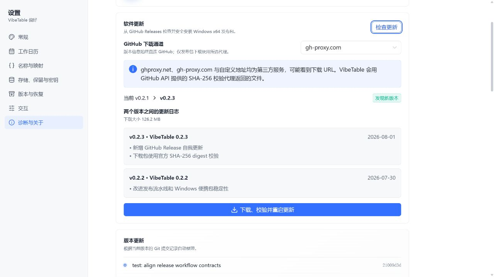

# 自我更新能力与安全边界

评估日期：2026-08-01
实现状态：Windows x64 便携包的成功更新与启动健康确认已实现；健康失败自动回退按
[ADR 0010](adr/0010-process-out-update-health-rollback.md) 待实施

## 结论

VibeTable 已具备端到端的稳定版自我更新能力。用户可在“设置 → 关于 → 软件更新”
手动检查 GitHub Releases，查看当前版本到目标版本之间仍可取得的各版 Release 日志，
选择直连或常用 GitHub 下载代理，并在校验通过后退出、替换程序文件和重启。

该能力复用发布资产 `VibeTable-v<version>-win-x64.zip` 及其同名 `.sha256` 文件。
版本元数据始终从 GitHub 官方 REST API 读取；ZIP 与校验文件使用用户选择的同一
下载通道，代理不能提供版本号、资产地址或作为最终信任根的摘要。

> 截图使用隔离 mock Release 数据进行界面回归，不包含用户数据或真实本机路径。

## 更新流程

1. 宿主直连 `api.github.com/repos/FelixJI/VibeTable/releases`，忽略 draft、
   prerelease 和非三段数字 SemVer 的条目，并按语义版本选择最高稳定版。
2. 宿主要求目标 Release 包含名称精确匹配的 Windows x64 ZIP、同名 `.sha256`
   文件，以及 ZIP 的 GitHub asset 元数据 `sha256:<hex>` digest。
3. 设置页展示 `(当前版本, 目标版本]` 范围内每个已发布版本的标题、日期和 Release
   body。当前版本早于 GitHub 仍保留的历史时，界面明确提示日志可能不完整。
4. ZIP 与 `.sha256` 文件会同时直连下载，或同时经过用户显式选择的 `ghproxy.net`、
   `gh-proxy.com` 或自定义 HTTPS 前缀代理。宿主严格校验校验文件只含一行
   `<64hex>  <精确 ZIP 文件名>`，先将其中摘要与 GitHub API digest 固定时间比较，
   再校验实际 ZIP；任一来源或文件不一致都会拒绝安装。
5. 校验通过后，ZIP 解压到应用安装目录的同级唯一 staging。解压器拒绝绝对路径、
   `..`、反斜线、符号链接、Windows 非法/ADS 文件名、大小写重复文件，以及超出
   文件数、下载大小或展开大小上限的包。
6. 新包中的单文件桌面宿主以内部 `--apply-update` 模式运行，等待旧进程退出。
   它先把旧的包拥有入口移到 staging 备份，再复制新入口；任一复制失败会移除
   已写入的新入口并恢复旧入口。成功后从原安装根重启应用，并保留 staging，直到
   完整 shell readiness 与只读工作区 Schema 健康探测确认新包可用。

## 用户数据保护

更新事务只允许触碰发布包契约中的三个根入口：

- `VibeTable.Next.exe`
- `release.json`
- `resources/`

工作区、偏好、活动记录和其他运行时状态位于 `%LOCALAPPDATA%\VibeTable`，不在
安装事务内。即使用户在便携包目录放置了其他文件，更新器也不会枚举、移动、覆盖
或删除这些未知根条目。源目录或目标目录出现重解析点时会拒绝更新，避免越过已验证
的目录边界。

## 代理与信任边界

- “GitHub 直连”不会把 ZIP 或校验文件 URL 交给第三方。
- 固定代理和自定义代理均由用户手动选择；设置页披露第三方可能看到完整下载 URL。
- 自定义代理必须是无账号、无 query、无 fragment 的 HTTPS 前缀。
- 安装 RPC 不能提交 asset URL、digest、PID、staging 或目标路径；自定义代理只可通过
  受校验的 HTTPS 偏好设置，且宿主始终在其后追加 GitHub 返回的完整 asset URL。
  安装只使用宿主最近一次检查缓存的不可变候选。
- 当前信任根是 GitHub 官方 API 的 TLS 响应和 ZIP asset SHA-256 digest；同通道
  `.sha256` 文件提供传输一致性与发布资产配对检查。现有 Release
  尚未提供独立的代码签名/离线签名，因此仓库或 GitHub 发布权限失陷不在该校验的
  防护范围内。

## 适用范围与限制

- 只更新正式发布的 Windows x64 便携包；开发目录、缺失/损坏 `release.json`、
  版本身份不一致或不可写安装目录会显示“不可原地更新”，不会尝试替换。
- 当前不提供预览渠道、后台自动检查、断点续传或跨架构迁移。
- Release 工作流只保留最近若干已发布 Release；很旧版本仍能更新到最新版本，
  但界面只能展示 GitHub 当前保留的区间日志。
- 文件替换事务失败会自动恢复旧包；新程序启动后的 shell readiness、只读工作区
  `schema.list` 健康确认与延迟清理已经实现。健康失败时自动恢复旧包尚未实现，后续按
  [ADR 0010](adr/0010-process-out-update-health-rollback.md) 的单一 journal 与进程外 worker 协议交付；
  在该真实打包失败路径通过前，不把启动健康确认描述为完整自动回退。

## 回归覆盖

.NET 测试覆盖 SemVer 选择、draft/prerelease 过滤、ZIP 与 `.sha256` 资产必需、
同通道代理重写、校验文件格式及与 API digest 的交叉校验、
无更新结果、包身份、Zip Slip/ADS 拒绝、只替换包拥有入口、未知文件保留、复制失败
回滚和成功更新后的 cleanup 身份。Web 测试覆盖代理保存、手动检查、两版本间多版
日志、第三方披露和安装 RPC。
