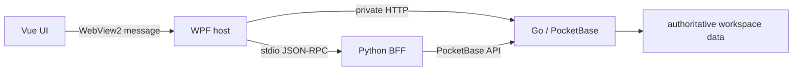

# VibeTable 初学者源码阅读指南

这份指南面向第一次进入 VibeTable 仓库的开发者。你不需要同时精通 TypeScript、C#、Python
和 Go；目标是先建立正确的进程与数据模型，再沿一条真实请求逐层阅读，最后深入自己关心的技术栈。

读完后，你应该能够回答四个问题：

1. 应用由哪些进程组成，谁负责启动和停止它们？
2. 一次 UI 请求如何穿过 WebView2、WPF 和后端？
3. 哪一层拥有业务数据权威，哪一层只负责适配或编排？
4. 修改某个能力时，应同时查看哪些 contracts 和测试？

## 先记住三个不变量

在阅读任何大型文件前，先记住：

- **PocketBase 是唯一业务数据权威。** Python BFF 不直接写 SQLite，Vue 前端也不选择其他 authority。
- **WPF 是本机能力与进程生命周期 owner。** 它管理 WebView2、Python BFF、Go sidecar、会话凭证和 path grant。
- **跨进程协议是闭集。** Web 消息、JSON-RPC 方法、workspace-v2 方法、错误和取消语义都需要显式注册与验证。



如果文档与实现看起来冲突，优先核对配置、代码、脚本和测试。现行边界的权威索引是
[跨进程 seam 索引](architecture/interprocess-seams.md)。

## 1. 先把项目跑起来

### 环境

- Windows 10/11 x64
- Python 3.11+ 与 `uv`
- Node.js 24.x（仓库锁定 24.18.0）
- .NET SDK 10.0.100
- Go 1.25.8
- WebView2 Runtime

在仓库根目录执行：

```powershell
uv sync --frozen --group dev --group build

Push-Location desktop/web-grid
npm ci
Pop-Location

uv run python scripts/dev.py
```

第一次阅读前至少成功运行一次应用。这样你看到 `app.ready`、workspace、Snapshot 或 sidecar
时，会知道它们对应什么界面和生命周期。只想确认四栈能构建时，可以运行：

```powershell
uv run python scripts/dev.py --build-only
```

## 2. 用仓库地图定位职责

| 区域 | 它负责什么 | 第一批文件 | 相邻测试 |
| --- | --- | --- | --- |
| 开发编排 | 构建 Go、Web、WPF 并启动宿主 | `scripts/dev.py` | `tests/test_dev.py` |
| Vue 应用 | 页面、状态、交互和 typed host bridge | `desktop/web-grid/src/main.ts`、`views/WorkspaceView.vue`、`bridge/hostBridge.ts` | 同目录 `*.test.ts` |
| WPF 宿主 | WebView2、本机能力、路由、子进程和 workspace 生命周期 | `App.xaml.cs`、`Services/ProductionWorkspaceRuntime.cs`、`Services/WebMessageRouter.cs` | `desktop/tests/VibeTable.Desktop.Tests/` |
| Python BFF | stdio JSON-RPC、应用服务、导入导出、插件和 PocketBase adapter | `backend/__main__.py`、`backend/rpc/`、`backend/adapters/pocketbase/` | `tests/backend/` |
| Go sidecar | PocketBase、workspace-v2、修订树、Snapshot 和恢复 | `sidecar/cmd/vibetable-pb/main.go`、`sidecar/internal/workspacev2/` | 相邻 `*_test.go` |
| 共享契约 | v1 product RPC、v2 workspace RPC 与 schema fixtures | `contracts/v1/`、`contracts/v2/`、`contracts/schema-v2/` | 各栈 contract tests |
| 插件平台 | SDK、manifest、示例与隔离执行 | `sdk/plugin/`、`examples/plugins/`、`backend/infrastructure/plugin_worker.py` | SDK/示例及 backend plugin tests |

不要从 `MainWindow.Product.cs` 或 `backend/__main__.py` 第一行一路读到底。它们是组合根，适合在你理解各个小接口后回来确认“这些模块如何接起来”。

## 3. 30 分钟建立整体模型

按下面顺序快速阅读；第一遍只看模块职责、构造参数和公开方法：

1. 根目录 `README.md`：理解产品能力、支持平台和运行方式。
2. `docs/architecture/interprocess-seams.md`：认识当前跨进程边界和 authority。
3. `scripts/dev.py`：确认开发时先构建什么、最后启动谁。
4. `desktop/web-grid/src/main.ts`：看 Vue/Pinia、bridge 和 `app.ready` 的启动顺序。
5. `desktop/src/VibeTable.Desktop/App.xaml.cs`：确认 WPF 创建 `MainWindow`，但不在这里组装全部运行时。
6. `desktop/src/VibeTable.Desktop/Services/ProductionWorkspaceRuntime.cs`：看宿主如何拥有 Python 和 sidecar 生命周期。
7. `backend/rpc/messages.py`、`framing.py`、`dispatcher.py`、`server.py`：先理解 Python JSON-RPC 基础，再看 `backend/__main__.py` 如何注册方法。
8. `sidecar/cmd/vibetable-pb/main.go`：只看配置、preflight、`internal/app.New(...)` 和 `Start()` 主线。

这一轮结束后，画出自己的五个框：Vue、WPF、Python、Go/PocketBase、workspace data。能标出箭头和 authority，就可以进入纵向阅读。

## 4. 入门纵向链：读取表结构 `schema.getTable`

这是一条现行、只读、较短的产品链路，适合第一次跨栈跟踪。

### 第一步：从真实 UI 调用开始

- `desktop/web-grid/src/views/WorkspaceView.vue` 在打开表时请求 `schema.getTable`。
- `desktop/web-grid/src/field-settings/service.ts` 在字段变更完成后也会刷新该结构。
- `desktop/web-grid/src/contracts/index.ts` 定义请求参数和返回的 `ProductTableDefinition`。

先记下操作名 `schema.getTable`。跨栈阅读最有效的方法不是猜类名，而是用稳定 operation 名搜索：

```powershell
rg -n 'schema\.getTable' desktop backend contracts tests
```

### 第二步：穿过 WebView2 边界

- `desktop/web-grid/src/bridge/hostBridge.ts` 只允许闭集中的消息，并用 `requestId` 关联响应、错误和超时。
- `desktop/src/VibeTable.Desktop/Services/WebMessageRouter.cs` 在宿主侧检查消息大小、JSON 形状、type 和 payload。
- `desktop/src/VibeTable.Desktop/Services/ProductDataRpcRegistry.cs` 进一步验证 `schema.getTable` 的参数闭集。

阅读对应的 `hostBridge.test.ts`、`WebMessageRouterTests.cs` 和
`ProductDataRpcRegistryTests.cs`，至少找出一条成功用例和一条拒绝非法输入的用例。

### 第三步：进入 Python BFF

- `desktop/src/VibeTable.Desktop/Services/JsonRpcProductDataGateway.cs` 将请求映射到 stdio JSON-RPC 方法。
- `backend/__main__.py` 把 product RPC 注册到 dispatcher。
- `backend/contracts/product_rpc.py` 定义 Python 侧参数契约。
- `backend/adapters/pocketbase/product_rpc.py` 实现 `get_table_schema`。
- `backend/adapters/pocketbase/client.py` 通过 PocketBase API 读取权威数据。

这一链路的关键结论是：Python 做契约适配和应用服务，但不绕过 PocketBase 直接写 SQLite。

## 5. 进阶纵向链：列出 Snapshot `snapshot.list`

这条链展示现行 workspace-v2 如何从 Vue 直达 Go sidecar。

### 第一步：UI action 变成 workspace-v2 请求

- `desktop/web-grid/src/components/settings/WorkspaceProtectionSettings.vue` 发出 `snapshot.list` action。
- `desktop/web-grid/src/services/workspaceV2HostAdapter.ts` 把 action 包装成 `workspace.v2.request`。
- `desktop/web-grid/src/contracts/workspaceV2Bridge.ts` 定义方法、参数、返回值和 wire 校验。

### 第二步：WPF 注入会话边界

- `desktop/src/VibeTable.Desktop/Services/WebMessageRouter.cs` 校验 workspace-v2 方法、scope 与 payload。
- `desktop/src/VibeTable.Desktop/MainWindow.Product.cs` 在组合根接收 `workspace.v2.request`。
- `desktop/src/VibeTable.Desktop/Services/WorkspaceV2HttpGateway.cs` 通过私有 loopback HTTP 转发，并校验 request id、wire scope 和 runtime identity。

这里要观察的是：renderer 不持有 sidecar credential，也不能自行提供任意本机路径。

### 第三步：Go dispatcher 到 workspace runtime

- `contracts/v2/fixtures/rpc-catalog.json` 是生成后的跨栈 catalog fixture；不要手工改生成物。
- `sidecar/internal/protocolv2/` 负责 JSON-RPC envelope、scope 和 dispatcher。
- `sidecar/internal/workspacev2/handlers.go` 注册 `snapshot.list`。
- `sidecar/internal/workspacev2/runtime.go` 承载 workspace runtime 与能力闭集。

配套阅读 `workspaceV2HostAdapter.test.ts`、`WorkspaceV2HttpGatewayTests.cs`、
`protocolv2/dispatcher_test.go` 和 `workspacev2/runtime_test.go`。重点找 session/epoch 不匹配、未知方法和正常列表返回三类用例。

## 6. 按兴趣继续深入

### 前端与交互

推荐顺序：

1. `desktop/web-grid/src/main.ts` 与 `App.vue`
2. `views/WorkspaceView.vue`
3. `stores/`、`services/`、`composables/`
4. `bridge/hostBridge.ts` 与 `contracts/`
5. 同目录 Vitest 测试

看到 UI 调用时，先搜索 operation 名，再找 host reply 类型，不要只沿组件 import 横向扩散。

### WPF 与本机能力

推荐顺序：

1. `ViewModels/MainWindowViewModel.cs`
2. `Services/ProductionWorkspaceRuntime.cs`
3. `Services/WebMessageRouter.cs`
4. `Services/WorkspaceRequestDispatcher.cs` 和具体 gateway 接口
5. `MainWindow.Product.cs` 中对应的组合位置

WPF 层最重要的不是页面绘制，而是生命周期、能力授权、会话隔离、取消和 typed routing。

### Python BFF

推荐顺序：

1. `backend/rpc/messages.py`、`framing.py`、`dispatcher.py`、`server.py`
2. `backend/contracts/`
3. `backend/application/`
4. `backend/adapters/pocketbase/`
5. `backend/__main__.py` 的注册与组合

用 `tests/backend/rpc/` 学协议，用 `tests/backend/adapters/` 学 PocketBase 边界。不要把 BFF 当作第二套数据库 authority。

### Go sidecar 与数据层

推荐顺序：

1. `sidecar/internal/protocolv2/`
2. `sidecar/internal/workspacev2/handlers.go` 与 `runtime.go`
3. 与目标能力同名的 package，例如 `query/`、`restore/`
4. `sidecar/internal/app/`
5. `sidecar/cmd/vibetable-pb/main.go`

Go 测试通常与源码相邻。修改 handler 时，先找到方法注册、scope、成功响应和稳定错误码，再考虑实现细节。

### 插件平台

先读[插件开发说明](plugin-development.md)，然后按以下顺序：

1. `sdk/plugin/src/types.ts` 与 `src/index.ts`
2. `examples/plugins/normalize-text/` 的 manifest、源码和测试
3. `backend/infrastructure/plugin_worker.py`
4. `backend/application/plugin_platform_service.py` 及相关 contracts

插件只提交受控 mutation plan，不直接取得数据库写权限。这是理解插件接口的前提。

## 7. 用最小测试验证理解

不必在第一次阅读时运行完整发布门禁。优先执行与阅读链最接近的测试：

```powershell
# Python RPC 与 PocketBase product adapter
uv run pytest tests/backend/rpc tests/backend/adapters/test_pocketbase_product_rpc.py

# Web bridge 与 workspace-v2 adapter
Push-Location desktop/web-grid
npm run test -- src/bridge/hostBridge.test.ts src/services/workspaceV2HostAdapter.test.ts
Pop-Location

# WPF 边界
dotnet test desktop/VibeTable.Desktop.sln --configuration Release --filter "FullyQualifiedName~WebMessageRouterTests|FullyQualifiedName~WorkspaceV2HttpGatewayTests"

# Go protocol 与 workspace runtime
Push-Location sidecar
go test ./internal/protocolv2 ./internal/workspacev2
Pop-Location
```

准备提交前，再根据改动范围运行[质量门禁说明](quality-gates.md)中的项目入口。完整发布资格命令是：

```powershell
uv run python qa/next.py --ci --json-report build/qa/report.json
```

## 8. 常见误区

- **一开始就通读最大文件**：先读稳定接口、operation 契约和测试，再回组合根。
- **把目录名当作调用关系**：跨栈时搜索 operation 名，并用 seam 文档核对 authority。
- **认为 Python 可以直接写 SQLite**：写路径必须经过 PocketBase authority。
- **让 Web 传本机绝对路径或 sidecar credential**：本机 path grant 与凭据归 WPF 持有。
- **手改生成 contract fixture**：先找到生成器和权威源，通过仓库脚本更新并运行一致性测试。
- **首次小改就运行全部 E2E**：先用相邻测试获得快速反馈，再按风险扩大验证范围。
- **只读成功路径**：每条跨进程链至少再看未知方法、非法 payload、取消或旧 session 中的一种失败路径。

## 9. 阅读笔记模板

跟踪一个新 operation 时，可以复制下面的清单：

```text
Operation:
用户从哪里触发：
Web 请求与返回契约：
WPF router / dispatcher：
Python 或 Go handler：
数据 authority：
稳定错误与取消语义：
成功测试：
失败测试：
最小验证命令：
```

如果这九项都能填出具体文件和方法，你已经具备安全修改该链路所需的基本上下文。
